# 15. Ros2-Deep Learning Application Course

## 15.1 Deep Learning Application Course

### 15.1.1 Robotic Arm Waste Sorting

* **Realization Process**

To begin with, initialize the nodes and obtain the camera intrinsic parameters, the set up the object recognition model.

Next, perform image processing and model recognition to calculate the coordinates of the objects.

Finally, send the gripping commands to the robotic arm for picking up and placing the waste blocks.

* **Operations**

:::{Note}
The command entered should be case sensitive, and "**Tab**" key can be used to complement the key words.
:::

(1) Connect JetArm to the remote desktop via NoMachine.

(2) Double click on  to open the command line terminal. Enter the command below and press Enter to disable the auto-startup service.

```
sudo systemctl stop start_app_node.service
```

(3) Enter the following command and press **Enter** to execute waste sorting task.

```
ros2 launch example waste_classification.launch.py
```

(5) If you want to close the program, please press `Ctrl+C`. Please try multiple times for the operation failure.

(6) After the game ends, you need to enable app service (should not enable the service, the following app functions will be affected).

```
sudo systemctl start start_app_node.service
```

(7) After app service is enabled successfully, the robotic arm will return to the initial posture, and the buzzer will make a "**beep**" sound.

* **Game Outcome**

After the game starts, when robot detects a waste card, the corresponding name will be displayed on the screen and different categories will be outlined with rectangle of different colors. Hazardous waste will be outlined in red, the recyclable waste in blue, kitchen waste in green and residual waste in gray. Additionally, it will proceed to sort and grip the waste blocks.


| **Waste category** |                  **Cards**                  |
| :----------------: | :-----------------------------------------: |
|  hazardous_waste  | Storage Battery, Marker, Oral Liquid Bottle |
|  recyclable_waste  |    Plastic Bottle, Umbrella, Toothbrush    |
|     food_waste     |     Banana Peel, Ketchup, Broken Bones     |
|   residual_waste   | Cigarette End, Plate, Disposable Chopsticks |


* **Launch File Analysis**

The launch file is stored in

[/home/ubuntu/ros2_ws/src/example/example/yolov8/waste_classification.launch.py](../_static/source_code/15/yolov8.zip)

(1) launch_setup Function

{lineno-start=9}

```python
def launch_setup(context):
    compiled = os.environ['need_compile']
    start = LaunchConfiguration('start', default='true')
    start_arg = DeclareLaunchArgument('start', default_value=start)
    display = LaunchConfiguration('display', default='true')
    display_arg = DeclareLaunchArgument('display', default_value=display)
    if compiled == 'True':
        sdk_package_path = get_package_share_directory('sdk')
9:     peripherals_package_path = get_package_share_directory('peripherals')
        example_package_path = get_package_share_directory('example')
        app_package_path = get_package_share_directory('app')
    else:
        sdk_package_path = '/home/ubuntu/ros2_ws/src/driver/sdk'
        peripherals_package_path = '/home/ubuntu/ros2_ws/src/peripherals'
        example_package_path = '/home/ubuntu/ros2_ws/src/example'
        app_package_path = '/home/ubuntu/ros2_ws/src/app'

    depth_camera_launch = IncludeLaunchDescription(
        PythonLaunchDescriptionSource(
            os.path.join(peripherals_package_path, 'launch/depth_camera.launch.py')),
    )
    sdk_launch = IncludeLaunchDescription(
        PythonLaunchDescriptionSource(
            os.path.join(sdk_package_path, 'launch/jetarm_sdk.launch.py')),
    )
    yolov8_node = Node(
        package='example',
        executable='yolov8_node',
        output='screen',
        parameters=[{'classes': ['BananaPeel','BrokenBones','CigaretteEnd','DisposableChopsticks','Ketchup','Marker','OralLiquidBottle','PlasticBottle','Plate','StorageBattery','Toothbrush', 'Umbrella']},
                    { 'engine': 'garbage_classification_640s.engine', 'lib': 'libmyplugins.so', 'conf': 0.8},]
    )

    waste_classification_node = Node(
        package='app',
        executable='waste_classification',
        output='screen',
        parameters=[ {'start': start, 'display': display, 'app': True}],
    )

    return [
            start_arg,
            display_arg,
            depth_camera_launch,
            sdk_launch,
            yolov8_node,
            waste_classification_node,
            ]
```

① `compiled = os.environ['need_compile']`: Retrieve the value of the need_compile environment variable to determine whether certain modules need compilation (e.g., for selecting paths before and after compilation).

② `start = LaunchConfiguration('start', default='true')`: Create a LaunchConfiguration object named start. This parameter specifies whether to launch certain nodes, with a default value of true.

③ `start_arg = DeclareLaunchArgument('start', default_value=start)`: Declare the start parameter, allowing it to be passed in during the launch to control behavior.

④ `debug = LaunchConfiguration('debug', default='false')`: Create a LaunchConfiguration object named debug. This parameter controls the debug mode, with a default value of false.

⑤ `debug_arg = DeclareLaunchArgument('debug', default_value=debug)`: Declare the debug parameter.

⑥ `broadcast = LaunchConfiguration('broadcast', default='false')`: Create a LaunchConfiguration object named broadcast. This parameter specifies whether to broadcast certain information, with a default value of false.

⑦ `broadcast_arg = DeclareLaunchArgument('broadcast', default_value=broadcast)`: Declare the broadcast parameter.

⑧ `compiled == 'True'`: Based on the value of the need_compile environment variable, determine the path configuration. If the value is True, use the get_package_share_directory function to obtain the shared directory path of ROS packages. If False, use hardcoded paths (typically for development purposes).

⑨ `sdk_package_path, peripherals_package_path, example_package_path, app_package_path`: Configure the paths for the sdk, peripherals, example, and app packages based on the compilation state.

⑩ `depth_camera_launch`: Use IncludeLaunchDescription to include and launch the depth_camera.launch.py file located in the peripherals package.

⑪ `sdk_launch`: Similarly, use IncludeLaunchDescription to launch the jetarm_sdk.launch.py file.

⑫ `yolov8_node`: Launch the yolov8_node node in the example package.

⑬ The launch configuration returns a list containing multiple DeclareLaunchArgument parameters, nodes, and launch files. These configurations and nodes will be executed during the launch process.

(2) generate_launch_description Function

{lineno-start=58}

```python
def generate_launch_description():
    return LaunchDescription([
        OpaqueFunction(function = launch_setup)
    ])
```

This function generates and returns a LaunchDescription object. A LaunchDescription serves as a container that includes all the nodes, parameters, and actions required for the launch process. It dynamically generates and executes the launch_setup function using the OpaqueFunction mechanism.

(3) Main Function

{lineno-start=63}

```python
if __name__ == '__main__':
    # 创建一个LaunchDescription对象
    ld = generate_launch_description()

    ls = LaunchService()
    ls.include_launch_description(ld)
    ls.run()
```

① `ls.include_launch_description(ld)`: Pass the `LaunchDescription` object to the `LaunchService` to initiate the included nodes and other configurations.

② `ls.run()`: Start the `LaunchService` to execute the launch process.

* **Python Source Code Analysis**

The source code file is stored in [`/home/ubuntu/ros2_ws/src/example/example/yolov8/waste_classification.py`](../_static/source_code/15/yolov8.zip)

The program logic flowchart derived from the program files is as follow.

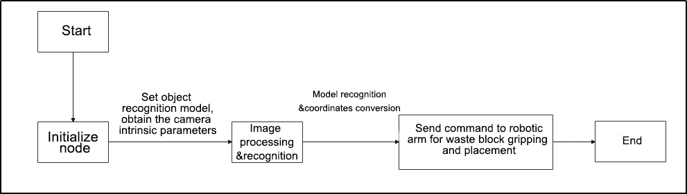

From the diagram above, the program's logic progress primarily aims to set up the object recognition model, obtain the camera intrinsic parameters, the process and recognize images and models, the send calculated object coordinates to the robot arm to pick up and place the waste blocks. The following content will be edited according to the aforementioned program logic flowchart.

(1) Import Function Package

{lineno-start=4}

```python
import os
import cv2
import yaml
import time
import math
import queue
import rclpy
import signal
import threading
import numpy as np
import sdk.fps as fps
from sdk import common
from rclpy.node import Node
from cv_bridge import CvBridge
from std_srvs.srv import Trigger
from geometry_msgs.msg import Twist
from interfaces.msg import ObjectsInfo
from xf_mic_asr_offline import voice_play
from sensor_msgs.msg import Image, CameraInfo
from rclpy.executors import MultiThreadedExecutor
from servo_controller_msgs.msg import ServosPosition
from rclpy.callback_groups import ReentrantCallbackGroup
from kinematics.kinematics_control import set_pose_target
from kinematics_msgs.srv import GetRobotPose, SetRobotPose
from servo_controller.bus_servo_control import set_servo_position
```

① `os`: A module for interacting with the operating system, such as accessing environment variables.

② `cv2`: OpenCV library used for computer vision tasks like image processing and display.

③ `yaml`: A library for loading and parsing YAML configuration files.

④ `time`: Provides time-related functions, such as implementing delays.

⑤ `math`: A module for mathematical calculations, such as square roots and trigonometric operations.

⑥ `queue`: Provides queue functionality for exchanging data between threads.

⑦ `Signal`: A module for handling system signals.

⑧ `Threading`: Python's threading module for implementing multithreaded operations.

⑨ `Numpy`: A core library for numerical computing in Python, supporting array and matrix operations.

⑩ `Rclpy`: ROS 2 Python client library providing ROS communication mechanisms (publish/subscribe, services, etc.) and node management features.

⑪ `cv_bridge`: A module for converting ROS message types (e.g., sensor_msgs/Image) into OpenCV image formats.

⑫ `std_srvs.srv.Trigger`: A ROS 2 service message type used to control start and stop operations.

⑬ `geometry_msgs.msg.Twist`: A custom message type containing information about recognized objects.

⑭ `interfaces.msg.ObjectsInfo`: A custom message type containing information about recognized objects.

⑮ `sensor_msgs.msg.Image`: A ROS 2 message type used for transmitting image data.

⑯ `servo_controller_msgs.msg.ServosPosition`: A message type for controlling servo positions.

⑰ `rclpy.executors.MultiThreadedExecutor`: A multithreaded ROS 2 executor enabling parallel processing of multiple threads.

⑱ `sdk.fps`: A module containing general utility functions, such as coordinate transformations and data processing.

⑲ `sdk.common`: A module containing general utility functions, such as coordinate transformations and data processing.

⑳ `xf_mic_asr_offline.voice_play`: A module for voice playback, used to play audio prompts.

㉑ `kinematics.kinematics_control`: A module for robotic kinematic control, responsible for setting motion targets for the robot.

㉒ `servo_controller.bus_servo_control`: A module for controlling servo positions.

(2) Waste Model Configuration

{lineno-start=30}

```python
WASTE_CLASSES = {
    'food_waste': ('BananaPeel', 'BrokenBones', 'Ketchup'),
    'hazardous_waste': ('Marker', 'OralLiquidBottle', 'StorageBattery'),
    'recyclable_waste': ('PlasticBottle', 'Toothbrush', 'Umbrella'),
    'residual_waste': ('Plate', 'CigaretteEnd', 'DisposableChopsticks'),
}

POSITIONS = {
    'food_waste': (0.085, -0.24, 0.025),
    'hazardous_waste': (0.017, -0.24, 0.025),
    'recyclable_waste': (-0.05, -0.238, 0.025),
    'residual_waste': (-0.112, -0.233, 0.025),
}
```

① `WASTE_CLASSES`: Maps the four types of waste categories (food_waste, hazardous_waste, recyclable_waste, residual_waste) to specific item names. Each category is represented by a tuple listing the item names belonging to that category.

② `POSITIONS`: Defines the target placement positions for the robotic arm corresponding to each waste category. Each category (e.g., food_waste, hazardous_waste, etc.) is associated with a tuple (x, y, z) representing the spatial coordinates of the robotic arm's target position.

(3) WasteClassificationNode Class

{lineno-start=44}

```python
class WasteClassificationNode(Node):
    hand2cam_tf_matrix = [
    [0.0, 0.0, 1.0, -0.101],
    [-1.0, 0.0, 0.0, 0.011],
    [0.0, -1.0, 0.0, 0.045],
    [0.0, 0.0, 0.0, 1.0]
]

    def __init__(self, name):
        rclpy.init()
        super().__init__(name, allow_undeclared_parameters=True, automatically_declare_parameters_from_overrides=True)
        self.running = True
        self.center = None
        self.count = 0
        self.class_name = None
        self.start_place = False
        self.start_move = False
        self.start_count = False

        self.config_file = 'transform.yaml'
        self.config_path = "[/home/ubuntu/ros2_ws/src/app/config/]()"
        self.pick_pitch = 80
        self.current_class_name = None
        self.fps = fps.FPS()  # fps计算器
        self.language = os.environ['ASR_LANGUAGE']
        with open(self.config_path + self.config_file, 'r') as f:
            config = yaml.safe_load(f)

            # 转换为 numpy 数组
            extristric = np.array(config['extristric'])
            white_area_center = np.array(config['white_area_pose_world'])
        self.white_area_center = white_area_center
        tvec = extristric[:1]  # 平移向量
        rmat = extristric[1:]  # 旋转矩阵
        tvec, rmat = common.extristric_plane_shift(np.array(tvec).reshape((3, 1)), np.array(rmat), 0.030)
        self.extristric = tvec, rmat
        self.previous_pose = None  # 上一次检测到的位置
        
                signal.signal(signal.SIGINT, self.shutdown)
        self.bridge = CvBridge()
        self.image_queue = queue.Queue(maxsize=2)

        self.joints_pub = self.create_publisher(ServosPosition, '/servo_controller', 1)

        timer_cb_group = ReentrantCallbackGroup()
        self.create_service(Trigger, '~/start', self.start_srv_callback, callback_group=timer_cb_group)  # 进入玩法
        self.create_service(Trigger, '~/stop', self.stop_srv_callback, callback_group=timer_cb_group)  # 退出玩法
        self.create_subscription(Image, '/yolov8/object_image', self.image_callback, 1)
        self.create_subscription(ObjectsInfo, '/yolov8/object_detect', self.get_object_callback, 1)
        self.camera_info_sub = self.create_subscription(CameraInfo, '/depth_cam/depth/camera_info', self.camera_info_callback, 1)
        self.start_yolov8_client = self.create_client(Trigger, '/yolov8/start', callback_group=timer_cb_group)
        self.start_yolov8_client.wait_for_service()
        self.stop_yolov8_client = self.create_client(Trigger, '/yolov8/stop', callback_group=timer_cb_group)
        self.stop_yolov8_client.wait_for_service()

        self.debug = self.get_parameter('debug').value
        self.broadcast = self.get_parameter('broadcast').value

        
        #等待服务启动
        self.client = self.create_client(Trigger, '/controller_manager/init_finish')
        self.client.wait_for_service()
        self.client = self.create_client(Trigger, '/kinematics/init_finish')
        self.client.wait_for_service()
        self.kinematics_client = self.create_client(SetRobotPose, '/kinematics/set_pose_target')
        self.kinematics_client.wait_for_service()

        self.timer = self.create_timer(0.0, self.init_process, callback_group=timer_cb_group)
```

① `hand2cam_tf_matrix`: Defines the hand-eye transformation matrix for the robotic arm's camera.

② `rclpy.init`: Initializes the ROS 2 communication environment.

③ `super().__init__`: Initializes the parent class and sets node parameters.

④ `self.running`: Sets the running flag to True.

⑤ State Variable Initialization: Initializes state variables such as the center point, counter, class names, and start flags.

⑥ Configuration File Path and Name: Specifies the path to the transform.yaml configuration file.

⑦ `self.pick_pitch`: Sets the picking angle to 80 degrees.

⑧ `self.fps`: Initializes the FPS (frames per second) calculator object.

⑨ `self.language`: Retrieves the speech recognition language setting from environment variables.

⑩ Load Configuration File: Reads and parses the contents of the YAML configuration file.

⑪ Extrinsic Transformation: Extracts the translation vector and rotation matrix, and applies planar offset transformations.

⑫ `self.white_area_center`: Sets the world coordinates for the center of the white area.

⑬ `self.previous_pose`: Initializes the previous detection position as None.

⑭ `signal.signal(signal.SIGINT, self.shutdown)`: Registers a signal handler for SIGINT to ensure safe node shutdown.

⑮ `self.bridge`: Initializes the bridge for converting image data between OpenCV and ROS formats.

⑯ `self.image_queue`: Creates an image processing queue with a maximum capacity of 2.

⑰ `self.joints_pub`: Creates a publisher to send servo position commands to the `/servo_controller` topic.

⑱ `timer_cb_group`: Creates a reentrant callback group to support multithreaded operations. Create Service (Start/Stop): Defines services for starting or stopping functionalities.

⑲ `create_service (start/stop)`: Defines a service to start or stop gameplay features.

⑳ `create_subscription (Image/ObjectsInfo/CameraInfo)`: Subscribes to image, detection info, and camera info topics.

㉑ `start_yolov8_client`: Creates a service client for starting YOLOv8 and waits for the service to become available.

㉒ `stop_yolov8_client`: Creates a service client for stopping YOLOv8 and waits for the service to become available.

㉓ `self.debug` and `self.broadcast`: Retrieves debug and broadcast flag values from the parameter server.

㉔ Wait for Control and Kinematics Module Services: Creates and waits for the `/controller_manager/init_finish` and `/kinematics/init_finish` services to be ready.

㉕ `self.kinematics_client`: Creates a service client for setting kinematics target poses and waits for it to become available.

㉖ `self.timer`: Creates a timer to trigger the init_process callback during the initialization process.

(4) init_process Method

{lineno-start=114}

```python
    def init_process(self):
        self.timer.cancel()

        set_servo_position(self.joints_pub, 1.0, ((1, 500), (2, 560), (3, 130), (4, 115), (5, 500), (10, 200)))  # 设置机械臂初始位置
        time.sleep(1)

        if self.get_parameter('start').value:
            self.start_srv_callback(Trigger.Request(), Trigger.Response())

        threading.Thread(target=self.main, daemon=True).start()
        self.create_service(Trigger, '~/init_finish', self.get_node_state)
        self.get_logger().info('\033[1;32m%s\033[0m' % 'start')
```

① `self.timer.cancel()`: Stops the initialization timer to prevent repeated triggers.

② `set_servo_position`: Calls a function to set the initial position of the robotic arm by passing the target servo position parameters.

③ `time.sleep(1)`: Pauses the program execution for 1 second to ensure the robotic arm completes its initial movements.

④ `self.get_parameter('start').value`: Checks the parameter server for the "**start**" flag value to determine if initialization should proceed.

⑤ `self.start_srv_callback`: Invokes the start service callback function if the "**start**" flag is set to true, simulating the startup operation.

⑥ `threading.Thread(target=self.main, daemon=True).start()`: Launches the main method in a separate thread to handle background tasks.

⑦ `self.create_service`: Creates the `~/init_finish` service to report the node's status.

⑧ `self.get_logger().info()`: Logs a success message indicating the startup was completed, highlighted in green for emphasis.

(5) get_node_state Function

{lineno-start=127}

```python
    def get_node_state(self, request, response):
        response.success = True
        return response
```

① `response.success = True`: Sets the success attribute of the service response to True, indicating that the node is functioning normally.

② `return response`: Returns the response object, completing the service call and notifying the client that the node is ready and operational.

(6) camera_info_callback Function

{lineno-start=131}

```python
    def camera_info_callback(self, msg):
        self.K = np.matrix(msg.k).reshape(1, -1, 3)
```

`self.K = np.matrix(msg.k).reshape(1, -1, 3)`: Extracts the intrinsic parameter matrix k from the received camera information message, converts it into a NumPy matrix format, and reshapes it into a three-dimensional array to fit the required calculations or operations.

(7) Play Function

{lineno-start=134}

```python
    def play(self, name):
        if self.broadcast:
            voice_play.play(name, language=self.language)
```

① `if self.broadcast:`: Checks if the broadcasting feature is enabled.

② `voice_play.play(name, language=self.language)`: If broadcasting is enabled, calls the `play` method of the `voice_play` module to play the given `name` as a voice message, using the currently set language.

(8) send_request Function

{lineno-start=138}

```python
    def send_request(self, client, msg):
        future = client.call_async(msg)
        while rclpy.ok():
            if future.done() and future.result():
                return future.result()
```

① `def send_request(self, client, msg)`: Defines a method `send_request`, which takes a client object `client` and a message object `msg` as parameters.

② `future = client.call_async(msg)`: Calls the client's asynchronous request method `call_async`, sends the message, and returns a `future` object representing the result of the request.

③ `while rclpy.ok()`: Enters a loop to check if the ROS2 node is still running.

④ `if future.done() and future.result()`: Checks if the `future` is completed and if the result is valid.

⑤ `return future.result()`: If the request is complete and the result is valid, returns the result of the `future`.

(9) start_srv_callback & stop_srv_callback Function

{lineno-start=144}

```python
    def start_srv_callback(self, request, response):
        self.get_logger().info('\033[1;32m%s\033[0m' % "start garbage classification")

        self.send_request(self.start_yolov8_client, Trigger.Request())
        response.success = True
        response.message = "start"
        return response

    def stop_srv_callback(self, request, response):
        self.get_logger().info('\033[1;32m%s\033[0m' % "stop garbage classification")
        self.send_request(self.stop_yolov8_client, Trigger.Request())
        response.success = True
        response.message = "stop"
        return response
```

① `def start_srv_callback(self, request, response)`: Defines a callback function `start_srv_callback` that handles service requests to start garbage classification.

② `self.send_request(self.start_yolov8_client, Trigger.Request())`: Calls the `send_request` method to send a start request to the `start_yolov8_client`.

③ `response.success = True`: Sets the service response to indicate success.

④ `response.message = "start"`: Sets the response message to "**start**".

⑤ `return response`: Returns the response object.

⑥ `def stop_srv_callback(self, request, response)`: Defines a callback function `stop_srv_callback` that handles service requests to stop garbage classification.

⑦ `self.get_logger().info('\033\[1;32m%s\033\[0m' % "stop garbage classification")`: Logs a message indicating that garbage classification has been stopped.

⑧ `self.send_request(self.stop_yolov8_client, Trigger.Request())`: Calls the `send_request` method to send a stop request to the `stop_yolov8_client`.

⑨ `response.success = True`: Sets the service response to indicate success.

⑩ `response.message = "stop"`: Sets the response message to "**stop**".

⑪ `return response`: Returns the response object.

(10) image_callback Function

{lineno-start=161}

```python
    def image_callback(self, ros_image):
        cv_image = self.bridge.imgmsg_to_cv2(ros_image, "bgr8")
        bgr_image = np.array(cv_image, dtype=np.uint8)
        if self.image_queue.full():
            # 如果队列已满，丢弃最旧的图像
            self.image_queue.get()
        # 将图像放入队列
        self.image_queue.put(bgr_image)
```

① `def image_callback(self, ros_image)`: Defines the image callback function to process incoming ROS image messages.

② `cv_image = self.bridge.imgmsg_to_cv2(ros_image, "bgr8")`: Converts the ROS image message to OpenCV format using the `bridge` object, with the color encoding set to "**bgr8**".

③ `bgr_image = np.array(cv_image, dtype=np.uint8)`: Converts the OpenCV image to a NumPy array with data type `np.uint8`.

④ `if self.image_queue.full()`: Checks if the image queue is full.

⑤ `self.image_queue.get()`: If the queue is full, removes the oldest image from the queue.

⑥ `self.image_queue.put(bgr_image)`: Adds the current image to the queue.

(11) Pick Function

{lineno-start=170}

```python
    def pick(self, pose_t, angle):
        waste_category = None
        if self.start_move:
            time.sleep(0.2)
            for k, v in WASTE_CLASSES.items():
                if self.current_class_name in v:
                    waste_category = k
                    break
            self.class_name = None
            self.get_logger().info('\033[1;32m%s\033[0m' % waste_category)
            self.stop_srv_callback(Trigger.Request(), Trigger.Response())
            msg = set_pose_target(pose_t, self.pick_pitch,  [-90.0, 90.0], 1.0)
            res = self.send_request(self.kinematics_client, msg)
            servo_data = res.pulse  
          
            angle = 500 + int(1000 * (angle / 240))
            # 驱动舵机
            set_servo_position(self.joints_pub, 1.0, ((1, servo_data[0]), (2, servo_data[1]), (3, servo_data[2]), (4, servo_data[3])))
            time.sleep(1)
            
            set_servo_position(self.joints_pub, 1.0, ((5, angle),))
            time.sleep(1)

            pose_t[2] -= 0.03
            msg = set_pose_target(pose_t, self.pick_pitch,  [-90.0, 90.0], 1.0)
            res = self.send_request(self.kinematics_client, msg)
            servo_data = res.pulse 

            set_servo_position(self.joints_pub, 1.0, ((1, servo_data[0]), (2, servo_data[1]), (3, servo_data[2]), (4, servo_data[3])))
            time.sleep(1)
            set_servo_position(self.joints_pub, 0.5, ((10, 600),))
            time.sleep(0.5)

            pose_t[2] += 0.1
            msg = set_pose_target(pose_t, self.pick_pitch,  [-180.0, 180.0], 1.0)
            res = self.send_request(self.kinematics_client, msg)
            servo_data = res.pulse  

            set_servo_position(self.joints_pub, 1.0, ((2, servo_data[1]), (3, servo_data[2]), (4, servo_data[3])))
            time.sleep(1)

            set_servo_position(self.joints_pub, 1.0, ((1, 500), (2, 610), (3, 70), (4, 140), (5, 500)))  # 设置机械臂初始位置
            time.sleep(1)
            self.start_move = False
            self.start_place = True
            threading.Thread(target=self.place, args=(waste_category,),daemon=True).start()
        else:
            time.sleep(0.01)
```

① `def pick(self, pose_t, angle)`: Defines the item pickup function, which takes the target position (`pose_t`) and angle as parameters.

② `waste_category = None`: Initializes the waste category as `None`.

③ `if self.start_move`: Checks if the movement has started, and if true, executes the following actions.

④ `time.sleep(0.2)`: Waits for 0.2 seconds.

⑤ `for k, v in WASTE_CLASSES.items()`: Iterates through the waste classification dictionary.

⑥ `if self.current_class_name in v`: Checks if the current item category is in the classification and, if true, sets the waste category.

⑦ `self.class_name = None`: Clears the item category.

⑧ `self.get_logger().info('\033\[1;32m%s\033\[0m' % waste_category)`: Logs the waste category information.

⑨ `self.stop_srv_callback(Trigger.Request(), Trigger.Response())`: Stops the waste classification service.

⑩ `msg = set_pose_target(pose_t, self.pick_pitch, [-90.0, 90.0], 1.0)`: Sets the pickup target position and orientation.

⑪ `res = self.send_request(self.kinematics_client, msg)`: Sends the target position request and gets the response.

⑫ `servo_data = res.pulse`: Retrieves the servo pulse data from the response.

⑬ `angle = 500 + int(1000 * (angle / 240))`: Calculates the servo angle.

⑭ `set_servo_position(self.joints_pub, 1.0, ((1, servo_data[0]), (2, servo_data[1]), (3, servo_data[2]), (4, servo_data[3])))`: Sets the arm servo positions.

⑮ `time.sleep(1)`: Waits for 1 second.

⑯ `set_servo_position(self.joints_pub, 1.0, ((5, angle),))`: Sets the angle of the fifth arm servo.

⑰ `time.sleep(1)`: Waits for 1 second.

⑱ `pose_t[2] -= 0.03`: Adjusts the Z-coordinate of the target position.

⑲ `msg = set_pose_target(pose_t, self.pick_pitch, [-90.0, 90.0], 1.0)`: Updates the target position and sets the orientation.

⑳ `res = self.send_request(self.kinematics_client, msg)`: Sends the new target position request and gets the response.

㉑ `servo_data = res.pulse`: Retrieves the updated servo pulse data from the response.

㉒ `set_servo_position(self.joints_pub, 1.0, ((1, servo_data[0]), (2, servo_data[1]), (3, servo_data[2]), (4, servo_data[3])))`: Updates the arm servo positions based on the new pulse data.

㉓ `time.sleep(1)`: Waits for 1 second.

㉔ `set_servo_position(self.joints_pub, 0.5, ((10, 600),)`: Sets the servo position.

㉕ `time.sleep(0.5)`: Waits for 0.5 seconds.

㉖ `set_servo_position(self.joints_pub, 1.5, ((1, 500), (2, 610), (3, 70), (4, 140), (5, 500)))`: Restores the initial arm position.

㉗ `time.sleep(2)`: Waits for 2 seconds.

㉘ `self.start_move = False`: Sets the start move flag to `False`.

㉙ `self.start_place = True`: Sets the start place flag to `True`.

㉚ `threading.Thread(target=self.place, args=(waste_category,), daemon=True).start()`: Starts a thread to place the waste.

㉛ `else`: If movement hasn't started, waits for 0.01 seconds.

(12) Place Function]

{lineno-start=219}

```python
    def place(self, waste_category):
        
        if self.start_place:
            for k, v in POSITIONS.items():
                if waste_category in k:
                    position = v
                    break
                   
            msg = set_pose_target(position, self.pick_pitch,  [-90.0, 90.0], 1.0)
            res = self.send_request(self.kinematics_client, msg)
            if res.pulse : # 可以达到
                servo_data = res.pulse  
          
                # 驱动舵机
                set_servo_position(self.joints_pub, 1.0, ((1, servo_data[0]), ))
                time.sleep(1)
                set_servo_position(self.joints_pub, 1.0, ( (2, servo_data[1]), (3, servo_data[2]), (4, servo_data[3])))
                time.sleep(1)
            
                set_servo_position(self.joints_pub, 0.5, ((10, 200),))
                time.sleep(1)
    
                
                set_servo_position(self.joints_pub, 1.0, ( (2, 610), (3, 70), (4, 140), (5, 500) ))  
                time.sleep(1)
                set_servo_position(self.joints_pub, 1.0, ((1, 500),))  
                time.sleep(1)

                self.start_srv_callback(Trigger.Request(), Trigger.Response())
                self.class_name = None
                self.start_place = False
                self.start_count = False
            else:
                time.sleep(0.01)
```

① `def place(self, waste_category)`: Defines a function `place` for waste disposal, which accepts the waste category as a parameter.

② `if self.start_place`: If the placement process has started, execute the following actions.

③ `for k, v in POSITIONS.items()`: Iterate through the placement position dictionary.

④ `if waste_category in k`: If the waste category matches a specific position, retrieve the corresponding position.

⑤ `msg = set_pose_target(position, self.pick_pitch, [-90.0, 90.0], 1.0)`: Set the target position and posture.

⑥ `res = self.send_request(self.kinematics_client, msg)`: Send the target position request and get the response.

⑦ `if res.pulse`: If the target position can be reached, perform the following actions:

⑧ `servo_data = res.pulse`: Retrieve the servo pulse data.

⑨ `self.get_logger().info(f"Servo angle: {list(res.pulse)}")`: Log the servo angle information.

⑩ `set_servo_position(self.joints_pub, 1.0, ((1, servo_data[0]), (2, servo_data[1]), (3, servo_data[2]), (4, servo_data[3])))`: Set the servo positions for the robotic arm.

⑪ `time.sleep(1)`: Wait for 1 second.

⑫ `set_servo_position(self.joints_pub, 0.5, ((10, 200),))`: Set the servo position.

⑬ `time.sleep(0.5)`: Wait for 0.5 seconds.

⑭ `set_servo_position(self.joints_pub, 1.0, ((1, 500), (2, 610), (3, 70), (4, 140), (5, 500)))`: Restore the robotic arm to its initial position.

⑮ `time.sleep(1)`: Wait for 1 second.

⑯ `self.start_srv_callback(Trigger.Request(), Trigger.Response())`: Call the service callback function.

⑰ `self.class_name = None`: Clear the object category.

⑱ `self.start_place = False`: Set the flag for the start of placement to False.

⑲ `self.start_count = False`: Set the flag for starting counting to False.

⑳ `else`: If the target position cannot be reached, wait for 0.01 seconds.

(13) Main Function

{lineno-start=253}

```python
    def main(self):
        count = 0
        while self.running:
            try:
                image = self.image_queue.get(block=True, timeout=1)
            except queue.Empty:
                if not self.running:
                    break
                else:
                    continue
            if self.class_name is not None and not self.start_move and not self.start_count and not self.debug:
                self.count += 1
                if self.count > 20:
                    self.current_class_name = self.class_name
                    self.start_move = True
                    self.start_count = True
                    self.count = 0
            elif self.debug and self.class_name is not None:
                count += 1
                if count > 50:
                    count = 0

                    self.debug = False
            else:
                self.count = 0
                time.sleep(0.01)
            if image is not None:
                # self.fps.update()
                # image = self.fps.show_fps(image)
                cv2.imshow('image', image)
                key = cv2.waitKey(1)
                if key == ord('q') or key == 27:  # 按q或者esc退出
                    self.running = False
```

① `def main(self)`: Define the main function to execute the primary loop logic.

② `count = 0`: Initialize the counter.

③ `while self.running`: Start a loop that continues until `self.running` is `False`.

④ `try`: Attempt to retrieve an image from the queue.

⑤ `image = self.image_queue.get(block=True, timeout=1)`: Get an image from the queue, waiting up to 1 second if the queue is empty.

⑥ `except queue.Empty`: If the queue is empty and the timeout is reached, check if the system should stop running.

⑦ `if not self.running`: If the `self.running` flag is `False`, exit the loop.

⑧ `else`: Otherwise, continue executing the loop.

⑨ `if self.class_name is not None and not self.start_move and not self.start_count and not self.debug`: If `class_name` is not `None`, and moving, counting, or debugging has not started.

⑩ `self.count += 1`: Increment the counter.

⑪ `if self.count > 20`: If the counter exceeds 20.

⑫ `self.current_class_name = self.class_name`: Update the current class name.

⑬ `self.start_move = True`: Set the flag to start moving to `True`.

⑭ `self.start_count = True`: Set the flag to start counting to `True`.

⑮ `self.count = 0`: Reset the counter.

⑯ `elif self.debug and self.class_name is not None`: If debugging mode is active and `class_name` is not `None`.

⑰ `count += 1`: Increment the debug counter.

⑱ `if count > 50`: If the debug counter exceeds 50.

⑲ `count = 0`: Reset the debug counter.

⑳ `self.debug = False`: Exit debug mode.

㉑ `else`: If none of the above conditions are met.

㉒ `self.count = 0`: Reset the counter.

㉓ `time.sleep(0.01)`: Wait for 0.01 seconds.

㉔ `if image is not None`: If the image is not `None`.

㉕ `self.fps.update()`: Update the FPS (frames per second).

㉖ `image = self.fps.show_fps(image)`: Display the FPS on the image.

㉗ `cv2.imshow('image', image)`: Show the image in a window.

㉘ `key = cv2.waitKey(1)`: Detect key presses.

㉙ `if key == ord('q') or key == 27`: If the 'q' or 'ESC' key is pressed.

㉚ `self.running = False`: Set `self.running` to `False` to stop the program.

(14) get_object_callback Function

{lineno-start=287}

```python
    def get_object_callback(self, msg):
        objects = msg.objects
        if objects == []:
            self.center = None
            self.class_name = None
        else:
            for i in objects:
                center = (int(i.box[0]), int(i.box[1]))

                self.class_name = i.class_name
                r = i.angle
                r = r % 90 # 将旋转角限制到 ±45°(limit the rotation angle to ±45°)
                angle = r - 90 if r > 45 else (r + 90 if r < -45 else r)
                projection_matrix = np.row_stack((np.column_stack((self.extristric[1], self.extristric[0])), np.array([[0, 0, 0, 1]])))
                world_pose = common.pixels_to_world([center, ], self.K, projection_matrix)[0]  # 像素坐标相对于识别区域中心的相对坐标(pixel coordinates relative to the center of the recognition area)
                world_pose[1] = -world_pose[1]
                world_pose[2] = 0.04
                world_pose = np.matmul(self.white_area_center, common.xyz_euler_to_mat(world_pose, (0, 0, 0)))  # 转换到相机相对坐标(convert to the camera relative coordinates)
                world_pose[2] = 0.04
                pose_t, _ = common.mat_to_xyz_euler(world_pose)
                pose_t[2] = 0.015
                config_data = common.get_yaml_data("/home/ubuntu/ros2_ws/src/app/config/positions.yaml")
                offset = tuple(config_data['waste_classification']['offset'])
                scale = tuple(config_data['waste_classification']['scale'])
                for i in range(3):
                    pose_t[i] = pose_t[i] + offset[i]
                    pose_t[i] = pose_t[i] * scale[i]

                pose_t[2] += (math.sqrt(pose_t[1] ** 2 + pose_t[0] ** 2) - 0.15) / 0.20 * 0.020
                threading.Thread(target=self.pick, args=(pose_t, angle), daemon=True).start()
```

① `objects = msg.objects`: Retrieve the list of detected objects.

② `if objects == []`: If no objects are detected, execute the following actions:

③ `self.center = None`: Reset the target center point.

④ `self.class_name = None`: Reset the target class name.

⑤ `else`: If objects are detected, execute the following actions:

⑥ `for i in objects`: Iterate through each detected object.

⑦ `center = (int(i.box[0]), int(i.box[1]))`: Get the pixel coordinates of the object's center point.

⑧ `self.class_name = i.class_name`: Update the class name of the current target object.

⑨ `r = i.angle % 90`: Limit the object's rotation angle to the 0–90° range.

⑩ `angle = r - 90 if r > 45 else (r + 90 if r < -45 else r)`: Further constrain the rotation angle to ±45°.

⑪ `projection_matrix = np.row_stack((np.column_stack((self.extristric[1], self.extristric[0])), np.array([[0, 0, 0, 1]])))`: Construct the projection matrix for coordinate transformation.

⑫ `world_pose = common.pixels_to_world([center], self.K, projection_matrix)[0]`: Convert pixel coordinates to world coordinates relative to the recognition area center.

⑬ `world_pose[1] = -world_pose[1]`: Invert the Y-axis direction in world coordinates.

⑭ `world_pose[2] = 0.04`: Fix the Z-coordinate to 0.04.

⑮ `world_pose = np.matmul(self.white_area_center, common.xyz_euler_to_mat(world_pose, (0, 0, 0)))`: Transform the world coordinates to the camera's reference coordinate system.

⑯ `pose_t, _ = common.mat_to_xyz_euler(world_pose)`: Convert the matrix-form world coordinates to XYZ translation and Euler angles.

⑰ `pose_t[2] = 0.015`: Adjust the Z-axis height to 0.015.

⑱ `config_data = common.get_yaml_data("/home/ubuntu/ros2_ws/src/app/config/positions.yaml")`: Load position offset and scale data from the configuration file.

⑲ `offset = tuple(config_data['waste_classification']['offset'])`: Extract coordinate offset data.

⑳ `scale = tuple(config_data['waste_classification']['scale'])`: Extract coordinate scaling data.

㉑ `for i in range(3)`: Iterate through the three coordinate dimensions (X, Y, Z) to apply adjustments.

㉒ `pose_t[i] = pose_t[i] + offset[i]`: Adjust the coordinate of the current dimension by the offset value.

㉓ `pose_t[i] = pose_t[i] * scale[i]`: Scale the coordinate of the current dimension by the scaling factor.

㉔ `pose_t[2] += (math.sqrt(pose_t[1] ** 2 + pose_t[0] ** 2) - 0.15) / 0.20 * 0.020`: Dynamically adjust the Z-axis coordinate to refine the pick-up position.

㉕ `threading.Thread(target=self.pick, args=(pose_t, angle), daemon=True).start()`: Start a new thread to call the `pick` method and execute the pick-up task.

### 15.1.2 MediaPipe Introduction

* **MediaPipe Description**

MediaPipe is an open-source framework of multi-media machine learning models. Cross-platform MediaPipe can run on mobile devices, workspace and servers, as well as support mobile GPU acceleration. It is also compatible with TensorFlow and TF Lite Inference Engine, and all kinds of TensorFlow and TF Lite models can be applied on it. Besides, MediaPipe supports GPU acceleration of mobile and embedded platform.


* **MediaPipe Pros and Cons**

(1) MediaPipe Pros

① MediaPipe supports various platforms and languages, including iOS, Android, C++, Python, JAVAScript, Coral, etc.

② Swift running. Models can run in real-time.

③ Models and codes are with high reuse rate.

(2) MediaPipe Cons

① For mobile devices, MediaPipe will occupy 10M or above.

② As it greatly depends on Tensorflow, you need to alter large amount of codes if you want to change it to other machine learning frameworks, which is not friendly to machine learning developer.

③ It adopts static image which can improve efficiency, but make it difficult to find out the errors.

* **How to use MediaPipe**

The figure below shows how to use MediaPipe. The solid line represents the part to coded, and the dotted line indicates the part not to coded. MediaPipe can offer the result and the function realization framework quickly.


(1) Dependency

MediaPipe utilizes OpenCV to process video, and uses [FFMPEG](https://www.ffmpeg.org/) to process audio data. Furthermore, it incorporates other essential dependencies, including OpenGL/Metal, Tensorflow, and Eigen.

For seamless usage of MediaPipe, we suggest gaining a basic understanding of OpenCV.

(2) MediaPipe Solutions

Solutions is based on the open-source pre-constructed sample of TensorFlow or TFLite. MediaPipe Solutions is built upon a framework, which provides 16 Solutions, including face detection, Face Mesh, iris, hand, posture, human body and so on.

* **MediaPipe Learning Resources**

MediaPipe website: [https://developers.google.com/mediapipe](https://developers.google.com/mediapipe)

MediaPipe Wiki: [http://i.bnu.edu.cn/wiki/index.php?title=Mediapipe](http://i.bnu.edu.cn/wiki/index.php?title=Mediapipe)

MediaPipe github: [https://github.com/google/mediapipe](https://github.com/google/mediapipe)

Dlib website: [http://dlib.net/](http://dlib.net/)

dlib github: [https://github.com/davisking/dlib](https://github.com/davisking/dlib)

### 15.1.3 3D Face Detection

* **Realization Process**

Firstly, initialize the node and robotic arm, subscribe to the camera image topic and create FeceMesh model instance for face detection.

Next, proceed to perform image processing to obtain the face key points information. Then connect all the key points of human face to form a contour of human face.

Lastly, combine the original RGB image with the black canvas that has facial contours drawn on it, forming a displayed result image.

* **Operations**

:::Note
The entered commands should be case sensitive, and the "**Tab**" key can be used to complement the key words.
:::

(1) Connect JetArm to the remote desktop via NoMachine.

(2) Double click on  to open the command line terminal. Enter the command below and press Enter to disable the auto-startup service.

```
sudo systemctl stop start_app_node.service
```

(3) Enter the command below and press Enter to run the program.

```
ros2 launch example face_mesh.launch.py
```

(4) If you want to close the program, please press `Ctrl+C`. Please try multiple times for the operation failure.

(5) After the game ends, you need to enable app service (should not enable the service, the following app functions will be affected).

```
sudo systemctl start start_app_node.service
```

(6) After the app auto-start service is enabled, robotic arm will return to the initial posture, and the buzzer will make a beep-beep sound.

* **Performance**

The camera can obtain facial key point information, and connect all the detected key points to form the outline of the face displayed on a black canvas.

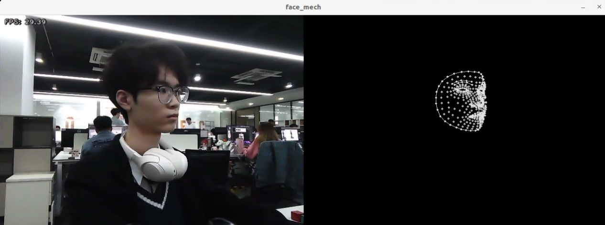

* **Launch File Analysis**

The launch file is located in  [`/home/ubuntu/ros2_ws/src/example/example/mediapipe/face_mesh.launch.py`](../_static/source_code/15/mediapipe.zip)

(1) launch_setup Functio

{lineno-start=9}

```python
def launch_setup(context):
    compiled = os.environ['need_compile']

    if compiled == 'True':
        sdk_package_path = get_package_share_directory('sdk')
        peripherals_package_path = get_package_share_directory('peripherals')
    else:
        sdk_package_path = '/home/ubuntu/ros2_ws/src/driver/sdk'
        peripherals_package_path = '/home/ubuntu/ros2_ws/src/peripherals'
    
    sdk_launch = IncludeLaunchDescription(
        PythonLaunchDescriptionSource(
            os.path.join(sdk_package_path, 'launch/jetarm_sdk.launch.py')),
    )

    depth_camera_launch = IncludeLaunchDescription(
        PythonLaunchDescriptionSource(
            os.path.join(peripherals_package_path, 'launch/depth_camera.launch.py')),
    )

    face_mesh_node = Node(
        package='example',
        executable='face_mesh',
        output='screen',
    )

    return [depth_camera_launch,
            sdk_launch,
            face_mesh_node,
            ]
```

① `compiled = os.environ['need_compile']`: Retrieve the value of the need_compile environment variable to determine whether compiled paths should be used.

② `if compiled == 'True'`: Check if the value of compiled indicates that compiled paths should be used.

③ `sdk_package_path = get_package_share_directory('sdk')`: If compiled paths are selected, retrieve the shared directory path for the sdk package.

④ `peripherals_package_path = get_package_share_directory('peripherals')`: If compiled paths are selected, retrieve the shared directory path for the peripherals package.

⑤ `sdk_package_path = '/home/ubuntu/ros2_ws/src/driver/sdk'`: If not compiled, manually set the source path for the sdk package.

⑥ `peripherals_package_path = '/home/ubuntu/ros2_ws/src/peripherals'`: If not compiled, manually set the source path for the peripherals package.

⑦ `sdk_launch = IncludeLaunchDescription(...)`: Include the jetarm_sdk.launch.py launch file from the sdk package to initialize related functionalities.

⑧ `depth_camera_launch = IncludeLaunchDescription(...)`: Include the depth_camera.launch.py launch file from the peripherals package to start the depth camera.

⑨ `face_mesh_node = Node(...)`: Define a ROS 2 node to execute the face_mesh program from the example package, with output displayed on the screen.

⑩ `return [depth_camera_launch, sdk_launch, face_mesh_node]`: Return the three ROS 2 components to be launched, including the depth camera, SDK launch file, and face_mesh node.

(2) generate_launch_description Function

{lineno-start=40}

```python
def generate_launch_description():
    return LaunchDescription([
        OpaqueFunction(function = launch_setup)
    ])
```

① `def generate_launch_description()`: Define a function named generate_launch_description to create a launch description for ROS 2.

② `return LaunchDescription([...])`: Return a LaunchDescription object that organizes and describes the ROS 2 nodes, functionalities, or files to be launched.

③ `OpaqueFunction(function=launch_setup)`: Use OpaqueFunction to invoke the launch_setup function, enabling dynamic configuration of the content in the launch file.

(3) Main Function

{lineno-start=45}

```python
if __name__ == '__main__':
    # 创建一个LaunchDescription对象
    ld = generate_launch_description()

    ls = LaunchService()
    ls.include_launch_description(ld)
    ls.run()
```

① `ld = generate_launch_description()`: Call the generate_launch_description function to create a LaunchDescription object that contains the launch configuration.

② `ls = LaunchService()`: Instantiate a LaunchService object, responsible for managing and executing ROS 2 launch services.

③ `ls.include_launch_description(ld)`: Add the previously created LaunchDescription object (ld) to the LaunchService, specifying the configuration to be launched.

④ `ls.run()`: Start and execute the LaunchService, launching ROS 2 nodes and functionalities as defined in the LaunchDescription.

* **Python Source Code Analysis**

The source code file is located in

[`/home/ubuntu/ros2_ws/src/example/example/mediapipe/include/face_mesh.py`](../_static/source_code/15/mediapipe.zip)

The following logic flowchart is obtained from organizing the program files:


From the above figure, the program's logic flow is mainly to perform image processing and obtain facial key information, collecting all the keypoints to form facial contour displayed on the returned image.

(1) Import Function Packet

Import the required module using the import statement.

{lineno-start=4}

```python
import os
import cv2
import rclpy
import queue
import threading
import numpy as np
import sdk.fps as fps
import mediapipe as mp
from rclpy.node import Node
from cv_bridge import CvBridge
from std_srvs.srv import Trigger
from sensor_msgs.msg import Image
from servo_controller_msgs.msg import ServosPosition
from servo_controller.bus_servo_control import set_servo_position
```

① `import os`: Import the standard Python os library for interacting with the operating system (e.g., file operations).

② `import cv2`: Import the OpenCV library (cv2) for image and video processing.

③ `import rclpy`: Import the ROS 2 Python client library (rclpy) for creating and managing ROS 2 nodes and communication.

④ `import queue`: Import the standard Python queue library to create thread-safe queues.

⑤ `import threading`: Import the standard Python threading library for implementing multithreading.

⑥ `import numpy as np`: Import the Numpy library (np) for efficient array manipulation and numerical computations.

⑦ `import sdk.fps as fps`: Import a custom fps module for calculating and displaying frame rates.

⑧ `import mediapipe as mp`: Import the MediaPipe library (mp) for computer vision features like face and hand detection.

⑨ `from rclpy.node import Node`: Import the Node class from the ROS 2 rclpy library to define ROS 2 nodes.

⑩ `from cv_bridge import CvBridge`: Import the CvBridge class to convert between ROS image messages and OpenCV image formats.

⑪ `from std_srvs.srv import Trigger`: Import the Trigger service type from std_srvs.srv, typically used to request or trigger specific actions.

⑫ `from sensor_msgs.msg import Image`: Import the Image message type from sensor_msgs.msg for handling image data in ROS.

⑬ `from servo_controller_msgs.msg import ServosPosition`: Import the ServosPosition message type from servo_controller_msgs.msg to control servo positions.

⑭ `from servo_controller.bus_servo_control import set_servo_position`: Import the set_servo_position function from a custom module (bus_servo_control) to send control signals to servos.

(2) Initialization Function of the FaceMeshNode Class

{lineno-start=23}

```python
class FaceMeshNode(Node):
    def __init__(self, name):
        rclpy.init()
        super().__init__(name)
        self.running = True
        self.bridge = CvBridge()
        self.face_mesh = mp.solutions.face_mesh.FaceMesh(
            static_image_mode=False,
            max_num_faces=1,
            min_detection_confidence=0.5,
        )
        self.drawing = mp.solutions.drawing_utils

        self.fps = fps.FPS()

        self.image_queue = queue.Queue(maxsize=2)
        self.image_sub = self.create_subscription(Image, '/depth_cam/rgb/image_raw', self.image_callback, 1)

        self.joints_pub = self.create_publisher(ServosPosition, '/servo_controller', 1) # 舵机控制
        #等待服务启动
        self.client = self.create_client(Trigger, '/controller_manager/init_finish')
        self.client.wait_for_service()
        set_servo_position(self.joints_pub, 1.5, ((10, 500), (5, 500), (4, 330), (3, 100), (2, 700), (1, 500)))


        self.get_logger().info('\033[1;32m%s\033[0m' % 'start')
        threading.Thread(target=self.main, daemon=True).start()
```

① `rclpy.init()`: Initializes the ROS2 client library, enabling the use of ROS2 functionalities in the current process.

② `super().__init__(name)`: Calls the constructor of the parent Node class to initialize the ROS2 node with the specified name.6

③ `self.running = True`: Sets the running attribute to True, indicating that the node is active and running.

④ `self.bridge = CvBridge()`: Creates an instance of CvBridge, which facilitates the conversion between ROS image messages and OpenCV image formats.

⑤ `self.face_mesh = mp.solutions.face_mesh.FaceMesh(...)`: Initializes a MediaPipe FaceMesh object in dynamic mode, configured to detect a maximum of one face with a minimum detection confidence of 0.5.

⑥ `self.drawing = mp.solutions.drawing_utils`: Initializes the MediaPipe drawing utilities for visualizing facial keypoints and connections.

⑦ `self.fps = fps.FPS()`: Creates an instance of FPS to calculate and display the frames per second.

⑧ `self.image_queue = queue.Queue(maxsize=2)`: Sets up a thread-safe queue with a maximum size of 2 for buffering image data.

⑨ `self.image_sub = self.create_subscription(Image, '/depth_cam/rgb/image_raw', self.image_callback, 1)`: Creates a subscriber to the /depth_cam/rgb/image_raw topic, receiving image data and passing it to the image_callback function.

⑩ `self.joints_pub = self.create_publisher(ServosPosition, '/servo_controller', 1)`: Creates a publisher to send servo position messages to the /servo_controller topic.

⑪ `self.client = self.create_client(Trigger, '/controller_manager/init_finish')`: Creates a client to interact with the /controller_manager/init_finish service.

⑫ `self.client.wait_for_service()`: Blocks execution until the init_finish service becomes available, ensuring subsequent operations can proceed.

⑬ `set_servo_position(self.joints_pub, 1.5, ((10, 500), (5, 500), (4, 330), (3, 100), (2, 700), (1, 500)))`: Calls the set_servo_position function to configure the initial positions of the servos.

⑭ `self.get_logger().info('\033\[1;32m%s\033\[0m' % 'start')`: Logs the startup information, highlighting it with formatted text.

⑮ `threading.Thread(target=self.main, daemon=True).start()`: Launches a background thread to execute the main method, which handles face detection and image display.

(3) image_callback Function

{lineno-start=51}

```python
    def image_callback(self, ros_image):
        cv_image = self.bridge.imgmsg_to_cv2(ros_image, "rgb8")
        rgb_image = np.array(cv_image, dtype=np.uint8)
        if self.image_queue.full():
            # 如果队列已满，丢弃最旧的图像
            self.image_queue.get()
            # 将图像放入队列
        self.image_queue.put(rgb_image)
```

① `cv_image = self.bridge.imgmsg_to_cv2(ros_image, "rgb8")`: Converts the received ROS image message (ros_image) into an OpenCV image format (cv2) using CvBridge, with the color format specified as RGB.

② `rgb_image = np.array(cv_image, dtype=np.uint8)`: Converts the OpenCV image into a Numpy array and ensures the data type is uint8, which is standard for image processing tasks.

③ `if self.image_queue.full()`: Checks if the image queue (image_queue) is full, meaning it has reached its maximum capacity for storing images.

④ `self.image_queue.get()`: If the queue is full, removes the oldest image from the queue to make space for the new image.

⑤ `self.image_queue.put(rgb_image)`: Adds the current image (rgb_image) to the queue. If the queue is not full, the image is added directly without removing any images.

(4) Main Function

{lineno-start=60}

```python
    def main(self):
        while self.running:
            try:
                image = self.image_queue.get(block=True, timeout=1)
            except queue.Empty:
                if not self.running:
                    break
                else:
                    continue
            black_image = np.zeros_like(image)

            resize_image = cv2.resize(image, (int(image.shape[1] / 2), int(image.shape[0] / 2)), cv2.INTER_NEAREST) # 缩放图片(resize the image)
            results = self.face_mesh.process(resize_image) # 调用人脸检测(call human face detection)
            if results.multi_face_landmarks is not None:
                for face_landmarks in results.multi_face_landmarks:
                    mp_drawing.draw_landmarks(
                            image=black_image,
                            landmark_list=face_landmarks,
                            connections = mp_face_mesh.FACEMESH_CONTOURS,
                            landmark_drawing_spec=drawing_spec,
                            connection_drawing_spec=drawing_spec)
            result_image = np.concatenate([image, black_image], axis=1)
            mp_image = mp.Image(image_format=mp.ImageFormat.SRGB, data=image)
            self.fps.update()
            result_image = self.fps.show_fps(result_image)
            result_image = cv2.cvtColor(result_image, cv2.COLOR_RGB2BGR)
            cv2.imshow('face_mech', result_image)
            key = cv2.waitKey(1)
            if key == ord('q') or key == 27:  # 按q或者esc退出
                break
        cv2.destroyAllWindows()
        rclpy.shutdown()
```

① `while self.running`: Enters a loop that continuously executes until self.running is set to False, indicating the program should stop.

② `image = self.image_queue.get(block=True, timeout=1)`: Retrieves an image from the image queue (image_queue), blocking for up to 1 second. If the queue is empty, a queue.Empty exception will be raised.

③ `except queue.Empty:`: Catches the queue.Empty exception if the queue is empty and the timeout of 1 second is reached.

④ `if not self.running:`: Checks if self.running is False. If so, the loop is exited, and the main program ends.

⑤ `black_image = np.zeros_like(image)`: Creates a black image with the same size as the original image, which will be used for drawing the face landmarks.

⑥ `resize_image = cv2.resize(image, (int(image.shape[1] / 2), int(image.shape[0] / 2)), cv2.INTER_NEAREST)`: Resizes the image to half its original size using the INTER_NEAREST interpolation algorithm.

⑦ `results = self.face_mesh.process(resize_image)`: Processes the resized image with the face_mesh object from MediaPipe to detect faces.

⑧ `if results.multi_face_landmarks is not None:`: Checks if any face landmarks were detected. If face landmarks are found, the code inside this block is executed.

⑨ `for face_landmarks in results.multi_face_landmarks:`: Iterates through the detected face landmarks.

⑩ `mp_drawing.draw_landmarks(...)`: Uses MediaPipe's drawing utilities to draw face landmarks and connections on the black_image.

⑪ `result_image = np.concatenate([image, black_image], axis=1)`: Concatenates the original image and the black image with drawn face landmarks along the horizontal axis, creating a composite image.

⑫ `mp_image = mp.Image(image_format=mp.ImageFormat.SRGB, data=image)`: Converts the image to a MediaPipe-compatible Image object.

⑬ `self.fps.update()`: Updates the FPS (frames per second) calculation.

⑭ `result_image = self.fps.show_fps(result_image)`: Displays the calculated FPS on the composite image.

⑮ `result_image = cv2.cvtColor(result_image, cv2.COLOR_RGB2BGR)`: Converts the image from RGB to BGR color space for proper display with OpenCV.

⑯ `cv2.imshow('face_mech', result_image)`: Displays the composite image with face detection and FPS information using OpenCV.

⑰ `key = cv2.waitKey(1)`: Waits for 1 millisecond for keyboard input and captures key events.

⑱ `if key == ord('q') or key == 27:`: If the 'q' key or the ESC key is pressed, the loop is exited, and the program stops.

⑲ `cv2.destroyAllWindows()`: Closes all OpenCV windows.

⑳ `rclpy.shutdown()`: Shuts down the ROS2 client, cleaning up any resources.

### 15.1.4 Mediapipe Face Tracking

* **Realization Process**

Firstly, Initialize the node and servos, subscribe to the camera image topic, create the FaceTracker class. Initialize the face detector, PID controller, and related variables.

Next, perform image processing by using the face detector to obtain facial bounding boxes and keypoints.

Then, calculate the distance between the face and the center of the screen. Based on the PID controller's calculations, control the robotic arm to achieve face tracking.

* **Operations**

:::Note
The entered commands should be case sensitive, and the "**Tab**" key can be used to complement the key words.
:::

(1) Connect JetArm to the remote desktop via NoMachine.

(2) Double click on  to open the command line terminal. Enter the command below and press Enter to disable the auto-startup service.

```
sudo systemctl stop start_app_node.service
```

(3) Enter the following command and press Enter to run the program.

```
ros2 launch example face_tracking.launch.py
```

(4) If you want to close the program, please press `Ctrl+C`. Please try multiple times for the operation failure.

(5) After the game ends, you need to enable app service (should not enable the service, the following app functions will be affected).

```
sudo systemctl start start_app_node.service
```

* **Outcome**

Robot will detect face and enclose it on the returned image. It is capable of tracking the movement of the face, ensuring that the face is located in the center of the image.


* **Launch File Analysis**

The Launch file is located in

[`/home/ubuntu/ros2_ws/src/example/example/mediapipe/face_tracking.launch.py`](../_static/source_code/15/mediapipe.zip)

(1) launch_setup Function

{lineno-start=9}

```python
def launch_setup(context):
    compiled = os.environ['need_compile']
    start = LaunchConfiguration('start', default='true')
    start_arg = DeclareLaunchArgument('start', default_value=start)
    if compiled == 'True':
        sdk_package_path = get_package_share_directory('sdk')
        peripherals_package_path = get_package_share_directory('peripherals')
    else:
        sdk_package_path = '/home/ubuntu/ros2_ws/src/driver/sdk'
        peripherals_package_path = '/home/ubuntu/ros2_ws/src/peripherals'

    sdk_launch = IncludeLaunchDescription(
        PythonLaunchDescriptionSource(
            os.path.join(sdk_package_path, 'launch/jetarm_sdk.launch.py')),
    )
    
    depth_camera_launch = IncludeLaunchDescription(
        PythonLaunchDescriptionSource(
            os.path.join(peripherals_package_path, 'launch/depth_camera.launch.py')),
    )

    face_tracking_node = Node(
        package='example',
        executable='face_tracking',
        output='screen',
        parameters=[{'start': start}]
    )

    return [start_arg,
            sdk_launch,
            depth_camera_launch,
            face_tracking_node,
            ]

```

① `compiled = os.environ['need_compile']`: Retrieves the value of the environment variable need_compile to determine whether compilation is needed.

② `start = LaunchConfiguration('start', default='true')`: Creates a LaunchConfiguration object to retrieve the value of the start parameter from the launch file, defaulting to 'true'.

③ `start_arg = DeclareLaunchArgument('start', default_value=start)`: Declares a launch argument for start, with a default value of 'true'. This value can be modified through command-line arguments or the launch file.

④ `if compiled == 'True':`: Checks if the environment variable need_compile is set to 'True' to decide whether to use the compiled paths.

⑤ `sdk_package_path = get_package_share_directory('sdk')`: If compilation is needed, retrieves the shared directory path for the sdk package.

⑥ `peripherals_package_path = get_package_share_directory('peripherals')`: If compilation is needed, retrieves the shared directory path for the peripherals package.

⑦ `else:`: If compiled is not 'True', use the default paths.

⑧ `sdk_package_path = '/home/ubuntu/ros2_ws/src/driver/sdk'`: Uses the default SDK package path.

⑨ `peripherals_package_path = '/home/ubuntu/ros2_ws/src/peripherals'`: Uses the default peripherals package path.

⑩ `sdk_launch = IncludeLaunchDescription(...)`: Includes the launch file jetarm_sdk.launch.py from the sdk package to start the related SDK configuration.

⑪ `depth_camera_launch = IncludeLaunchDescription(...)`: Includes the launch file depth_camera.launch.py from the peripherals package to start the configuration related to the depth camera.

⑫ `face_tracking_node = Node(...)`: Defines a face_tracking node with the specified package name, executable file, output method (displayed on the screen), and the passed launch argument start.

⑬ `return [start_arg, sdk_launch, depth_camera_launch, face_tracking_node]`: Returns the launch argument and the various launch items, including the SDK launch, depth camera launch, and face tracking node.

(2) generate_launch_description Function

{lineno-start=43}

```python
def generate_launch_description():
    return LaunchDescription([
        OpaqueFunction(function = launch_setup)
    ])
```

`return LaunchDescription([OpaqueFunction(function = launch_setup)])`: Creates and returns a LaunchDescription object containing an OpaqueFunction, with the launch_setup function passed as an argument.

(3) Main Function

{lineno-start=48}

```python
if __name__ == '__main__':
    # 创建一个LaunchDescription对象
    ld = generate_launch_description()

    ls = LaunchService()
    ls.include_launch_description(ld)
    ls.run()
```

① `ld = generate_launch_description()`: Calls the generate_launch_description() function to create a LaunchDescription object, which contains the launch configuration and nodes to be started.

② `ls = LaunchService()`: Creates a LaunchService object, which is the core class of the ROS2 launch system, responsible for managing and executing launch descriptions.

③ `ls.include_launch_description(ld)`: Adds the previously created LaunchDescription object ld to the LaunchService, preparing it for execution.

④ `ls.run()`: Starts and runs the LaunchService, initiating the execution of all launch items defined in the description, such as nodes and launch files.

* **Python Source Code Analysis**

The source code file is located in

[/home/ubuntu/ros2_ws/src/example/example/mediapipe/face_tracking.launch.py](../_static/source_code/15/mediapipe.zip)

The program logic flowchart derived from the program files is as follow.

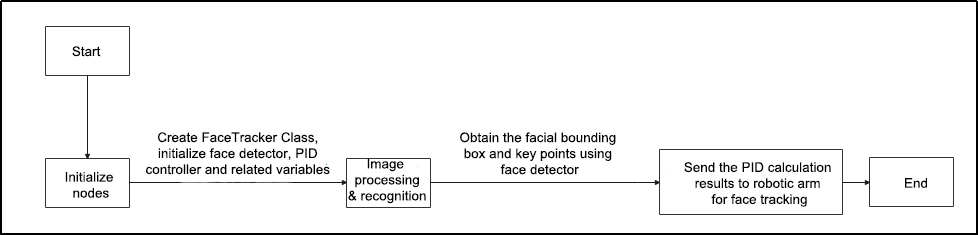

(1) Import Feature Pack

{lineno-start=4}

```python
import os
import cv2
import time
import queue
import rclpy
import threading
import numpy as np
import sdk.pid as pid
import mediapipe as mp
from sdk import fps
from rclpy.node import Node
from cv_bridge import CvBridge
from std_srvs.srv import Trigger
from sensor_msgs.msg import Image
from kinematics_msgs.srv import SetRobotPose
from rclpy.executors import MultiThreadedExecutor
from servo_controller_msgs.msg import ServosPosition
from rclpy.callback_groups import ReentrantCallbackGroup
from kinematics.kinematics_control import set_pose_target
from servo_controller.bus_servo_control import set_servo_position
from sdk.common import show_faces, mp_face_location, box_center, distance
```

① `import os`: Imports the OS module for interacting with the operating system, mainly for accessing environment variables and file system operations.

② `import cv2`: Imports the OpenCV library for image processing and computation.

③ `import time`: Imports the time module for handling delays and time-related operations.

④ `import queue`: Imports the queue module for managing thread synchronization.

⑤ `import rclpy`: Imports the ROS2 client library.

⑥ `import threading`: Imports the threading module for creating multithreaded tasks.

⑦ `import numpy as np`: Imports the NumPy library for handling and manipulating arrays.

⑧ `import sdk.pid as pid`: Imports the PID control-related module from the SDK.

⑨ `import mediapipe as mp`: Imports the MediaPipe library for face detection and tracking.

⑩ `from sdk import fps`: Imports the frame rate monitoring module from the SDK.

⑪ `from rclpy.node import Node`: Imports the ROS2 Node class for creating ROS2 nodes.

⑫ `from cv_bridge import CvBridge`: Imports the CV Bridge library for converting ROS image messages to OpenCV images.

⑬ `from std_srvs.srv import Trigger`: Imports the ROS2 Trigger service for sending trigger commands.

⑭ `from sensor_msgs.msg import Image`: Imports the ROS2 Image message type for handling image data.

⑮ `from kinematics_msgs.srv import SetRobotPose`: Imports the ROS2 SetRobotPose service for setting robot joint positions.

⑯ `from rclpy.executors import MultiThreadedExecutor`: Imports the ROS2 MultiThreadedExecutor class for handling asynchronous tasks.

⑰ `from servo_controller_msgs.msg import ServosPosition`: Imports the ROS2 ServosPosition message type for controlling servos.

⑱ `from rclpy.callback_groups import ReentrantCallbackGroup`: Imports the ROS2 ReentrantCallbackGroup class for managing asynchronous callbacks.

⑲ `from kinematics.kinematics_control import set_pose_target`: Imports the function for setting the robot's joint target position from the kinematics control module.

⑳ `from servo_controller.bus_servo_control import set_servo_position`: Imports the function for setting the servo position from the servo control module.

㉑ `from sdk.common import show_faces, mp_face_location, box_center, distance`: Imports a series of utility functions from the SDK module for face detection and manipulation, including show_faces, mp_face_location, box_center, and distance.

(2) FaceTrackingNode Class Initialization Function

{lineno-start=26}

```python
class FaceTrackingNode(Node):
    def __init__(self, name):
        rclpy.init()
        super().__init__(name, allow_undeclared_parameters=True, automatically_declare_parameters_from_overrides=True)
        self.face_detector = mp.solutions.face_detection.FaceDetection(
            min_detection_confidence=0.3,
        )
        self.running = True
        self.bridge = CvBridge()
        self.fps = fps.FPS()
        self.image_queue = queue.Queue(maxsize=2)
        
        self.z_dis = 0.28
        self.y_dis = 500
        self.x_init = 0.18
        self.pid_z = pid.PID(0.00006, 0.0, 0.0)
        self.pid_y = pid.PID(0.055, 0.0, 0.0)
        self.detected_face = 0 
        self.joints_pub = self.create_publisher(ServosPosition, '/servo_controller', 1) # 舵机控制

        self.image_sub = self.create_subscription(Image, '/depth_cam/rgb/image_raw', self.image_callback, 1)  # 摄像头订阅(subscribe to the camera)

        self.result_publisher = self.create_publisher(Image, '~/image_result', 1)  # 图像处理结果发布(publish the image processing result)
        timer_cb_group = ReentrantCallbackGroup()
        self.create_service(Trigger, '~/start', self.start_srv_callback) # 进入玩法
        self.create_service(Trigger, '~/stop', self.stop_srv_callback, callback_group=timer_cb_group) # 退出玩法
        self.client = self.create_client(Trigger, '/controller_manager/init_finish')
        self.client.wait_for_service()
        self.client = self.create_client(Trigger, '/kinematics/init_finish')
        self.client.wait_for_service()

        self.kinematics_client = self.create_client(SetRobotPose, '/kinematics/set_pose_target')
        self.kinematics_client.wait_for_service()

        self.timer = self.create_timer(0.0, self.init_process, callback_group=timer_cb_group)
```

① `rclpy.init()`: Initializes the ROS2 client library, enabling the use of ROS2 functionalities.

② `super().__init__(name, allow_undeclared_parameters=True, automatically_declare_parameters_from_overrides=True)`: Calls the parent class `Node` constructor to initialize the node, allowing undeclared parameters and automatically declaring parameters that are overridden.

③ `self.face_detector = mp.solutions.face_detection.FaceDetection(min_detection_confidence=0.3)`: Initializes the Mediapipe face detection module with a minimum detection confidence of 0.3.

④ `self.running = True`: Defines a flag indicating whether the node is running.

⑤ `self.bridge = CvBridge()`: Creates a `CvBridge` object to convert ROS image messages to OpenCV images.

⑥ `self.fps = fps.FPS()`: Creates an `FPS` object to monitor the frame rate of image processing.

⑦ `self.image_queue = queue.Queue(maxsize=2)`: Creates a thread-safe queue with a maximum size of 2 to store image data.

⑧ `self.z_dis = 0.28`: Sets the initial Z-axis distance value.

⑨ `self.y_dis = 500`: Sets the initial Y-axis distance value.

⑩ `self.x_init = 0.18`: Sets the initial X-axis value.

⑪ `self.pid_z = pid.PID(0.00006, 0.0, 0.0)`: Creates a PID controller object to control the Z-axis position.

⑫ `self.pid_y = pid.PID(0.055, 0.0, 0.0)`: Creates a PID controller object to control the Y-axis position.

⑭ `self.detected_face = 0`: Initializes a variable `detected_face` to indicate whether a face has been detected.

⑭ `self.joints_pub = self.create_publisher(ServosPosition, '/servo_controller', 1)`: Creates a publisher to send `ServosPosition` messages to the `/servo_controller` topic for servo control.

⑮ `self.image_sub = self.create_subscription(Image, '/depth_cam/rgb/image_raw', self.image_callback, 1)`: Creates a subscriber to receive image messages from the `/depth_cam/rgb/image_raw` topic and calls the `image_callback` method for processing.

⑯ `self.result_publisher = self.create_publisher(Image, '~/image_result', 1)`: Creates a publisher to publish the image processing results to the `~/image_result` topic.

⑰ `timer_cb_group = ReentrantCallbackGroup()`: Creates a reentrant callback group to ensure safe execution of callback functions in a multithreaded environment, particularly for timer callbacks.

⑱ `self.create_service(Trigger, '~/start', self.start_srv_callback)`: Creates a service that listens to the `~/start` topic and triggers the `start_srv_callback` method.

⑲ `self.create_service(Trigger, '~/stop', self.stop_srv_callback, callback_group=timer_cb_group)`: Creates a service that listens to the `~/stop` topic, triggers the `stop_srv_callback` method, and uses the timer callback group for safe execution.

⑳ `self.client = self.create_client(Trigger, '/controller_manager/init_finish')`: Creates a client to connect to the `/controller_manager/init_finish` service and waits for the service to start.

㉑ `self.client.wait_for_service()`: Blocks and waits for the `/controller_manager/init_finish` service to become available.

㉒ `self.client = self.create_client(Trigger, '/kinematics/init_finish')`: Creates a client to connect to the `/kinematics/init_finish` service and waits for the service to start.

㉓ `self.client.wait_for_service()`: Blocks and waits for the `/kinematics/init_finish` service to become available.

㉔ `self.kinematics_client = self.create_client(SetRobotPose, '/kinematics/set_pose_target')`: Creates a client to connect to the `/kinematics/set_pose_target` service for setting the robot's pose target.

㉕ `self.kinematics_client.wait_for_service()`: Blocks and waits for the `/kinematics/set_pose_target` service to become available.

㉖ `self.timer = self.create_timer(0.0, self.init_process, callback_group=timer_cb_group)`: Creates a timer that immediately calls the `init_process` method to perform initialization, using the timer callback group for safe execution.

(3) init_process Function

{lineno-start=62}

```python
    def init_process(self):
        self.timer.cancel()

        self.init_action()
        if self.get_parameter('start').value:
            self.start_srv_callback(Trigger.Request(), Trigger.Response())

        threading.Thread(target=self.main, daemon=True).start()
        self.create_service(Trigger, '~/init_finish', self.get_node_state)
        self.get_logger().info('\033[1;32m%s\033[0m' % 'start')
```

① `self.timer.cancel()`: Cancels the timer and stops the triggering of the timer callback.

② `self.init_action()`: Calls the `init_action` method to perform initialization operations.

③ `if self.get_parameter('start').value`: Checks the value of the `start` parameter to determine whether to execute the startup operation.

④ `self.start_srv_callback(Trigger.Request(), Trigger.Response())`: If the `start` parameter is true, calls the `start_srv_callback` method with empty request and response objects to initiate the related operations.

⑤ `threading.Thread(target=self.main, daemon=True).start()`: Creates and starts a new thread to execute the `main` method. The `daemon=True` argument ensures that the thread is a daemon thread, which will automatically terminate when the main program exits.

⑥ `self.create_service(Trigger, '~/init_finish', self.get_node_state)`: Creates a service at the `~/init_finish` topic. When a service request is received, it calls the `get_node_state` method as the callback.

⑦ `self.get_logger().info('\033\[1;32m%s\033\[0m' % 'start')`: Logs an informational message indicating that the node has started, using green text for visibility.

(4) init_action Function

{lineno-start=80}

```python
    def init_action(self):
        msg = set_pose_target([self.x_init, 0.0, self.z_dis], 0.0, [-90.0, 90.0], 1.0)
        res = self.send_request(self.kinematics_client, msg)
        if res.pulse:
            servo_data = res.pulse
            set_servo_position(self.joints_pub, 1.5, ((10, 500), (5, 500), (4, servo_data[3]), (3, servo_data[2]), (2, servo_data[1]), (1, servo_data[0])))
            time.sleep(1.8)
```

① `msg = set_pose_target([self.x_init, 0.0, self.z_dis], 0.0, [-90.0, 90.0], 1.0)`: Calls the `set_pose_target` function to create a target pose message `msg`. It sets the robot's target position to `[self.x_init, 0.0, self.z_dis]`, defines the target rotation angle range as `[-90.0, 90.0]`, and sets the target speed to `1.0`.

② `res = self.send_request(self.kinematics_client, msg)`: Calls the `send_request` method to send the `msg` message to the `kinematics_client` service and receives the response `res`.

③ `if res.pulse`: Checks if the `pulse` field exists in the response `res`, which indicates whether valid servo data is available.

④ `servo_data = res.pulse`: Assigns the `pulse` data from the response to `servo_data`, which contains the servo control values.

⑤ `set_servo_position(self.joints_pub, 1.5, ((10, 500), (5, 500), (4, servo_data[3]), (3, servo_data[2]), (2, servo_data[1]), (1, servo_data[0])))`: Calls the `set_servo_position` function, passing the servo data `servo_data`. This function sets the position of each servo based on the values from `servo_data`, with `1.5` as the baseline value and specific servo positions from the `servo_data`.

⑥ `time.sleep(1.8)`: Pauses execution for 1.8 seconds, allowing the servos to complete their movement.

(5) send_request Function

{lineno-start=88}

```python
    def send_request(self, client, msg):
        future = client.call_async(msg)
        while rclpy.ok():
            if future.done() and future.result():
                return future.result()
```

① `def send_request(self, client, msg):`: Defines a method send_request, which takes a client object and a msg object as parameters.

② `future = client.call_async(msg)`: Calls the client's asynchronous request method `call_async`, sends the message, and returns a `future` object representing the result of the request.

③ `while rclpy.ok()`: Enters a loop to continuously check if the ROS2 node is running properly.

④ `if future.done() and future.result()`: Checks if the `future` has completed and if the result is valid.

⑤ `return future.result()`: If the request is complete and the result is valid, returns the result of the `future`.

(6) start_srv_callback & stop_srv_callback Function

{lineno-start=95}

```python
    def start_srv_callback(self, request, response):
        self.get_logger().info('\033[1;32m%s\033[0m' % "start face track")
        
        self.start = True
        response.success = True
        response.message = "start"
        return response

    def stop_srv_callback(self, request, response):
        self.get_logger().info('\033[1;32m%s\033[0m' % "stop face track")
        self.start = False
        res = self.send_request(ColorDetect.Request())
        if res.success:
            self.get_logger().info('\033[1;32m%s\033[0m' % 'set face success')
        else:
            self.get_logger().info('\033[1;32m%s\033[0m' % 'set face fail')
        response.success = True
        response.message = "stop"
        return response
```

① `self.send_request(self.start_yolov8_client, Trigger.Request())`: Calls the `send_request` method, sending a start request to `start_yolov8_client`.

② `response.success = True`: Sets the service response to indicate success.

③ `response.message = "start"`: Sets the response message to "**start**".

④ `return response`: Returns the response object.

⑤ `self.send_request(self.stop_yolov8_client, Trigger.Request())`: Calls the `send_request` method, sending a stop request to `stop_yolov8_client`.

⑥ `response.success = True`: Sets the service response to indicate success.

⑦ `response.message = "stop"`: Sets the response message to "**stop**".

⑧ `return response`: Returns the response object.

(7) image_callback Function

{lineno-start=115}

```python
    def image_callback(self, ros_image):
        # 将画面转为 opencv 格式(convert the screen to opencv format)
        cv_image = self.bridge.imgmsg_to_cv2(ros_image, "bgr8")
        bgr_image = np.array(cv_image, dtype=np.uint8)

        if self.image_queue.full():
            # 如果队列已满，丢弃最旧的图像
            self.image_queue.get()
        # 将图像放入队列
        self.image_queue.put(bgr_image)
```

① `self.send_request(self.start_yolov8_client, Trigger.Request())`: Calls the `send_request` method, sending a start request to `start_yolov8_client`.

② `response.success = True`: Sets the service response to indicate success.

③ `response.message = "start"`: Sets the response message to "**start**".

④ `return response`: Returns the response object.

⑤ `self.send_request(self.stop_yolov8_client, Trigger.Request())`: Calls the `send_request` method, sending a stop request to `stop_yolov8_client`.

⑥ `response.success = True`: Sets the service response to indicate success.

⑦ `response.message = "stop"`: Sets the response message to "**stop**".

⑧ `return response`: Returns the response object.

(8) Main Function

{lineno-start=127}

```python
    def main(self):

        while self.running:
            bgr_image = self.image_queue.get()

            result_image = np.copy(bgr_image)
            results = self.face_detector.process(bgr_image)
            boxes, keypoints = mp_face_location(results, bgr_image)
            o_h, o_w = bgr_image.shape[:2]
            if len(boxes) > 0:
                self.detected_face += 1 
                self.detected_face = min(self.detected_face, 20) # 让计数总是不大于20(ensure that the count is never greater than 20)

                # 连续 5 帧识别到了人脸就开始追踪, 避免误识别(start tracking if a face is detected in five consecutive frames to avoid false positives)
                if self.detected_face >= 5:
                    center = [box_center(box) for box in boxes] # 计算所有人脸的中心坐标(calculate the center coordinate of all human faces)
                    dist = [distance(c, (o_w / 2, o_h / 2)) for c in center] # 计算所有人脸中心坐标到画面中心的距离(calculate the distance from the center of each detected face to the center of the screen)
                    face = min(zip(boxes, center, dist), key=lambda k: k[2]) # 找出到画面中心距离最小的人脸(identify the face with the minimum distance to the center of the screen)

                    center_x, center_y = face[1]
                    t1 = time.time()
                    self.pid_y.SetPoint = result_image.shape[1]/2 
                    self.pid_y.update(center_x)
                    self.y_dis += self.pid_y.output
                    if self.y_dis < 200:
                        self.y_dis = 200
                    if self.y_dis > 800:
                        self.y_dis = 800

                    self.pid_z.SetPoint = result_image.shape[0]/2 
                    self.pid_z.update(center_y)
                    self.z_dis += self.pid_z.output
                    if self.z_dis > 0.30:
                        self.z_dis = 0.30
                    if self.z_dis < 0.23:
                        self.z_dis = 0.23
                    msg = set_pose_target([self.x_init, 0.0, self.z_dis], 0.0, [-180.0, 180.0], 1.0)
                    res = self.send_request(self.kinematics_client, msg)
                    t2 = time.time()
                    t = t2 - t1
                    if t < 0.02:
                        time.sleep(0.02 - t)
                    if res.pulse:
                        servo_data = res.pulse
                        set_servo_position(self.joints_pub, 0.02, ((10, 500), (5, 500), (4, servo_data[3]), (3, servo_data[2]), (2, servo_data[1]), (1, int(self.y_dis))))
                    else:
                        set_servo_position(self.joints_pub, 0.02, ((1, int(self.y_dis)), ))

                result_image = show_faces( result_image, bgr_image, boxes, keypoints) # 在画面中显示识别到的人脸和脸部关键点(display the detected faces and facial key points on the screen)
            else: # 这里是没有识别到人脸的处理(here is the processing for when no face is detected)         
                if self.detected_face > 0:
                    self.detected_face -= 1
                else:
                    self.pid_z.clear()
                    self.pid_y.clear()


            self.result_publisher.publish(self.bridge.cv2_to_imgmsg(result_image, "bgr8"))
            self.fps.update()
            self.fps.show_fps(result_image)
            cv2.imshow("result", result_image)
            cv2.waitKey(1)

        self.init_action()
        rclpy.shutdown()
```

① `bgr_image = self.image_queue.get()`: Retrieves the latest image data from the image_queue.

② `result_image = np.copy(bgr_image)`: Creates a copy of bgr_image named result_image for processing and displaying the results.

③ `results = self.face_detector.process(bgr_image)`: Uses the face_detector to process the image and detect faces.

④ `boxes, keypoints = mp_face_location(results, bgr_image)`: Extracts the bounding boxes (boxes) and keypoints (keypoints) of detected faces using the mp_face_location function.

⑤ `o_h, o_w = bgr_image.shape[:2]`: Gets the image's height (o_h) and width (o_w).

⑥ `if len(boxes) > 0`: If at least one face is detected, proceeds to the face processing flow.

⑦ `self.detected_face += 1`: Increments the face detection count.

⑧ `self.detected_face = min(self.detected_face, 20)`: Ensures that the face detection count does not exceed 20.

⑨ `if self.detected_face >= 5`: If faces have been detected for 5 consecutive frames, starts tracking the face.

⑩ `center = [box_center(box) for box in boxes]`: Calculates the center coordinates for each detected face.

⑪ `dist = [distance(c, (o_w / 2, o_h / 2)) for c in center]`: Calculates the distance between each face center and the image center.

⑫ `face = min(zip(boxes, center, dist), key=lambda k: k[2])`: Finds the face closest to the image center.

⑬ `center_x, center_y = face[1]`: Gets the center coordinates of the face closest to the image center.

⑭ `self.pid_y.SetPoint = result_image.shape[1]/2`: Sets the PID controller's target to the horizontal center of the image for horizontal tracking.

⑮ `self.pid_y.update(center_x)`: Updates the PID controller with the error between the current position and the target position.

⑯ `self.y_dis += self.pid_y.output`: Updates the Y-axis position based on the PID controller output.

⑰ `self.y_dis = max(200, min(self.y_dis, 800))`: Constrains the Y-axis position to stay between 200 and 800.

⑱ `self.pid_z.SetPoint = result_image.shape[0]/2`: Sets the PID controller's target to the vertical center of the image for vertical tracking.

⑲ `self.pid_z.update(center_y)`: Updates the PID controller with the error in the Y-coordinate and calculates the new output.

⑳ `self.z_dis = max(0.23, min(self.z_dis, 0.30))`: Constrains the Z-axis position to stay between 0.23 and 0.30.

㉑ `msg = set_pose_target([self.x_init, 0.0, self.z_dis], 0.0, [-180.0, 180.0], 1.0)`: Creates a message to set the robot arm's target position.

㉒ `res = self.send_request(self.kinematics_client, msg)`: Sends a request to the kinematics service to set the target position.

㉓ `t2 = time.time()`: Records the current time.

㉔ `if t < 0.02`: If the processing time is less than 20 milliseconds, sleeps to maintain the frame rate.

㉕ `if res.pulse`: If the kinematics service returns pulse data, adjusts the servo positions.

㉖ `set_servo_position(self.joints_pub, 0.02, ((10, 500), (5, 500), (4, servo_data[3]), (3, servo_data[2]), (2, servo_data[1]), (1, int(self.y_dis))))`: Adjusts the servo positions based on the pulse data and PID output.

㉗ `else`: If no pulse data is returned, uses the default servo positions.

㉘ `result_image = show_faces(result_image, bgr_image, boxes, keypoints)`: Displays the detected faces and keypoints on the image.

㉙ `else`: If no faces are detected, reduces the detection count and resets the PID controller.

㉚ `self.result_publisher.publish(self.bridge.cv2_to_imgmsg(result_image, "bgr8"))`: Publishes the processed image to a ROS topic.

㉛ `self.fps.update()`: Updates the frame rate counter.

㉜ `self.fps.show_fps(result_image)`: Displays the current frame rate on the image.

㉝ `cv2.imshow("result", result_image)`: Displays the processed image.

㉞ `cv2.waitKey(1)`: Waits for a keyboard event to process the image window.

㉟ `self.init_action()`: Executes the initialization action at the end of the program.

㊱ `rclpy.shutdown()`: Shuts down the ROS2 node.

### 15.1.5 Mediapipe Gesture Interaction

* **Realization Process**

At first, initialize the nodes and the servos of robotic arm, subscribe to the camera image topic, and create **HandGestureNode** class.

Next, perform image processing to detect and recognize gestures.

Then invoke the corresponding action group to execute the interaction of robotic arm.

* **Operations**

:::Note
The entered commands should be case sensitive, and the "**Tab**" key can be used to complement the key words.
:::

(1) Connect JetArm to the remote desktop via NoMachine.

(2) Double click on  to open the command line terminal. Enter the command below and press Enter to disable the auto-startup service.

```
sudo systemctl stop start_app_node.service
```

(3) Enter the following command and press Enter to run the program.

```
ros2 launch example hand_gesture.launch.py
```

(4) If you want to close the program, please press `Ctrl+C`. Please try multiple times for the operation failure.

(5) After the game ends, you need to enable app service (should not enable the service, the following app functions will be affected).

```
sudo systemctl start start_app_node.service
```

(6) After the app service is enabled, the robotic arm will return to the initial posture, and the buzzer will make a "**Di**" sound.

* **Performance**

The robotic arm can detect key points on the hand and connect them to recognize gestures, and execute a corresponding action group for interactive movements. Gesture "**one**" corresponds to action group "**one.d6a**", gesture "**two**" corresponds to action group "**two.d6a**"


* **Launch File Analysis**

The Launch file is located in

`/home/ubuntu/ros2_ws/src/example/example/mediapipe/hand_gesture.launch.py`

(1) launch_setup Function

{lineno-start=9}

```python
def launch_setup(context):
    compiled = os.environ['need_compile']
    start = LaunchConfiguration('start', default='true')
    start_arg = DeclareLaunchArgument('start', default_value=start)
    if compiled == 'True':
        sdk_package_path = get_package_share_directory('sdk')
        peripherals_package_path = get_package_share_directory('peripherals')
    else:
        sdk_package_path = '/home/ubuntu/ros2_ws/src/driver/sdk'
        peripherals_package_path = '/home/ubuntu/ros2_ws/src/peripherals'

    sdk_launch = IncludeLaunchDescription(
        PythonLaunchDescriptionSource(
            os.path.join(sdk_package_path, 'launch/jetarm_sdk.launch.py')),
    )

    
    depth_camera_launch = IncludeLaunchDescription(
        PythonLaunchDescriptionSource(
            os.path.join(peripherals_package_path, 'launch/depth_camera.launch.py')),
    )

    hand_gesture_node = Node(
        package='example',
        executable='hand_gesture',
        output='screen',
    )

    return [start_arg,
            sdk_launch,
            depth_camera_launch,
            hand_gesture_node,
            ]


```

① `compiled = os.environ['need_compile']`: Reads the `need_compile` environment variable to determine whether compilation is required.

② `start = LaunchConfiguration('start', default='true')`: Declares a launch configuration parameter `start`, with a default value of `true`.

③ `start_arg = DeclareLaunchArgument('start', default_value=start)`: Declares the `start` launch parameter and adds it to the launch file.

④ `if compiled == 'True'`: Checks if the `need_compile` environment variable is set to `True`.

⑤ `sdk_package_path = get_package_share_directory('sdk')`: Gets the shared directory path of the `sdk` package based on the compilation status.

⑥ `peripherals_package_path = get_package_share_directory('peripherals')`: Gets the shared directory path of the `peripherals` package based on the compilation status.

⑦ `else`: If the `compiled` environment variable is not set to `'True'`, uses a fixed path.

⑧ `sdk_package_path = '/home/ubuntu/ros2_ws/src/driver/sdk'`: Sets the `sdk` package path using a fixed directory.

⑨ `peripherals_package_path = '/home/ubuntu/ros2_ws/src/peripherals'`: Sets the `peripherals` package path using a fixed directory.

⑩ `sdk_launch = IncludeLaunchDescription(...)`: Includes the launch file `jetarm_sdk.launch.py` from the `sdk` package.

⑪ `depth_camera_launch = IncludeLaunchDescription(...)`: Includes the launch file `depth_camera.launch.py` from the `peripherals` package.

⑫ `hand_gesture_node = Node(...)`: Defines a ROS2 node `hand_gesture_node` to execute the `hand_gesture` executable, outputs to the screen, and passes the `start` parameter.

⑬ `return [...]`: Returns a list of launch actions, including the launch parameters, SDK launch file, depth camera launch file, and hand gesture recognition node.

(2) generate_launch_description Function

{lineno-start=43}

```python
def generate_launch_description():
    return LaunchDescription([
        OpaqueFunction(function = launch_setup)
    ])
```

`return LaunchDescription([OpaqueFunction(function = launch_setup)])`:

Creates and returns a LaunchDescription object, which contains an OpaqueFunction with the launch_setup function passed to it.

(3) Main Function

{lineno-start=48}

```python
if __name__ == '__main__':
    # 创建一个LaunchDescription对象
    ld = generate_launch_description()

    ls = LaunchService()
    ls.include_launch_description(ld)
    ls.run()
```

① `ld = generate_launch_description()`: Calls the `generate_launch_description()` function to generate a `LaunchDescription` object, which contains the configuration and nodes for the launch.

② `ls = LaunchService()`: Creates a `LaunchService` object. `LaunchService` is the core class of the ROS2 launch system, responsible for managing and executing launch descriptions.

③ `ls.include_launch_description(ld)`: Adds the previously created `LaunchDescription` object `ld` to the `LaunchService`, preparing it to execute the launch items defined in the description.

④ `ls.run()`: Starts and runs the `LaunchService`, initiating all the launch items defined within it, such as nodes and launch files.

* **Python Source Code Analysis**

(1) Import Feature Pack

{lineno-start=4}

```python
import cv2
import time
import enum
import rclpy
import queue
import threading
import numpy as np
import sdk.fps as fps
import mediapipe as mp
import sdk.buzzer as buzzer
from rclpy.node import Node
from cv_bridge import CvBridge
from std_srvs.srv import Trigger
from sensor_msgs.msg import Image
from rclpy.executors import MultiThreadedExecutor
from sdk.common import  distance, vector_2d_angle
from servo_controller_msgs.msg import ServosPosition
from rclpy.callback_groups import ReentrantCallbackGroup
from servo_controller.bus_servo_control import set_servo_position
from servo_controller.action_group_controller import ActionGroupController
```

① `import cv2`: Imports the `cv2` module, which is used for computer vision operations, such as image processing.

② `import time`: Imports the `time` module, which provides time-related functions.

③ `import enum`: Imports the `enum` module, which is used to define enumeration types.

④ `import rclpy`: Imports the `rclpy` module, which is used for ROS2 node and communication management.

⑤ `import queue`: Imports the `queue` module, which is used for managing queues between threads.

⑥ `import threading`: Imports the `threading` module, which is used for implementing multithreading operations.

⑦ `import numpy as np`: Imports the `numpy` module, which is used for numerical calculations and array operations.

⑧ `import sdk.fps as fps`: Imports the `fps` module from the `sdk` package, used for calculating and displaying the frame rate.

⑨ `import mediapipe as mp`: Imports the `mediapipe` module, which provides computer vision tools, such as hand detection.

⑩ `import sdk.buzzer as buzzer`: Imports the `buzzer` module from the `sdk` package, used to control the buzzer behavior.

⑪ `from rclpy.node import Node`: Imports the `Node` class from `rclpy.node`, which is used to create and manage ROS2 nodes.

⑫ `from cv_bridge import CvBridge`: Imports the `CvBridge` class from the `cv_bridge` module, which is used to convert ROS image messages to OpenCV images and vice versa.

⑬ `from std_srvs.srv import Trigger`: Imports the `Trigger` service type from `std_srvs.srv`, which is used to trigger service calls.

⑭ `from sensor_msgs.msg import Image`: Imports the `Image` message type from `sensor_msgs.msg`, used for transmitting image data.

⑮ `from rclpy.executors import MultiThreadedExecutor`: Imports the `MultiThreadedExecutor` class from `rclpy.executors`, which supports multithreaded execution.

⑯ `from sdk.common import distance, vector_2d_angle`: Imports the `distance` and `vector_2d_angle` methods from `sdk.common`, used for calculating the distance between two points and 2D angles, respectively.

⑰ `from servo_controller_msgs.msg import ServosPosition`: Imports the `ServosPosition` message type from `servo_controller_msgs.msg`, used for controlling the position of servos.

⑱ `from rclpy.callback_groups import ReentrantCallbackGroup`: Imports the `ReentrantCallbackGroup` from `rclpy.callback_groups`, which supports reentrant callback groups.

⑲ `from servo_controller.bus_servo_control import set_servo_position`: Imports the `set_servo_position` function from `servo_controller.bus_servo_control`, used for setting servo positions.

⑳ `from servo_controller.action_group_controller import ActionGroupController`: Imports the `ActionGroupController` class from `servo_controller.action_group_controller`, used for managing servo action groups.

(2) get_hand_landmarks Function

{lineno-start=27}

```python
def get_hand_landmarks(img_size, landmarks):
    """
    将landmarks从medipipe的归一化输出转为像素坐标(convert landmarks from the normalized output of mediapipe to pixel coordinates)
    :param img: 像素坐标对应的图片(pixel coordinates corresponding image)
    :param landmarks: 归一化的关键点(normalized key points)
    :return:
    """
    w, h = img_size
    landmarks = [(lm.x * w, lm.y * h) for lm in landmarks]
    return np.array(landmarks)
```

① `def get_hand_landmarks(img, landmarks)`: Defines the function `get_hand_landmarks`, which converts normalized keypoints output by Mediapipe into pixel coordinates.

② `h, w, _ = img.shape`: Retrieves the height `h`, width `w`, and the number of channels `_` (which is ignored) from the input image `img`.

③ `landmarks = [(lm.x * w, lm.y * h) for lm in landmarks]`: Converts the normalized `landmarks` to pixel coordinates by multiplying the normalized x and y values (`lm.x` and `lm.y`) by the image's width (`w`) and height (`h`).

④ `return np.array(landmarks)`: Returns the list of pixel coordinates `landmarks` as a NumPy array.

(3) hand_angle Function

{lineno-start=39}

```python
def hand_angle(landmarks):
    """
    计算各个手指的弯曲角度(calculate the blending angle of each finger)
    :param landmarks: 手部关键点(hand key point)
    :return: 各个手指的角度(the angle of each finger)
    """
    angle_list = []
    # thumb 大拇指
    angle_ = vector_2d_angle(landmarks[3] - landmarks[4], landmarks[0] - landmarks[2])
    angle_list.append(angle_)
    # index 食指
    angle_ = vector_2d_angle(landmarks[0] - landmarks[6], landmarks[7] - landmarks[8])
    angle_list.append(angle_)
    # middle 中指
    angle_ = vector_2d_angle(landmarks[0] - landmarks[10], landmarks[11] - landmarks[12])
    angle_list.append(angle_)
    # ring 无名指
    angle_ = vector_2d_angle(landmarks[0] - landmarks[14], landmarks[15] - landmarks[16])
    angle_list.append(angle_)
    # pink 小拇指
    angle_ = vector_2d_angle(landmarks[0] - landmarks[18], landmarks[19] - landmarks[20])
    angle_list.append(angle_)
    angle_list = [abs(a) for a in angle_list]
    return angle_list
```

① To perform logical processing on the key points, the angles between the key points are calculated to identify the type of finger (e.g., thumb, index finger). The hand_angle function takes a set of key points landmarks(results) as input, and uses the vector_2d_angle function to calculate the angles between the relevant key points. The key points in the landmarks set correspond to the following positions, as shown in the figure below:

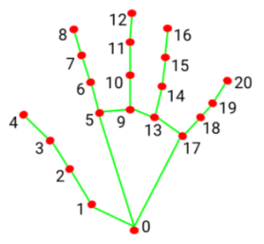

② For example, when calculating the angle for the thumb: The vector_2d_angle function is used to calculate the angle between joint points. The key points landmarks[3], landmarks[4], landmarks[0], and landmarks[2] correspond to points 3, 4, 0, and 2 in the hand feature extraction diagram. By calculating the angles between the joint points (fingertips), the thumb's posture can be determined. Similarly, the processing logic for other finger joints follows the same approach.

③ To ensure optimal recognition, the parameters and basic logic (such as angle addition and subtraction) in the hand_angle function should remain as defaults.

(4) h_gesture Function

{lineno-start=65}

```python
def h_gesture(angle_list):
    """
    通过二维特征确定手指所摆出的手势(determine the gesture formed by the fingers through two-dimensional features)
    :param angle_list: 各个手指弯曲的角度(the blending angle of each finger)
    :return : 手势名称字符串(gesture name string)
    """
    thr_angle, thr_angle_thumb, thr_angle_s = 65.0, 53.0, 49.0
    if (angle_list[0] > thr_angle_thumb) and (angle_list[1] > thr_angle) and (angle_list[2] > thr_angle) and (
            angle_list[3] > thr_angle) and (angle_list[4] > thr_angle):
        gesture_str = "fist"
    elif (angle_list[0] < thr_angle_s) and (angle_list[1] < thr_angle_s) and (angle_list[2] > thr_angle) and (
            angle_list[3] > thr_angle) and (angle_list[4] > thr_angle):
        gesture_str = "gun"
    elif (angle_list[0] < thr_angle_s) and (angle_list[1] > thr_angle) and (angle_list[2] > thr_angle) and (
            angle_list[3] > thr_angle) and (angle_list[4] > thr_angle):
        gesture_str = "hand_heart"
    elif (angle_list[0] > 5) and (angle_list[1] < thr_angle_s) and (angle_list[2] > thr_angle) and (
            angle_list[3] > thr_angle) and (angle_list[4] > thr_angle):
        gesture_str = "one"
    elif (angle_list[0] > thr_angle_thumb) and (angle_list[1] < thr_angle_s) and (angle_list[2] < thr_angle_s) and (
            angle_list[3] > thr_angle) and (angle_list[4] > thr_angle):
        gesture_str = "two"
    elif (angle_list[0] > thr_angle_thumb) and (angle_list[1] < thr_angle_s) and (angle_list[2] < thr_angle_s) and (
            angle_list[3] < thr_angle_s) and (angle_list[4] > thr_angle):
        gesture_str = "three"
    elif (angle_list[0] > thr_angle_thumb) and (angle_list[1] > thr_angle) and (angle_list[2] < thr_angle_s) and (
            angle_list[3] < thr_angle_s) and (angle_list[4] < thr_angle_s):
        gesture_str = "OK"
    elif (angle_list[0] > thr_angle_thumb) and (angle_list[1] < thr_angle_s) and (angle_list[2] < thr_angle_s) and (
            angle_list[3] < thr_angle_s) and (angle_list[4] < thr_angle_s):
        gesture_str = "four"
    elif (angle_list[0] < thr_angle_s) and (angle_list[1] < thr_angle_s) and (angle_list[2] < thr_angle_s) and (
            angle_list[3] < thr_angle_s) and (angle_list[4] < thr_angle_s):
        gesture_str = "five"
    elif (angle_list[0] < thr_angle_s) and (angle_list[1] > thr_angle) and (angle_list[2] > thr_angle) and (
            angle_list[3] > thr_angle) and (angle_list[4] < thr_angle_s):
        gesture_str = "six"
    else:
        gesture_str = "none"

    return gesture_str
```

① After identifying the different types of fingers and determining their positions in the image, you can implement logical recognition for various gestures by writing the h_gesture function. In the h_gesture function shown above, the parameters thr_angle = 65, thr_angle_thenum = 53, and thr_angle_s = 49 represent the threshold values for angle judgments at the gesture logic points. These values have been tested to provide stable recognition performance, and it is not recommended to change them. If the recognition logic is not performing well, adjusting these values within a ±5 range should be sufficient. The angle_list[0,1,2,3,4] corresponds to the five fingers of the hand.

② For example, for the "**one**" gesture:

{lineno-start=81}

```python
    elif (angle_list[0] > 5) and (angle_list[1] < thr_angle_s) and (angle_list[2] > thr_angle) and (
            angle_list[3] > thr_angle) and (angle_list[4] > thr_angle):
        gesture_str = "one"
```

The code above represents the angle logic checks for the "**one**" gesture. angle_list[0] > 5 indicates whether the angle value of the thumb joint feature point in the image is greater than 5. angle_list[1] < thr_angle_s checks if the angle feature of the index finger joint is less than the preset threshold thr_angle_s, and angle_list[2] < thr_angle checks if the angle feature of the middle finger joint is less than the preset thr_angle. The logic for the remaining two fingers, angle_list[3] and angle_list[4], is handled similarly. When these conditions are met, the current gesture is recognized as "**one**". The logic for recognizing other gestures follows the same principle.

(5) State Class

{lineno-start=108}

```python
class State(enum.Enum):
    NULL = 0
    TRACKING = 1
    RUNNING = 2
```

An enumeration named State is defined, which contains three members: NULL, TRACKING, and RUNNING. Each member represents a specific state and is associated with a corresponding value (0, 1, and 2, respectively).

(6) draw_points Function

{lineno-start=114}

```python
def draw_points(img, points, tickness=4, color=(255, 0, 0)):
    points = np.array(points).astype(dtype=np.int64)
    if len(points) > 2:
        for i, p in enumerate(points):
            if i + 1 >= len(points):
                break
            cv2.line(img, p, points[i + 1], color, tickness)
```

① Convert the input list of points into a NumPy array and change the data type to integers.

② Check if the number of points is greater than 2, as at least two points are required to draw a line.

③ Iterate through each point in the list. Inside the loop, check if the current index i + 1 is greater than or equal to the length of the points list. If the current point is the last point, there is no next point to connect, so break out of the loop.

④ Use OpenCV's cv2.line function to draw a line segment on the image, connecting the current point p and the next point points[i + 1], with the specified color and line thickness.

(7) HandGestureNode Class Initialization Function

{lineno-start=123}

```python
class HandGestureNode(Node):
    def __init__(self, name):
        rclpy.init()
        super().__init__(name, allow_undeclared_parameters=True, automatically_declare_parameters_from_overrides=True)
        self.drawing = mp.solutions.drawing_utils
        self.hand_detector = mp.solutions.hands.Hands(
            static_image_mode=False,
            max_num_hands=1,
            min_tracking_confidence=0.4,
            min_detection_confidence=0.4
        )

        self.fps = fps.FPS()  # fps计算器(fps calculator)
        self.bridge = CvBridge()  # 用于ROS Image消息与OpenCV图像之间的转换
        self.buzzer = buzzer.BuzzerController()  # fps计算器(fps calculator)
        self.image_queue = queue.Queue(maxsize=2)
        self.running = True
        self.draw = True
        self.state = State.NULL
        self.points = [[0, 0], ]
        self.no_finger_timestamp = time.time()
        self.one_count = 0
        self.count = 0
        self.direction = ""
        self.last_gesture = "none"

        timer_cb_group = ReentrantCallbackGroup()
        self.image_sub = self.create_subscription(Image, '/depth_cam/rgb/image_raw', self.image_callback, 1)  # 摄像头订阅(subscribe to the camera)
        self.joints_pub = self.create_publisher(ServosPosition, '/servo_controller', 1) # 舵机控制
        self.create_service(Trigger, '~/start', self.start_srv_callback, callback_group=timer_cb_group) # 进入玩法
        self.create_service(Trigger, '~/stop', self.stop_srv_callback, callback_group=timer_cb_group) # 退出玩法

        self.controller = ActionGroupController(self.create_publisher(ServosPosition, 'servo_controller', 1), '/home/ubuntu/factory_utils/arm_pc/ActionGroups')
        self.client = self.create_client(Trigger, '/controller_manager/init_finish')
        self.client.wait_for_service()
        self.timer = self.create_timer(0.0, self.init_process, callback_group=timer_cb_group)
       
```

① `class HandGestureNode(Node)`: Defines a class named HandGestureNode that inherits from the Node class. This class is used to create a ROS2 node for handling gesture recognition.

② `def __init__(self, name)`: The initialization function that accepts a name parameter as the node's name and sets up various node configurations.

③ `rclpy.init()`: Initializes the ROS2 client library and starts the ROS2 system.

④ `super().__init__(name, allow_undeclared_parameters=True, automatically_declare_parameters_from_overrides=True)`: Calls the parent class's initialization method, passing the node name and allowing undeclared parameters and automatic parameter declaration from overrides.

⑤ `self.drawing = mp.solutions.drawing_utils`: Uses the drawing tools provided by mediapipe for drawing hand keypoints.

⑥ `self.hand_detector = mp.solutions.hands.Hands(...)`: Initializes the mediapipe hand detector and sets the gesture detection configuration, such as enabling dynamic mode, setting the maximum number of hands to detect, and specifying minimum tracking and detection confidence levels.

⑦ `self.fps = fps.FPS()`: Initializes an instance of the FPS class to calculate the frame rate.

⑧ `self.bridge = CvBridge()`: Initializes an instance of the CvBridge class for converting between ROS messages and OpenCV images.

⑨ `self.buzzer = buzzer.BuzzerController()`: Initializes an instance of BuzzerController for controlling the buzzer.

⑩ `self.image_queue = queue.Queue(maxsize=2)`: Initializes a queue with a maximum size of 2 for storing camera images.

⑪ `self.running = True`: Sets a flag indicating whether the node is currently running.

⑫ `self.draw = True`: Sets a flag indicating whether drawing is enabled.

⑬ `self.state = State.NULL`: Sets the initial state to NULL, meaning no gesture is detected.

⑭ `self.points = [[0, 0], ]`: Initializes a list to store the trajectory of the gesture points.

⑮ `self.no_finger_timestamp = time.time()`: Records the current time for handling timeouts when no fingers are detected.

⑯ `self.one_count = 0`: Initializes a counter to track the number of times fingers are extended.

⑰ `self.count = 0`: Initializes a counter for other operations or gesture state tracking.

⑱ `self.direction = ""`: Initializes a variable to store direction information.

⑲ `self.last_gesture = "none"`: Initializes a variable to store the last detected gesture.

⑳ `timer_cb_group = ReentrantCallbackGroup()`: Creates a reentrant callback group to handle multiple callbacks.

㉑ `self.image_sub = self.create_subscription(...)`: Creates a subscription to the /depth_cam/rgb/image_raw topic, receiving camera image data and processing it via the image_callback function.

㉒ `self.joints_pub = self.create_publisher(...)`: Creates a publisher to publish servo position data to the /servo_controller topic for controlling the servos.

㉓ `self.create_service(Trigger, '~/start', self.start_srv_callback, callback_group=timer_cb_group)`: Creates a ROS service to handle requests to the ~/start service, invoking the start_srv_callback function.

㉔ `self.create_service(Trigger, '~/stop', self.stop_srv_callback, callback_group=timer_cb_group)`: Creates another ROS service to handle requests to the ~/stop service, invoking the stop_srv_callback function.

㉕ `self.controller = ActionGroupController(...)`: Initializes an ActionGroupController instance to manage action groups.

㉖ `self.client = self.create_client(Trigger, '/controller_manager/init_finish')`: Creates a client to wait for a response from the /controller_manager/init_finish service.

㉗ `self.client.wait_for_service()`: Waits for the /controller_manager/init_finish service to be available to receive requests.

㉘ `self.timer = self.create_timer(0.0, self.init_process, callback_group=timer_cb_group)`: Creates a timer that calls the init_process function at regular intervals to initialize other operations in the node.

(8) init_process Function

{lineno-start=161}

```python
    def init_process(self):
        self.timer.cancel()

        self.init_action()
        if self.get_parameter('start').value:
            self.start_srv_callback(Trigger.Request(), Trigger.Response())

        threading.Thread(target=self.main, daemon=True).start()
        self.create_service(Trigger, '~/init_finish', self.get_node_state)
        self.get_logger().info('\033[1;32m%s\033[0m' % 'start')
```

① `self.timer.cancel()`: Cancels the timer and stops triggering the timer callback.

② `self.init_action()`: Calls the init_action method to perform initialization operations.

③ `if self.get_parameter('start').value:`: Checks the value of the 'start' parameter to decide whether to execute the startup operation.

④ `self.start_srv_callback(Trigger.Request(), Trigger.Response())`: If the 'start' parameter is true, calls the start_srv_callback method, passing empty request and response objects to initiate the corresponding operation.

⑥ `threading.Thread(target=self.main, daemon=True).start()`: Creates and starts a new thread to execute the main method. The daemon=True argument ensures the thread will terminate automatically when the main program exits.

⑦ `self.create_service(Trigger, '~/init_finish', self.get_node_state)`: Creates a service named ~/init_finish. When the service is requested, the get_node_state method is invoked as the callback.

⑧ `self.get_logger().info('\033\[1;32m%s\033\[0m' % 'start')`: Logs an informational message indicating the node has started, displayed in green text.

(9) get_node_state Function

{lineno-start=172}

```python
    def get_node_state(self, request, response):
        response.success = True
        return response
```

① `response.success = True`: Sets the success attribute of the service response to True, indicating that the node is in a normal state.

② `return response`: Returns the response object, completing the service call and notifying the client that the node is available.

(10) init_action Function

{lineno-start=179}

```python
    def init_action(self):
        set_servo_position(self.joints_pub, 1.5, ((10, 500), (5, 500), (4, 330), (3, 100), (2, 700), (1, 500)))
        time.sleep(1.8)
```

① `set_servo_position(self.joints_pub, 1.5, ((10, 500), (5, 500), (4, servo_data[3]), (3, servo_data[2]), (2, servo_data[1]), (1, servo_data[0])))`: Call the set_servo_position function, passing the servo_data values to set the positions of the individual servos. The base position is set to 1.5, and the servo positions are derived from the servo_data values.

② `time.sleep(1.8)`: Pause the execution for 1.8 seconds to allow the servos to complete their movement.

(11) send_request Function

{lineno-start=183}

```python
    def send_request(self, client, msg):
        future = client.call_async(msg)
        while rclpy.ok():
            if future.done() and future.result():
                return future.result()
```

① `def send_request(self, client, msg)`: Define a method send_request that accepts a client object (client) and a message object (msg) as parameters.

② `future = client.call_async(msg)`: Call the client's asynchronous request method `call_async` to send the message and return a future object, which represents the result of the request.

③ `while rclpy.ok()`: Enter a loop that checks whether the ROS2 node is still running.

④ `if future.done() and future.result()`: Check if the future has completed and if the result is valid.

⑤ `return future.result()`: If the request is completed and the result is valid, return the result of the future.

(12) start_srv_callback & stop_srv_callback Function

{lineno-start=190}

```python
    def start_srv_callback(self, request, response):
        self.get_logger().info('\033[1;32m%s\033[0m' % "start hand gesture")
        
        self.start = True
        response.success = True
        response.message = "start"
        return response

    def stop_srv_callback(self, request, response):
        self.get_logger().info('\033[1;32m%s\033[0m' % "stop hand gesture")
        self.start = False
```

① `self.send_request(self.start_yolov8_client, Trigger.Request())`: Call the send_request method to send a start request to the start_yolov8_client.

② `response.success = True`: Set the service response to indicate success.6

③ `response.message = "start"`: Set the response message to "**start**".

④ `return response`: Return the service response.

⑤ `self.send_request(self.stop_yolov8_client, Trigger.Request())`: Call the send_request method to send a stop request to the stop_yolov8_client.

⑥ `response.success = True`: Set the service response to indicate success.

⑦ `response.message = "stop"`: Set the response message to "**stop**".

⑧ `return response`: Return the service response.

(13) do_act Function

{lineno-start=202}

```python
    def do_act(self, gesture):
        self.controller.run_action(gesture)
        self.count = 0
        self.last_gesture = "none"
        self.state = State.NULL
        self.draw = True
```

① `self.send_request(self.start_yolov8_client, Trigger.Request())`: Call the `send_request` method to send a start request to the `start_yolov8_client`.

② `response.success = True`: Set the service response to indicate success.

③ `response.message = "start"`: Set the response message to "**start**".

④ `return response`: Return the service response.

⑤ `self.send_request(self.stop_yolov8_client, Trigger.Request())`: Call the `send_request` method to send a stop request to the `stop_yolov8_client`.

⑥ `response.success = True`: Set the service response to indicate success.

⑦ `response.message = "stop"`: Set the response message to "**stop**".

⑧ `return response`: Return the service response.

(14) buzzer_task Function

① `def buzzer_task(self)`: Define a method buzzer_task to control the buzzer's operation.

② `self.buzzer.set_buzzer(500, 0.1, 0.5, 1)`: Call the set_buzzer method of the BuzzerController to configure the buzzer with the following parameters: frequency (500 Hz), duration (0.1 seconds), pause time (0.5 seconds), and repeat count (1).

③ `time.sleep(0.5)`: Pause the program for 0.5 seconds to ensure the buzzer's sound completes without premature termination or interruption.

(15) Image_callback Function

{lineno-start=214}

```python
    def image_callback(self, ros_image):
        # 将画面转为 opencv 格式(convert the screen to opencv format)
        cv_image = self.bridge.imgmsg_to_cv2(ros_image, "bgr8")
        bgr_image = np.array(cv_image, dtype=np.uint8)

        if self.image_queue.full():
            # 如果队列已满，丢弃最旧的图像
            self.image_queue.get()
        # 将图像放入队列
        self.image_queue.put(bgr_image)
```

① `def image_callback(self, ros_image)`: Define an image callback function to receive and process the incoming ros_image message.

② `cv_image = self.bridge.imgmsg_to_cv2(ros_image, "bgr8")`: Use CvBridge to convert the ROS image message ros_image into an OpenCV-compatible image format cv_image, specifying the encoding as bgr8.

③ `bgr_image = np.array(cv_image, dtype=np.uint8)`: Convert the resulting cv_image to a NumPy array and ensure the image data type is uint8.

④ `if self.image_queue.full()`: Check whether the image queue self.image_queue is full.

⑤ `self.image_queue.get()`: If the queue is full, remove the oldest image from the queue to make space.

⑥ `self.image_queue.put(bgr_image)`: Add the current image bgr_image to the queue.

(16) Main Function

{lineno-start=225}

```python
    def main(self):
        while self.running:

            bgr_image = self.image_queue.get()
            bgr_image = cv2.flip(bgr_image, 1) # 镜像画面(mirrored image)
            result_image = np.copy(bgr_image) # 拷贝一份用作结果显示，以防处理过程中修改了图像(make a copy for result display to prevent modification of the image during processing)

            if time.time() - self.no_finger_timestamp > 2:
                self.direction = ""
            else:
                if self.direction != "":
                    cv2.putText(result_image, self.direction, (10, 100), cv2.FONT_HERSHEY_SIMPLEX, 1, (255, 0, 0), 2)

            try:
                results = self.hand_detector.process(bgr_image) # 手部、关键点识别(hand and key points recognition)
                if results.multi_hand_landmarks and self.draw :
                    gesture = "none"
                    index_finger_tip = [0, 0]
                    for hand_landmarks in results.multi_hand_landmarks: 
                        self.drawing.draw_landmarks(
                            result_image,
                            hand_landmarks,
                            mp.solutions.hands.HAND_CONNECTIONS)
                        h, w = bgr_image.shape[:2]
                        landmarks = get_hand_landmarks((w, h), hand_landmarks.landmark)
                        angle_list = hand_angle(landmarks)
                        gesture = h_gesture(angle_list) # 根据关键点位置判断手势(judge gesture based on key points position)
                        index_finger_tip = landmarks[8].tolist()

                    cv2.putText(result_image, gesture.upper(), (10, 100), cv2.FONT_HERSHEY_SIMPLEX, 1.2, (0, 0, 0), 5)
                    cv2.putText(result_image, gesture.upper(), (10, 100), cv2.FONT_HERSHEY_SIMPLEX, 1.2, (255, 255, 0), 2)
                    draw_points(result_image, self.points[1:])
                    if self.state != State.RUNNING :
                        if gesture == self.last_gesture and gesture != "none":
                            self.count += 1
                        else:
                            self.count = 0
                        if self.count > 20:
                            self.state = State.RUNNING
                            self.draw = False
                            threading.Thread(target=self.buzzer_task,).start()
                            threading.Thread(target=self.do_act, args=(gesture, )).start()
                    else:
                        self.count = 0
                    self.last_gesture = gesture

                else:
                    if self.state != State.NULL:
                        if time.time() - self.no_finger_timestamp > 2:
                            self.one_count = 0
                            self.points = [[0, 0],]
                            self.state = State.NULL
                self.fps.update()
                self.fps.show_fps(result_image)
                cv2.imshow("result", result_image)
                cv2.waitKey(1)


            except Exception as e:
                self.get_logger().error(str(e))

        self.init_action()
        rclpy.shutdown()
```

① `bgr_image = self.image_queue.get()`: Retrieve a new image from the image queue for processing.

② `bgr_image = cv2.flip(bgr_image, 1)`: Perform a horizontal flip on the image to simulate a self-view perspective.

③ `result_image = np.copy(bgr_image)`: Create a copy of the image to avoid modifying the original during processing.

④ `if time.time() - self.no_finger_timestamp > 2`: Check if more than 2 seconds have passed without detecting a finger; if so, reset the direction indicator.

⑤ `if self.direction != ""`: If a valid direction indicator exists, display it on the image.

⑥ `results = self.hand_detector.process(bgr_image)`: Use the MediaPipe library to process the image for hand gesture detection.

⑦ `if results.multi_hand_landmarks and self.draw`: If hand keypoints are detected and drawing is enabled, draw the keypoints on the image.

⑧ `gesture = h_gesture(angle_list)`: Determine the current hand gesture based on the angles of the fingers.

⑨ `cv2.putText(result_image, gesture.upper(), (10, 100), cv2.FONT_HERSHEY_SIMPLEX, 1.2, (0, 0, 0), 5)`: Display the gesture name on the image with a bold black background.

⑩ `cv2.putText(result_image, gesture.upper(), (10, 100), cv2.FONT_HERSHEY_SIMPLEX, 1.2, (255, 255, 0), 2)`: Display the gesture name on the image in yellow text.

⑪ `draw_points(result_image, self.points[1:])`: Draw the finger trajectory to visualize the user's finger movement path.

⑫ `if self.state != State.RUNNING`: If the current state is not RUNNING, check if the gesture persists.

⑬ `if gesture == self.last_gesture and gesture != "none"`: Determine if the current gesture matches the last gesture for consistency.

⑭ `if self.count > 20`: If the same gesture is detected more than 20 times, switch to the RUNNING state and execute an action.

⑮ `threading.Thread(target=self.buzzer_task).start()`: Start a thread to execute the buzzer task, providing auditory feedback.

⑯ `threading.Thread(target=self.do_act, args=(gesture,)).start()`: Start a thread to execute the action corresponding to the gesture.

⑰ `self.last_gesture = gesture`: Update the last recognized gesture.

⑱ `if self.state != State.NULL`: If the state is not NULL, check if the timeout for finger detection has been exceeded.

⑲ `if time.time() - self.no_finger_timestamp > 2`: If no finger is detected for more than 2 seconds, reset the state.

⑳ `self.fps.update()`: Update the FPS counter for calculating and displaying the current frame rate.

㉑ `self.fps.show_fps(result_image)`: Display the current frame rate on the image.

㉒ `cv2.imshow("result", result_image)`: Show the processed image in a window.

㉓ `cv2.waitKey(1)`: Wait for 1 millisecond to respond to key events and update the image.

### 15.1.6 Mediapipe Fingertip Trajectory

* **Realization Process**

At first, initialize the nodes and the servos of robotic arm, subscribe to the camera image topic, and create **FingerTrackNode** class.

Next, perform image processing to recognize gestures, and detect the position of the index finger for trajectory drawing.

Then when the gesture of an open hand with five fingers is detected, generate a black-and-white trajectory image.

* **Operations**

:::Note
The entered commands should be case sensitive, and the "**Tab**" key can be used to complement the key words.
:::

(1) Connect JetArm to the remote desktop via NoMachine.

(2) Double click on  to open the command line terminal. Enter the below command and press Enter to disable the auto-startup service.

```
sudo systemctl stop start_app_node.service
```

(3) Enter command and press Enter to run the program.

```
ros2 launch example finger_trajectory.launch.py
```

(4) If you want to close the program, please press `Ctrl+C`. Please try multiple times for the operation failure.

(5) After the game ends, you need to enable app service in  (should not enable the service, the following app functions will be affected).

```
ros2 launch example finger_trajectory.launch.py
```

(6) After the app service is enabled, the robotic arm will return to the initial posture, and the buzzer will make a "**beep**" sound

* **Outcome**

Robotic arm can detect key points on the hand and connect them with lines. You can draw the trajectory when moving your index finger, and the recorded trajectory can be cleared by pressing the space bar.


When we extend all five fingers, the trajectory will be recorded, and the detected shape of the gesture will be displayed.


* **Launch File Analysis**

The Launch file is located in

`/home/ubuntu/ros2_ws/src/example/example/mediapipe/finger_trajectory.launch.py`

(1) launch_setup Function

{lineno-start=9}

```python
def launch_setup(context):
    compiled = os.environ['need_compile']

    if compiled == 'True':
        sdk_package_path = get_package_share_directory('sdk')
        peripherals_package_path = get_package_share_directory('peripherals')
    else:
        sdk_package_path = '/home/ubuntu/ros2_ws/src/driver/sdk'
        peripherals_package_path = '/home/ubuntu/ros2_ws/src/peripherals'

    sdk_launch = IncludeLaunchDescription(
        PythonLaunchDescriptionSource(
            os.path.join(sdk_package_path, 'launch/jetarm_sdk.launch.py')),
    )

    depth_camera_launch = IncludeLaunchDescription(
        PythonLaunchDescriptionSource(
            os.path.join(peripherals_package_path, 'launch/depth_camera.launch.py')),
    )

    finger_trajectory_node = Node(
        package='example',
        executable='finger_trajectory',
        output='screen',
    )

    return [
            sdk_launch,
            depth_camera_launch,
            finger_trajectory_node,
            ]
```

① `compiled = os.environ['need_compile']`: Retrieve the compilation flag from the environment variable need_compile.

② `if compiled == 'True':`: Check if the environment variable need_compile is set to 'True', indicating the need for compilation.

③ `sdk_package_path = get_package_share_directory('sdk')`: Obtain the shared directory path of the SDK package.

④ `peripherals_package_path = get_package_share_directory('peripherals')`: Obtain the shared directory path of the peripherals package.

⑤ `else:`: If the environment variable need_compile is not 'True', directly specify the paths for the compiled SDK and peripherals packages.

⑥ `sdk_package_path = '/home/ubuntu/ros2_ws/src/driver/sdk'`: Set the SDK package path to the compiled location.

⑦ `peripherals_package_path = '/home/ubuntu/ros2_ws/src/peripherals'`: Set the peripherals package path to the compiled location.

⑧ `sdk_launch = IncludeLaunchDescription(...)`: Create an IncludeLaunchDescription for the SDK, including the jetarm_sdk.launch.py launch file.

⑨ `os.path.join(sdk_package_path, 'launch/jetarm_sdk.launch.py')`: Construct the file path to the SDK launch file.

⑩ `depth_camera_launch = IncludeLaunchDescription(...)`: Create an IncludeLaunchDescription for the depth camera, including the depth_camera.launch.py launch file.

⑪ `os.path.join(peripherals_package_path, 'launch/depth_camera.launch.py')`: Construct the file path to the depth camera launch file.

⑫ `finger_trajectory_node = Node(...)`: Create a ROS 2 node to execute the finger_trajectory executable from the example package.

⑬ `return [...]`: Return a list that includes the SDK launch file, the depth camera launch file, and the finger trajectory node.

(2) generate_launch_description Function

{lineno-start=41}

```python
def generate_launch_description():
    return LaunchDescription([
        OpaqueFunction(function = launch_setup)
    ])
```

`return LaunchDescription([OpaqueFunction(function=launch_setup)])`: Create and return a LaunchDescription object that includes an OpaqueFunction, with the launch_setup function passed to it.

(3) Main Function

{lineno-start=46}

```python
if __name__ == '__main__':
    # 创建一个LaunchDescription对象
    ld = generate_launch_description()

    ls = LaunchService()
    ls.include_launch_description(ld)
    ls.run()
```

① `ld = generate_launch_description()`: Call the generate_launch_description() function to create a LaunchDescription object that contains the configuration and nodes to be launched.

② `ls = LaunchService()`: Create a LaunchService object, which is a core class in the ROS2 launch system responsible for managing and executing launch descriptions.

③ `ls.include_launch_description(ld)`: Add the previously created LaunchDescription object (ld) to the LaunchService, preparing it for execution.

④ `ls.run()`: Start and run the LaunchService, executing all launch items defined in the description, such as nodes and launch files.

* **Python Source Code Analysis**

The source code file is located in

`/home/ubuntu/ros2_ws/src/example/example/mediapipe/include/finger_trajectory.py`

The program logic flowchart derived from the program files is as follow.

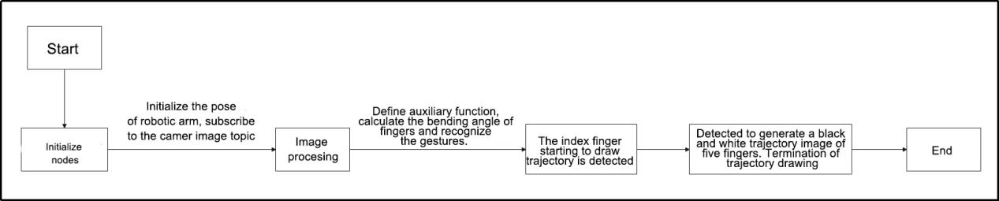

From the above diagram, the program is mainly image processing and gesture recognition, then perform trajectory drawing and generate the trajectory image.

(1) Import Function Packet

{lineno-start=4}

```python
import cv2
import time
import enum
import rclpy
import queue
import threading
import numpy as np
import sdk.fps as fps
import mediapipe as mp
from rclpy.node import Node
from cv_bridge import CvBridge
from std_srvs.srv import Trigger
from sensor_msgs.msg import Image
from rclpy.executors import MultiThreadedExecutor
from sdk.common import  distance, vector_2d_angle, get_area_max_contour
from servo_controller_msgs.msg import ServosPosition
from rclpy.callback_groups import ReentrantCallbackGroup
from servo_controller.bus_servo_control import set_servo_position
```

① `compiled = os.environ['need_compile']`: Retrieve the compilation flag from the environment variable need_compile.

② `if compiled == 'True':`: Check if the environment variable need_compile is set to 'True', indicating the need for compilation.

③ `sdk_package_path = get_package_share_directory('sdk')`: Obtain the shared directory path of the SDK package.

④ `peripherals_package_path = get_package_share_directory('peripherals')`: Obtain the shared directory path of the peripherals package.

⑤ `else:`: If the environment variable need_compile is not 'True', directly specify the paths for the compiled SDK and peripherals packages.

⑥ `sdk_package_path = '/home/ubuntu/ros2_ws/src/driver/sdk'`: Set the SDK package path to the compiled location.

⑦ `peripherals_package_path = '/home/ubuntu/ros2_ws/src/peripherals'`: Set the peripherals package path to the compiled location.

⑧ `sdk_launch = IncludeLaunchDescription(...)`: Create an IncludeLaunchDescription for the SDK, including the jetarm_sdk.launch.py launch file.

⑨ `os.path.join(sdk_package_path, 'launch/jetarm_sdk.launch.py')`: Construct the file path to the SDK launch file.

⑩ `depth_camera_launch = IncludeLaunchDescription(...)`: Create an IncludeLaunchDescription for the depth camera, including the depth_camera.launch.py launch file.

⑪ `os.path.join(peripherals_package_path, 'launch/depth_camera.launch.py')`: Construct the file path to the depth camera launch file.

⑫ `finger_trajectory_node = Node(...)`: Create a ROS 2 node to execute the finger_trajectory executable from the example package.

⑬ `return [...]`: Return a list that includes the SDK launch file, the depth camera launch file, and the finger trajectory node.

(2) get_hand_landmarks Function

{lineno-start=24}

```python
def get_hand_landmarks(img, landmarks):
    """
    将landmarks从medipipe的归一化输出转为像素坐标(convert landmarks from the normalized output of mediapipe to pixel coordinates)
    :param img: 像素坐标对应的图片(pixel coordinates corresponding image)
    :param landmarks: 归一化的关键点(normalized key points)
    :return:
    """
    h, w, _ = img.shape
    landmarks = [(lm.x * w, lm.y * h) for lm in landmarks]
    return np.array(landmarks)
```

① `def get_hand_landmarks(img, landmarks)`: Defines a function get_hand_landmarks that converts the normalized keypoints output by Mediapipe into pixel coordinates.

② `h, w, _ = img.shape`: Retrieves the height (h), width (w), and the number of channels (_) from the input image img (the number of channels is ignored).

③ `landmarks = [(lm.x * w, lm.y * h) for lm in landmarks]`: Converts the normalized landmarks into pixel coordinates. The normalized coordinates (lm.x and lm.y) are multiplied by the width and height of the image to get pixel coordinates.

④ `return np.array(landmarks)`: Returns the list of pixel coordinates landmarks as a NumPy array.

(3) hand_angle Function

{lineno-start=36}

```python
def hand_angle(landmarks):
    """
    计算各个手指的弯曲角度(calculate the blending angle of each finger)
    :param landmarks: 手部关键点(hand key point)
    :return: 各个手指的角度(the angle of each finger)
    """
    angle_list = []
    # thumb 大拇指
    angle_ = vector_2d_angle(landmarks[3] - landmarks[4], landmarks[0] - landmarks[2])
    angle_list.append(angle_)
    # index 食指
    angle_ = vector_2d_angle(landmarks[0] - landmarks[6], landmarks[7] - landmarks[8])
    angle_list.append(angle_)
    # middle 中指
    angle_ = vector_2d_angle(landmarks[0] - landmarks[10], landmarks[11] - landmarks[12])
    angle_list.append(angle_)
    # ring 无名指
    angle_ = vector_2d_angle(landmarks[0] - landmarks[14], landmarks[15] - landmarks[16])
    angle_list.append(angle_)
    # pink 小拇指
    angle_ = vector_2d_angle(landmarks[0] - landmarks[18], landmarks[19] - landmarks[20])
    angle_list.append(angle_)
    angle_list = [abs(a) for a in angle_list]
    return angle_list
```

To process the key points logically, the angle relationships between the key points are analyzed to identify which finger type (e.g., thumb, index) it corresponds to. The hand_angle function takes a set of key points landmarks(results) as input and calculates the angle between the corresponding key points using the vector_2d_angle function. The key points in the landmarks set are as follows:


For example, to calculate the angle of the thumb: The vector_2d_angle function calculates the angle between joint points. The key points landmarks[3], landmarks[4], landmarks[0], and landmarks[2] correspond to the points 3, 4, 0, and 2 in the hand feature extraction diagram. By calculating the angles between these joint points (finger tips), the thumb's posture can be determined. Similarly, the feature processing logic for other fingers follows the same pattern.

To ensure accurate recognition, it is recommended to keep the parameters and basic logic (e.g., angle addition and subtraction) in the hand_angle function as default.

(4) h_gesture Function

{lineno-start=62}

```python
def h_gesture(angle_list):
    """
    通过二维特征确定手指所摆出的手势(determine the gesture formed by the fingers through two-dimensional features)
    :param angle_list: 各个手指弯曲的角度(the blending angle of each finger)
    :return : 手势名称字符串(gesture name string)
    """
    thr_angle, thr_angle_thumb, thr_angle_s = 65.0, 53.0, 49.0
    if (angle_list[0] < thr_angle_s) and (angle_list[1] < thr_angle_s) and (angle_list[2] < thr_angle_s) and (
            angle_list[3] < thr_angle_s) and (angle_list[4] < thr_angle_s):
        gesture_str = "five"
    elif (angle_list[0] > 5) and (angle_list[1] < thr_angle_s) and (angle_list[2] > thr_angle) and (
            angle_list[3] > thr_angle) and (angle_list[4] > thr_angle):
        gesture_str = "one"
    else:
        gesture_str = "none"
    return gesture_str
```

① After identifying the different finger types and determining their positions in the image, the next step is to perform logical gesture recognition using the h_gesture function for different hand gestures. In the h_gesture function shown in the diagram above, the parameters thr_angle = 65, thr_angle_thenum = 53, and thr_angle_s = 49 are the threshold angle values for gesture logic points (through testing, these values provide stable recognition results, and it is not recommended to change them. If recognition performance is poor, adjusting the values by ±5 is suggested). The list angle_list[0,1,2,3,4] corresponds to the five fingers of the hand.

② For example, for the "**one**" gesture:

{lineno-start=72}

```python
    elif (angle_list[0] > 5) and (angle_list[1] < thr_angle_s) and (angle_list[2] > thr_angle) and (
            angle_list[3] > thr_angle) and (angle_list[4] > thr_angle):
        gesture_str = "one"
    else:
        gesture_str = "none"
```

The code shown above represents the logical angle checks for the "**one**" gesture. angle_list[0] > 5 checks whether the angle of the thumb joint in the image is greater than 5. angle_list[1] < thr_angle_s checks if the angle of the index finger joint is smaller than the predefined thr_angle_s, and angle_list[2] < thr_angle checks if the angle of the middle finger joint is smaller than the predefined thr_angle. The logic for the other two fingers, angle_list[3] and angle_list[4], is similar. When these conditions are met, the gesture is recognized as "**one**". Other gestures are processed in a similar manner.

Each gesture has its own logical processing, but the overall framework is similar. Other gesture features can be referenced from the previous section.

(5) State Class

{lineno-start=80}

```python
class State(enum.Enum):
    NULL = 0
    TRACKING = 1
    RUNNING = 2
```

An enumeration named State is defined, containing three members: NULL, TRACKING, and RUNNING. Each member represents a state and is associated with a specific value (0, 1, and 2, respectively).

(6) draw_points Function

{lineno-start=86}

```python
def draw_points(img, points, tickness=4, color=(255, 0, 0)):
    """
    将记录的点连线画在画面上(draw lines connecting the recorded points on the screen)
    """
    points = np.array(points).astype(dtype=np.int32)
    if len(points) > 2:
        for i, p in enumerate(points):
            if i + 1 >= len(points):
                break
            cv2.line(img, p, points[i + 1], color, tickness)
```

① Convert the input list of points into a NumPy array and change the data type to integer.

② Check if the number of points is greater than 2, as at least two points are needed to draw a line.

③ Iterate through each point in the list. Inside the loop, use if i + 1 >= len(points) to check if the current index has reached the end of the list. If it's the last point, there is no need to connect to the next point, so break the loop.

④ Use OpenCV's cv2.line function to draw a line segment on the image, connecting the current point p with the next point points[i + 1], using the specified color and line thickness.

(7) get_track_img Function

{lineno-start=98}

```python
def get_track_img(points):
    """
    用记录的点生成一张黑底白线的轨迹图(generate a trajectory image with a black background and white lines using the recorded points)
    """
    points = np.array(points).astype(dtype=np.int32)
    x_min, y_min = np.min(points, axis=0).tolist()
    x_max, y_max = np.max(points, axis=0).tolist()
    track_img = np.full([y_max - y_min + 100, x_max - x_min + 100, 1], 0, dtype=np.uint8)
    points = points - [x_min, y_min]
    points = points + [50, 50]
    draw_points(track_img, points, 1, (255, 255, 255))
    return track_img
```

① `def get_track_img(points): `: Define a function get_track_img to generate a trajectory image.

② `points = np.array(points).astype(dtype=np.int32) `: Convert the input points data to a NumPy array and cast the data type to int32 to ensure the coordinates are integers.

③ `x_min, y_min = np.min(points, axis=0).tolist() `: Calculate the minimum x and y coordinates of all points.

④ `x_max, y_max = np.max(points, axis=0).tolist() `: Calculate the maximum x and y coordinates of all points.

⑤ `track_img = np.full([y_max - y_min + 100, x_max - x_min + 100, 1], 0, dtype=np.uint8) `: Create a blank image track_img based on the minimum and maximum coordinates, with a size equal to the difference between the max and min coordinates, plus an offset of 100. Initialize the image with black pixels (0).

⑥ `points = points - [x_min, y_min] `: Shift all points' coordinates so that the minimum coordinate point aligns with (0,0), to ensure they are displayed inside the image during drawing.

⑦ `points = points + [50, 50] `: Apply an additional offset (50, 50) to the points' coordinates to ensure that they have appropriate spacing within the image.

⑧ `draw_points(track_img, points, 1, (255, 255, 255)) `: Call the draw_points function to draw the points on the track_img image, using white color (255, 255, 255).

⑨ `return track_img `: Return the generated trajectory image track_img.

(8) FingerTrajectorykNode Class Initialization

{lineno-start=112}

```python
class FingerTrajectorykNode(Node):
    def __init__(self, name):
        rclpy.init()
        super().__init__(name, allow_undeclared_parameters=True, automatically_declare_parameters_from_overrides=True)
        self.drawing = mp.solutions.drawing_utils
        self.timer = time.time()

        self.hand_detector = mp.solutions.hands.Hands(
            static_image_mode=False,
            max_num_hands=1,
            min_tracking_confidence=0.05,
            min_detection_confidence=0.6
        )


        self.fps = fps.FPS()  # fps计算器(fps calculator)
        self.bridge = CvBridge()  # 用于ROS Image消息与OpenCV图像之间的转换
        self.image_queue = queue.Queue(maxsize=2)
        self.state = State.NULL
        self.running = True
        self.points = []
        self.start_count = 0
        self.no_finger_timestamp = time.time()

        timer_cb_group = ReentrantCallbackGroup()
        self.image_sub = self.create_subscription(Image, '/depth_cam/rgb/image_raw', self.image_callback, 1)  # 摄像头订阅(subscribe to the camera)
        self.joints_pub = self.create_publisher(ServosPosition, '/servo_controller', 1) # 舵机控制

        #等待服务启动
        self.client = self.create_client(Trigger, '/controller_manager/init_finish')
        self.client.wait_for_service()
        set_servo_position(self.joints_pub, 1.0, ((10, 500), (5, 500), (4, 330), (3, 100), (2, 700), (1, 500)))
        threading.Thread(target=self.main, daemon=True).start()
        self.get_logger().info('\033[1;32m%s\033[0m' % '按空格清空已经记录的轨迹')  
```

① `rclpy.init() `: Initialize the ROS2 system.

② `super().__init__(name, allow_undeclared_parameters=True, automatically_declare_parameters_from_overrides=True) `: Call the parent class Node constructor to initialize the ROS2 node, allowing undeclared parameters and automatically declaring parameters passed through overrides.

③ `self.drawing = mp.solutions.drawing_utils `: Initialize MediaPipe drawing tools for visualizing hand keypoints.

④ `self.timer = time.time() `: Record the current time for subsequent time calculations.

⑤ `self.hand_detector = mp.solutions.hands.Hands(...) `: Initialize the MediaPipe hand detector with parameters like static image mode, maximum number of hands, minimum tracking confidence, and minimum detection confidence.

⑥ `self.fps = fps.FPS() `: Initialize the frame rate calculator to calculate and display the processing frame speed.

⑦ `self.bridge = CvBridge() `: Initialize the OpenCV and ROS image message conversion bridge.

⑧ `self.image_queue = queue.Queue(maxsize=2) `: Initialize a queue of size 2 for caching image data.

⑨ `self.state = State.NULL `: Initialize the state to NULL, indicating the current state is empty.

⑩ `self.running = True `: Set the running flag to True, indicating the program is running.

⑪ `self.points = [] `: Initialize an empty list to store hand keypoint trajectories.

⑫ `self.start_count = 0 `: Initialize the start_count counter to detect gesture states.

⑬ `self.no_finger_timestamp = time.time() `: Record the timestamp when no fingers are detected for subsequent checking.

⑭ `timer_cb_group = ReentrantCallbackGroup() `: Create a reentrant callback group to allow multi-threaded callback processing.

⑮ `self.image_sub = self.create_subscription(...) `: Create a subscriber to subscribe to the /depth_cam/rgb/image_raw image topic, with the callback function self.image_callback.

⑯ `self.joints_pub = self.create_publisher(...) `: Create a publisher to publish control messages for the servos to the /servo_controller topic.

⑰ `self.client = self.create_client(Trigger, '/controller_manager/init_finish') `: Create a client to connect to the /controller_manager/init_finish service and wait for it to start.

⑱ `self.client.wait_for_service() `: Wait for the service to be ready for connection.

⑲ `set_servo_position(self.joints_pub, 1.0, ((10, 500), (5, 500), (4, 330), (3, 100), (2, 700), (1, 500))) `: Call the set_servo_position function to set the initial servo positions.

⑳ `threading.Thread(target=self.main, daemon=True).start() `: Start a new thread to execute the main function self.main and set the thread as a daemon.

㉑ `self.get_logger().info('\033\[1;32m%s\033\[0m' % 'Press space to clear the recorded trajectory') `: Log the information, prompting the user to press the space bar to clear the recorded trajectory.

(9) Image_callback Function

{lineno-start=146}

```python
    def image_callback(self, ros_image):
        # 将画面转为 opencv 格式(convert the screen to opencv format)
        cv_image = self.bridge.imgmsg_to_cv2(ros_image, "bgr8")
        bgr_image = np.array(cv_image, dtype=np.uint8)

        if self.image_queue.full():
            # 如果队列已满，丢弃最旧的图像
            self.image_queue.get()
        # 将图像放入队列
        self.image_queue.put(bgr_image)
```

① `def image_callback(self, ros_image):`: Define an image callback function to receive and process the incoming ros_image message.

② `cv_image = self.bridge.imgmsg_to_cv2(ros_image, "bgr8")`: Use CvBridge to convert the ros_image message from ROS to an OpenCV image format (cv_image), with the encoding set to "**bgr8**".

③ `bgr_image = np.array(cv_image, dtype=np.uint8)`: Convert the cv_image to a NumPy array, ensuring the image data type is uint8.

④ `if self.image_queue.full():`: Check if the self.image_queue is full.

⑤ `self.image_queue.get()`: If the queue is full, discard the oldest image by removing the first image in the queue.

⑥ `self.image_queue.put(bgr_image)`: Add the current image (bgr_image) to the queue.

(10) Main Function

{lineno-start=157}

```python
    def main(self):
        while self.running:

            bgr_image = self.image_queue.get()
            bgr_image = cv2.flip(bgr_image, 1) # 镜像画面(mirrored image)
            result_image = np.copy(bgr_image) # 拷贝一份用作结果显示，以防处理过程中修改了图像(make a copy for result display to prevent modification of the image during processing)
            if self.timer <= time.time() and self.state == State.RUNNING:
                self.state = State.NULL
            try:
                results = self.hand_detector.process(bgr_image) if self.state != State.RUNNING else None
                if results is not None and results.multi_hand_landmarks:
                    gesture = "none"
                    index_finger_tip = [0, 0]
                    self.no_finger_timestamp = time.time()  # 记下当期时间，以便超时处理(note the current time for timeout handling)
                    for hand_landmarks in results.multi_hand_landmarks:
                        self.drawing.draw_landmarks(
                            result_image,
                            hand_landmarks,
                            mp.solutions.hands.HAND_CONNECTIONS)
                        landmarks = get_hand_landmarks(bgr_image, hand_landmarks.landmark)
                        angle_list = (hand_angle(landmarks))
                        gesture = (h_gesture(angle_list))
                        index_finger_tip = landmarks[8].tolist()

                    if self.state == State.NULL:
                        if gesture == "one":  # 检测到单独伸出食指，其他手指握拳(detect the index finger extended while the other fingers are clenched into a fist)
                            self.start_count += 1
                            if self.start_count > 20:
                                self.state = State.TRACKING
                                self.points = []
                        else:
                            self.start_count = 0

                    elif self.state == State.TRACKING:
                        if gesture == "five": # 伸开五指结束画图(finish drawing when all five fingers are spread out)
                            self.state = State.NULL

                            # 生成黑白轨迹图(generate a black and white trajectory image)
                            track_img = get_track_img(self.points)
                            contours = cv2.findContours(track_img, cv2.RETR_EXTERNAL, cv2.CHAIN_APPROX_NONE)[-2]
                            contour, area = get_area_max_contour(contours, 300)

                            # 按轨迹图识别所画图形(identify the drawn shape based on the trajectory image)
                            track_img = cv2.fillPoly(track_img, [contour, ], (255, 255, 255))
                            for _ in range(3):
                                track_img = cv2.erode(track_img, cv2.getStructuringElement(cv2.MORPH_RECT, (5, 5)))
                                track_img = cv2.dilate(track_img, cv2.getStructuringElement(cv2.MORPH_RECT, (5, 5)))
                            contours = cv2.findContours(track_img, cv2.RETR_EXTERNAL, cv2.CHAIN_APPROX_NONE)[-2]
                            contour, area = get_area_max_contour(contours, 300)
                            h, w = track_img.shape[:2]

                            track_img = np.full([h, w, 3], 0, dtype=np.uint8)
                            track_img = cv2.drawContours(track_img, [contour, ], -1, (0, 255, 0), 2)
                            approx = cv2.approxPolyDP(contour, 0.026 * cv2.arcLength(contour, True), True)
                            track_img = cv2.drawContours(track_img, [approx, ], -1, (0, 0, 255), 2)

                            print(len(approx))
                            # 根据轮廓包络的顶点数确定图形(determine the shape based on the number of vertices in the contour envelope)
                            if len(approx) == 3:
                                cv2.putText(track_img, 'Triangle', (10, 40),cv2.FONT_HERSHEY_SIMPLEX, 1.2, (255, 255, 0), 2)
                            if len(approx) == 4 or len(approx) == 5:
                                cv2.putText(track_img, 'Square', (10, 40),cv2.FONT_HERSHEY_SIMPLEX, 1.2, (255, 255, 0), 2)
                            if 5 < len(approx) < 10:
                                cv2.putText(track_img, 'Circle', (10, 40),cv2.FONT_HERSHEY_SIMPLEX, 1.2, (255, 255, 0), 2)
                            if len(approx) == 10:
                                cv2.putText(track_img, 'Star', (10, 40),cv2.FONT_HERSHEY_SIMPLEX, 1.2, (255, 255, 0), 2)

                            cv2.imshow('track', track_img)
```

① `while self.running:`: Enter a loop that runs until self.running is False, ensuring the program keeps running.

② `bgr_image = self.image_queue.get()`: Get the image from the image queue.

③ `bgr_image = cv2.flip(bgr_image, 1)`: Horizontally flip the image to create a mirror effect.

④ `result_image = np.copy(bgr_image)`: Create a copy of the image to display the result, ensuring the original image is not modified during processing.

⑤ `if self.timer <= time.time() and self.state == State.RUNNING:`: If the timer has timed out and the state is RUNNING, change the state to NULL.

⑥ `results = self.hand_detector.process(bgr_image) if self.state != State.RUNNING else None`: Call the MediaPipe hand detector to process the image (only if the state is not RUNNING).

⑦ `if results is not None and results.multi_hand_landmarks:`: If hand landmarks are detected, continue processing.

⑧ `gesture = "none"`: Initialize the gesture as "**none**".

⑨ `index_finger_tip = [0, 0]`: Initialize the index finger tip position as [0, 0].

⑩ `self.no_finger_timestamp = time.time()`: Record the current time for later timeout handling.

⑪ `for hand_landmarks in results.multi_hand_landmarks:`: Iterate through the landmarks of each detected hand for further processing.

⑫ `self.drawing.draw_landmarks(result_image, hand_landmarks, mp.solutions.hands.HAND_CONNECTIONS)`: Draw the hand landmarks and connections on the result image.

⑬ `landmarks = get_hand_landmarks(bgr_image, hand_landmarks.landmark)`: Get the positions of the hand landmarks.

⑭ `angle_list = (hand_angle(landmarks))`: Calculate the angles of the fingers.

⑮ `gesture = (h_gesture(angle_list))`: Determine the gesture based on the calculated angles.

⑯ `index_finger_tip = landmarks[8].tolist()`: Get the coordinates of the index finger tip.

⑰ `if self.state == State.NULL:`: If the state is NULL, proceed to gesture recognition.

⑱ `if gesture == "one":`: If the gesture is "**one**", start drawing.

⑲ `self.start_count += 1`: Increment the counter to indicate consecutive detection of the "**one**" gesture.

⑳ `if self.start_count > 20:`: If the gesture has been detected consecutively for more than 20 frames, change the state to TRACKING and initialize the points list.

㉑ `else:`: Reset the counter if the gesture is not continuously detected.

㉒ `elif self.state == State.TRACKING:`: If the state is TRACKING, proceed with drawing the trajectory.

㉓ `if gesture == "five":`: If the "five" gesture is detected, stop drawing.

㉔ `track_img = get_track_img(self.points)`: Generate the trajectory image.

㉕ `contours = cv2.findContours(track_img, cv2.RETR_EXTERNAL, cv2.CHAIN_APPROX_NONE)[-2]`: Extract contours from the trajectory image.

㉖ `contour, area = get_area_max_contour(contours, 300)`: Get the largest contour by area, with a minimum size of 300.

㉗ `track_img = cv2.fillPoly(track_img, [contour, ], (255, 255, 255))`: Fill the contour area in the trajectory image.

㉘ `for _ in range(3):`: Perform morphological operations (erosion followed by dilation) to remove noise.

㉙ `contours = cv2.findContours(track_img, cv2.RETR_EXTERNAL, cv2.CHAIN_APPROX_NONE)[-2]`: Re-extract the contours after morphological operations.

㉚ `track_img = np.full([h, w, 3], 0, dtype=np.uint8)`: Initialize the trajectory image for display with zeros.

㉛ `track_img = cv2.drawContours(track_img, [contour, ], -1, (0, 255, 0), 2)`: Draw the contours on the trajectory image.

㉜ `approx = cv2.approxPolyDP(contour, 0.026 * cv2.arcLength(contour, True), True)`: Approximate the contour to get polygon vertices.

㉝ `track_img = cv2.drawContours(track_img, [approx, ], -1, (0, 0, 255), 2)`: Draw the approximated polygon contour.

㉞ `if len(approx) == 3:`: Check if the contour has 3 vertices, indicating a triangle.

㉟ `cv2.putText(track_img, 'Triangle', (10, 40), cv2.FONT_HERSHEY_SIMPLEX, 1.2, (255, 255, 0), 2)`: Display "**Triangle**" on the image if the contour has 3 vertices.

㊱ `if len(approx) == 4 or len(approx) == 5:`: If the contour has 4 or 5 vertices, display "**Square**".

㊲ `if 5 < len(approx) < 10:`: If the contour has between 6 and 9 vertices, display "**Circle**".

㊳ `if len(approx) == 10:`: If the contour has 10 vertices, display "**Star**".

㊴ `cv2.imshow('track', track_img)`: Display the generated trajectory image.

{lineno-start=226}

```python
                        else:
                            if len(self.points) > 0:
                                if distance(self.points[-1], index_finger_tip) > 5:
                                    self.points.append(index_finger_tip)
                            else:
                                self.points.append(index_finger_tip)

                        draw_points(result_image, self.points)
                    else:
                        pass
                else:
                    if self.state == State.TRACKING:
                        if time.time() - self.no_finger_timestamp > 2:
                            self.state = State.NULL
                            self.points = []

            except Exception as e:
                self.get_logger().error(str(e))

            self.fps.update()
            self.fps.show_fps(result_image)
            cv2.imshow('image', result_image)
            key = cv2.waitKey(1) 

            if key == ord(' '): # 按空格清空已经记录的轨迹(press the space key to clear the recorded trajectory)
                self.points = []
```

① `else:`: If the gesture is not "**five**", continue drawing the trajectory.

② `if len(self.points) > 0:`: If there are points to draw.

③ `if distance(self.points[-1], index_finger_tip) > 5:`: If the distance between the current and previous points is greater than 5, add the new point.

④ `else:`: If no points exist, add the first point.

⑤ `draw_points(result_image, self.points)`: Draw the trajectory points on the image.

⑥ `else:`: If no hand landmarks are detected, skip the processing.

⑦ `if self.state == State.TRACKING:`: If the state is TRACKING.

⑧ `if time.time() - self.no_finger_timestamp > 2:`: If no fingers are detected for more than 2 seconds, revert to NULL state.

⑨ `self.state = State.NULL`: Change the state to NULL.

⑩ `self.points = []`: Clear the recorded points.

⑪ `except Exception as e:`: If an error occurs, log the exception.

⑫ `self.fps.update()`: Update the FPS counter.

⑬ `self.fps.show_fps(result_image)`: Display the FPS on the image.

⑭ `cv2.imshow('image', result_image)`: Show the processed image.

⑮ `key = cv2.waitKey(1)`: Wait for a key press.

⑯ `if key == ord(' '):`: If the spacebar is pressed.

⑰ `self.points = []`: Clear the recorded trajectory points.

### 15.1.7 Mediapipe Human Pose Detection

* **Realization Process**

At first, initialize the nodes and the servos of the robotic arm, subscribe to the camera image topic, and instantiate a body recognizer.

Next, perform image processing using MediaPipe's human pose estimation model to detect key points of the human torso in the frame.

Finally, use a drawing utility class to draw the key points and connecting lines of the human body on the resulting image.

* **Operations**

:::Note
The entered commands should be case sensitive, and the "**Tab**" key can be used to complement the key words.
:::

(1) Connect JetArm to the remote desktop via NoMachine.

(2) Double click on  to open the command line terminal. Enter the command below and press Enter to disable the auto-startup service.

```
sudo systemctl stop start_app_node.service
```

(3) Enter the command below and press Enter to run the program.

```
ros2 launch example mankind_pose.launch.py
```

(4) If you want to close the program, please press `Ctrl+C`. Please try multiple times for the operation failure.

(5) After the game ends, you need to enable app service in  (should not enable the service, the following app functions will be affected).

```
sudo systemctl start start_app_node.service
```

(6) After the app service is enabled, the robotic arm will return to the initial posture, and the buzzer will make a "**Di**" sound.

* **Outcome**

It can accomplish human pose recognition and execute program to display the recognition result, showing the lines connecting the human skeleton.


* **Launch File Analysis**

The Launch file is located in

`/home/ubuntu/ros2_ws/src/example/example/mediapipe/mankind_pose.launch.py`

(1) launch_setup Function

{lineno-start=9}

```python
def launch_setup(context):
    compiled = os.environ['need_compile']

    if compiled == 'True':
        sdk_package_path = get_package_share_directory('sdk')
        peripherals_package_path = get_package_share_directory('peripherals')
    else:
        sdk_package_path = '/home/ubuntu/ros2_ws/src/driver/sdk'
        peripherals_package_path = '/home/ubuntu/ros2_ws/src/peripherals'

    sdk_launch = IncludeLaunchDescription(
        PythonLaunchDescriptionSource(
            os.path.join(sdk_package_path, 'launch/jetarm_sdk.launch.py')),
    )

    depth_camera_launch = IncludeLaunchDescription(
        PythonLaunchDescriptionSource(
            os.path.join(peripherals_package_path, 'launch/depth_camera.launch.py')),
    )

    mankind_pose_node = Node(
        package='example',
        executable='mankind_pose',
        output='screen',
    )

    return [depth_camera_launch,
            sdk_launch,
            mankind_pose_node,
            ]
```


① `compiled = os.environ['need_compile']`: Retrieve the compilation flag from the environment variable to determine whether to use the precompiled package.

② `if compiled == 'True':`: Check if the precompiled package should be used (determined by the environment variable).

③ `sdk_package_path = get_package_share_directory('sdk')`: Get the shared directory path of the precompiled SDK package.

④ `peripherals_package_path = get_package_share_directory('peripherals')`: Get the shared directory path of the precompiled peripherals package.

⑤ `else:`: If the precompiled packages are not needed, use the source code paths instead.

⑥ `sdk_package_path = '/home/ubuntu/ros2_ws/src/driver/sdk'`: Set the SDK package path to the source directory when it is not compiled.

⑦ `peripherals_package_path = '/home/ubuntu/ros2_ws/src/peripherals'`: Set the peripherals package path to the source directory when it is not compiled.

⑧ `sdk_launch = IncludeLaunchDescription(...)`: Create an IncludeLaunchDescription object to include the jetarm_sdk.launch.py launch file, using either the compiled or source directory path.

⑨ `depth_camera_launch = IncludeLaunchDescription(...)`: Create an IncludeLaunchDescription object to include the depth_camera.launch.py launch file, using either the compiled or source directory path.

⑩ `mankind_pose_node = Node(...)`: Create a ROS2 node mankind_pose_node from the example package. The executable is mankind_pose, and the output will be displayed on the screen.

⑪ `return [depth_camera_launch, sdk_launch, mankind_pose_node]`: Return a list containing three launch items: the depth camera, SDK package, and human pose node launch files.

⑫ `return LaunchDescription([OpaqueFunction(function = launch_setup)])`: Return a LaunchDescription object containing the launch items generated by the launch_setup function.

(2) generate_launch_description Function

{lineno-start=40}

```python
def generate_launch_description():
    return LaunchDescription([
        OpaqueFunction(function = launch_setup)
    ])
```

`return LaunchDescription([OpaqueFunction(function = launch_setup)])`: Create and return a LaunchDescription object, which contains an OpaqueFunction, passing the launch_setup function to it.

(3) Main Function

{lineno-start=45}

```python
if __name__ == '__main__':
    # 创建一个LaunchDescription对象
    ld = generate_launch_description()

    ls = LaunchService()
    ls.include_launch_description(ld)
    ls.run()
```

① `ld = generate_launch_description()`: Call the generate_launch_description() function to create a LaunchDescription object, which includes the configuration and nodes to be launched.

② `ls = LaunchService()`: Create a LaunchService object. LaunchService is the core class of the ROS2 launch system, responsible for managing and executing launch descriptions.

③ `ls.include_launch_description(ld)`: Add the previously created LaunchDescription object ld to the LaunchService, preparing it for execution.

④ `ls.run()`: Start and run the LaunchService, which will execute all the launch items defined in the description, such as nodes and launch files.

⑤ This version is clearer and more standard, with concise explanations for each step.

* **Python Source Code Analysis**

The source code file is located in

`/home/ubuntu/ros2_ws/src/example/example/mediapipe/include/mankind_pose.py`

The program logic flowchart derived from the program files is as follow.

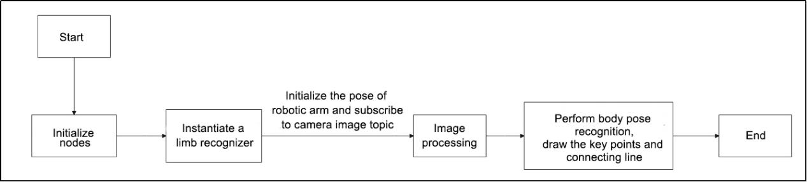

From the above diagram, the program is mainly image processing and gesture recognition, then perform trajectory drawing and generate the trajectory image.

(1) Import Function Packet

{lineno-start=8}

```python
import cv2
import rclpy
import queue
import threading
import numpy as np
import sdk.fps as fps
import mediapipe as mp
from rclpy.node import Node
from cv_bridge import CvBridge
from std_srvs.srv import Trigger
from sensor_msgs.msg import Image
from rclpy.executors import MultiThreadedExecutor
from servo_controller_msgs.msg import ServosPosition
from servo_controller.bus_servo_control import set_servo_position
```

① `import cv2`: Import the OpenCV library for image processing and computer vision tasks.

② `import rclpy`: Import the ROS2 Python client library for creating and managing ROS2 nodes, and for publishing and subscribing to messages.

③ `import queue`: Import Python's queue module for inter-thread communication.

④ `import threading`: Import Python's threading module for running concurrent tasks in the background.

⑤ `import numpy as np`: Import the NumPy library for handling arrays and matrix operations, commonly used for image data processing.

⑥ `import sdk.fps as fps`: Import the fps module from the SDK, used to calculate frames per second (FPS).

⑦ `import mediapipe as mp`: Import the MediaPipe library for real-time computer vision tasks, such as hand keypoint detection.

⑧ `from rclpy.node import Node`: Import the `Node` class from the `rclpy` library. All ROS2 nodes must inherit from this class.

⑨ `from cv_bridge import CvBridge`: Import the `CvBridge` class from the `cv_bridge` library, used to convert ROS image messages into OpenCV image format.

⑩ `from std_srvs.srv import Trigger`: Import the standard ROS2 service `Trigger`, typically used for executing simple trigger operations.

⑪ `from sensor_msgs.msg import Image`: Import the `Image` message type from `sensor_msgs` in ROS2, used to handle camera image data.

⑫ `from rclpy.executors import MultiThreadedExecutor`: Import the `MultiThreadedExecutor` from `rclpy.executors`, used for managing multi-threaded execution.

⑬ `from servo_controller_msgs.msg import ServosPosition`: Import the `ServosPosition` message type from `servo_controller_msgs`, used to control the movements of servos.

⑭ `from servo_controller.bus_servo_control import set_servo_position`: Import the `set_servo_position` function from `servo_controller.bus_servo_control`, used to set the position of a servo.

(2) MankindPoseNode Class Initialization Function

{lineno-start=24}

```python
class MankindPoseNode(Node):
    def __init__(self, name):
        rclpy.init()
        super().__init__(name)

        # 实例化一个肢体识别器(instantiate a limb recognizer)
        self.pose = mp.solutions.pose.Pose(
            static_image_mode=False,
            model_complexity=0,
            min_detection_confidence=0.8,
            min_tracking_confidence=0.2
        )
        self.drawing = mp.solutions.drawing_utils # 结果绘制工具(result drawing tool)
        self.fps = fps.FPS() # 帧率计数器(frame rate calculator)
        self.bridge = CvBridge()  # 用于ROS Image消息与OpenCV图像之间的转换

        self.image_queue = queue.Queue(maxsize=2)
        self.image_sub = self.create_subscription(Image, '/depth_cam/rgb/image_raw', self.image_callback, 1)
        self.joints_pub = self.create_publisher(ServosPosition, '/servo_controller', 1) # 舵机控制
        #等待服务启动
        self.client = self.create_client(Trigger, '/controller_manager/init_finish')
        self.client.wait_for_service()
        set_servo_position(self.joints_pub, 1.5, ((10, 500), (5, 500), (4, 330), (3, 100), (2, 700), (1, 500)))

        threading.Thread(target=self.main, daemon=True).start()
```

① `def __init__(self, name)`: Define the constructor method for the class. It initializes the ROS2 node and performs necessary setup.

② `rclpy.init()`: Initialize the ROS2 Python client library and start the ROS2 node system.

③ `super().__init__(name)`: Call the parent class Node constructor to initialize the ROS2 node and set the node name.

④ `self.pose = mp.solutions.pose.Pose(...)`: Instantiate the MediaPipe Pose recognizer, configuring model complexity and confidence for detection and tracking.

⑤ `self.drawing = mp.solutions.drawing_utils`: Access MediaPipe's drawing utilities to render human pose keypoints on the image.

⑥ `self.fps = fps.FPS()`: Instantiate the FPS counter to calculate and display the frame rate of the video stream.

⑦ `self.bridge = CvBridge()`: Instantiate the CvBridge object to convert ROS image messages into OpenCV image format.

⑧ `self.image_queue = queue.Queue(maxsize=2)`: Create a queue with a maximum size of 2 to buffer images for processing.

⑨ `self.image_sub = self.create_subscription(Image, '/depth_cam/rgb/image_raw', self.image_callback, 1)`: Create a subscription to receive image data from the depth camera (/depth_cam/rgb/image_raw), using self.image_callback to handle incoming messages.

⑩ `self.joints_pub = self.create_publisher(ServosPosition, '/servo_controller', 1)`: Create a publisher to send servo position data to the servo controller on the topic /servo_controller.

⑪ `self.client = self.create_client(Trigger, '/controller_manager/init_finish')`: Create a client to wait for the /controller_manager/init_finish service to start.

⑫ `self.client.wait_for_service()`: Wait for the service to become available before proceeding with communication.

⑬ `set_servo_position(self.joints_pub, 1.5, ((10, 500), (5, 500), (4, 330), (3, 100), (2, 700), (1, 500)))`: Call the set_servo_position function to send position data to the servo controller.

⑭ `threading.Thread(target=self.main, daemon=True).start()`: Create and start a new background thread to execute the self.main method, allowing the main logic to run concurrently in the background.

(3)image_callback Function

{lineno-start=50}

```python
    def image_callback(self, ros_image):
        cv_image = self.bridge.imgmsg_to_cv2(ros_image, "bgr8")
        bgr_image = np.array(cv_image, dtype=np.uint8)
        if self.image_queue.full():
            # 如果队列已满，丢弃最旧的图像
            self.image_queue.get()
            # 将图像放入队列
        self.image_queue.put(bgr_image)
```

① `def image_callback(self, ros_image)`: Define the image callback function to process incoming ROS image messages.

② `cv_image = self.bridge.imgmsg_to_cv2(ros_image, "bgr8")`: Convert the ROS image message to OpenCV format using CvBridge, specifying the encoding as "**bgr8**".

③ `bgr_image = np.array(cv_image, dtype=np.uint8)`: Convert the OpenCV image to a NumPy array with the data type uint8.

④ `if self.image_queue.full()`: Check if the image queue has reached its maximum capacity.

⑤ `self.image_queue.get()`: If the queue is full, remove the oldest image (the first item in the queue).

⑥ `self.image_queue.put(bgr_image)`: Add the current image (bgr_image) to the image queue.

(4) Main Function

{lineno-start=59}

```python
    def main(self):
        while True:
            bgr_image = self.image_queue.get()
            bgr_image = cv2.flip(bgr_image, 1)  # 镜像画面, 这样可以正对屏幕和相机看效果(mirror image, aligned with the screen and camera for better visualization)
            result_image = np.copy(bgr_image) # 将画面复制一份作为结果，结果绘制在这上面(duplicate the image as the result canvas, and draw the results on it)
            # bgr_image = cv2.resize(bgr_image, (int(ros_image.width / 2), int(ros_image.height / 2))) 
            results = self.pose.process(bgr_image)  # 进行识别(perform recognition)
            self.drawing.draw_landmarks(result_image, results.pose_landmarks, mp.solutions.pose.POSE_CONNECTIONS) # 画出各关节及连线(draw the joints and lines connecting them)
            self.fps.update() # 计算帧率(calculate frame rate)
            self.fps.show_fps(result_image)
            cv2.imshow("result", result_image)
            cv2.waitKey(1)

        cv2.destroyAllWindows()
        rclpy.shutdown()
```

① `while True`: Starts an infinite loop, continuously retrieving and processing images from the queue until the program is terminated.

② `bgr_image = self.image_queue.get()`: Retrieves an image from the image queue.

③ `bgr_image = cv2.flip(bgr_image, 1)`: Flips the retrieved image horizontally, creating a mirror effect, making it easier to view on the screen.

④ `result_image = np.copy(bgr_image)`: Creates a copy of the bgr_image to avoid modifying the original image during processing, using it as the canvas for drawing results.

⑤ `results = self.pose.process(bgr_image)`: Uses the MediaPipe Pose model for pose recognition on the image, returning the results.

⑥ `self.drawing.draw_landmarks(result_image, results.pose_landmarks, mp.solutions.pose.POSE_CONNECTIONS)`: Draws the pose landmarks and connections on the result_image.

⑦ `self.fps.update()`: Updates the frame rate calculator to compute the current frame rate.

⑧ `self.fps.show_fps(result_image)`: Displays the current frame rate on the result_image.

⑨ `cv2.imshow("result", result_image)`: Displays the result_image using OpenCV.

⑩ `cv2.waitKey(1)`: Waits for 1 millisecond to process any user input and keeps the display window updated.

## 15.2 Target Detection Model Training

### 15.2.1 Model Training

* **Image Collecting**

(1) Execute the following command in the terminal to terminate the app auto-start service.

```
sudo systemctl stop start_app_node.service
```

(2) Run the following command to enable the camera service.

```
ros2 launch peripherals depth_camera.launch.py
```

(3) Enter the command below to start the image collecting tool.

```
cd factory_utils/collect_picture && python3 main.py
```

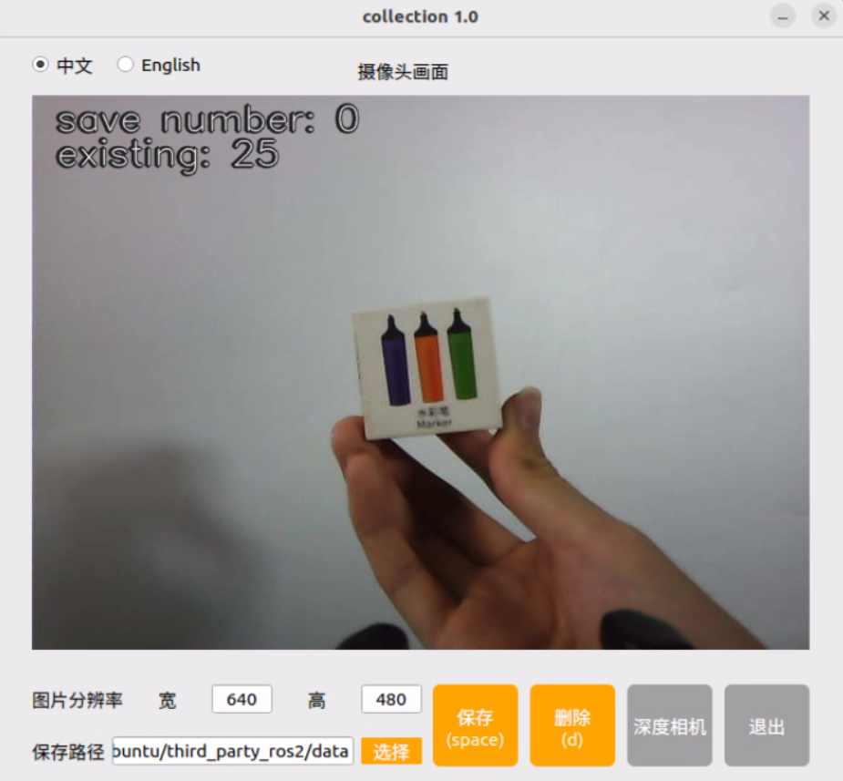

(4) Change the file storage path to "/home/ubuntu/third_party_ros2/data".

:::Note
This directory contains all the necessary program files for training the model. It is not recommended for beginners to use other directories.
:::

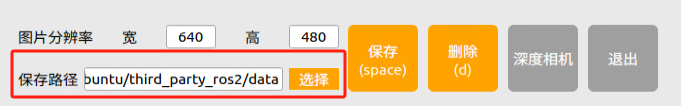

(5) Place the target object within the camera's field of view, then click the "**Save (space)**" button or press the spacebar to capture and save the current camera image. A folder named "**JPEGImages**" will be automatically created under the directory "**/home/ubuntu/third_party_ros2/data**" to store the images.

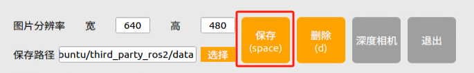

:::Note
To improve the reliability of the model, please capture the target object from different distances, rotation angles, and tilt angles.
:::

(6) After completing image collection, click the "**Exit**" button to close this tool.

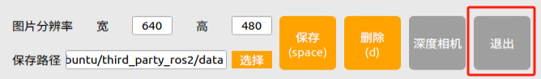

(7) Access the directory: **/home/ubuntu/third_party_ros2/data/JPEGImages** to check whether the image is collected successfully.

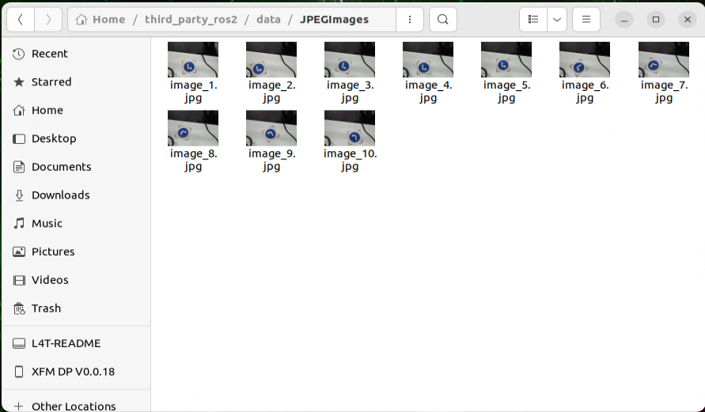

* **Using the roLabelImg Annotation Software**

The download link for roLabelImg is: [https://github.com/cgvict/roLabelImg](https://github.com/cgvict/roLabelImg)

(1) Open the directory where the annotation software is located by entering the following command:

```
cd /home/ubuntu/factory_utils/roLabelImg
```

(2) Run the software by executing the command:

```
python3 roLabelImg.py
```

(3) After opening the software, click "**File**" in the top-left corner, then select "**Open Dir**" to choose the directory containing the images you collected.


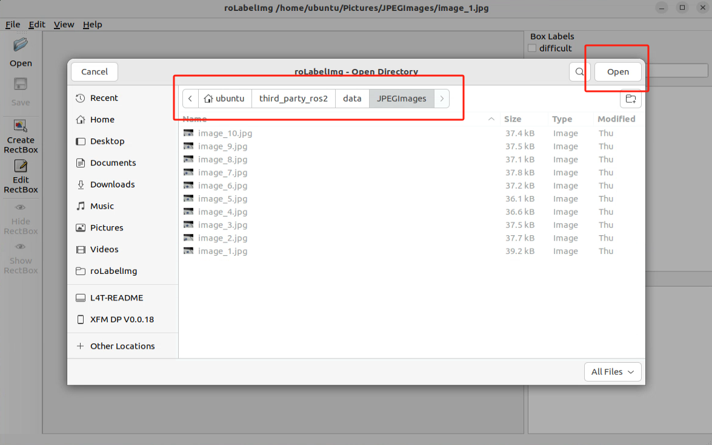

(4) Next, click "**File**" again, and select "**Change default saved Annotation dir**" to change the save path. Choose the "**Annotations**" folder inside the "**data**" directory.

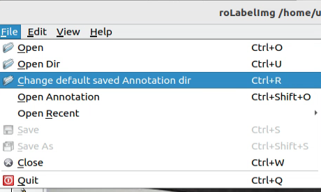

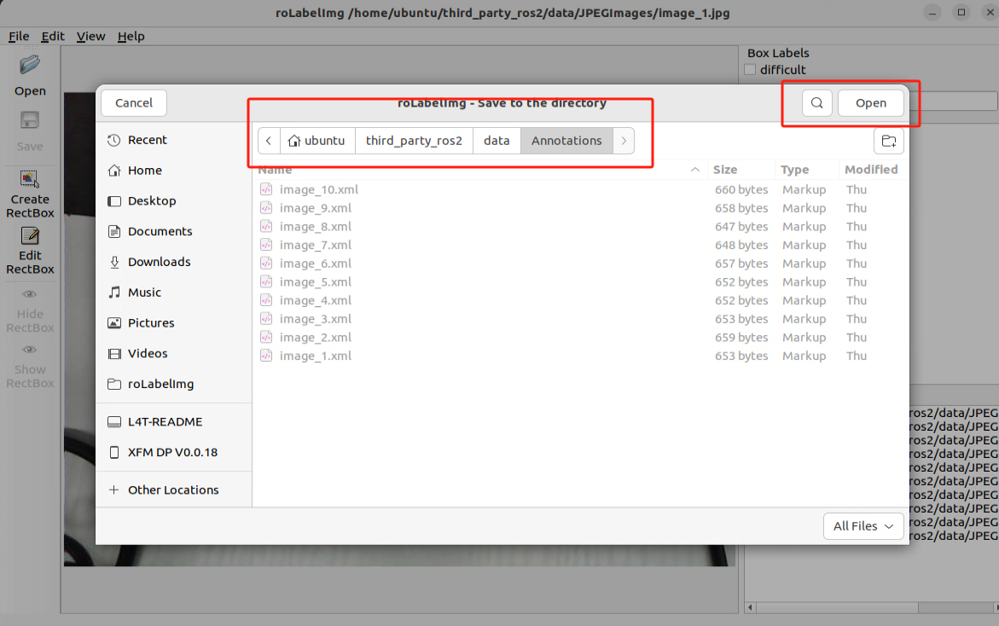

(5) Then, click "**View**" in the top-left corner, and select "**Advanced Mode**" to enable the rotation annotation feature.

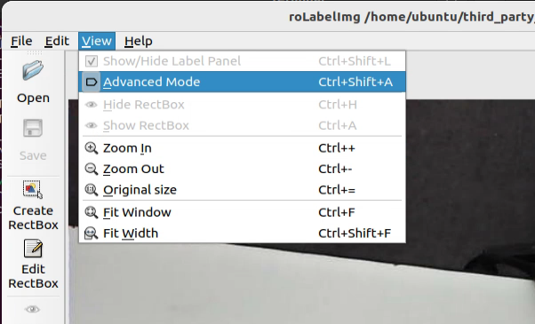

(6) hortcut keys:

e: Annotate the rotated target

w: Annotate the regular target

d: Go to the next image

a: Go to the previous image

c: Small clockwise rotation

x: Small counterclockwise rotation

v: Large clockwise rotation

z: Large counterclockwise rotation

After annotating each image, click the "**Save**" icon on the left to save your work.

:::{Note}

Always use the keyboard shortcuts C and X to rotate the bounding box, aligning it with the object's edges. This ensures that the subsequent recognition process is not affected.

:::

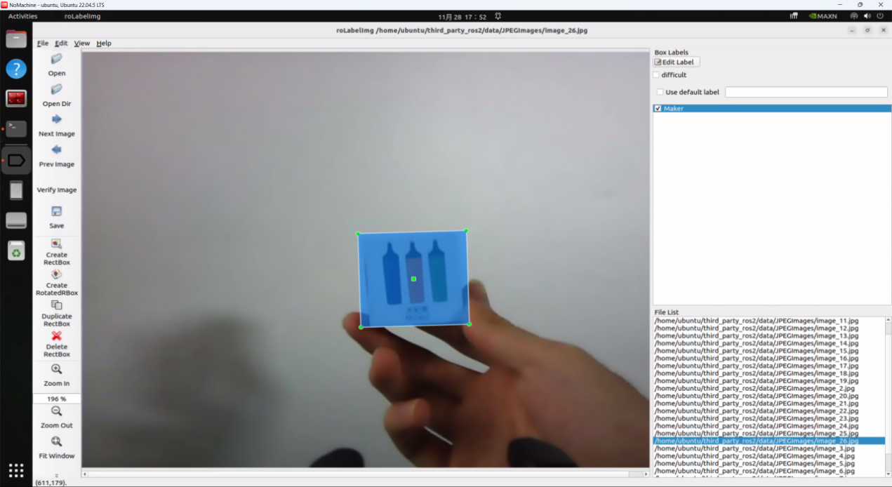

* **Dataset Annotation Processing**

After annotating with roLabelImg software, the generated XML files need to be converted into the training TXT format. The overall processing flow is:

xml --\> dota_xml --\> dota_txt --\> txt

(The training programs for this section are located in the \`/home/ubuntu/third_party_ros2/data\` directory.)

(1) Convert the annotated XML files to \`dota_txt\` format by entering the following command and modifying the file paths if needed. If the paths are already as shown, no modification is required.

```
cd ~/third_party_ros2/data && gedit roxml_to_dota.py
```

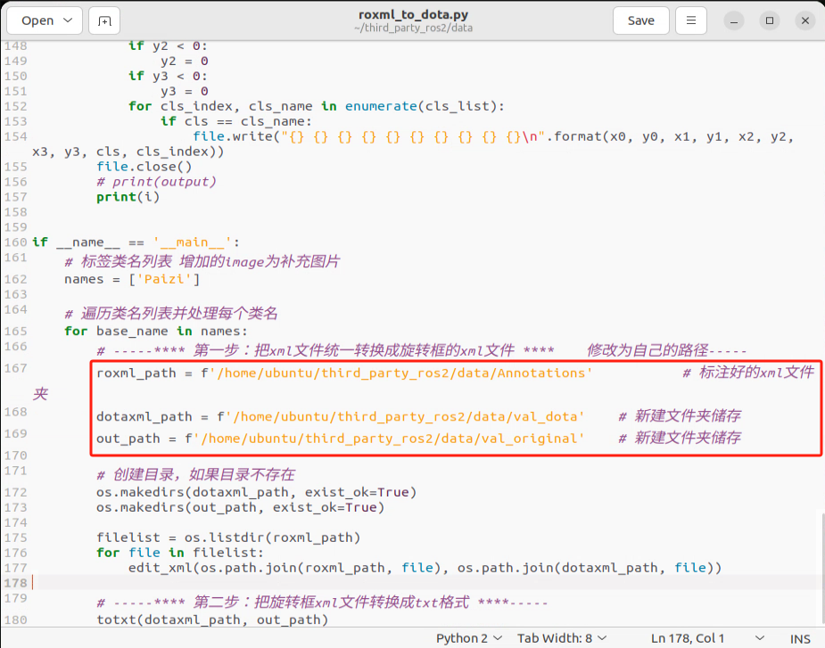

In the same file, modify the label list according to your requirements.

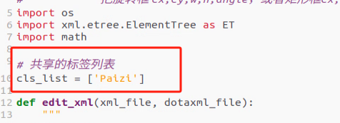

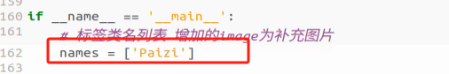

(2) Run the conversion program:

```
python3 roxml_to_dota.py
```

This will generate \`dota_txt\` files in the \`val_original\` folder.

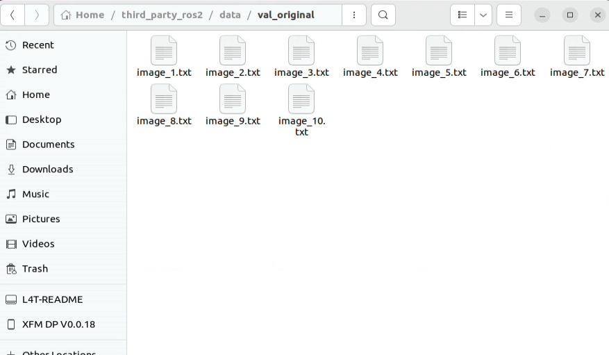

(3) Enter the following command to modify the label file for splitting data:

```
gedit split_data.py
```

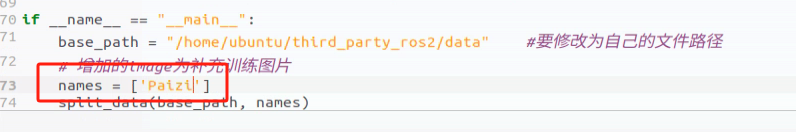

(4) Run the program to randomly split the dataset into 90% for training (train) and 10% for validation (val). It will also synchronize the corresponding \`dota_txt\` files, splitting them into 90% for \`train_original\` and 10% for \`val_original\`. The result will be as shown below:

```
python3 split_data.py
```

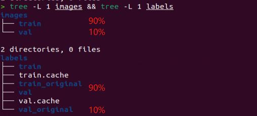

(5) Convert **dota_txt** to **txt** format:

① Enter the following command to modify the class name in the \`converter.py\` program. Replace \`class_mapping\` with your own labels and set the image type to your dataset image type (in this case, \`.jpg\`).

```
gedit ~/third_party_ros2/ultralytics/ultralytics/data/converter.py
```

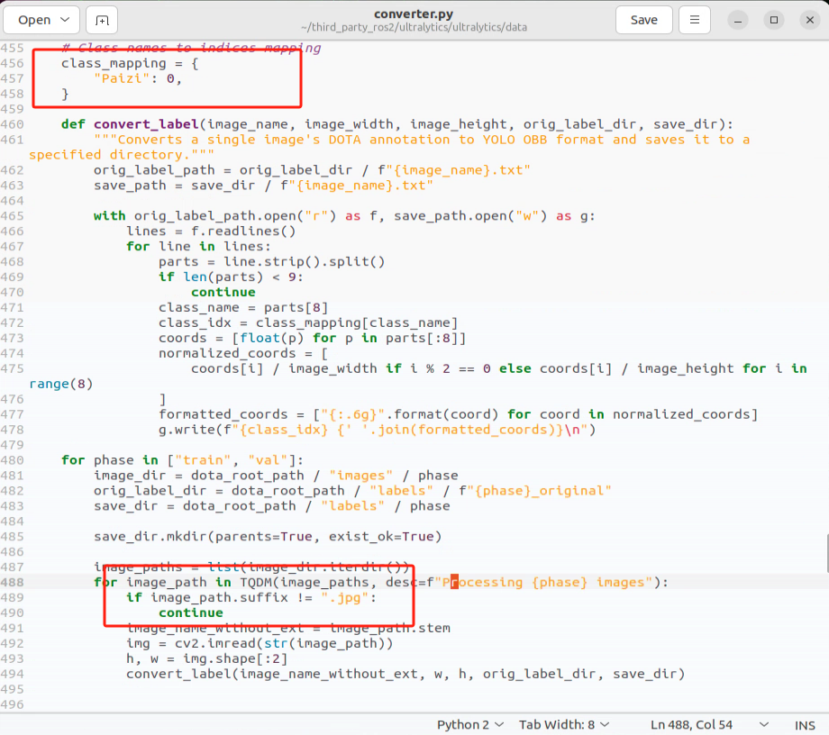

② Run the conversion program with the following command:

```
cd ~/third_party_ros2/data && python3 dota_to_txt.py
```

This will generate the necessary folders and \`.txt\` files.

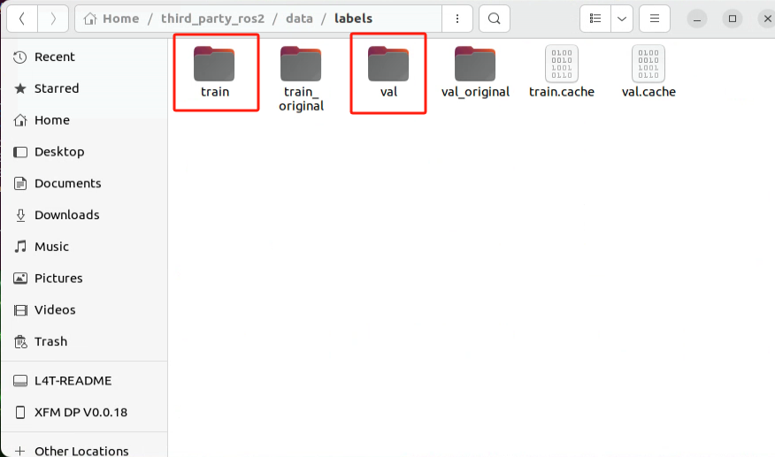

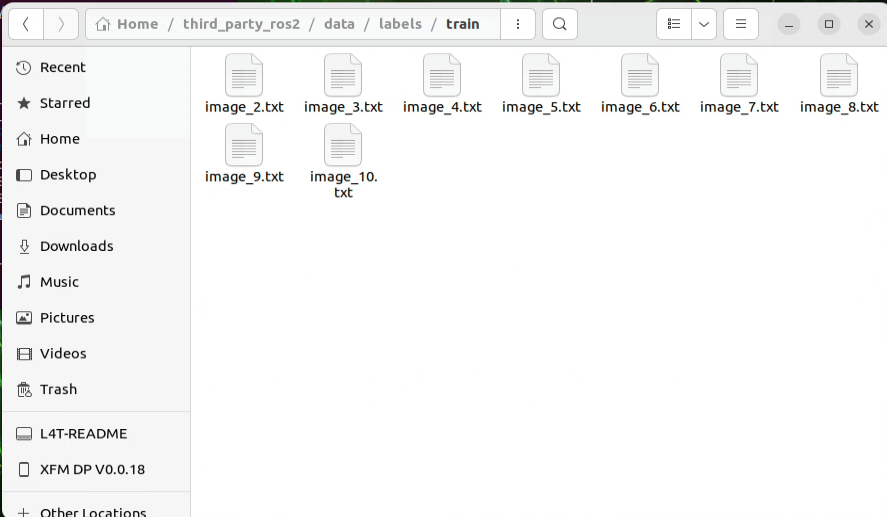

(6) Modify the \`yolov8-obb.yaml\` file to update the number of classes (\`nc\`) to match your dataset's class count:

```
cd ~/third_party_ros2/ultralytics/ultralytics/cfg/models/v8/ && gedit yolov8-obb.yaml
```

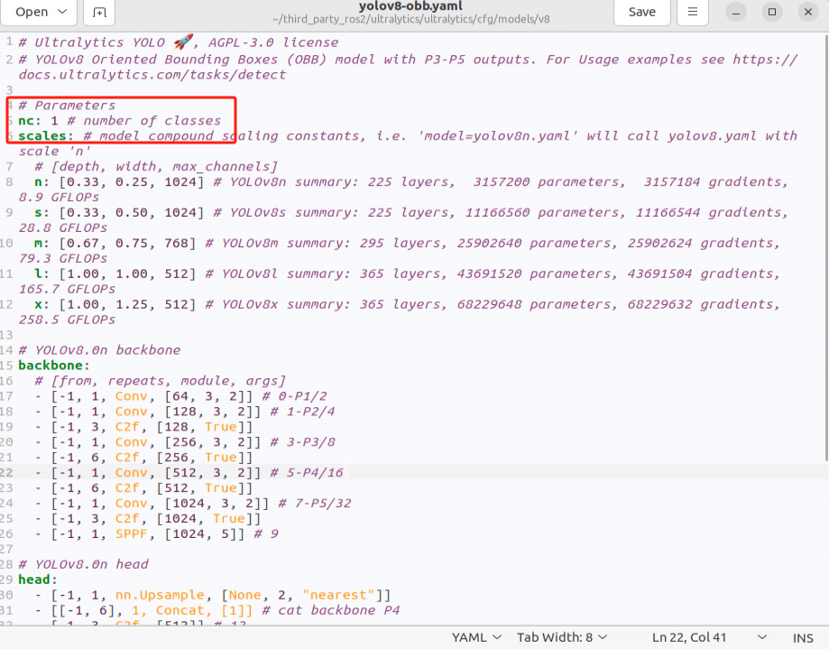

(7) Enter the following command to modify the \`data.yaml\` file. This file will be used for the next training steps. Be sure to update your paths, class count, and class names:

```
cd ~/third_party_ros2/data && gedit data.yaml
```

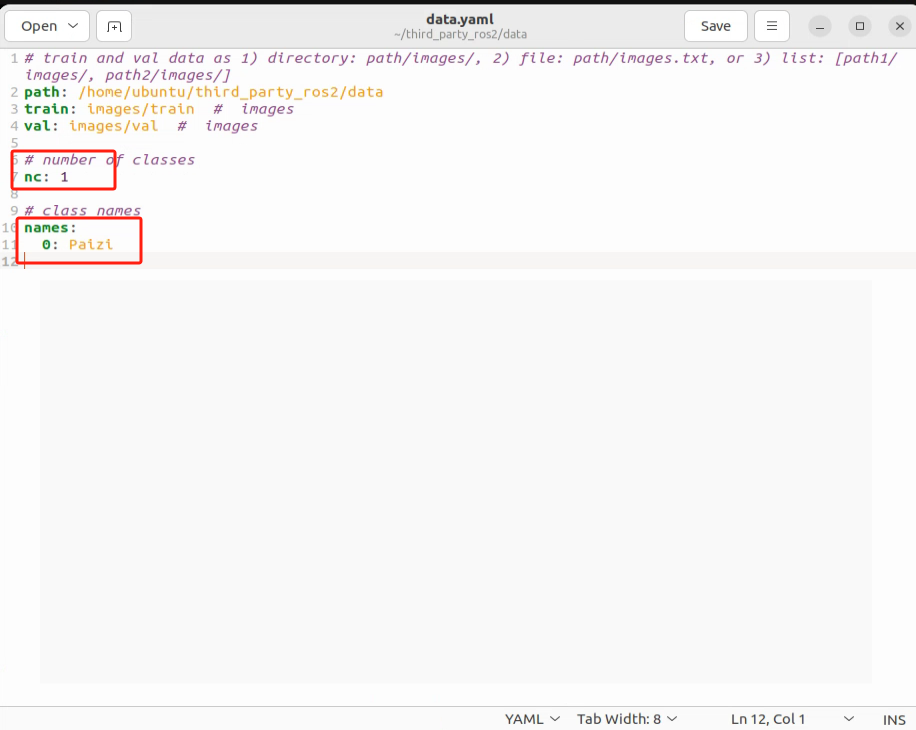

* **Start Training**

(1) Enter the following command to modify the \`default.yaml\` file. Set the task type to \`obb\`:

```
cd ~/third_party_ros2/ultralytics/ultralytics/cfg/ && gedit default.yaml
```

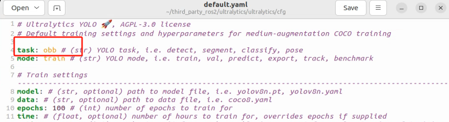

(2) Enter the following command to modify the file paths in \`yolov8_train.py\`. For hardware with lower specifications, you can reduce the values for \`batch\` and \`imgsz\` parameters. For example, set \`batch=8\` and \`imgsz=640\`.

"**imgsz**" refers to the image size.

"**batch**" refers to the number of images processed in a single batch.

"**epochs**" refers to the number of training iterations.

"**data**" is the path to your dataset.

"**model**" is the path to the pre-trained weights (this generally doesn't need modification).

```
cd ~/third_party_ros2/data && gedit yolov8_train.py
```

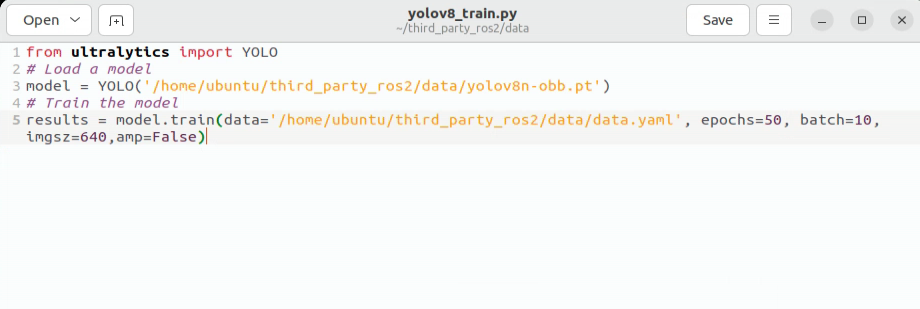

(3) Enter the following command to begin training:

```
python3 yolov8_train.py
```

After training is complete, the results will be saved in the \`~/third_party_ros2/data/runs/obb\` folder.

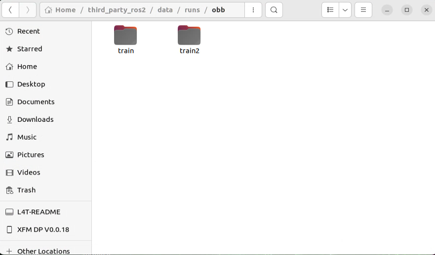

The weights folder stores the trained .pt model files generated during the training process.

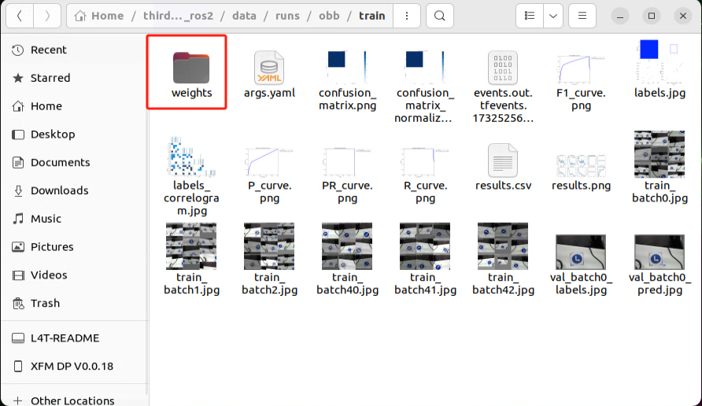

### 15.2.2 Convert PT File to Engine File

(1) Copy the newly trained \`best.pt\` file to the \`/home/ubuntu/third_party_ros2/tensorrtx/yolov8\` directory.

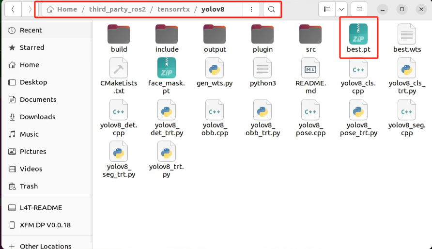

(2) In the **yolov8** directory, right-click and select "**Open in Terminal**" to open a terminal window.

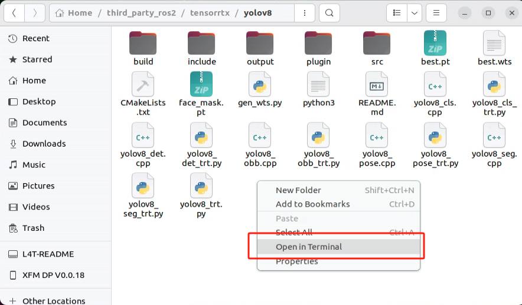

(3) Run the following command to convert the previously trained model into .wts format:

```
python3 gen_wts.py -w best.pt -o best.wts
```

(4) Wait for the model conversion to complete.

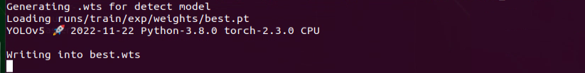

(5) Next, enter the \`tensorrtx/yolov8/include\` directory:

```
cd include
```

(6) Edit the \`config.h\` file using the following command. This file contains parameters that need to match the ones used during training. Specifically:

```
gedit config.h
```

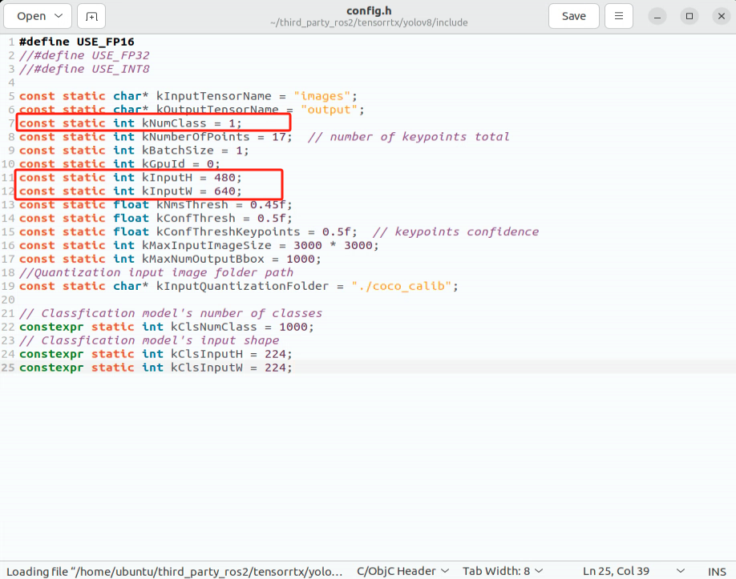

(7) After editing, go back to the previous directory:

```
cd ..
```

(8) Create a \`build\` directory and navigate into it:

```
mkdir build && cd build
```

(9) Compile the \`build\` directory using the following command:

```
cmake ..
```

(10) Next, build the \`build\` directory. This process may take some time, so please be patient:

```
make
```

(11) Copy the \`.wts\` file (generated from the previous model conversion) into the current directory (\`build\`):

```
cp ../best.wts .
```

(12) Run the following command to generate the TensorRT engine file (\`best.engine\`). This conversion process may take some time, so please be patient:

```
sudo ./yolov8_obb -s best.wts best.engine n
```

(13) If the following message appears in the terminal, it means the engine file has been successfully converted:

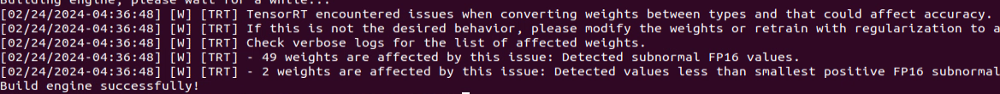

Once the conversion is complete, not only will the `best.engine` model engine file be generated (which can be used with TensorRT), but a `libmyplugins.so` library file will also be created. This library file will be used in subsequent programs to accelerate the inference process.

### 15.2.3 Model Validation

(1) Run the following command to modify the routine file path:

```
cd ~/ros2_ws/src/example/example/yolov8 && gedit yolov8_object_detection_node.launch.py
```

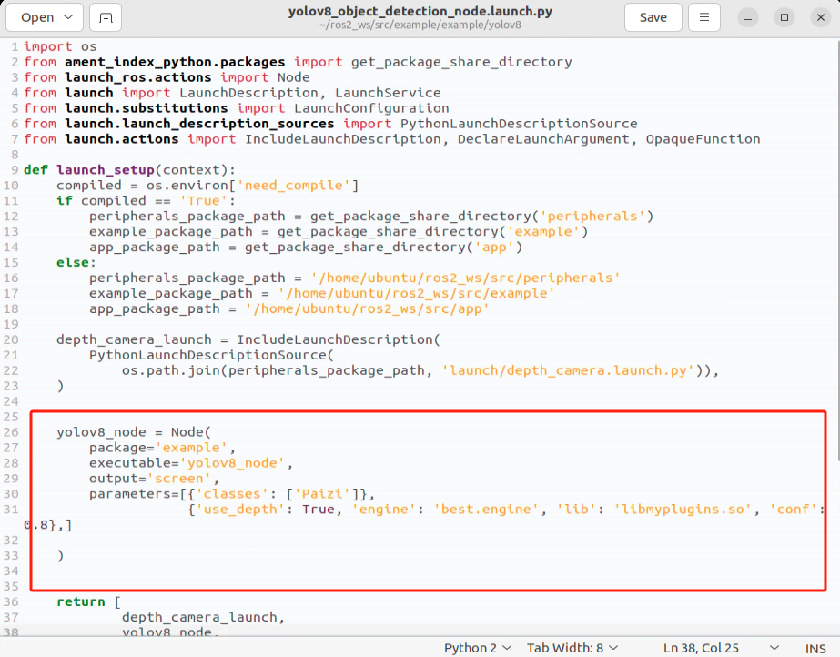

Modify the following sections in the file:

Change `Classes` to your own class names.

Set `engine` to `best.engine`.

(2) Copy the `best.engine` and `libmyplugins.so` files (generated in Step 2) into the `yolov8` routine directory.

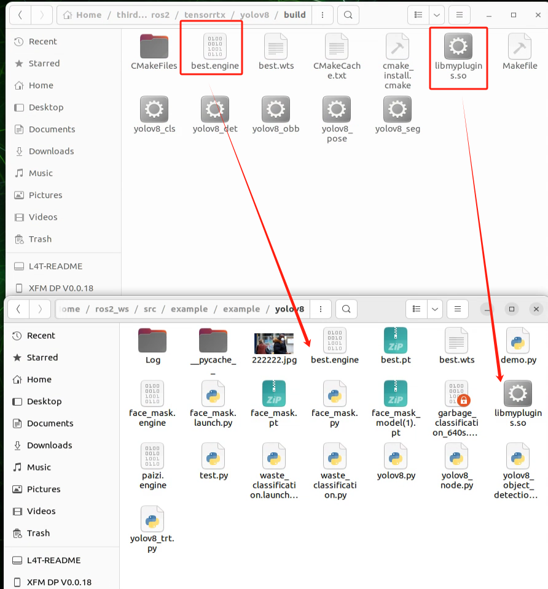

(3)Launch the routine for testing by running the following command:

```
ros2 launch example yolov8_object_detection_node.launch.py
```

Then, enter `rqt` and select the following options in the interface to view the detection results:

```
rqt
```

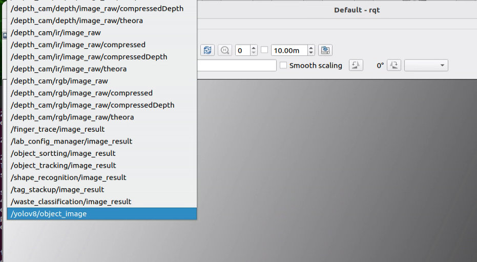

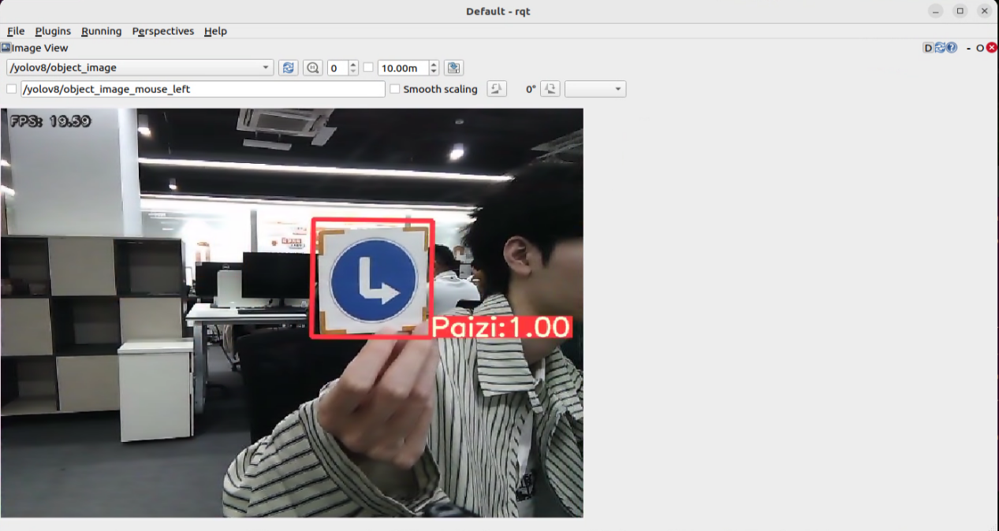


## 15.3 Training a Custom Object Detection Model

### 15.3.1 Image Collection

1. Open a terminal and run the command below to stop the app auto-start service.

   ```bash
   sudo systemctl stop start_app_node.service
   ```


2. Run the following command to start the depth camera service.

   ```bash
   ros2 launch peripherals depth_camera.launch.py
   ```


3. Open a new terminal window, then run the command below to create a directory for the dataset. The example below uses **my_data** as the directory name.

   ```bash
   mkdir -p ~/my_data
   ```


4. Run the following command to launch the image collection tool.

   ```bash
   cd factory_utils/collect_picture && python3 main.py
   ```


In the upper-left corner of the tool window, the **save number** indicates the image ID, which is the sequence number of the saved image. The **existing** indicates the number of images that have already been saved.

5. Click **Select(space)**, then change the save path to the **my_data** directory created earlier.


6. Place the target object within the camera view, then click **Save(space)** or press the **Space** key to save the current camera frame. After **Save(space)** is clicked or the **Space** key is pressed, a **JPEGImages** folder is automatically created under **/home/ubuntu/my_data** to store the captured images.


> [!NOTE]
>
> * **To improve model reliability, capture the target object from different distances, rotation angles, and tilt angles.**
>
> * **To ensure stable detection performance, collect a sufficiently large number of training images. About 100 images per class is recommended.**

7. After image collection is complete, click **Quit** to close the tool.


8. Return to all open terminal windows and press **Ctrl + C** to stop the running processes.

### 15.3.2 Image Annotation

After image collection is complete, the next step is image annotation. Annotation is essential for building a functional dataset because it defines the class of the important region in each image, allowing the trained model to recognize the same class in new images later.

1. Run the command below to open the annotation tool directory.

   ```bash
   cd /home/ubuntu/factory_utils/roLabelImg
   ```


2. Run the following command to launch **roLabelImg.py**.

   ```bash
   python3 roLabelImg.py
   ```


3. After the software opens, click **File** in the upper-left corner, then select **Open Dir** and choose the folder that contains the collected images.


4. Click **File** again, then select **Change default saved Annotation dir**. Set the save path to the **Annotations** directory under **my_data**.


5. Click **View** in the upper-left corner, then select **Advanced Mode** to enable rotated bounding box annotation.


6. The shortcut keys are listed below.

   **E**: Annotate a rotated object.
   **D**: Next image.
   **A**: Previous image.
   **C**: Rotate slightly clockwise.
   **X**: Rotate slightly counterclockwise.
   **V**: Rotate clockwise by a larger angle.
   **Z**: Rotate counterclockwise by a larger angle.

   After each image is annotated, click the **Save** icon on the left to save the result.

   > [!NOTE]
   >
   > **Use the C and X keys to fine-tune the box angle so that the rectangle aligns with the object edges. Otherwise, later detection accuracy may be affected.**


7. In the pop-up window, enter the class name for the target object. In this example, the class name is **left**. After entering the name, click **OK** or press **Enter** to confirm.


8. Press **Ctrl + S** to save the annotation data for the current image.

9. Press the **D** key to move to the next image, then repeat steps 6 through 8 until all images have been annotated. After all annotations are complete, close the software.

### 15.3.3 Converting the Dataset Format

1. Open a terminal and run the following command.

   ```bash
   gedit ~/my_data/classes.names
   ```


2. Enter the annotated class name **left** into the text file. If multiple classes are included, enter one class name per line.


> [!NOTE]
>
> **The class names entered here must exactly match the class names used during annotation.**

3. Press **Ctrl + S** to save the file, then close it.

4. Return to the terminal and run the following command to convert the dataset format.

   ```bash
   python3 ~/third_party/yolo/xml2yolo_obb.py --data ~/my_data --yaml ~/my_data/data.yaml
   ```


### 15.3.4 Training the Model

1. Run the following command to enter the YOLO directory.

   ```bash
   cd ~/third_party/yolo
   ```


2. Run the command below to edit the file and change the path to the generated dataset YAML file.

   ```bash
   vim train.py
   ```


In this file, `imgsz` specifies the image size, `batch` specifies the number of images in each batch, and `epochs` specifies the number of training epochs. These parameters can be adjusted as needed. Increasing the number of epochs can improve model reliability, but it also increases training time.

3. Run the following command to start training.

   ```bash
   python3 train.py
   ```


   After training is complete, the results are saved in the **~/third_party/yolo/runs/obb** directory.


   The **weights** folder stores the generated **.pt** model file.

### 15.3.5 Exporting and Using the Engine Model

1. Using the generated training result path above as an example, run the following command to enter the directory.

   ```bash
   cd ~/third_party/yolo/runs/obb/train3/weights
   ```


2. Run the following command to move the trained model file to the target directory.

   ```bash
   cp best.pt ~/third_party/yolo
   ```


3. Run the following command to export the engine file. This process takes some time to complete.

   ```bash
   python3 export_engine.py
   ```


4. After the conversion is complete, an **engine** file is generated.


5. Copy the generated engine file to the directory: **ros2_ws/src/example/example/yolo_detect/model**. Adjust the path as needed.

   ```bash
   cp ~/third_party/yolo/best.engine ~/ros2_ws/src/example/example/yolo_detect/model
   ```


6. Run the following command to open the file.

   ```bash
   gedit ~/ros2_ws/src/example/example/yolo_detect/yolo_object_detection_node.launch.py
   ```


Change the content in the highlighted area to **best.engine**. After the modification is complete, press **Ctrl + S** to save the file, then close it.


7. Run the following command to check the model detection result.

   ```bash
   ros2 launch example yolo_object_detection_node.launch.py yolo:=yolov11
   ```


