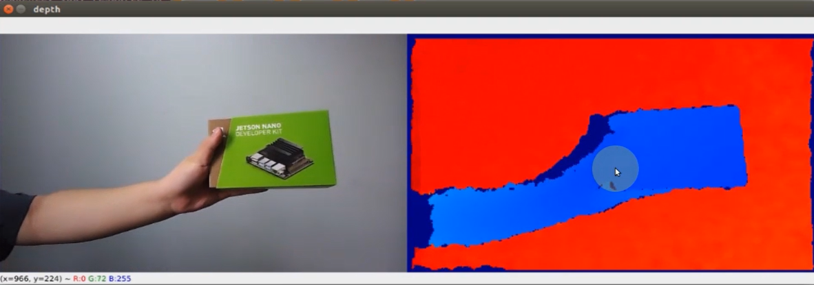
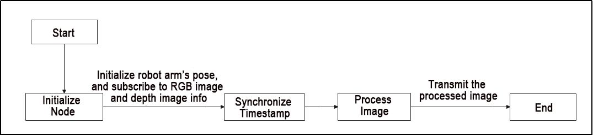
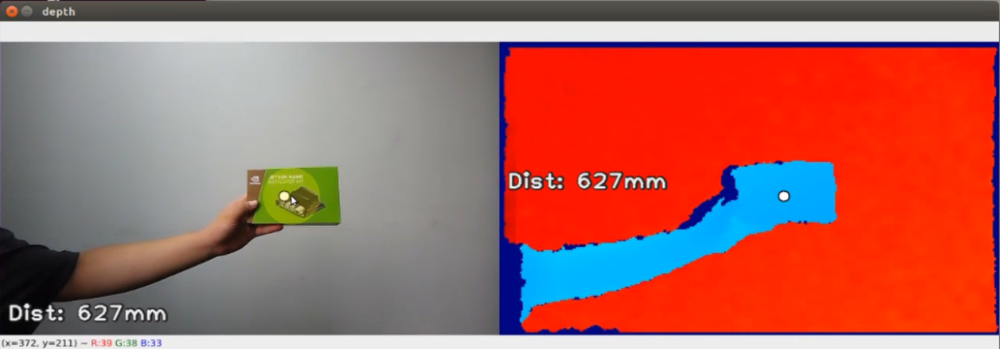
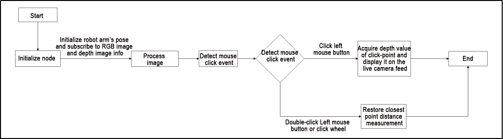
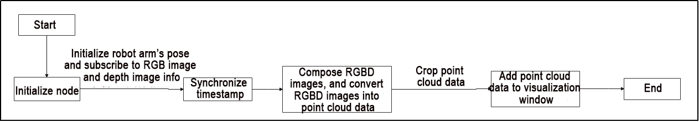
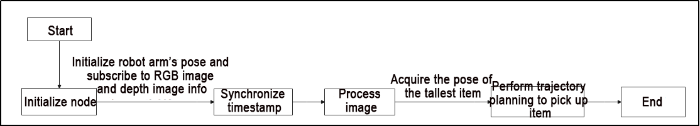
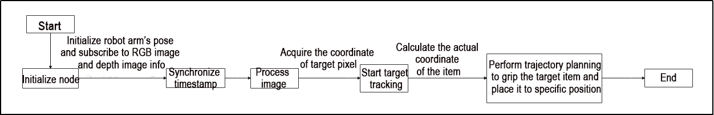
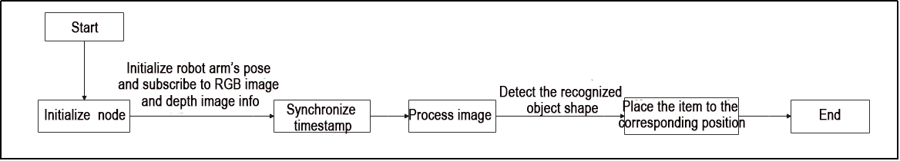

# 17. ROS2-Robot Arm Depth Camera Application

## 17.1 Depth Map Pseudo-Color Processing

### 17.1.1 Program Flow

First, initialize the node and obtain the RGB image and depth map topicmessages.

Next, process the image to generate the pseudo-color image.

Finally, transmit both the color image and pseudo-color image.

### 17.1.2 Operation Steps

:::{Note}

The input command should be case sensitive, and the keywords can be complemented using Tab key.

:::

(1) Double-click  to open the command line terminal, and execute the following command to close the auto-start service. 

```
sudo systemctl stop start_app_node.service
```

(2) Execute the command below and hit Enter to run the game.

```
ros2 launch example get_depth_rgb_img.launch.py
```

(3) If you need to terminate the running program, use short-cut `Ctrl+C`.

(4) After completing the game experience, you need to start the app service (if not started, it will affect the functionality of the app for subsequent game). In the terminal, enter the following command and press Enter to start the app service. Wait a moment for the service to initialize and start.

```
sudo systemctl start start_app_node.service
```

(5) After the service is initiated successfully, the robot will emit a beeping sound.

### 17.1.3 Program Outcome

Once the game starts, the robot arm will send the RGB color image and depth image to the terminal. The color will change corresponding to the distance indicated in the depth map.



### 17.1.4 Launch File Analysis

The Launch file is saved in

**[/home/ubuntu/ros2_ws/src/example/example/rgbd_function/get_depth_rgb_img.launch.py](../_static/source_code/17/rgbd_function.zip)**

- **launch_setup Function**

{lineno-start=9}

```python
def launch_setup(context):
    compiled = os.environ['need_compile']

    if compiled == 'True':
        sdk_package_path = get_package_share_directory('sdk')
        peripherals_package_path = get_package_share_directory('peripherals')
    else:
        sdk_package_path = '/home/ubuntu/ros2_ws/src/driver/sdk'
        peripherals_package_path = '/home/ubuntu/ros2_ws/src/peripherals'

    sdk_launch = IncludeLaunchDescription(
        PythonLaunchDescriptionSource(
            os.path.join(sdk_package_path, 'launch/jetarm_sdk.launch.py')),
    )

    depth_camera_launch = IncludeLaunchDescription(
        PythonLaunchDescriptionSource(
            os.path.join(peripherals_package_path, 'launch/depth_camera.launch.py')),
    )

    get_depth_rgb_img_node = Node(
        package='example',
        executable='get_depth_rgb_img',
        output='screen',
    )

    return [depth_camera_launch,
            sdk_launch,
            get_depth_rgb_img_node,
            ]
```

(1) `compiled = os.environ['need_compile']`: Retrieve the `need_compile` flag from the environment variables to determine if compilation is required.

(2) `if compiled == 'True'`: Check if compilation is needed (True or False).

(3) `sdk_package_path = get_package_share_directory('sdk')`: set the shared directory path for the `sdk` package.

(4) `peripherals_package_path = get_package_share_directory('peripherals')`: Get the shared directory path for the `peripherals` package.

(5) `else`: If compilation is not required, use the local paths instead.

(6) `sdk_package_path = '/home/ubuntu/ros2_ws/src/driver/sdk'`: Set the local path for the `sdk` package.

(7) `peripherals_package_path = '/home/ubuntu/ros2_ws/src/peripherals'`: Set the local path for the `peripherals` package.

(8) `sdk_launch = IncludeLaunchDescription(...)`: Creates an IncludeLaunchDescription object to include the launch configuration defined in the jetarm_sdk.launch.py file.

(9) `depth_camera_launch = IncludeLaunchDescription(...)`: Creates an IncludeLaunchDescription object to include the launch configuration defined in the depth_camera.launch.py file.

(10) `get_depth_rgb_img_node = Node(...)`: Creates a Node object to launch the get_depth_rgb_img node, with logs output to the screen.

(11) `return [...]`: Returns a list containing multiple launch configurations, including the depth camera, SDK launch file, and the node for retrieving depth images.

- **generate_launch_description Function**

{lineno-start=40}

```python
def generate_launch_description():
    return LaunchDescription([
        OpaqueFunction(function = launch_setup)
    ])
```

(1) `def generate_launch_description()`: Defines the generate_launch_description function, which is responsible for generating a launch description object.

(2) `return LaunchDescription([OpaqueFunction(function=launch_setup)])`: Returns a LaunchDescription object that includes the result of the launch_setup function, executed through an OpaqueFunction, as the launch configuration.

- **Main Function**

{lineno-start=45}

```python
if __name__ == '__main__':
    # 创建一个LaunchDescription对象
    ld = generate_launch_description()

    ls = LaunchService()
    ls.include_launch_description(ld)
    ls.run()
```

(1) `if __name__ == '__main__'`: Checks whether the script is being executed as the main program. If true, it proceeds with the launch process.

(2) `ld = generate_launch_description()`: Calls the generate_launch_description function to generate the launch description object ld.

(3) `ls = LaunchService()`: Creates an instance of the LaunchService class, named ls, which is responsible for managing the launch process.

(4) `ls.include_launch_description(ld)`: Includes the generated launch description ld in the LaunchService instance to ensure the configurations defined in the launch file are executed.

(5) `ls.run()`: Starts the ROS 2 system and executes the nodes and configurations defined in the launch file.

### 17.1.5 Python Source Code Analysis

The source code is saved in

**[/home/ubuntu/ros2_ws/src/example/example/rgbd_function/include/get_depth_rgb_img.py](../_static/source_code/17/rgbd_function.zip)**

The program flowchart is as below:



The program primarily involves capturing the RGB image and depth image from the camera. After processing the image, the program will then transmit it to the screen.

- **Import Feature Pack**

{lineno-start=8}

```python
import os
import cv2
import time
import rclpy
import queue
import threading
import numpy as np
import sdk.fps as fps
import mediapipe as mp
import message_filters
from rclpy.node import Node
from cv_bridge import CvBridge
from std_srvs.srv import SetBool
from std_srvs.srv import Trigger
from sensor_msgs.msg import Image, CameraInfo
from rclpy.executors import MultiThreadedExecutor
from servo_controller_msgs.msg import ServosPosition
from rclpy.callback_groups import ReentrantCallbackGroup
from servo_controller.bus_servo_control import set_servo_position
```

(1) `import os`: Imports the os module for operating system-related functions, such as handling file paths and environment variables.

(2) `import cv2`: Imports the cv2 module for image processing and video capture functions.

(3) `import time`: Imports the time module for time-related operations, such as delays and time calculations.

(4) `import rclpy`: Imports the Python client library for ROS 2, enabling communication with ROS 2 systems.

(5) `import queue`: Imports the queue module to create thread-safe queues.

(6) `import threading`: Imports the threading module for multi-threading functionality.

(7) `import numpy as np`: Imports the numpy module for efficient numerical computations and array operations.

(8) `import sdk.fps as fps`: Imports a custom fps module for frame rate calculations.

(9) `import mediapipe as mp`: Imports the mediapipe library for image processing and human pose detection.

(10) `import message_filters`: Imports the message_filters module for synchronizing subscribed messages.

(11) `from rclpy.node import Node`: Imports the Node class from rclpy.node to create ROS 2 nodes.

(12) `from cv_bridge import CvBridge`: Imports the CvBridge class for converting between ROS image messages and OpenCV images.

(13) `from std_srvs.srv import SetBool`: Imports the SetBool service message type for controlling boolean services.

(14) `from std_srvs.srv import Trigger`: Imports the Trigger service message type for services that trigger specific actions.

(15) `from sensor_msgs.msg import Image, CameraInfo`: Imports the Image and CameraInfo message types from sensor_msgs.msg for transmitting images and camera information.

(16) `from rclpy.executors import MultiThreadedExecutor`: Imports the MultiThreadedExecutor class for multi-threaded execution of ROS 2 nodes.

(17) `from servo_controller_msgs.msg import ServosPosition`: Imports the ServosPosition message type from servo_controller_msgs.msg for controlling servo positions.

(18) `from rclpy.callback_groups import ReentrantCallbackGroup`: Imports the ReentrantCallbackGroup class for handling reentrant callbacks in multi-threaded environments.

(19) `from servo_controller.bus_servo_control import set_servo_position`: Imports the set_servo_position function from servo_controller.bus_servo_control for controlling servo positions.

- **GetRgbAndDepthNode Class Initialization Function**

{lineno-start=28}

```python
class GetRgbAndDepthNode(Node):
    def __init__(self, name):
        rclpy.init()
        super().__init__(name)
        self.running = True
        self.fps = fps.FPS()

        self.image_queue = queue.Queue(maxsize=2)
        self.joints_pub = self.create_publisher(ServosPosition, '/servo_controller', 1) # 舵机控制
        
        self.client = self.create_client(Trigger, '/controller_manager/init_finish')
        self.client.wait_for_service()
        self.client = self.create_client(SetBool, '/depth_cam/set_ldp_enable')
        self.client.wait_for_service()

        rgb_sub = message_filters.Subscriber(self, Image, '/depth_cam/rgb/image_raw')
        depth_sub = message_filters.Subscriber(self, Image, '/depth_cam/depth/image_raw')
        info_sub = message_filters.Subscriber(self, CameraInfo, '/depth_cam/depth/camera_info')

        # 同步时间戳, 时间允许有误差在0.02s
        sync = message_filters.ApproximateTimeSynchronizer([rgb_sub, depth_sub, info_sub], 3, 0.02)
        sync.registerCallback(self.multi_callback) #执行反馈函数
        
        timer_cb_group = ReentrantCallbackGroup()
        self.timer = self.create_timer(0.0, self.init_process, callback_group=timer_cb_group)
```

(1) `rclpy.init()`: Initializes the ROS 2 client library rclpy, which is necessary for creating ROS nodes.

(2) `super().__init__(name)`: Calls the constructor of the parent class Node to initialize the ROS node. The parameter name specifies the node's name.

(3) `self.running = True`: Sets the running flag to indicate whether the node should continue running.

(4) `self.fps = fps.FPS()`: Creates an FPS object to calculate and track the frame rate.

(5) `self.image_queue = queue.Queue(maxsize=2)`: Creates a thread-safe queue image_queue to store image data, with a maximum size of 2 frames.

(6) `self.joints_pub = self.create_publisher(ServosPosition, '/servo_controller', 1)`: Creates a publisher for the ServosPosition message type to control servo motors, publishing to the /servo_controller topic.

(7) `self.client = self.create_client(Trigger, '/controller_manager/init_finish')`: Creates a Trigger service client to send requests to the /controller_manager/init_finish service.

(8) `self.client.wait_for_service()`: Waits until the /controller_manager/init_finish service becomes available for invocation.

(9) `self.client = self.create_client(SetBool, '/depth_cam/set_ldp_enable')`: Creates a SetBool service client to send boolean requests to the /depth_cam/set_ldp_enable service.

(10) `self.client.wait_for_service()`: Waits until the /depth_cam/set_ldp_enable service becomes available.

(11) `rgb_sub = message_filters.Subscriber(self, Image, '/depth_cam/rgb/image_raw')`: Creates a message_filters.Subscriber to subscribe to RGB image messages from the /depth_cam/rgb/image_raw topic.

(12) `depth_sub = message_filters.Subscriber(self, Image, '/depth_cam/depth/image_raw')`: Creates a message_filters.Subscriber to subscribe to depth image messages from the /depth_cam/depth/image_raw topic.

(13) `info_sub = message_filters.Subscriber(self, CameraInfo, '/depth_cam/depth/camera_info')`: Creates a message_filters.Subscriber to subscribe to camera info messages from the /depth_cam/depth/camera_info topic.

(14) `sync = message_filters.ApproximateTimeSynchronizer([rgb_sub, depth_sub, info_sub], 3, 0.02)`: Creates an ApproximateTimeSynchronizer object to synchronize messages from multiple subscribers (RGB images, depth images, and camera info). Allows a maximum time difference of 0.02 seconds between messages.

(15) `sync.registerCallback(self.multi_callback)`: Registers the multi_callback function to handle synchronized messages when they are available.

(16) `timer_cb_group = ReentrantCallbackGroup()`: Creates a reentrant callback group timer_cb_group to allow callbacks to execute concurrently in a multithreaded environment.

(17) `self.timer = self.create_timer(0.0, self.init_process, callback_group=timer_cb_group)`: Creates a timer that periodically triggers the init_process function. The timer_cb_group ensures concurrent execution of timer callbacks.

- **init_process Method**

{lineno-start=54}

```python
    def init_process(self):
        self.timer.cancel()

        msg = SetBool.Request()
        msg.data = False
        self.send_request(self.client, msg)

        set_servo_position(self.joints_pub, 1.5, ((10, 500), (5, 500), (4, 330), (3, 100), (2, 700), (1, 500)))
        time.sleep(1.5)
        
        threading.Thread(target=self.main, daemon=True).start()
        self.create_service(Trigger, '~/init_finish', self.get_node_state)
        self.get_logger().info('\033[1;32m%s\033[0m' % 'start')
```

(1) `self.timer.cancel()`: Cancels the timer, stopping its periodic callback execution.

(2) `msg = SetBool.Request()`: Creates a `SetBool.Request` message object, used for sending boolean value requests.

(3) `msg.data = False`: Sets the `data` attribute of the message to `False`, which can be used to disable a specific function (e.g., turning off LDP).

(4) `self.send_request(self.client, msg)`: Sends the request message `msg` to the service client `self.client`. This action triggers the `/depth_cam/set_ldp_enable` service.

(5) `set_servo_position(self.joints_pub, 1.5, ((10, 500), (5, 500), (4, 330), (3, 100), (2, 700), (1, 500)))`: Calls the `set_servo_position` function to publish a `ServosPosition` message via `self.joints_pub`, setting the servo positions.

(6) `time.sleep(1.5)`: Pauses execution for 1.5 seconds to allow sufficient time for the servo adjustments to complete.

(7) `threading.Thread(target=self.main, daemon=True).start()`: Starts a new thread to execute the `main` method. The thread is configured as a daemon to ensure it terminates when the main program exits.

(8) `self.create_service(Trigger, '~/init_finish', self.get_node_state)`: Creates a service of type `Trigger` with the name `~/init_finish` and registers the callback function `self.get_node_state` to handle incoming requests.

(9) `self.get_logger().info('\033[1;32m%s\033[0m' % 'start')`: Logs the message `'start'` in green text, signaling the initialization process has begun.

- **get_node_state Function**

{lineno-start=68}

```python
    def get_node_state(self, request, response):
        response.success = True
        return response

```

(1) `response.success = True`: Sets the success attribute of the service response to True, indicating that the node status is normal.

(2) `return response`: Returns the response object, completing the service call and notifying the client that the node is available.

- **send_request Function**

{lineno-start=72}

```python
    def send_request(self, client, msg):
        future = client.call_async(msg)
        while rclpy.ok():
            if future.done() and future.result():
                return future.result()
```


(1) `def send_request(self, client, msg)`: Defines a method `send_request`, which accepts a client object `client` and a message object `msg` as parameters.

(2) `future = client.call_async(msg)`: Calls the client's asynchronous request method `call_async`, sends the message, and returns a `future` object that represents the result of the request.

(3) `while rclpy.ok()`: Enters a loop to check if the ROS2 node is still running.

(4) `if future.done() and future.result()`:Checks if the `future` is completed and if the result is valid.

(5) `return future.result()`: If the request is completed and the result is valid, returns the result of the `future`.

- **multi_callback Function**

{lineno-start=78}

```python
    def multi_callback(self, ros_rgb_image, ros_depth_image, depth_camera_info):
        if self.image_queue.full():

            # 如果队列已满，丢弃最旧的图像
            self.image_queue.get()
        # 将图像放入队列
        self.image_queue.put((ros_rgb_image, ros_depth_image, depth_camera_info))
```

(1) `if self.image_queue.full()`: Checks if the image queue `image_queue` is full.

(2) `self.image_queue.get()`: If the queue is full, discard the oldest image by retrieving and removing the first element from the queue.

(3) `self.image_queue.put((ros_rgb_image, ros_depth_image, depth_camera_info))`: Inserts the current RGB image, depth image, and camera information as a tuple into the `image_queue`, saving the latest image data.

- **Main Function**

{lineno-start=86}

```python
    def main(self):
        while self.running:
            try:
                ros_rgb_image, ros_depth_image, depth_camera_info = self.image_queue.get(block=True, timeout=1)
            except queue.Empty:
                if not self.running:
                    break
                else:
                    continue
            try:
                rgb_image = np.ndarray(shape=(ros_rgb_image.height, ros_rgb_image.width, 3), dtype=np.uint8, buffer=ros_rgb_image.data)
                rgb_image = rgb_image[40:440,]
                depth_image = np.ndarray(shape=(ros_depth_image.height, ros_depth_image.width), dtype=np.uint16, buffer=ros_depth_image.data)

                h, w = depth_image.shape[:2]

                depth = np.copy(depth_image).reshape((-1, ))
                depth[depth<=0] = 0
                sim_depth_image = np.clip(depth_image, 0, 4000).astype(np.float64)
                sim_depth_image = sim_depth_image / 2000.0 * 255.0
                bgr_image = cv2.cvtColor(rgb_image, cv2.COLOR_RGB2BGR)
                depth_color_map = cv2.applyColorMap(sim_depth_image.astype(np.uint8), cv2.COLORMAP_JET)
                result_image = np.concatenate([cv2.cvtColor(rgb_image, cv2.COLOR_RGB2BGR), depth_color_map], axis=1)
                cv2.imshow("depth", result_image)
                key = cv2.waitKey(1)
                if key != -1:
                    self.running = False


            except Exception as e:
                self.get_logger().info('error: ' + str(e))
```

(1) `while self.running`: Starts a loop that continues running as long as self.running is True. The loop will stop once self.running becomes False.

(2) `ros_rgb_image, ros_depth_image, depth_camera_info = self.image_queue.get(block=True, timeout=1)`: Retrieves the RGB image, depth image, and camera information from the queue. If no new data is available within 1 second, it will raise an exception.

(3) `except queue.Empty`: Catches the queue.Empty exception. If the queue is empty, it checks whether the process is still running. If not, the loop exits; otherwise, it continues waiting for new data.

(4) `rgb_image = np.ndarray(shape=(ros_rgb_image.height, ros_rgb_image.width, 3), dtype=np.uint8, buffer=ros_rgb_image.data)`: Converts the RGB image data from ROS into a NumPy array with the specified shape and data type.

(5) `rgb_image = rgb_image[40:440, :]`: Crops the RGB image to remove the top and bottom sections, keeping only the central region.

(6) `depth_image = np.ndarray(shape=(ros_depth_image.height, ros_depth_image.width), dtype=np.uint16, buffer=ros_depth_image.data)`: Converts the depth image data from ROS into a NumPy array.

(7) `h, w = depth_image.shape[:2]`: Retrieves the height and width of the depth image.

(8) `depth = np.copy(depth_image).reshape((-1, ))`: Creates a copy of the depth image and flattens it into a one-dimensional array.

(9) `depth[depth<=0] = 0`: Sets all values in the depth image that are less than or equal to zero to zero, effectively removing invalid depth information.

(10) `sim_depth_image = np.clip(depth_image, 0, 4000).astype(np.float64)`: Clips the depth image values to the range of 0 to 4000, then converts the array to `float64` data type.

(11) `sim_depth_image = sim_depth_image / 2000.0 * 255.0`: Scales the depth image values to the range of 0 to 255.

(12) `bgr_image = cv2.cvtColor(rgb_image, cv2.COLOR_RGB2BGR)`: Converts the RGB image to BGR format, as OpenCV uses BGR by default.

(13) `depth_color_map = cv2.applyColorMap(sim_depth_image.astype(np.uint8), cv2.COLORMAP_JET)`: Applies a color map to the depth image to enhance visualization, using the JET color map.

(14) `result_image = np.concatenate([cv2.cvtColor(rgb_image, cv2.COLOR_RGB2BGR), depth_color_map], axis=1)`: Concatenates the RGB and depth images horizontally for a side-by-side display.

(15) `cv2.imshow("depth", result_image)`: Displays the concatenated image in a window named "**depth**".

(16) `key = cv2.waitKey(1)`: Waits for a key press, listening for input for 1 millisecond.

(17) `if key != -1`: If a key is pressed, stop the loop and set `self.running = False`.

## 17.2 Distance Ranging

### 17.2.1 Program Flow

First, initialize the node and obtain the RGB image and depth map topic messages.

Next, process the image to obtain the pixel distance.

Finally, transmit both the color image and pseudo-color image.

### 17.2.2 Operation Steps

:::{Note}

The input command should be case sensitive, and the keywords can be complemented using Tab key.

:::

(1) Double-click  to open the command line terminal, and execute the following command to terminate the auto-start service.

```
sudo systemctl stop start_app_node.service
```

(2) Run the command below and hit Enter to run the game program.

```
ros2 launch example distance_measure.launch.py
```

(3) If you need to terminate the running program, use short-cut `Ctrl+C`.

(4) After completing the game experience, you need to start the app service (if not started, it will affect the subsequent usage of the app features). In the terminal, enter the command and press Enter to start the app service. Wait for a moment, and the service will be activated.

```
sudo systemctl start start_app_node.service
```

(5) After the service is initiated successfully, the robot will emit a beeping sound.

### 17.2.3 Program Outcome

When the game begins, the robot arm will transmit both the RGB color image and depth image to the screen. The depth image will indicate the point closest to the screen along with its corresponding distance. You can generate a click point by left-clicking the mouse, and obtain the distance from this point. By double-clicking or pressing the mouse scroll, the marked point can be canceled, allowing the robot arm to resume measuring the minimal distance.



### 17.2.4 Launch File Analysis

The Launch file is saved in

**[/home/ubuntu/ros2_ws/src/example/example/rgbd_function/distance_measure.launch.py](../_static/source_code/17/rgbd_function.zip)**

- **launch_setup Function**

  {lineno-start=9}

```python
def launch_setup(context):
    compiled = os.environ['need_compile']

    if compiled == 'True':
        sdk_package_path = get_package_share_directory('sdk')
        peripherals_package_path = get_package_share_directory('peripherals')
    else:
        sdk_package_path = '/home/ubuntu/ros2_ws/src/driver/sdk'
        peripherals_package_path = '/home/ubuntu/ros2_ws/src/peripherals'

    sdk_launch = IncludeLaunchDescription(
        PythonLaunchDescriptionSource(
            os.path.join(sdk_package_path, 'launch/jetarm_sdk.launch.py')),
    )

    depth_camera_launch = IncludeLaunchDescription(
        PythonLaunchDescriptionSource(
            os.path.join(peripherals_package_path, 'launch/depth_camera.launch.py')),
    )

    distance_measure_node = Node(
        package='example',
        executable='distance_measure',
        output='screen',
    )

    return [depth_camera_launch,
            sdk_launch,
            distance_measure_node,
            ]
```

(1) `compiled = os.environ['need_compile']`: Retrieve the value of `need_compile` from the environment variables to determine whether compilation is required.

(2) `if compiled == 'True'`: Check if the value of `need_compile` is `'True'`, to decide whether to use the compiled package path or the source code path.

(3) `sdk_package_path = get_package_share_directory('sdk')`: Get the shared directory path for the `sdk` package for future file references.

(4) `peripherals_package_path = get_package_share_directory('peripherals')`: Get the shared directory path for the `peripherals` package for future file references.

(5) `else`: If `need_compile` is not equal to `'True'`, use the local paths `/home/ubuntu/ros2_ws/src/driver/sdk` and `/home/ubuntu/ros2_ws/src/peripherals`.

(6) `sdk_package_path = '/home/ubuntu/ros2_ws/src/driver/sdk'`: Set the local path for the `sdk` package.

(7) `peripherals_package_path = '/home/ubuntu/ros2_ws/src/peripherals`: Set the local path for the `peripherals` package.

(8) `sdk_launch = IncludeLaunchDescription(...)`: Create a launch description object that includes the jetarm_sdk.launch.py launch file, which is used to start SDK-related services.

(9) `depth_camera_launch = IncludeLaunchDescription(...)`: Create a launch description object that includes the depth_camera.launch.py launch file, which is used to start depth camera-related services.

(10) `distance_measure_node = Node(...)`: Create a ROS2 node named distance_measure, belonging to the example package. This node runs the distance_measure executable and displays the output on the screen.

(11) `return [depth_camera_launch, sdk_launch, distance_measure_node]`: Return a list containing multiple launch files to start the depth camera, SDK, and distance measurement node.

- **generate_launch_description Function**

{lineno-start=40}

```python
def generate_launch_description():
    return LaunchDescription([
        OpaqueFunction(function = launch_setup)
    ])
```

(1) `def generate_launch_description():`: Define the generate_launch_description function, which is used to generate a launch description object.

(2) `return LaunchDescription([OpaqueFunction(function = launch_setup)])`: Return a LaunchDescription object, which executes the launch_setup function using OpaqueFunction and includes its result as part of the launch configuration.

- **Main Function**

{lineno-start=45}

```python
if __name__ == '__main__':
    # 创建一个LaunchDescription对象
    ld = generate_launch_description()

    ls = LaunchService()
    ls.include_launch_description(ld)
    ls.run()
```

(1) `if __name__ == '__main__'`: Check if the script is being executed as the main program. If so, proceed with the launch process.

(2) `ld = generate_launch_description()`: Call the `generate_launch_description` function to generate the launch description object `ld`.

(3) `ls = LaunchService()`: Create an instance of `LaunchService` called `ls`, which is responsible for running the launch services.

(4) `ls.include_launch_description(ld)`: Include the generated launch description `ld` into the `LaunchService`, ensuring that the configuration in the launch file are executed.

(5) `ls.run()`: Start the ROS2 system and execute the nodes and configurations defined in the launch file.

### 17.2.5 Python Source Code Analysis

The source code file locates in

**[/home/ubuntu/ros2_ws/src/example/example/rgbd_function/include/distance_measure.py](../_static/source_code/17/rgbd_function.zip)**

The program flowchart is as below:



When the game begins, the robot arm will transmit both the RGB color image and depth image to the screen. The depth image will indicate the point closest to the screen along with its corresponding distance. You can generate a click point by left-clicking the mouse, and obtain the distance from this point. By double-clicking or pressing the mouse scroll, the marked point can be canceled, allowing the robot arm to resume measuring the minimal distance.

- **Import Feature Pack**

{lineno-start=11}
  
```python
import os
import cv2
import time
import rclpy
import queue
import threading
import numpy as np
import sdk.fps as fps
import mediapipe as mp
import message_filters
from rclpy.node import Node
from cv_bridge import CvBridge
from std_srvs.srv import SetBool
from std_srvs.srv import Trigger
from sensor_msgs.msg import Image, CameraInfo
from rclpy.executors import MultiThreadedExecutor
from servo_controller_msgs.msg import ServosPosition
from rclpy.callback_groups import ReentrantCallbackGroup
from servo_controller.bus_servo_control import set_servo_position
```

(1) `import os`: Import the `os` module to provide functionality for interacting with the operating system, such as path manipulation and environment variables.

(2) `import cv2`: Import the OpenCV library for computer vision tasks, including image processing and video capture.

(3) `import time`: Import the `time` module to handle time-related operations, such as delays and timing.

(4) `import rclpy`: Import the ROS2 Python client library to create and manage nodes, topics, and other ROS2 functionalities.

(5) `import queue`: Import the `queue` module for safe data exchange in multithreaded environments.

(6) `import threading`: Import the `threading` module to create and manage threads.

(7) `import numpy as np`: Import the `numpy` library for efficient array operations and mathematical computations.

(8) `import sdk.fps as fps`: Import the custom `fps` module for calculating and tracking frame rates.

(9) `import mediapipe as mp`: Import the MediaPipe library for computer vision tasks, such as pose estimation.

(10) `import message_filters`: Import the `message_filters` module to synchronize messages from multiple sensors (e.g., depth and RGB images).

(11) `from rclpy.node import Node`: Import the `Node` class from `rclpy.node` to create ROS2 nodes.

(12) `from cv_bridge import CvBridge`: Import `CvBridge` from `cv_bridge` to convert between ROS2 image messages and OpenCV image formats.

(13) `from std_srvs.srv import SetBool`: Import the `SetBool` service type from `std_srvs.srv`, typically used for sending boolean requests.

(14)`from std_srvs.srv import Trigger`: Import the `Trigger` service type from `std_srvs.srv`, used to trigger operations.

(15) `from sensor_msgs.msg import Image, CameraInfo`: Import the `Image` and `CameraInfo` message types from `sensor_msgs.msg` to handle image data and camera information.

(16) `from rclpy.executors import MultiThreadedExecutor`: Import `MultiThreadedExecutor` from `rclpy.executors` to handle multiple threads processing ROS2 events simultaneously.

(17) `from servo_controller_msgs.msg import ServosPosition`: Import the `ServosPosition` message type from `servo_controller_msgs.msg` to control the positions of servos.

(18) `from rclpy.callback_groups import ReentrantCallbackGroup`: Import `ReentrantCallbackGroup` from `rclpy.callback_groups` to enable reentrant callback groups, allowing multiple threads to be used within callbacks.

(19) `from servo_controller.bus_servo_control import set_servo_position`: Import the `set_servo_position` function from `servo_controller.bus_servo_control` to set the target positions of servos.

- **DistanceMeasureNode Class Initialization Function**

{lineno-start=32}

```python
class DistanceMeasureNode(Node):

    def __init__(self, name):
        rclpy.init()
        super().__init__(name)
        self.running = True
        self.fps = fps.FPS()

        self.image_queue = queue.Queue(maxsize=2)
        self.joints_pub = self.create_publisher(ServosPosition, '/servo_controller', 1) # 舵机控制
        
        self.client = self.create_client(Trigger, '/controller_manager/init_finish')
        self.client.wait_for_service()
        self.client = self.create_client(SetBool, '/depth_cam/set_ldp_enable')
        self.client.wait_for_service()

        rgb_sub = message_filters.Subscriber(self, Image, '/depth_cam/rgb/image_raw')
        depth_sub = message_filters.Subscriber(self, Image, '/depth_cam/depth/image_raw')

        # 同步时间戳, 时间允许有误差在0.02s
        sync = message_filters.ApproximateTimeSynchronizer([rgb_sub, depth_sub], 4, 0.5)
        sync.registerCallback(self.multi_callback) #执行反馈函数
        
        timer_cb_group = ReentrantCallbackGroup()
        self.timer = self.create_timer(0.0, self.init_process, callback_group=timer_cb_group)
        self.target_point = None
        self.last_event = 0
        cv2.namedWindow("depth")
        cv2.setMouseCallback('depth', self.click_callback)
        threading.Thread(target=self.main, daemon=True).start()
```

(1) `rclpy.init()`: Initializes the ROS2 Python client library.

(2) `super().__init__(name)`: Calls the parent class Node's initialization method and passes the node name to it.

(3) `self.running = True`: Sets the running status flag to `True` to control the main loop.

(4) `self.fps = fps.FPS()`: Instantiates a frame rate calculator `fps` to compute the frame rate.

(5) `self.joints_pub = self.create_publisher(ServosPosition, '/servo_controller', 1)`: Creates a publisher to send servo position messages to the `/servo_controller` topic.

(6) `self.client = self.create_client(Trigger, '/controller_manager/init_finish')`: Creates a service client to trigger the completion of the controller initialization.

(7)`self.client.wait_for_service()`: Waits for the `/controller_manager/init_finish` service to be available.

(8) `self.client = self.create_client(SetBool, '/depth_cam/set_ldp_enable')`: Creates another service client to control the LDP function of the depth camera.

- **init_process Function**

  {lineno-start=62}

```python
    def init_process(self):
        self.timer.cancel()

        msg = SetBool.Request()
        msg.data = False
        self.send_request(self.client, msg)

        set_servo_position(self.joints_pub, 1.5, ((10, 500), (5, 500), (4, 330), (3, 100), (2, 700), (1, 500)))
        time.sleep(1)

        # threading.Thread(target=self.main, daemon=True).start()
        self.get_logger().info('\033[1;32m%s\033[0m' % 'start')
```


(1) `def init_process(self)`: Defines the `init_process` method, which handles the initial setup of the node.

(2) `self.timer.cancel()`: Cancels the `timer`, stopping any subsequent timer callbacks.

(3) `msg = SetBool.Request()`: Creates a service request message of type `SetBool`.

(4) `msg.data = False`: Sets the `data` attribute of the message to `False`.

(5) `self.send_request(self.client, msg)`: Sends the request message `msg` to the client `self.client`, which triggers the `/depth_cam/set_ldp_enable` service.

(6) `set_servo_position(self.joints_pub, 1.5, ((10, 500), (5, 500), (4, 330), (3, 100), (2, 700), (1, 500)))`: Calls the function to set the positions of multiple servos. The target positions are specified by the tuple array, and the action duration is set to 1.5 seconds.

(7) `time.sleep(1)`: Pauses the program for 1 second to allow the servos to complete their movement.

(8) `self.get_logger().info('\033[1;32m%s\033[0m' % 'start')`: Logs a colored message indicating that the initialization process is complete, with "**start**" displayed in green using ANSI color codes.

- **multi_callback Function**

{lineno-start=75}

```python
    def multi_callback(self, ros_rgb_image, ros_depth_image):
        if self.image_queue.full():

            # 如果队列已满，丢弃最旧的图像
            self.image_queue.get()
        # 将图像放入队列
        self.image_queue.put((ros_rgb_image, ros_depth_image))
```

(1) `if self.image_queue.full()`: Check if the image queue `image_queue` is full.

(2) `self.image_queue.get()`: If the queue is full, remove the oldest image from the queue by retrieving and discarding the first element.

(3) `self.image_queue.put((ros_rgb_image, ros_depth_image, depth_camera_info))`: Add the current RGB image, depth image, and camera information as a tuple into the `image_queue`, ensuring the latest image data is stored.

- **click_callback Function**

{lineno-start=83}

```python
    def click_callback(self, event, x, y, flags, params):
        if event == cv2.EVENT_RBUTTONDOWN or event == cv2.EVENT_MBUTTONDOWN or event == cv2.EVENT_LBUTTONDBLCLK:
            self.target_point = None
        if event == cv2.EVENT_LBUTTONDOWN and self.last_event != cv2.EVENT_LBUTTONDBLCLK:
            if x >= 640:
                self.target_point = (x - 640, y)
            else:
                self.target_point = (x, y)
        self.last_event = event
```

(1) `if event == cv2.EVENT_RBUTTONDOWN or event == cv2.EVENT_MBUTTONDOWN or event == cv2.EVENT_LBUTTONDBLCLK`: Check if the mouse event is a right-click, middle-click, or double-click with the left button.

(2) `self.target_point = None`: If the above condition is met, set `target_point` to `None`, indicating the target point is cleared.

(3) `if event == cv2.EVENT_LBUTTONDOWN and self.last_event != cv2.EVENT_LBUTTONDBLCLK`: Check if the mouse event is a single left-click and the previous event was not a left double-click.

(4) `if x >= 640`: If the x-coordinate of the mouse click is greater than or equal to 640, the click is on the right-side image (e.g., the right half of a stitched image).

(5) `self.target_point = (x - 640, y)`: Set the target point to the adjusted coordinates relative to the right-side image.

(6) `else`: If `x < 640`, the click is on the left-side image.

(7) `self.target_point = (x, y)`: Set the target point to the original click coordinates.

(8) `self.last_event = event`: Save the current event type to `last_event` for use in subsequent event checks.

- **send_request Function**

{lineno-start=93}

```python
    def send_request(self, client, msg):
        future = client.call_async(msg)
        while rclpy.ok():
            if future.done() and future.result():
                return future.result()
```

(1) `def send_request(self, client, msg)`: Define a method named `send_request` that takes a client object (`client`) and a message object (`msg`) as input parameters.

(2) `future = client.call_async(msg)`: Call the asynchronous request method `call_async` on the client to send the message. This method returns a `future` object that represents the outcome of the request.

(3) `while rclpy.ok()`: Enter a loop to continuously check if the ROS 2 node is operating normally.

(4) `if future.done() and future.result()`: Verify whether the `future` object has completed its operation and if the result is valid.

(5) `return future.result()`: If the request is complete and the result is valid, return the result of the `future`.

- **Main Function**

{lineno-start=99}
  
```python
    def main(self):
        while self.running:
            try:
                ros_rgb_image, ros_depth_image = self.image_queue.get(block=True, timeout=1)
            except queue.Empty:
                if not self.running:
                    break
                else:
                    self.get_logger().info('\033[1;31m%s\033[0m' % 'sdsdfsd')
                    continue
            try:
                rgb_image = np.ndarray(shape=(ros_rgb_image.height, ros_rgb_image.width, 3), dtype=np.uint8, buffer=ros_rgb_image.data)
                depth_image = np.ndarray(shape=(ros_depth_image.height, ros_depth_image.width), dtype=np.uint16, buffer=ros_depth_image.data)

                h, w = depth_image.shape[:2]

                depth = np.copy(depth_image).reshape((-1, ))
                depth[depth<=0] = 55555
                min_index = np.argmin(depth)
                min_y = min_index // w
                min_x = min_index - min_y * w
                if self.target_point is not None:
                    min_x, min_y = self.target_point

                sim_depth_image = np.clip(depth_image, 0, 2000).astype(np.float64) / 2000 * 255
                depth_color_map = cv2.applyColorMap(sim_depth_image.astype(np.uint8), cv2.COLORMAP_JET)

                txt = 'Dist: {}mm'.format(depth_image[min_y, min_x])
                cv2.circle(depth_color_map, (int(min_x), int(min_y)), 8, (32, 32, 32), -1)
                cv2.circle(depth_color_map, (int(min_x), int(min_y)), 6, (255, 255, 255), -1)
                cv2.putText(depth_color_map, txt, (11, 380), cv2.FONT_HERSHEY_PLAIN, 2.0, (32, 32, 32), 6, cv2.LINE_AA)
                cv2.putText(depth_color_map, txt, (10, 380), cv2.FONT_HERSHEY_PLAIN, 2.0, (240, 240, 240), 2, cv2.LINE_AA)
```

(1) `while self.running`: Continuously execute the loop until the `self.running` flag is set to `False`.

(2) `ros_rgb_image, ros_depth_image, depth_camera_info = self.image_queue.get(block=True, timeout=1)`: Attempt to retrieve RGB and depth images from the queue, with a timeout of 1 second.

(3) `except queue.Empty`: Handle the exception triggered when the queue is empty.

(4) `if not self.running`: Check if the `self.running` flag is `False`. If so, exit the loop.

(5) `self.get_logger().info('\033[1;31m%s\033[0m' % 'sdsdfsd')`: If the queue is empty and the program is still running, log a test message.

(6) `rgb_image = np.ndarray(...)`: Convert the ROS RGB image data into a NumPy array.

(7) `depth_image = np.ndarray(...)`: Convert the ROS depth image data into a NumPy array.

(8) `depth = np.copy(depth_image).reshape((-1, ))`: Flatten the depth image into a one-dimensional array.

(9) `epth[depth <= 0] = 55555`: Set all invalid depth values (less than or equal to 0) to a large value for filtering.

(10) `min_index = np.argmin(depth)`: Find the index of the smallest depth value.

(11) `min_y = min_index // w`: Calculate the vertical coordinate of the point with the minimum depth.

(12) `min_x = min_index - min_y * w`: Calculate the horizontal coordinate of the point with the minimum depth.

(13) `if self.target_point is not None`: If a target point is manually specified, override the automatically calculated minimum depth point.

(14) `min_x, min_y = self.target_point`: Use the coordinates of the manually specified target point.

(15) `sim_depth_image = ...`: Normalize the depth image and map its values to the range 0–255 to create a simulated depth map.

(16) `depth_color_map = ...`: Apply a pseudo-color mapping to generate a visual representation of the depth image.

(17) `txt = 'Dist: {}mm'.format(depth_image[min_y, min_x])`: Prepare text to display the depth value at the target point.

(18) `cv2.circle(depth_color_map, ...)`: Draw a marker on the pseudo-colored depth map at the target point.

(19) `cv2.putText(depth_color_map, ...)`: Overlay the depth value as text on the depth map.

{lineno-start=132}

```python
                bgr_image = cv2.cvtColor(rgb_image[40:440, ], cv2.COLOR_RGB2BGR)
                cv2.circle(bgr_image, (int(min_x), int(min_y)), 8, (32, 32, 32), -1)
                cv2.circle(bgr_image, (int(min_x), int(min_y)), 6, (255, 255, 255), -1)
                cv2.putText(bgr_image, txt, (11, h - 20), cv2.FONT_HERSHEY_PLAIN, 2.0, (32, 32, 32), 6, cv2.LINE_AA)
                cv2.putText(bgr_image, txt, (10, h - 20), cv2.FONT_HERSHEY_PLAIN, 2.0, (240, 240, 240), 2, cv2.LINE_AA)

                self.fps.update()
                # bgr_image = self.fps.show_fps(bgr_image)
                result_image = np.concatenate([bgr_image, depth_color_map], axis=1)
                result_image = self.fps.show_fps(result_image)
                cv2.imshow("depth", result_image)
                key = cv2.waitKey(1)

            except Exception as e:
                self.get_logger().info('error: ' + str(e))
        rclpy.shutdown()
```

(20) `bgr_image = ...`: Crop and convert the RGB image to BGR format for display.

(21) `cv2.circle(bgr_image, ...)`: Draw a marker on the RGB image at the target point.

(22) `cv2.putText(bgr_image, ...)`: Overlay the depth value as text on the RGB image.

(23) `self.fps.update()`: Update the frame rate information.

(24) `result_image = ...`: Combine the RGB image and the pseudo-colored depth map into a single result image.

(25) `result_image = self.fps.show_fps(result_image)`: Display frame rate information on the result image.

(26) `cv2.imshow("depth", result_image)`: Show the result image in a display window.

(27) `key = cv2.waitKey(1)`: Wait for a key input to maintain the display window.

(28) `except Exception as e`: Catch any exceptions and log the error information.

(29) `rclpy.shutdown()`: Shut down the ROS node after the main loop ends.

## 17.3 Depth Map Conversion

### 17.3.1 Program Flow

Firstly, initialize the node and obtain the topic message of the RGB image and depth image.

Next, process the image to integrate the RGB image and depth map into RGBD image. Then convert the RGBD image into point cloud.

Lastly, crop and transmit the point cloud data.

### 17.3.2 Operation Steps

:::{Note}

The input command should be case sensitive, and the keywords can be complemented using Tab key.

:::

(1) Double-click  to open the command line terminal, and execute the command to close the auto-start service.

```
sudo systemctl stop start_app_node.service
```

(2) Run the following command and hit Enter to run the program.

```
ros2 launch example rgb_depth_to_pointcloud.launch.py
```

(3) If you need to terminate the running program, use short-cut `Ctrl+C`.

(4) Following the above function, it is essential to enable the app service; otherwise, the app functions may be impacted. Execute the command to initiate the app service.

```
sudo systemctl start start_app_node.service
```

(5) After the service is initiated successfully, the robot will emit a beeping sound.

### 17.3.3 Program Outcome

When the game starts, the robotic arm will transform the pre-cropped point cloud data into a depth image, which is subsequently displayed in the visualization window. In the feedback display, users can examine the depth image. For different perspectives of the point cloud, users can either hold down the left mouse button or scroll to drag and navigate through the point cloud. Furthermore, scrolling the mouse wheel enables zooming in on the point cloud, providing a more detailed view.


### 17.3.4 Launch File Analysis

The Launch file is saved in

**[/home/ubuntu/ros2_ws/src/example/example/rgbd_function/rgb_depth_to_pointcloud.launch.py](../_static/source_code/17/rgbd_function.zip)**

- **launch_setup Function**

{lineno-start=9}

```python
def launch_setup(context):
    compiled = os.environ['need_compile']

    if compiled == 'True':
        sdk_package_path = get_package_share_directory('sdk')
        peripherals_package_path = get_package_share_directory('peripherals')
    else:
        sdk_package_path = '/home/ubuntu/ros2_ws/src/driver/sdk'
        peripherals_package_path = '/home/ubuntu/ros2_ws/src/peripherals'

    sdk_launch = IncludeLaunchDescription(
        PythonLaunchDescriptionSource(
            os.path.join(sdk_package_path, 'launch/jetarm_sdk.launch.py')),
    )

    depth_camera_launch = IncludeLaunchDescription(
        PythonLaunchDescriptionSource(
            os.path.join(peripherals_package_path, 'launch/depth_camera.launch.py')),
    )

    rgb_depth_to_pointcloud_node = Node(
        package='example',
        executable='rgb_depth_to_pointcloud',
        output='screen',
    )

    return [depth_camera_launch,
            sdk_launch,
            rgb_depth_to_pointcloud_node,
            ]
```

(1) `compiled = os.environ['need_compile']`: Retrieve the value of the `need_compile` environment variable to determine if related code needs to be compiled.

(2) `if compiled == 'True'`: Check if the value of `need_compile` is `'True'`. This determines whether to use the compiled path or the source code path.

(3) `sdk_package_path = get_package_share_directory('sdk')`: Get the shared directory path of the `sdk` package for subsequent path configuration.

(4) `peripherals_package_path = get_package_share_directory('peripherals')`: Get the shared directory path of the `peripherals` package for subsequent path configuration.

(5) `else`: If the value of `need_compile` is not `'True'`, use the source code path instead.

(6) `sdk_package_path = '/home/ubuntu/ros2_ws/src/driver/sdk'`: When compilation is not needed, manually specify the source code path for the `sdk` package.

(7) `peripherals_package_path = '/home/ubuntu/ros2_ws/src/peripherals'`: When compilation is not needed, manually specify the source code path for the `peripherals` package.

(8) `sdk_launch = IncludeLaunchDescription(...)`: Use `IncludeLaunchDescription` to load and launch the `jetarm_sdk.launch.py` file, which configures the related launch items for the `sdk` package.

(9) `depth_camera_launch = IncludeLaunchDescription(...)`: Use `IncludeLaunchDescription` to load and launch the `depth_camera.launch.py` file, which configures the related launch items for the `peripherals` package.

(10) `rgb_depth_to_pointcloud_node = Node(...)`: Define a ROS 2 node named `rgb_depth_to_pointcloud` from the `example` package. This node's output is configured for display on the screen.

(11) `return [depth_camera_launch, sdk_launch, rgb_depth_to_pointcloud_node]`: Return a list containing all launch items, including the depth camera, SDK, and the RGB-Depth to PointCloud node.

- **generate_launch_description Function**

{lineno-start=40}

```python
def generate_launch_description():
    return LaunchDescription([
        OpaqueFunction(function = launch_setup)
    ])
```

(1) `def generate_launch_description()`: Define the `generate_launch_description` function to create a launch description object.

(2) `return LaunchDescription([OpaqueFunction(function=launch_setup)])`: Return a `LaunchDescription` object that uses an `OpaqueFunction` to execute the `launch_setup` function, incorporating its output into the launch configuration.

- **Main Function**

{lineno-start=45}

```python
if __name__ == '__main__':
    # 创建一个LaunchDescription对象
    ld = generate_launch_description()

    ls = LaunchService()
    ls.include_launch_description(ld)
    ls.run()
```
  

(1) `if __name__ == '__main__'`: Check if the script is being executed as the main program. If so, proceed with the launch process.

(2) `ld = generate_launch_description()`: Call the `generate_launch_description` function to create a launch description object (`ld`).

(3) `ls = LaunchService()`: Create an instance of `LaunchService` (`ls`) to manage and execute the launch process.

(4) `ls.include_launch_description(ld)`: Add the generated launch description (`ld`) to the `LaunchService`, ensuring the configurations in the launch file are included.

(5) `ls.run()`: Start the ROS2 system and execute the nodes and configurations defined in the launch file.

### 17.3.5 Python Source Code Analysis

The source code file locates in

**[/home/ubuntu/ros2_ws/src/example/example/rgbd_function/include/rgb_depth_to_pointcloud.py](../_static/source_code/17/rgbd_function.zip)**

The program flowchart is as below:



The program's primary logic, as depicted in the diagram above, includes acquiring RGB and depth images from the camera. Subsequently, the program processes this data and employs mouse click events to measure the distance from the clicked point and determine the nearest point distance.

- **Import Feature Pack**

{lineno-start=4}

```python
import os
import cv2
import time
import rclpy
import queue
import signal
import threading
import numpy as np
from sdk import pid
import open3d as o3d
import message_filters
from rclpy.node import Node
from std_srvs.srv import Trigger
from std_srvs.srv import SetBool
from geometry_msgs.msg import Twist
from sensor_msgs.msg import Image, CameraInfo
from rclpy.executors import MultiThreadedExecutor
from servo_controller_msgs.msg import ServosPosition
from rclpy.callback_groups import ReentrantCallbackGroup
from servo_controller.bus_servo_control import set_servo_position
```

(1) `import os`: Import the `os` module to perform operating system-related functions, such as file handling and environment variable operations.

(2) `import cv2`: Import the `cv2` (OpenCV) module for image and video processing, commonly used in computer vision tasks.

(3) `import time`: Import the `time` module to handle time-related operations, such as delays and timestamps.

(4) `import rclpy`: Import `rclpy`, the ROS2 Python client library, to create and manage ROS2 nodes and communication in Python.

(5) `import queue`: Import the `queue` module for thread-safe queue handling, often used in producer-consumer patterns.

(6) `import signal`: Import the `signal` module to manage system signals (e.g., interrupt signals), useful for handling program lifecycle events.

(7) `import threading`: Import the `threading` module to enable multithreading for concurrent execution of multiple tasks.

(8) `import numpy as np`: Import `numpy`, a powerful numerical computing library, widely used for array and matrix operations, especially in image processing and machine learning.

(9) `from sdk import pid`: Import the `pid` module from the `sdk` package for implementing PID controllers (proportional, integral, and derivative control) in control algorithms.

(10) `import open3d as o3d`: Import the `open3d` library (aliased as `o3d`) for handling 3D data, commonly used for processing and visualizing point clouds and 3D images.

(11) `import message_filters`: Import the `message_filters` module, a ROS2 utility for synchronizing messages, particularly for time or approximate time synchronization of subscribers.

(12) `from rclpy.node import Node`: Import the `Node` class from `rclpy.node`, the fundamental unit for defining and managing ROS2 nodes.

(13) `from std_srvs.srv import Trigger`: Import the `Trigger` service type from `std_srvs.srv`, commonly used for services that trigger specific actions.

(14) `from std_srvs.srv import SetBool`: Import the `SetBool` service type from `std_srvs.srv`, used for services that accept boolean values to control system states.

(15) `from geometry_msgs.msg import Twist`: Import the `Twist` message type from `geometry_msgs.msg`, typically used for robot motion control, representing linear and angular velocities.

(16) `from sensor_msgs.msg import Image, CameraInfo`: Import the `Image` and `CameraInfo` message types from `sensor_msgs.msg` for handling image data and camera information.

(17) `from rclpy.executors import MultiThreadedExecutor`: Import the `MultiThreadedExecutor` class from `rclpy.executors` to run ROS2 nodes and callbacks in parallel across multiple threads.

(18) `from servo_controller_msgs.msg import ServosPosition`: Import the `ServosPosition` message type from `servo_controller_msgs.msg` to manage servo motor positioning.

(19) `from rclpy.callback_groups import ReentrantCallbackGroup`: Import the `ReentrantCallbackGroup` from `rclpy.callback_groups`, allowing callbacks to execute concurrently within the same thread.

(20) `from servo_controller.bus_servo_control import set_servo_position`: Import the `set_servo_position` function from `servo_controller.bus_servo_control` to configure servo motor positions.

- **TrackObjectNode Class Initialization Function**

{lineno-start=25}

```python
class TrackObjectNode(Node):
    def __init__(self, name):
        rclpy.init()
        super().__init__(name, allow_undeclared_parameters=True, automatically_declare_parameters_from_overrides=True)
        signal.signal(signal.SIGINT, self.shutdown)
        self.scale = 4
        self.proc_size = [int(640/self.scale), int(480/self.scale)] 
        self.haved_add = False
        self.get_point = False
        self.display = True
        self.running = True
        self.pc_queue = queue.Queue(maxsize=1)
        self.target_cloud = o3d.geometry.PointCloud() # 要显示的点云
        # 裁剪roi
        # x, y, z
        roi = np.array([
            [-0.7, -0.5, 0],
            [-0.7, 0.3, 0],
            [0.7,  0.3, 0],
            [0.7,  -0.5, 0]], 
            dtype = np.float64)
        # y 近+， x左-
        self.vol = o3d.visualization.SelectionPolygonVolume()
        # 裁剪z轴，范围
        self.vol.orthogonal_axis = 'Z'
        self.vol.axis_max = 0.9
        self.vol.axis_min = -1.3
        self.vol.bounding_polygon = o3d.utility.Vector3dVector(roi)

        self.t0 = time.time()
        self.joints_pub = self.create_publisher(ServosPosition, '/servo_controller', 0) # 舵机控制
        
        timer_cb_group = ReentrantCallbackGroup()

        self.client = self.create_client(Trigger, '/controller_manager/init_finish')
        self.client.wait_for_service()

        self.client = self.create_client(SetBool, '/depth_cam/set_ldp_enable')
        self.client.wait_for_service()
```

(1) `rclpy.init()`: Initialize the ROS2 Python client library to start ROS2 functionality.

(2) `super().__init__(name, allow_undeclared_parameters=True, automatically_declare_parameters_from_overrides=True)`: Call the parent class `Node` constructor with the provided node name, and enable support for undeclared parameters and automatic declaration of parameters from overrides.

(3) `signal.signal(signal.SIGINT, self.shutdown)`: Set up a signal handler to listen for the SIGINT signal (typically generated by pressing Ctrl+C). When this signal is received, the `shutdown` method will be called.

(4) `self.scale = 4`: Set the scaling factor to 4, which will be used to resize images.

(5) `self.proc_size = [int(640/self.scale), int(480/self.scale)]`: Adjust the image processing dimensions based on the scaling factor, reducing the resolution from 640x480 to 160x120.

(6) `self.haved_add = False`: Initialize a flag to indicate whether certain elements have been added, with the default value set to `False`.

(7) `self.get_point = False`: Initialize a flag to indicate whether certain points have been acquired, with the default value set to `False`.

(8) `self.display = True`: Initialize a flag to determine whether the display is enabled, with the default set to `True`.

(9) `self.running = True`: Initialize a flag to represent the running state of the node, with the default value set to `True`.

(10) `self.pc_queue = queue.Queue(maxsize=1)`: Create a queue named `pc_queue` to store point cloud data, with a maximum size of 1.

(11) `self.target_cloud = o3d.geometry.PointCloud()`: Create an empty Open3D `PointCloud` object named `target_cloud` to store the target point cloud data.

(12) `roi = np.array([...], dtype=np.float64)`: Define the coordinates of the four points of the Region of Interest (ROI) as a numpy array, used to selectively display a specific region of the point cloud.

(13) `self.vol = o3d.visualization.SelectionPolygonVolume()`: Create a `SelectionPolygonVolume` object to facilitate the selection and clipping of point cloud data.

(14) `self.vol.orthogonal_axis = 'Z'`: Set the orthogonal axis for the clipping region to the Z-axis, specifying the direction of the clipping.

(15) `self.vol.axis_max = 0.9`: Set the maximum clipping value for the Z-axis to 0.9.

(16) `self.vol.axis_min = -1.3`: Set the minimum clipping value for the Z-axis to -1.3.

(17) `self.vol.bounding_polygon = o3d.utility.Vector3dVector(roi)`: Set the bounding polygon for the clipping region to the defined ROI.

(18) `self.t0 = time.time()`: Record the current time (`t0`) for calculating subsequent time differences.

(19) `self.joints_pub = self.create_publisher(ServosPosition, '/servo_controller', 0)`: Create a publisher of type `ServosPosition` for controlling servos, publishing to the `/servo_controller` topic.

(20) `timer_cb_group = ReentrantCallbackGroup()`: Create a reentrant callback group to set up timer-based callbacks.

{lineno-start=62}

```python
        self.client = self.create_client(SetBool, '/depth_cam/set_ldp_enable')
        self.client.wait_for_service()

        camera_name = 'depth_cam'
        rgb_sub = message_filters.Subscriber(self, Image, '/%s/rgb/image_raw' % camera_name)
        depth_sub = message_filters.Subscriber(self, Image, '/%s/depth/image_raw' % camera_name)
        info_sub = message_filters.Subscriber(self, CameraInfo, '/%s/depth/camera_info' % camera_name)
        
        # 同步时间戳, 时间允许有误差在0.02s
        sync = message_filters.ApproximateTimeSynchronizer([rgb_sub, depth_sub, info_sub], 3, 2)
        sync.registerCallback(self.multi_callback) #执行反馈函数

        self.timer = self.create_timer(0.0, self.init_process, callback_group=timer_cb_group)
```

(21) `self.client = self.create_client(Trigger, '/controller_manager/init_finish')`: Create a service client to call the `/controller_manager/init_finish` service.

(22) `self.client.wait_for_service()`: Wait for the `/controller_manager/init_finish` service to be launched and available.

(23) `self.client = self.create_client(SetBool, '/depth_cam/set_ldp_enable')`: Create a service client to call the `/depth_cam/set_ldp_enable` service.

(24) `self.client.wait_for_service()`: Wait for the `/depth_cam/set_ldp_enable` service to be launched and available.

(25) `camera_name = 'depth_cam'`: Set the camera name to 'depth_cam' for subscribing to related topics.

(26) `rgb_sub = message_filters.Subscriber(self, Image, '/%s/rgb/image_raw' % camera_name)`: Create a subscriber to receive raw RGB image data from the `depth_cam` camera.

(27) `depth_sub = message_filters.Subscriber(self, Image, '/%s/depth/image_raw' % camera_name)`: Create a subscriber to receive raw depth image data from the `depth_cam` camera.

(28) `info_sub = message_filters.Subscriber(self, CameraInfo, '/%s/depth/camera_info' % camera_name)`: Create a subscriber to receive camera information from the `depth_cam` camera.

(29) `sync = message_filters.ApproximateTimeSynchronizer([rgb_sub, depth_sub, info_sub], 3, 2)`: Create an approximate time synchronizer to ensure that the timestamps of RGB, depth images, and camera info match, with a maximum allowable time difference of 2 seconds.

(31) `sync.registerCallback(self.multi_callback)`: Register the `multi_callback` function to handle the synchronized data.

(32) `self.timer = self.create_timer(0.0, self.init_process, callback_group=timer_cb_group)`: Create a timer to invoke the `init_process` method for the initialization process, using the reentrant callback group.

- **init_process Method**

{lineno-start=76}

```python
    def init_process(self):
        self.timer.cancel()

        set_servo_position(self.joints_pub, 1, ((1, 500), (2, 765), (3, 85), (4, 150), (5, 500), (10, 200)))

        msg = SetBool.Request()
        msg.data = False
        self.send_request(self.client, msg)

        threading.Thread(target=self.main, daemon=True).start()
        self.create_service(Trigger, '~/init_finish', self.get_node_state)
        self.get_logger().info('\033[1;32m%s\033[0m' % 'start')
```

(1) `self.timer.cancel()`: Cancel the `timer`, stopping its periodic callbacks.

(2) `msg = SetBool.Request()`: Create a message of type `SetBool.Request` to send a boolean request.

(3) `msg.data = False`: Set the `data` attribute of the message to `False`, indicating the disabling of a feature (e.g., turning off LDP).

(4) `self.send_request(self.client, msg)`: Send the request message `msg` to the client `self.client`, which triggers the `/depth_cam/set_ldp_enable` service.

(5) `set_servo_position(self.joints_pub, 1.5, ((10, 500), (5, 500), (4, 330), (3, 100), (2, 700), (1, 500)))`: Calls the `set_servo_position` function to publish a `ServosPosition` message, controlling the servos to set their positions.

(6) `time.sleep(1.5)`: Pause for 1.5 seconds to ensure the servo position adjustments are completed.

(7) `threading.Thread(target=self.main, daemon=True).start()`: Start a new thread to run the `main` method, setting it as a daemon thread so that it ends when the node shuts down.

(8) `self.create_service(Trigger, '~/init_finish', self.get_node_state)`: Create a ROS2 service named ~/init_finish. When this service is called, it will execute the self.get_node_state callback function. The Trigger service type is commonly used to trigger events, similar to a switch operation.

(9) `self.get_logger().info('\033[1;32m%s\033[0m' % 'start')`: Use the ROS2 logger to print an informational message with the text start. The message is formatted using ANSI escape codes to color the text green (\033[1;32m), and % is used for formatting the message string.

- **get_node_state Function**

{lineno-start=89}

```python
    def get_node_state(self, request, response):
        response.success = True
        return response
```

(1) `response.success = True`: Set the `success` attribute of the service response to `True`, indicating that the node's status is normal.

(2) `return response`: Return the response object to complete the service call and notify the client that the node's status is available and functional.

- **send_request Function**

{lineno-start=93}

```python
    def send_request(self, client, msg):
        future = client.call_async(msg)
        while rclpy.ok():
            if future.done() and future.result():
                return future.result()
```

(1) `def send_request(self, client, msg)`: Define a method `send_request` that accepts a client object `client` and a message object `msg` as parameters.

(2) `future = client.call_async(msg)`: Call the client's asynchronous request method `call_async`, sending the message msg and returning a future object that represents the result of the request.

(3) `while rclpy.ok()`: Enter a loop that checks whether the ROS2 node is still running and functional.

(4) `if future.done() and future.result()`: Check if the `future` has completed and if the result is valid.

(5) `return future.result()`: If the request is complete and the result is valid, return the result of the `future`.

- **multi_callback Function**

{lineno-start=99}

```python
    def multi_callback(self, ros_rgb_image, ros_depth_image, depth_camera_info):
        try:
            # ros格式转为numpy
            rgb_image = np.ndarray(shape=(ros_rgb_image.height, ros_rgb_image.width, 3), dtype=np.uint8, buffer=ros_rgb_image.data)
            depth_image = np.ndarray(shape=(ros_depth_image.height, ros_depth_image.width), dtype=np.uint16, buffer=ros_depth_image.data)
          
            rgb_image = cv2.resize(rgb_image, tuple(self.proc_size), interpolation=cv2.INTER_NEAREST)
            depth_image = cv2.resize(depth_image, tuple(self.proc_size), interpolation=cv2.INTER_NEAREST)
            intrinsic = o3d.camera.PinholeCameraIntrinsic(int(depth_camera_info.width / self.scale),
                                                               int(depth_camera_info.height / self.scale),
                                                               int(depth_camera_info.k[0] / self.scale), int(depth_camera_info.k[4] / self.scale),
                                                               int(depth_camera_info.k[2] / self.scale), int(depth_camera_info.k[5] / self.scale))
            o3d_image_rgb = o3d.geometry.Image(rgb_image)
            o3d_image_depth = o3d.geometry.Image(np.ascontiguousarray(depth_image))

            # rgbd_function --> point_cloud
            rgbd_image = o3d.geometry.RGBDImage.create_from_color_and_depth(o3d_image_rgb, o3d_image_depth, convert_rgb_to_intensity=False)
            # cpu占用大 
            pc = o3d.geometry.PointCloud.create_from_rgbd_image(rgbd_image, intrinsic)#, extrinsic=extrinsic)ic)
            
            # 裁剪
            roi_pc = self.vol.crop_point_cloud(pc)
            
            if len(roi_pc.points) > 0:
                # 去除最大平面，即地面, 距离阈4mm，邻点数，迭代次数
                plane_model, inliers = roi_pc.segment_plane(distance_threshold=0.05,
                         ransac_n=10,
                         num_iterations=50)
                
                # 保留内点
                inlier_cloud = roi_pc.select_by_index(inliers, invert=True)
                self.target_cloud.points = inlier_cloud.points
                self.target_cloud.colors = inlier_cloud.colors
            else:
                self.target_cloud.points = roi_pc.points
                self.target_cloud.colors = roi_pc.colors
            # 转180度方便查看
            self.target_cloud.transform(np.asarray([[1, 0, 0, 0], [0, -1, 0, 0], [0, 0, -1, 0], [0, 0, 0, 1]]))
            try:
                self.pc_queue.put_nowait(self.target_cloud)
            except queue.Full:
                pass

        except BaseException as e:
            print('callback error:', e)
        self.t0 = time.time()
```


(1) `rgb_image = np.ndarray(shape=(ros_rgb_image.height, ros_rgb_image.width, 3), dtype=np.uint8, buffer=ros_rgb_image.data)`: Convert the ROS-formatted RGB image data into a NumPy array for easier processing in subsequent image handling tasks.

(2) `depth_image = np.ndarray(shape=(ros_depth_image.height, ros_depth_image.width), dtype=np.uint16, buffer=ros_depth_image.data)`: Convert the ROS-formatted depth image data into a NumPy array, using 16-bit unsigned integers for depth values.

(3) `rgb_image = cv2.resize(rgb_image, tuple(self.proc_size), interpolation=cv2.INTER_NEAREST)`: Resize the RGB image to the preset processing size `self.proc_size` using OpenCV's `resize` function with nearest-neighbor interpolation.

(4) `depth_image = cv2.resize(depth_image, tuple(self.proc_size), interpolation=cv2.INTER_NEAREST)`: Resize the depth image to the preset processing size `self.proc_size` using OpenCV's `resize` function with nearest-neighbor interpolation.

(5) `intrinsic = o3d.camera.PinholeCameraIntrinsic(int(depth_camera_info.width / self.scale), int(depth_camera_info.height / self.scale), int(depth_camera_info.k[0] / self.scale), int(depth_camera_info.k[4] / self.scale), int(depth_camera_info.k[2] / self.scale), int(depth_camera_info.k[5] / self.scale))`: Create an Open3D camera intrinsic object by adjusting the camera parameters (e.g., width, height, focal lengths) according to the scale factor `self.scale`.

(6) `o3d_image_rgb = o3d.geometry.Image(rgb_image)`: Convert the processed RGB image into an Open3D image object `o3d_image_rgb`.

(7) `o3d_image_depth = o3d.geometry.Image(np.ascontiguousarray(depth_image))`: Convert the processed depth image into an Open3D image object `o3d_image_depth`, ensuring the memory layout is contiguous.

(8) `rgbd_image = o3d.geometry.RGBDImage.create_from_color_and_depth(o3d_image_rgb, o3d_image_depth, convert_rgb_to_intensity=False)`: Combine the RGB and depth images into a single RGBD image, which will be used to generate the point cloud. Set convert_rgb_to_intensity=False to prevent RGB values from being converted to intensity.

(9) `pc = o3d.geometry.PointCloud.create_from_rgbd_image(rgbd_image, intrinsic)`: Generate a point cloud object pc using the RGBD image and the camera intrinsic parameters.

(10) `roi_pc = self.vol.crop_point_cloud(pc)`: Use the predefined cropping volume self.vol to crop the generated point cloud pc, extracting the points within the region of interest (ROI).

(11) `if len(roi_pc.points) > 0`: Check if the cropped point cloud contains any valid points.

(12) `plane_model, inliers = roi_pc.segment_plane(distance_threshold=0.05, ransac_n=10, num_iterations=50)`: Use the RANSAC algorithm to segment a plane (e.g., ground) from the point cloud. Set parameters for distance threshold, minimum number of points, and maximum number of iterations.

(13) `inlier_cloud = roi_pc.select_by_index(inliers, invert=True)`: Extract the non-plane points from the segmented result, effectively removing the ground points.

(14) `self.target_cloud.points = inlier_cloud.points`: Assign the non-plane points to self.target_cloud.

(15) `self.target_cloud.colors = inlier_cloud.colors`: Assign the color information of the non-plane points to self.target_cloud.

(16) `else`: If the cropped point cloud does not contain valid points, directly assign the original cropped point cloud to self.target_cloud.

(17) `self.target_cloud.points = roi_pc.points`: Assign the points of the cropped point cloud to self.target_cloud.

(18) `self.target_cloud.colors = roi_pc.colors`: Assign the color data of the cropped point cloud to self.target_cloud.

(19) `self.target_cloud.transform(np.asarray([[1, 0, 0, 0], [0, -1, 0, 0], [0, 0, -1, 0], [0, 0, 0, 1]]))`: Apply a coordinate transformation to the point cloud: flip around the X-axis and invert by 180 degrees around the Y-axis for easier viewing.

(20) `try`: Attempt to add the point cloud to the self.pc_queue queue.

(21) `self.pc_queue.put_nowait(self.target_cloud)`: Place self.target_cloud in the pc_queue without blocking, even if the queue is full.

(22) `except queue.Full`: If the queue is full, skip the operation to avoid blocking.

(23) `pass`: No operation, to prevent throwing an exception when the queue is full.

(24) `except BaseException as e`: Catch any exceptions that may occur during the process.

(25) `print('callback error:', e)`: Print the error message for debugging purposes.

(26) `self.t0 = time.time()`: Update the timestamp self.t0 and record the current time again.

- **Main Function**

{lineno-start=149}

```python
    def main(self):
        if self.display:
            # 创建可视化窗口
            vis = o3d.visualization.Visualizer()
            vis.create_window(window_name='point cloud', width=640, height=400, visible=1)
        while self.running:
            if not self.haved_add:
                if self.display:
                    try:
                        point_cloud = self.pc_queue.get(block=True, timeout=2)
                    except queue.Empty:
                        continue
                    vis.add_geometry(point_cloud)
                self.haved_add = True
            if self.haved_add:
                try:
                    point_cloud = self.pc_queue.get(block=True, timeout=2)
                except queue.Empty:
                    continue
                # 刷新
                points = np.asarray(point_cloud.points)
                if len(points) > 0:
                    twist = Twist()
                    min_index = np.argmax(points[:, 2])
                    min_point = points[min_index]
                    if len(point_cloud.colors) < min_index:
                        continue
                    point_cloud.colors[min_index] = [255, 255, 0]
                    
                    if self.display:
                        vis.update_geometry(point_cloud)
                        vis.poll_events()
                        vis.update_renderer()

            else:
                time.sleep(0.01)
        # 销毁所有显示的几何图形
        vis.destroy_window()
        self.get_logger().info('\033[1;32m%s\033[0m' % 'shutdown')
        rclpy.shutdown()
```

(1) `if self.display`: If self.display is True, execute the following visualization-related operations.

(2) `vis = o3d.visualization.Visualizer()`: Create an Open3D visualizer vis to display the point cloud.

(3) `vis.create_window(window_name='point cloud', width=640, height=400, visible=1)`: Create a window named "point cloud" with a size of 640x400 and make the window visible.

(4) `while self.running`: Use a while loop to continuously execute until self.running becomes False. The loop will stop once self.running becomes False.

(5) `if not self.haved_add`: If self.haved_add is False, it means the point cloud has not been added to the visualizer yet.

(6) `if self.display`: If self.display is True, perform the display operations.

(7) `point_cloud = self.pc_queue.get(block=True, timeout=2)`: Get a point cloud object from the point cloud queue pc_queue. If the queue is empty, wait for a maximum of 2 seconds.

(8) `except queue.Empty`: If the queue does not contain data within the 2-second wait time, catch the queue.Empty exception and skip the current iteration.

(9) `vis.add_geometry(point_cloud)`: Add the obtained point cloud point_cloud to the visualizer vis for display.

(10) `self.haved_add = True`: Set self.haved_add to True, indicating that the point cloud has been successfully added to the visualizer.

(11) `if self.haved_add`: If the point cloud has already been added to the visualizer, continue with the point cloud update operations.

(12) `point_cloud = self.pc_queue.get(block=True, timeout=2)`: Retrieve a new point cloud from the queue for further updates.

(13) `except queue.Empty`: If the queue is empty, catch the exception and continue to wait for new data.

(14) `points = np.asarray(point_cloud.points)`: Convert the point cloud data to a NumPy array points for easier subsequent processing.

(15) `if len(points) > 0`: If the point cloud data is not empty, execute the following operations.

(16) `twist = Twist()`: Create a Twist object, typically used to represent velocity or motion commands, though it is not used in this case.

(17) `min_index = np.argmax(points[:, 2])`: Get the index of the point with the maximum Z-axis coordinate, representing the farthest point in the point cloud.

(18) `min_point = points[min_index]`: Retrieve the coordinates of the point with the maximum Z-axis value.

(19) `if len(point_cloud.colors) < min_index`: If the length of the color data in the point cloud is less than min_index, skip the current operation.

(20) `point_cloud.colors[min_index] = [255, 255, 0]`: Set the color of the point with the maximum Z-axis value to yellow [255, 255, 0].

(21) `if self.display`: If self.display is True, execute the following display update operations.

(22) `vis.update_geometry(point_cloud)`: Update the point cloud data in the visualizer.

(23)`vis.poll_events()`: Process user events (e.g., window close, mouse interactions).

(24) `vis.update_renderer()`: Update the renderer to refresh the displayed content.

(25) `else`: If self.haved_add is False, execute the following operations.

(26) `time.sleep(0.01)`: If no point cloud data has been added to the visualizer, sleep for 10 milliseconds to avoid high CPU usage.

(27) `vis.destroy_window()`: After the loop ends, destroy the visualization window and release resources.

(28) `self.get_logger().info('\033[1;32m%s\033[0m' % 'shutdown')`: Log a message indicating that the system is shutting down.

(29) `rclpy.shutdown()`: Shutdown the ROS2 node and release associated resources.

## 17.4 Height Detection and Gripping

### 17.4.1 Program Flow

Start by initializing the node and fetching topic information related to RGB and depth images.

Then, perform image processing to determine the pixel coordinates of the tallest object within the field of view.

Afterward, convert these pixel coordinates into the world coordinates of the robotic arm through a coordinate system transformation.

Finally, conclude the process by planning the trajectory of the robotic arm for grasping and placing the large wooden block.

### 17.4.2 Operation Steps

**Note: the input command should be case sensitive, and the keywords can be complemented using Tab key.**

(1) Double-click  to open the command line terminal, and execute the following command to disable the auto-start service.

```
sudo systemctl stop start_app_node.service
```

(2) Run the command below and hit Enter to run the game program.

```
ros2 launch example remove_too_high.launch.py
```

(3) If you need to terminate the running program, use short-cut `Ctrl+C`.

(4) Following the above function, it is essential to enable the app service; otherwise, the app functions may be impacted. Execute the following command.

```
sudo systemctl start start_app_node.service
```

(5) After the service is initiated successfully, the robot will emit a beeping sound.

### 17.4.3 Program Outcome

Once the game begins, place a 30x30mm block and a 40x40mm block within the recognition area on the map. Subsequently, the robotic arm will assess their heights and pick up the taller of the two.


### 17.4.4 Launch File Analysis

The Launch file is saved in

**[/home/ubuntu/ros2_ws/src/example/example/rgbd_function/remove_too_high.launch.py](../_static/source_code/17/rgbd_function.zip)**

- **launch_setup Function**

{lineno-start=9}

```python
def launch_setup(context):
    compiled = os.environ['need_compile']

    if compiled == 'True':
        sdk_package_path = get_package_share_directory('sdk')
        peripherals_package_path = get_package_share_directory('peripherals')
    else:
        sdk_package_path = '/home/ubuntu/ros2_ws/src/driver/sdk'
        peripherals_package_path = '/home/ubuntu/ros2_ws/src/peripherals'

    sdk_launch = IncludeLaunchDescription(
        PythonLaunchDescriptionSource(
            os.path.join(sdk_package_path, 'launch/jetarm_sdk.launch.py')),
    )

    depth_camera_launch = IncludeLaunchDescription(
        PythonLaunchDescriptionSource(
            os.path.join(peripherals_package_path, 'launch/depth_camera.launch.py')),
    )

    remove_too_high_node = Node(
        package='example',
        executable='remove_too_high',
        output='screen',
    )

    return [depth_camera_launch,
            sdk_launch,
            remove_too_high_node,
            ]
```

- **generate_launch_description Function**

{lineno-start=40}

```python
def generate_launch_description():
    return LaunchDescription([
        OpaqueFunction(function = launch_setup)
    ])
```

(1) `def generate_launch_description()`: Define the generate_launch_description function, which is responsible for generating the launch description object.

(2) `return LaunchDescription([OpaqueFunction(function = launch_setup)])`: Return a LaunchDescription object that executes the launch_setup function using OpaqueFunction and includes its result as part of the launch configuration.

- **Main Function**

{lineno-start=45}

```python
if __name__ == '__main__':
    # 创建一个LaunchDescription对象
    ld = generate_launch_description()

    ls = LaunchService()
    ls.include_launch_description(ld)
    ls.run()
```

(1) `if __name__ == '__main__'`: Check if the script is being executed as the main program. If true, proceed with the startup process.

(2) `ld = generate_launch_description()`: Call the generate_launch_description function to generate the launch description object ld.

(3) `ls = LaunchService()`: Create an instance of LaunchService, named ls, which is responsible for running the launch service.

(4) `ls.include_launch_description(ld)`: Include the generated launch description ld into the LaunchService to ensure that the configurations defined in the launch file are executed.

(5) `ls.run()`: Start the ROS2 system and execute the nodes and configurations defined in the launch file.

### 17.4.5 Python Source Code Analysis

The source code file is saved in

**[/home/ubuntu/ros2_ws/src/example/example/rgbd_function/include/remove_too_high.py](../_static/source_code/17/rgbd_function.zip)**

The program flowchart is as below:



The program's core logic, as depicted in the above diagram, revolves around obtaining RGB and depth images from the camera. Following image processing, the program then moves on to acquiring the pose of the tallest object within the field of view. Subsequently, it initiates the grasp operation to relocate the large block.

- **Import Feature Pack**

{lineno-start=10}

```python
import cv2
import math
import time
import rclpy
import queue
import signal
import threading
import numpy as np
import message_filters
from rclpy.node import Node
from sdk import  common, fps
from std_srvs.srv import SetBool
from std_srvs.srv import Trigger
from sensor_msgs.msg import Image, CameraInfo
from rclpy.executors import MultiThreadedExecutor
from servo_controller_msgs.msg import ServosPosition
from ros_robot_controller_msgs.msg import BuzzerState
from rclpy.callback_groups import ReentrantCallbackGroup
from kinematics.kinematics_control import set_pose_target
from kinematics_msgs.srv import GetRobotPose, SetRobotPose
from servo_controller.bus_servo_control import set_servo_position
```

(1) `import cv2`: Import the OpenCV library for image processing and computer vision tasks.

(2) `import math`: Import the math library to provide common mathematical functions (e.g., trigonometric functions, logarithms).

(3) `import time`: Import the time library for operations related to time (e.g., delays, timestamps).

(4) `import rclpy`: Import the Python client library for ROS2, rclpy, used to develop nodes, publish, and subscribe to messages in ROS2.

(5) `import queue`: Import the queue module from the Python standard library, used for task scheduling and communication between threads.

(6) `import signal`: Import the signal module to handle system signals (e.g., termination, stop signals).

(7) `import threading`: Import the threading module for concurrent execution of operations in Python.

(8) `import numpy as np`: Import the numpy library for numerical calculations, particularly matrix and array operations.

(9) `import message_filters`: Import the ROS2 message filters module for synchronizing data streams from multiple sensors (e.g., RGB and depth images).

(10) `from rclpy.node import Node`: Import the Node class from rclpy.node, the base class for ROS2 nodes.

(11) `from sdk import common, fps`: Import the common and fps modules from the sdk package, which include commonly used functions or tools for frame rate handling.

(12) `from std_srvs.srv import SetBool`: Import the SetBool service type from the standard services, used to exchange boolean requests and responses.

(13) `from std_srvs.srv import Trigger`: Import the Trigger service type from standard services, used for triggering actions (usually without parameters).

(14) `from sensor_msgs.msg import Image, CameraInfo`: Import the Image and CameraInfo message types from the ROS2 sensor_msgs package, used for handling image data and camera information.

(15) `from rclpy.executors import MultiThreadedExecutor`: Import the MultiThreadedExecutor from rclpy.executors, used to execute multiple callbacks concurrently for better performance.

(16) `from servo_controller_msgs.msg import ServosPosition`: Import the ServosPosition message type from the servo_controller_msgs package, used for controlling servo commands.

(17) `from ros_robot_controller_msgs.msg import BuzzerState`: Import the BuzzerState message type from the ros_robot_controller_msgs package, used for controlling the robot's buzzer state.

(18) `from rclpy.callback_groups import ReentrantCallbackGroup`: Import the ReentrantCallbackGroup from rclpy.callback_groups, enabling thread-safe callback groups that allow concurrent execution of multiple callbacks in the same thread.

(19) `from kinematics.kinematics_control import set_pose_target`: Import the set_pose_target function from the kinematics_control module in the kinematics package, used to set the robot's target pose.

(20) `from kinematics_msgs.srv import GetRobotPose, SetRobotPose`: Import the GetRobotPose and SetRobotPose service types from the kinematics_msgs package, used for getting and setting the robot's pose.

(21) `from servo_controller.bus_servo_control import set_servo_position`: Import the set_servo_position function from the bus_servo_control module in the servo_controller package, used for setting the position of a servo.

- **depth_pixel_to_camera Function**

{lineno-start=33}

```python
def depth_pixel_to_camera(pixel_coords, depth, intrinsics):
    fx, fy, cx, cy = intrinsics
    px, py = pixel_coords
    x = (px - cx) * depth / fx
    y = (py - cy) * depth / fy
    z = depth
    return np.array([x, y, z])
```

(1) `def depth_pixel_to_camera(pixel_coords, depth, intrinsics)`: Define a function named depth_pixel_to_camera that converts pixel coordinates (pixel_coords) and depth values (depth) into 3D coordinates in the camera coordinate system. The function takes three arguments: pixel coordinates, depth value, and the camera intrinsic parameters.

(2) `fx, fy, cx, cy = intrinsics`: Unpack the intrinsics (camera parameters) to obtain the focal lengths (fx, fy) and principal point (cx, cy). These parameters are used to convert pixel coordinates to 3D coordinates in the camera coordinate system.

(3) `px, py = pixel_coords`: Unpack pixel_coords (pixel coordinates) to obtain the horizontal (px) and vertical (py) pixel coordinates.

(4) `x = (px - cx) * depth / fx`: Calculate the x coordinate in the camera coordinate system. This is done by subtracting the principal point's horizontal coordinate (cx) from the pixel's horizontal coordinate (px), multiplying by the depth value (depth), and then dividing by the focal length (fx).

(5) `y = (py - cy) * depth / fy`: Similarly, calculate the y coordinate in the camera coordinate system. Subtract the principal point's vertical coordinate (cy) from the pixel's vertical coordinate (py), multiply by the depth value (depth), and divide by the focal length (fy).

(6) `z = depth`: The z coordinate is simply the depth value, representing the distance from the camera to the object.

(7) `return np.array([x, y, z])`: Return the calculated x, y, and z coordinates as a NumPy array, representing the 3D position of the point in the camera coordinate system.

- **RemoveTooHighObjectNode Class Initialization**

{lineno-start=42}

```python
class RemoveTooHighObjectNode(Node):

    hand2cam_tf_matrix = [
    [0.0, 0.0, 1.0, -0.101],
    [-1.0, 0.0, 0.0, 0.01],
    [0.0, -1.0, 0.0, 0.05],
    [0.0, 0.0, 0.0, 1.0]
]
    def __init__(self, name):
        rclpy.init()
        super().__init__(name, allow_undeclared_parameters=True, automatically_declare_parameters_from_overrides=True)
        self.endpoint = None
        self.fps = fps.FPS()
        self.last_shape = "none"
        self.moving = False
        self.running = True
        self.stamp = time.time()
        self.count = 0
        self.last_position = (0, 0, 0)

        self.image_queue = queue.Queue(maxsize=2)
        self.joints_pub = self.create_publisher(ServosPosition, '/servo_controller', 1) # 舵机控制
        
        timer_cb_group = ReentrantCallbackGroup()
        self.create_service(Trigger, '~/start', self.start_srv_callback) # 进入玩法
        self.create_service(Trigger, '~/stop', self.stop_srv_callback, callback_group=timer_cb_group) # 退出玩法
        self.client = self.create_client(Trigger, '/controller_manager/init_finish')
        self.client.wait_for_service()
        self.client = self.create_client(SetBool, '/depth_cam/set_ldp_enable')
        self.client.wait_for_service()


        self.buzzer_pub = self.create_publisher(BuzzerState, '/ros_robot_controller/set_buzzer', 1)
        self.get_current_pose_client = self.create_client(GetRobotPose, '/kinematics/get_current_pose')
        self.get_current_pose_client.wait_for_service()
        self.set_pose_target_client = self.create_client(SetRobotPose, '/kinematics/set_pose_target')
        self.set_pose_target_client.wait_for_service()

        
        
        rgb_sub = message_filters.Subscriber(self, Image, '/depth_cam/rgb/image_raw')
        depth_sub = message_filters.Subscriber(self, Image, '/depth_cam/depth/image_raw')
        info_sub = message_filters.Subscriber(self, CameraInfo, '/depth_cam/depth/camera_info')

        # 同步时间戳, 时间允许有误差在0.02s
        sync = message_filters.ApproximateTimeSynchronizer([rgb_sub, depth_sub, info_sub], 3, 0.08)
        sync.registerCallback(self.multi_callback) #执行反馈函数
        
        timer_cb_group = ReentrantCallbackGroup()
        self.timer = self.create_timer(0.0, self.init_process, callback_group=timer_cb_group)
```

(1) `hand2cam_tf_matrix = [...]`: Define a 4x4 transformation matrix hand2cam_tf_matrix that represents the transformation from the hand coordinate system to the camera coordinate system. This matrix contains both rotation and translation information, typically used to compute the relative position and orientation between the hand and the camera.

(2) `rclpy.init()`: Initialize the ROS2 Python client library, allowing communication between the node and the ROS2 system.

(3) `super().__init__(name, allow_undeclared_parameters=True, automatically_declare_parameters_from_overrides=True)`: Call the parent class constructor to initialize the node, allowing undeclared parameters and automatically declaring parameters from overrides.

(4) `self.endpoint = None`: Initialize the endpoint as None, which will later be used for network requests or to specify the endpoint of a service.

(5) `self.fps = fps.FPS()`: Initialize an fps object to calculate the frames per second (FPS) for performance tracking.

(6) `self.last_shape = "none"`: Initialize the variable last_shape to store the shape of the last processed object, defaulting to "none".

(7) `self.moving = False`: Initialize the variable moving to False, indicating that the system is not in motion by default.

(8) `self.running = True`: Initialize the variable running to True, indicating that the system is in a running state by default.

(9) `self.stamp = time.time()`: Get the current timestamp and store it in the stamp variable for time tracking.

(10) `self.count = 0`: Initialize the counter count to 0, used to track the number of times an event occurs.

(11) `self.last_position = (0, 0, 0)`: Initialize the variable last_position to store the previous position, defaulting to the origin (0, 0, 0).

(12) `self.image_queue = queue.Queue(maxsize=2)`: Create an image queue image_queue with a maximum size of 2 to store image data. This ensures that only the most recent images are kept in memory.

(13) `self.joints_pub = self.create_publisher(ServosPosition, '/servo_controller', 1)`: Create a ROS2 publisher joints_pub to control servos. The message type is ServosPosition, and the topic used for communication is /servo_controller.

(14) `timer_cb_group = ReentrantCallbackGroup()`: Create a reentrant callback group timer_cb_group to group timer callbacks with other callbacks, ensuring thread safety when handling multiple callbacks.

(15) `self.create_service(Trigger, '~/start', self.start_srv_callback)`: Create a ROS2 service named ~/start. When this service is called, it triggers the start_srv_callback function.

(16) `self.create_service(Trigger, '~/stop', self.stop_srv_callback, callback_group=timer_cb_group)`: Create another ROS2 service named ~/stop. Calling this service invokes the stop_srv_callback function. The timer_cb_group callback group is used to ensure thread safety.

(17) `self.client = self.create_client(Trigger, '/controller_manager/init_finish')`: Create a ROS2 client client to request the /controller_manager/init_finish service, waiting for the completion of the initialization process.

(18) `self.client.wait_for_service()`: Wait for the /controller_manager/init_finish service to start and become available for use.

(19) `self.client = self.create_client(SetBool, '/depth_cam/set_ldp_enable')`: Create another ROS2 client to connect to the /depth_cam/set_ldp_enable service. This client will be used to enable or disable the LDP (Light Dependent Pixel) feature on the depth camera.

(20) `self.client.wait_for_service()`: Wait for the /depth_cam/set_ldp_enable service to start and become available for use.

(20) `self.buzzer_pub = self.create_publisher(BuzzerState, '/ros_robot_controller/set_buzzer', 1)`: Create a ROS2 publisher buzzer_pub to publish messages of type BuzzerState to the topic /ros_robot_controller/set_buzzer, used for controlling the buzzer on the robot.

(21) `self.get_current_pose_client = self.create_client(GetRobotPose, '/kinematics/get_current_pose')`: Create a ROS2 client get_current_pose_client to connect to the /kinematics/get_current_pose service, which is used to obtain the robot's current pose (position and orientation).

(22) `self.get_current_pose_client.wait_for_service()`: Wait for the /kinematics/get_current_pose service to start and become available for requests.

(23) `self.set_pose_target_client = self.create_client(SetRobotPose, '/kinematics/set_pose_target')`: Create another ROS2 client set_pose_target_client to connect to the /kinematics/set_pose_target service, which is used to set the robot's target pose (desired position and orientation).

(24) `self.set_pose_target_client.wait_for_service()`: Wait for the /kinematics/set_pose_target service to start and become available for requests.

(25) `rgb_sub = message_filters.Subscriber(self, Image, '/depth_cam/rgb/image_raw')`: Create a subscriber rgb_sub to receive RGB image data from the topic /depth_cam/rgb/image_raw.

(26) `depth_sub = message_filters.Subscriber(self, Image, '/depth_cam/depth/image_raw')`: Create another subscriber depth_sub to receive depth image data from the topic /depth_cam/depth/image_raw.

(27) `info_sub = message_filters.Subscriber(self, CameraInfo, '/depth_cam/depth/camera_info')`: Create a subscriber info_sub to receive the camera information from the /depth_cam/depth/camera_info topic, which provides metadata about the depth camera.

(28) `sync = message_filters.ApproximateTimeSynchronizer([rgb_sub, depth_sub, info_sub], 3, 0.08)`: Use the ApproximateTimeSynchronizer to synchronize the data from the three subscribers (rgb_sub, depth_sub, and info_sub). Set the maximum allowed time difference between messages to 0.08 seconds.

(29) `sync.registerCallback(self.multi_callback)`: Register the callback function multi_callback to be called when synchronized data from the three subscribers arrives.

(30) `timer_cb_group = ReentrantCallbackGroup()`: Create a new callback group timer_cb_group to ensure thread-safe execution of the timer callbacks.

(31) `self.timer = self.create_timer(0.0, self.init_process, callback_group=timer_cb_group)`: Create a timer with a 0.0-second interval and associate it with the callback function init_process, using the timer_cb_group to ensure thread safety in handling the callback.

- **init_process Function**

{lineno-start=94}

```python
    def init_process(self):
        self.timer.cancel()

        set_servo_position(self.joints_pub, 1, ((1, 500), (2, 540), (3, 220), (4, 50), (5, 500), (10, 200)))
        time.sleep(2)

        threading.Thread(target=self.main, daemon=True).start()
        self.create_service(Trigger, '~/init_finish', self.get_node_state)
        self.get_logger().info('\033[1;32m%s\033[0m' % 'start')
```

(1) `self.timer.cancel()`: Call the cancel() method on the timer object to cancel the current timer callback. This is typically used to stop the timer's execution and prevent further callback invocations.

(2) `set_servo_position(self.joints_pub, 1, ((1, 500), (2, 540), (3, 220), (4, 50), (5, 500), (10, 200)))`: Call the set_servo_position function to set the positions of the servos. The first argument, self.joints_pub, is the ROS2 publisher responsible for publishing the servo control messages. The second argument, 1, represents the servo's identifier, and the third argument specifies a list of servo numbers and their respective target positions.

(3) `time.sleep(2)`: Pause the program for 2 seconds. This is typically used to allow time for the servos to reach their target positions or for other initialization tasks to complete.

(4) `threading.Thread(target=self.main, daemon=True).start()`: Create and start a new thread to execute the self.main method. The daemon=True flag ensures that this thread is a daemon thread, meaning it will automatically exit when the main thread finishes.

(5) `self.create_service(Trigger, '~/init_finish', self.get_node_state)`: Create a ROS2 service named ~/init_finish. When this service is called, it will execute the self.get_node_state callback function. The Trigger service type is commonly used to trigger events, similar to a switch operation.

(6) `self.get_logger().info('\033[1;32m%s\033[0m' % 'start')`: Use the ROS2 logger to print an informational message with the text start. The message is formatted using ANSI escape codes to color the text green (\033[1;32m), and % is used for formatting the message string.

- **get_node_state Function**

{lineno-start=104}

```python
    def get_node_state(self, request, response):
        response.success = True
        return response
```

(1) `response.success = True`: Set the `success` attribute of the service response to `True`, indicating that the node's status is normal.

(2) `return response`: Return the response object to complete the service call and notify the client that the node's status is available and functional.

- **start_srv_callback & stop_srv_callback Function**

{lineno-start=112}

```python
    def start_srv_callback(self, request, response):
        self.get_logger().info('\033[1;32m%s\033[0m' % "start")
        self.start = True
        response.success = True
        response.message = "start"
        return response

    def stop_srv_callback(self, request, response):
        self.get_logger().info('\033[1;32m%s\033[0m' % "stop")
        self.start = False
        self.moving = False
        self.count = 0
        self.last_pitch_yaw = (0, 0)
        self.last_position = (0, 0, 0)
        set_servo_position(self.joints_pub, 1, ((1, 500), (2, 540), (3, 220), (4, 50), (5, 500), (10, 200)))
        response.success = True
        response.message = "stop"
        return response
```

(1) `def start_srv_callback(self, request, response)`: Define a callback function start_srv_callback to handle the service request for starting garbage classification.

(2) `self.get_logger().info('\033[1;32m%s\033[0m' % "start garbage classification")`: Log the message "start garbage classification" with green text, indicating the initiation of garbage classification.

(3) `self.send_request(self.start_yolov8_client, Trigger.Request())`: Call the send_request method to send a start request to the start_yolov8_client.

(4) `response.success = True`: Set the service response attribute success to True, indicating that the request was successful.

(5) `response.message = "start"`: Set the response message to "start", confirming the initiation of the process.

(6) `return response`: Return the response object to complete the service call and notify the client that the garbage classification process has started.

(7) `def stop_srv_callback(self, request, response)`: Define a callback function stop_srv_callback to handle the service request for stopping garbage classification.

(8) `self.get_logger().info('\033[1;32m%s\033[0m' % "stop garbage classification")`: Log the message "stop garbage classification" with green text, indicating the termination of the process.

(9) `self.send_request(self.stop_yolov8_client, Trigger.Request())`: Call the send_request method to send a stop request to the stop_yolov8_client.

(10) `response.success = True`: Set the service response attribute success to True, indicating that the stop request was successful.

(11) `response.message = "stop"`: Set the response message to "stop", confirming the termination of the process.

(12) `return response`: Return the response object to complete the service call and notify the client that the garbage classification process has been stopped.

- **send_request Function**

{lineno-start=131}

```python
    def send_request(self, client, msg):
        future = client.call_async(msg)
        while rclpy.ok():
            if future.done() and future.result():
                return future.result()
```

(1) `def send_request(self, client, msg)`: Define a method send_request that accepts a client object client and a message object msg as parameters.

(2) `future = client.call_async(msg)`: Call the asynchronous request method call_async on the client to send the message. This method returns a `future` object that represents the outcome of the request.

(3) `while rclpy.ok()`: Enter a loop that checks if the ROS2 node is running properly.

(4) `if future.done() and future.result()`: Check if the future has finished processing and if the result is valid.

(5) `return future.result()`: If the request has completed successfully and the result is valid, return the result of the future object.

- **multi_callback Function**

{lineno-start=137}

```python
    def multi_callback(self, ros_rgb_image, ros_depth_image, depth_camera_info):
        if self.image_queue.full():
            # 如果队列已满，丢弃最旧的图像
            self.image_queue.get()
        # 将图像放入队列
        self.image_queue.put((ros_rgb_image, ros_depth_image, depth_camera_info))
```

(1) `if self.image_queue.full()`: Check if the image queue image_queue is full.

(2) `self.image_queue.get()`: If the queue is full, remove the oldest image from the queue by getting and removing the first element.

(3) `self.image_queue.put((ros_rgb_image, ros_depth_image, depth_camera_info))`: Put the current RGB image, depth image, and camera information as a tuple into the image_queue, saving the latest image data.

- **get_endpoint Function**

{lineno-start=144}

```python
    def get_endpoint(self):
        endpoint = self.send_request(self.get_current_pose_client, GetRobotPose.Request()).pose
        self.endpoint = common.xyz_quat_to_mat([endpoint.position.x, endpoint.position.y, endpoint.position.z],
                                        [endpoint.orientation.w, endpoint.orientation.x, endpoint.orientation.y, endpoint.orientation.z])
        return self.endpoint
```

(1) `endpoint = self.send_request(self.get_current_pose_client, GetRobotPose.Request()).pose`: This line sends a request to the GetRobotPose service to retrieve the robot's current position and orientation data. The self.send_request method calls the ROS service client and returns a response object, where the pose attribute contains the robot's position data.

(2) `self.endpoint = common.xyz_quat_to_mat([endpoint.position.x, endpoint.position.y,endpoint.position.z], [endpoint.orientation.w, endpoint.orientation.x, endpoint.orientation.y, endpoint.orientation.z])`: This line converts the robot's position (x, y, z) and orientation (quaternion: w, x, y, z) into a 4x4 transformation matrix. This matrix is useful for representing the robot's position and orientation in space.

(3) `return self.endpoint`: Return the generated 4x4 transformation matrix, which contains both the robot's position and orientation, making it useful for further spatial computations and motion planning.

- **Pick Function**

{lineno-start=150}

```python
    def pick(self, position, angle):
        angle =  angle % 90
        angle = angle - 90 if angle > 40 else (angle + 90 if angle < -45 else angle)
        yaw = 80
        msg = BuzzerState()
        msg.freq = 1900
        msg.on_time = 0.2
        msg.off_time = 0.01
        msg.repeat = 1
        self.buzzer_pub.publish(msg)
        time.sleep(1)
        position[2] += 0.05
        msg = set_pose_target(position, yaw, [-180.0, 180.0], 1.0)
        res = self.send_request(self.set_pose_target_client, msg)
        if res.pulse:
            servo_data = res.pulse
            set_servo_position(self.joints_pub, 1.5, ((1, servo_data[0]),(2, servo_data[1]), (3, servo_data[2]),(4, servo_data[3])))
            time.sleep(1.5)
        angle = 500 + int(1000 * (angle + res.rpy[-1]) / 240)
        set_servo_position(self.joints_pub, 0.5, ((5, angle),))
        time.sleep(0.5)

        position[2] -= 0.05        
        msg = set_pose_target(position, yaw, [-180.0, 180.0], 1.0)
        res = self.send_request(self.set_pose_target_client, msg)
        if res.pulse:
            servo_data = res.pulse
            set_servo_position(self.joints_pub, 1.5, ((1, servo_data[0]),(2, servo_data[1]), (3, servo_data[2]),(4, servo_data[3])))
            time.sleep(1.5)
        set_servo_position(self.joints_pub, 1.0, ((10, 600),))
        time.sleep(1)
        position[2] += 0.05
        msg = set_pose_target(position, yaw, [-180.0, 180.0], 1.0)
        res = self.send_request(self.set_pose_target_client, msg)
        if res.pulse:
            servo_data = res.pulse
            set_servo_position(self.joints_pub, 1.5, ((1, servo_data[0]),(2, servo_data[1]), (3, servo_data[2]),(4, servo_data[3])))
            time.sleep(1.5)
```

(1) `angle = angle % 90`: This line ensures that the angle is always between 0 and 90 degrees. If the angle exceeds 90 degrees, the modulus operation limits it to a value within this range.

(2) `angle = angle - 90 if angle > 40 else (angle + 90 if angle < -45 else angle)`: This conditional statement further adjusts the angle. If the angle is greater than 40 degrees, it subtracts 90 from it; if the angle is less than -45 degrees, it adds 90 to it; otherwise, the angle remains unchanged.

(3) `yaw = 80`: This sets the yaw (orientation) angle to 80, typically representing the robot's heading or direction.

(4) `msg = BuzzerState()`: Creates a BuzzerState message object used to control the state of the buzzer.

(5) `msg.freq = 1900`: Sets the frequency of the buzzer to 1900 Hz.

(6) `msg.on_time = 0.2`: Sets the buzzer's on-time duration to 0.2 seconds.

(7) `msg.off_time = 0.01`: Sets the buzzer's off-time duration to 0.01 seconds.

(8) `msg.repeat = 1`: Sets the buzzer to repeat the sound once.

(9) `self.buzzer_pub.publish(msg)`: Publishes the configured buzzer message, triggering the buzzer to sound.

(10) `time.sleep(1)`: Pauses the execution for 1 second, allowing the buzzer to finish sounding.

(11) `position[2] += 0.05`: Increases the z-coordinate of position by 0.05, adjusting the position for the next operation.

(12) `msg = set_pose_target(position, yaw, [-180.0, 180.0], 1.0)`: Calls the set_pose_target function to set the target position, target yaw (orientation), and the allowed range of the pose angle.

(13) `res = self.send_request(self.set_pose_target_client, msg)`: Sends the request to set the robot's target pose and stores the response in res.

(14) `if res.pulse`: Checks if the response contains pulse data, and if it does, it continues with the servo control process.

(15) `servo_data = res.pulse`: Extracts the pulse data from the response, which contains the control data required for the servos.

{lineno-start=188}

```python
        set_servo_position(self.joints_pub, 1.0, ((1, 500), (2, 740), (3, 100), (4, 260), (5, 500)))
        time.sleep(1)
        set_servo_position(self.joints_pub, 1.0, ((1, 150), (2, 635), (3, 100), (4, 260), (5, 500)))
        time.sleep(1)
        set_servo_position(self.joints_pub, 1.0,  ((1, 150), (2, 600), (3, 125), (4, 175), (5, 500)))
        time.sleep(1)
        set_servo_position(self.joints_pub, 1.0,  ((1, 150), (2, 600), (3, 125), (4, 175), (5, 500), (10, 200)))
        time.sleep(1)
        set_servo_position(self.joints_pub, 1.0,  ((1, 500), (2, 540), (3, 220), (4, 50), (5, 500), (10, 200)))

        time.sleep(1)
        self.stamp = time.time()
        self.moving = False
```

(16) `set_servo_position(self.joints_pub, 1.5, ((1, servo_data[0]), (2, servo_data[1]), (3, servo_data[2]), (4, servo_data[3])))`: Calls the set_servo_position function to adjust the robot's servo positions using the servo control message. It updates the positions of servos 1, 2, 3, and 4 according to the servo_data values.

(17)`time.sleep(1.5)`: Pauses the execution for 1.5 seconds to allow the servos to complete their movement.

(18) `angle = 500 + int(1000 * (angle + res.rpy[-1]) / 240)`: Adjusts the angle value based on the target angle and the angle data from the response (res.rpy[-1]), ensuring that the servo position is set accurately.

(19) `set_servo_position(self.joints_pub, 0.5, ((5, angle),))`: Adjusts the position of servo 5 based on the newly calculated angle value.

(20) `time.sleep(0.5)`: Pauses the execution for 0.5 seconds, allowing the servo to complete its adjustment.

(21) `position[2] -= 0.05`: Decreases the z-coordinate of the position by 0.05, preparing for another position adjustment.

(22) `msg = set_pose_target(position, yaw, [-180.0, 180.0], 1.0)`: Calls the set_pose_target function to set the new target position and yaw angle for the robot.

(23) `res = self.send_request(self.set_pose_target_client, msg)`: Sends a request to set the target pose using the set_pose_target_client.

(24) `if res.pulse`: Checks if the response contains pulse data. If it does, the servo control process continues.

(25) `servo_data = res.pulse`: Extracts the pulse data from the response, which contains the control data for the servos.

(26) `set_servo_position(self.joints_pub, 1.5, ((1, servo_data[0]), (2, servo_data[1]), (3, servo_data[2]), (4, servo_data[3])))`: Calls the set_servo_position function to update the servo positions using the new servo_data values.

(27) `time.sleep(1.5)`: Pauses the execution for 1.5 seconds to allow the servos to complete their movement.

(28) `set_servo_position(self.joints_pub, 1.0, ((10, 600),))`: Adjusts the position of servo 10, setting its target position to 600.

(29) `time.sleep(1)`: Pauses the execution for 1 second, allowing the servo to complete its adjustment.

(30) `position[2] += 0.05`: Increases the z-coordinate of position by 0.05 to restore the original position for the next operation.

(31) `msg = set_pose_target(position, yaw, [-180.0, 180.0], 1.0)`: Calls the set_pose_target function again to set the target position and yaw.

(32) `res = self.send_request(self.set_pose_target_client, msg)`: Sends the request to set the target pose.

(33) `if res.pulse`: Checks for pulse data in the response. If it exists, the servo control process continues.

(34) `servo_data = res.pulse`: Extracts the pulse data for controlling the servos.

(35) `set_servo_position(self.joints_pub, 1.5, ((1, servo_data[0]), (2, servo_data[1]), (3, servo_data[2]), (4, servo_data[3])))`: Calls the set_servo_position function to update the servo positions with the new servo_data.

(36) `time.sleep(1.5)`: Pauses the execution for 1.5 seconds to ensure the servo movements are complete.

(37) `set_servo_position(self.joints_pub, 1.0, ((1, 500), (2, 540), (3, 220), (4, 50), (5, 500), (10, 200)))`: Restores the servo positions to their initial settings by setting each servo's target position.

(38) `time.sleep(1)`: Pauses the execution for 1 second to ensure the servos complete the reset.

(39) `self.stamp = time.time()`: Records the current time to update the timestamp.

(40) `self.moving = False`: Sets the moving flag to False, indicating that the robot has completed its movement and is no longer in motion.

- **Main Function**

{lineno-start=204}

```python
    def main(self):
        while self.running:
            try:
                ros_rgb_image, ros_depth_image, depth_camera_info = self.image_queue.get(block=True, timeout=1)
            except queue.Empty:
                if not self.running:
                    break
                else:
                    continue
            try:
                rgb_image = np.ndarray(shape=(ros_rgb_image.height, ros_rgb_image.width, 3), dtype=np.uint8, buffer=ros_rgb_image.data)
                depth_image = np.ndarray(shape=(ros_depth_image.height, ros_depth_image.width), dtype=np.uint16, buffer=ros_depth_image.data)
                bgr_image = cv2.cvtColor(rgb_image[40:440, ], cv2.COLOR_RGB2BGR)
                K = depth_camera_info.k


                ih, iw = depth_image.shape[:2]

            
                depth = depth_image.copy()
                depth[380:400, :] = np.array([[55555,]*640]*20)
                depth = depth.reshape((-1, )).copy()
                depth[depth<=100] = 55555
                min_index = np.argmin(depth)
                min_y = min_index // iw
                min_x = min_index - min_y * iw

                min_dist = depth_image[min_y, min_x]
                sim_depth_image = np.clip(depth_image, 0, 2000).astype(np.float64) / 2000 * 255
                depth_image = np.where(depth_image > min_dist + 10, 0, depth_image)
                sim_depth_image_sort = np.clip(depth_image, 0, 2000).astype(np.float64) / 2000 * 255
                depth_gray = sim_depth_image_sort.astype(np.uint8)
                depth_gray = cv2.GaussianBlur(depth_gray, (5, 5), 0)
                _, depth_bit = cv2.threshold(depth_gray, 1, 255, cv2.THRESH_BINARY)
                depth_bit = cv2.erode(depth_bit, np.ones((5, 5), np.uint8))
                depth_bit = cv2.dilate(depth_bit, np.ones((3, 3), np.uint8))
                depth_color_map = cv2.applyColorMap(sim_depth_image.astype(np.uint8), cv2.COLORMAP_JET)

```

(1) `while self.running`: Starts a while loop that continuously executes until self.running is set to False. This is often used to repeatedly process data such as capturing and processing images.

(2) `ros_rgb_image, ros_depth_image, depth_camera_info = self.image_queue.get(block=True, timeout=1)`: Retrieves the RGB image, depth image, and camera information from the image_queue. If the queue is empty, it will wait for up to 1 second before raising an exception.

(3) `except queue.Empty`: Catches the queue.Empty exception when the queue is empty, allowing the program to continue without crashing.

(4) `if not self.running`: Checks if self.running is False. If it is, it breaks out of the loop and stops the program.

(5) `rgb_image = np.ndarray(shape=(ros_rgb_image.height, ros_rgb_image.width, 3), dtype=np.uint8, buffer=ros_rgb_image.data)`: Creates a NumPy array from the ros_rgb_image data, representing the RGB image with a shape defined by the image height, width, and 3 channels (RGB).

(6) `depth_image = np.ndarray(shape=(ros_depth_image.height, ros_depth_image.width), dtype=np.uint16, buffer=ros_depth_image.data)`: Similarly, creates a NumPy array for the depth image from ros_depth_image, where each pixel is a 16-bit unsigned integer representing depth values.

(7) `bgr_image = cv2.cvtColor(rgb_image[40:440, :], cv2.COLOR_RGB2BGR)`: Converts a selected region of the RGB image (rows 40 to 440) from RGB to BGR format using OpenCV, since OpenCV processes images in BGR format.

(8) `K = depth_camera_info.k`: Extracts the intrinsic camera matrix K from the depth_camera_info. This matrix contains the focal lengths and the optical center (principal point) of the camera.

(9) `ih, iw = depth_image.shape[:2]`: Retrieves the height (ih) and width (iw) of the depth image for later use.

(10)`depth = depth_image.copy()`: Creates a copy of the depth image to work on without modifying the original image.

(11) `depth[380:400, :] = np.array([[55555,]*640]*20)`: Replaces a specific region of the depth image (rows 380-400) with a large value (55555), used to mask out unwanted parts of the image (e.g., noisy or irrelevant data).

(12) `depth = depth.reshape((-1, )).copy()`: Flattens the depth image into a one-dimensional array for easier processing.

(13) `depth[depth<=100] = 55555`: Sets depth values less than 100 to 55555 (invalid or out-of-range depths) to filter out noise or irrelevant information.

(14) `min_index = np.argmin(depth)`: Finds the index of the minimum depth value in the flattened depth array.

(15) `min_y = min_index // iw`: Computes the y coordinate (row) of the minimum depth value by dividing the index by the image width (iw).

(16) `min_x = min_index - min_y * iw`: Computes the x coordinate (column) of the minimum depth value by subtracting the row index multiplied by the width from the original index.

(17) `min_dist = depth_image[min_y, min_x]`: Retrieves the actual minimum depth value at the coordinates min_y, min_x in the depth image.

(18) `sim_depth_image = np.clip(depth_image, 0, 2000).astype(np.float64) / 2000 * 255`: Clips the depth image to a range between 0 and 2000 (valid depth range), normalizes it, and scales the values to a range between 0 and 255 for easier visualization.

(19) `depth_image = np.where(depth_image > min_dist + 10, 0, depth_image)`: Sets all depth values greater than min_dist + 10 to 0, effectively masking out areas further than the target depth by a certain margin.

(20) `sim_depth_image_sort = np.clip(depth_image, 0, 2000).astype(np.float64) / 2000 * 255`: Re-applies clipping and normalization to the modified depth image to prepare it for visualization.

(21) `depth_gray = sim_depth_image_sort.astype(np.uint8)`: Converts the normalized depth image to an 8-bit grayscale image for further processing.

(22) `depth_gray = cv2.GaussianBlur(depth_gray, (5, 5), 0)`: Applies a Gaussian blur to the depth grayscale image to smooth the image and reduce noise.

(23) `_, depth_bit = cv2.threshold(depth_gray, 1, 255, cv2.THRESH_BINARY)`: Applies a binary threshold to the depth grayscale image. Pixels with values greater than 1 are set to 255 (white), and others are set to 0 (black).

(24) `depth_bit = cv2.erode(depth_bit, np.ones((5, 5), np.uint8))`: Performs an erosion operation on the binary depth image, removing small noise elements (dilated areas become eroded).

(25) `depth_bit = cv2.dilate(depth_bit, np.ones((3, 3), np.uint8))`: Performs a dilation operation on the binary depth image to fill in small gaps and connect nearby objects. The dilation operation uses a 3x3 rectangle kernel.

(26) `depth_color_map = cv2.applyColorMap(sim_depth_image.astype(np.uint8), cv2.COLORMAP_JET)`: Applies a color map to the normalized depth image using the JET colormap, which provides a rainbow-like color visualization to represent depth values.

{lineno-start=242}

```python
                contours, hierarchy = cv2.findContours(depth_bit, cv2.RETR_EXTERNAL, cv2.CHAIN_APPROX_NONE)
                shape = 'none'
                txt = ""
                z = 0
                largest = None
                for obj in contours:
                    area = cv2.contourArea(obj)
                    if area < 500 or self.moving is True:
                        continue
                    (cx, cy), radius = cv2.minEnclosingCircle(obj)
                    cv2.circle(depth_color_map, (int(cx), int(cy)), int(radius), (0, 0, 255), 2)
                    
                    self.get_endpoint()
                    position = depth_pixel_to_camera((cx, cy), depth_image[int(cy), int(cx)] / 1000.0, (K[0], K[4], K[2], K[5]))
                    position[2] = position[2] + 0.03

                    pose_end = np.matmul(self.hand2cam_tf_matrix, common.xyz_euler_to_mat(position, (0, 0, 0)))  # 转换的末端相对坐标(relative coordinates of the converted end)
                    world_pose = np.matmul(self.endpoint, pose_end)  # 转换到机械臂世界坐标(convert to the robotic arm's world coordinates)
                    pose_t, pose_R = common.mat_to_xyz_euler(world_pose)
                    pose_t[1] += 0.01
                    if pose_t[2] > z:
                        largest = obj, pose_t
                        min_x = cx
                        min_y = cy
                        txt = 'Dist: {}mm'.format(depth_image[int(cy), int(cx)])
                        cv2.circle(depth_color_map, (int(min_x), int(min_y)), 8, (32, 32, 32), -1)
                        cv2.circle(depth_color_map, (int(min_x), int(min_y)), 6, (255, 255, 255), -1)
                        cv2.putText(depth_color_map, txt, (11, ih-20), cv2.FONT_HERSHEY_PLAIN, 2.0, (32, 32, 32), 6, cv2.LINE_AA)
                        cv2.putText(depth_color_map, txt, (10, ih-20), cv2.FONT_HERSHEY_PLAIN, 2.0, (240, 240, 240), 2, cv2.LINE_AA)

                        cv2.circle(bgr_image, (int(min_x), int(min_y)), 8, (32, 32, 32), -1)
                        cv2.circle(bgr_image, (int(min_x), int(min_y)), 6, (255, 255, 255), -1)
                        cv2.putText(bgr_image, txt, (11, ih - 20), cv2.FONT_HERSHEY_PLAIN, 2.0, (32, 32, 32), 6, cv2.LINE_AA)
                        cv2.putText(bgr_image, txt, (10, ih - 20), cv2.FONT_HERSHEY_PLAIN, 2.0, (240, 240, 240), 2, cv2.LINE_AA)
```

(27) `contours, hierarchy = cv2.findContours(depth_bit, cv2.RETR_EXTERNAL, cv2.CHAIN_APPROX_NONE)`: Uses OpenCV's findContours function to find the contours of the objects in the binary depth image (depth_bit). It retrieves the external contours (ignoring internal contours) and uses CHAIN_APPROX_NONE to store all contour points (no approximation).

(28) `shape = 'none'`: Initializes the variable shape to 'none', which will later store the shape information of the detected object.

(29) `txt = ""`: Initializes the variable txt as an empty string. This will be used later to display or store information about the detected object, such as shape or depth data.

(30) `z = 0`: Initializes the variable z to 0, which will be used to store the depth information of the object in the image.

(31) `largest = None`: Initializes largest to None, which will later store the largest contour and related position information.

(32) `for obj in contours`: Iterates over each contour (i.e., object) found in the contours list.

(33) `area = cv2.contourArea(obj)`: Calculates the area of the current contour using cv2.contourArea(). This is used to determine the size of the object.

(34) `if area < 500 or self.moving is True`: If the contour's area is less than 500 pixels (indicating a small object that might be noise) or the robot is currently moving (self.moving is True), the loop skips further processing of this contour.

(35) `(cx, cy), radius = cv2.minEnclosingCircle(obj)`: For the valid contours (area >= 500), this line calculates the minimum enclosing circle for the current contour using OpenCV's cv2.minEnclosingCircle(). It returns the center (cx, cy) and radius of the circle that best fits the contour.

(36) `cv2.circle(depth_color_map, (int(cx), int(cy)), int(radius), (0, 0, 255), 2)`: Draws the minimum enclosing circle on the depth color map (depth_color_map) at the calculated center (cx, cy) with the calculated radius. The circle is drawn in red ((0, 0, 255)) and has a thickness of 2 pixels.

(37) `self.get_endpoint()`: Calls the get_endpoint() method to retrieve the position of the end-effector (or endpoint) of the robotic arm. This position will be used for further calculations.

(38) `position = depth_pixel_to_camera((cx, cy), depth_image[int(cy), int(cx)] / 1000.0, (K[0], K[4], K[2], K[5]))`: Converts the pixel coordinates (cx, cy) of the contour center in the depth image to 3D coordinates in the camera coordinate system. This is done by using the depth value at (cx, cy) in the depth_image, dividing it by 1000.0 to convert the value from millimeters to meters, and using the camera intrinsic matrix K to perform the conversion.

(39) `pose_end = np.matmul(self.hand2cam_tf_matrix, common.xyz_euler_to_mat(position, (0, 0, 0)))`: Converts the position from the camera coordinate system to the end-effector's coordinate system using a transformation matrix hand2cam_tf_matrix. The position is represented as a 4x4 transformation matrix that combines the position with a rotation matrix (set as identity here with (0, 0, 0) for simplicity).

(40) `world_pose = np.matmul(self.endpoint, pose_end)`: Converts the position from the end-effector's local coordinate system to the world coordinate system using the self.endpoint transformation matrix. This represents the final target position in the world coordinate system.

(41) `pose_t, pose_R = common.mat_to_xyz_euler(world_pose)`: Decomposes the resulting transformation matrix world_pose into position (pose_t) and orientation (pose_R) in the world coordinate system. The position is extracted as a 3D vector, and the orientation is expressed as Euler angles.

(42) `pose_t[1] += 0.01`: Slightly adjusts the target position along the y axis (pose_t[1]) by adding 0.01 to fine-tune the object's position. This is often done to ensure the robot moves to the exact desired point or to compensate for any minor inaccuracies in the calculation.

(43) `if pose_t[2] > z`: Compares the z coordinate of the target position (pose_t[2], which represents depth) with the current depth value (z). If the target's depth is greater than the current depth, it means this target is further away, and thus potentially a more significant target for processing.

(44) `largest = obj, pose_t`: If the condition in line 43 is true, the current contour (obj) and its corresponding position (pose_t) are stored in largest. This marks this target as the largest (or furthest) target seen so far.

(45) `txt = 'Dist: {}mm'.format(depth_image[int(cy), int(cx)])`: Retrieves the depth value from the depth_image at the position (cx, cy) (the center of the detected contour). This value is formatted into a string (txt) to display the target's distance in millimeters.

(46) `cv2.circle(depth_color_map, (int(min_x), int(min_y)), 8, (32, 32, 32), -1)`: Draws a circle at the location (min_x, min_y) on the depth_color_map image. This circle marks the target's position in the depth map, with a size of 8 pixels and a color of (32, 32, 32) (a dark gray).

(47) `cv2.circle(depth_color_map, (int(min_x), int(min_y)), 6, (255, 255, 255), -1)`: Draws a smaller circle at the same position (min_x, min_y) on the depth_color_map with a size of 6 pixels and a color of white (255, 255, 255). This circle highlights the target's position.

(48) `cv2.putText(depth_color_map, txt, (11, ih-20), cv2.FONT_HERSHEY_PLAIN, 2.0, (32, 32, 32), 6, cv2.LINE_AA)`: Adds the formatted text txt (the depth information) on the depth_color_map image at the position (11, ih-20) (near the bottom of the image). The font used is FONT_HERSHEY_PLAIN, with a size of 2.0, and the text color is dark gray (32, 32, 32). The text thickness is 6 pixels, and cv2.LINE_AA ensures smooth edges.

(49) `cv2.putText(depth_color_map, txt, (10, ih-20), cv2.FONT_HERSHEY_PLAIN, 2.0, (240, 240, 240), 2, cv2.LINE_AA)`: Draws the same text txt again on the depth_color_map image, but with a slight offset to create a shadow effect. The text is now white (240, 240, 240) with a thickness of 2 pixels, making it easier to read against the dark background.

(50)`cv2.circle(bgr_image, (int(min_x), int(min_y)), 8, (32, 32, 32), -1)`: Marks the target position on the bgr_image (in the original RGB image) by drawing a dark gray circle of size 8 pixels at (min_x, min_y).

(51) `cv2.circle(bgr_image, (int(min_x), int(min_y)), 6, (255, 255, 255), -1)`: Adds a white circle of size 6 pixels over the previous circle to highlight the target's position on the bgr_image.

(52) `cv2.putText(bgr_image, txt, (11, ih - 20), cv2.FONT_HERSHEY_PLAIN, 2.0, (32, 32, 32), 6, cv2.LINE_AA)`: Draws the formatted depth information (txt) as text on the bgr_image near the bottom-left corner, using the same style as on the depth map image.

(53) `cv2.putText(bgr_image, txt, (10, ih - 20), cv2.FONT_HERSHEY_PLAIN, 2.0, (240, 240, 240), 2, cv2.LINE_AA)`: Adds the shadowed version of the text on the bgr_image to enhance visibility, similar to how it's done on the depth map image.

{lineno-start=277}

```python
                if largest is not None:
                    obj, pose_t = largest
                    dist = math.sqrt((self.last_position[0] - pose_t[0]) ** 2 + (self.last_position[1] - pose_t[1])** 2 + (self.last_position[2] - pose_t[2])**2)
                    self.last_position = pose_t
                    self.get_logger().info("dist: " + str(pose_t[2]))
                    if dist < 0.002 and 0.01 < pose_t[2] :
                        if time.time() - self.stamp > 0.5:
                            self.stamp = time.time()
                            rect = cv2.minAreaRect(obj)
               
                            # time.sleep(2)
                            self.moving = True
                            threading.Thread(target=self.pick, args=(pose_t, rect[2])).start()

                    else:
                        self.stamp = time.time()
                

                self.fps.update()
                # bgr_image = self.fps.show_fps(bgr_image)
                result_image = np.concatenate([bgr_image, depth_color_map], axis=1)
                cv2.imshow("depth", result_image)
                key = cv2.waitKey(1)
                if key != -1:
                    rospy.signal_shutdown('shutdown1')

            except Exception as e:
                self.get_logger().info('error1: ' + str(e))
        rclpy.shutdown()
```

(54) `if largest is not None`: Checks if the largest target (the most significant detected object, i.e., the one with the greatest depth value) is found. If it's not None, it means that a valid target has been detected, and the following actions will be performed.

(55) `dist = math.sqrt((self.last_position[0] - pose_t[0]) ** 2 + (self.last_position[1] - pose_t[1])** 2 + (self.last_position[2] - pose_t[2])**2)`: Calculates the Euclidean distance between the current target's position (pose_t) and the last recorded target position (self.last_position). This is done by computing the square root of the sum of squared differences in the x, y, and z coordinates.

(56) `self.last_position = pose_t`: Updates self.last_position with the current target's position (pose_t). This is necessary for future distance calculations and tracking.

(57) `self.get_logger().info("dist: " + str(pose_t[2]))`: Logs the depth (z coordinate) of the current target in the pose_t variable to the logger. This provides insight into the target's distance from the robot.

(58) `if dist < 0.002 and 0.01 < pose_t[2]`: Checks two conditions:

If the distance between the current and previous target positions (dist) is less than 0.002 meters (indicating the target hasn't moved much).

If the depth (pose_t[2]) is between 0.01 meters and some higher threshold (indicating that the target is within a reasonable range for interaction).

If both conditions are true, the robot will attempt to pick up the object.

(59) `if time.time() - self.stamp > 0.5`: Checks if more than 0.5 seconds have passed since the last action, based on the stamp timestamp. This prevents the robot from making multiple pick-up attempts too quickly.

(60) `rect = cv2.minAreaRect(obj)`: Finds the minimum-area bounding rectangle for the current contour (obj). This rectangle can be used to determine the orientation and position of the target when performing a pick-up operation.

(61) `self.moving = True`: Sets the moving flag to True, indicating that the robotic arm is in motion and should not attempt to track other targets or perform further actions until the movement is complete.

(62) `threading.Thread(target=self.pick, args=(pose_t, rect[2])).start()`: Starts a new thread to run the pick method, passing the target position (pose_t) and the rotation angle (rect[2] which is the angle of the minimum bounding rectangle). This allows the robot to perform the pick-up action in parallel without blocking the main loop.

(63) `else`: If the conditions for picking up the object are not met, the code proceeds with the following actions, updating the robot's state without taking action.

(64) `self.stamp = time.time()`: Updates the stamp timestamp to the current time. This will be used to track how long it has been since the last action.

(65) `self.fps.update()`: Updates the frames-per-second (FPS) tracker. This is likely used to monitor the processing speed of the system.

(66) `result_image = np.concatenate([bgr_image, depth_color_map], axis=1)`: Combines the bgr_image (original RGB image) and depth_color_map (depth image with color mapping) into a single image (result_image). This concatenation happens horizontally (side-by-side).

(67) `cv2.imshow("depth", result_image)`: Displays the concatenated result_image in a window titled "depth." This allows the user to see both the RGB and depth data simultaneously.

(68) `key = cv2.waitKey(1)`: Waits for a key press for 1 millisecond. The value of key is the ASCII code of the pressed key.

(69) `if key != -1`: If any key is pressed (indicated by a non-negative value for key), the program proceeds to shutdown the ROS node.

(70) `rospy.signal_shutdown('shutdown1')`: Initiates a graceful shutdown of the ROS node, stopping the execution of the ROS-based robot system. The message 'shutdown1' is logged as the reason for the shutdown.

(71) `except Exception as e`: Catches any exceptions that may occur during the execution of the try block. This helps ensure that errors are handled and logged properly.

(72) `self.get_logger().info('error1: ' + str(e))`: Logs the exception error message (e) to the logger. This helps with debugging by providing information on what went wrong during execution.

(73) `rclpy.shutdown()`: Shuts down the ROS client library (rclpy), terminating the ROS node cleanly after the exception has been caught or the shutdown signal is triggered.

## 17.5 3D Space Gripping

### 17.5.1 Program Flow

Firstly, initialize the node and obtain the topic message of the RGB image and depth image.

Next, process the image to obtain the coordinate of the target pixel so as to track the target.

Subsequently, convert the obtained pixel coordinate into the robot arm world coordinate.

Lastly, plan the trajectory of the robot arm enabling the robot arm to place the item to corresponding position.

### 17.5.2 Operation Steps

:::{Note}

The input command should be case sensitive, and the keywords can be complemented using Tab key.

:::

(1) Double-click  to open the command-line terminal, and execute the following command to disable the auto-start service.

```
sudo systemctl stop start_app_node.service
```

(2) Run the command below and hit Enter to run the game program.

```
ros2 launch example track_and_grab.launch.py
```

(3) If you need to terminate the running program, use short-cut `Ctrl+C`.

(4) Following the above function, it is essential to enable the app service; otherwise, the app functions may be impacted. Execute the command below.

```
sudo systemctl start start_app_node.service
```

(5) After the robot arm returns to the initial pose, the robot arm will emit a beeping sound.

### 17.5.3 Program Outcome

Upon initiating the game, the robot arm will align the camera to face forward for detecting the colored block (the program defaults to recognizing the red color). Subsequently, the camera initiates tracking of the item. Once the item's pose is acquired, the robot arm proceeds to pick it up and relocate it to the designated position.

Note: If the item is placed within the minimal detection range, the camera cannot measure the item's distance. In this scenario, the measurement result will be set to 0, and the terminal will display 'TOO CLOSE !!!'. To resolve this issue, ensure the target block is positioned away from the camera for proper gripping.


### 17.5.4 Launch File Analysis

Launch file is saved in

**[/home/ubuntu/ros2_ws/src/example/example/rgbd_function/track_and_grab.launch.py](../_static/source_code/17/rgbd_function.zip)**

- **launch_setup Function**

{lineno-start=9}

```python
def launch_setup(context):
    compiled = os.environ['need_compile']

    start = LaunchConfiguration('start', default='true')
    start_arg = DeclareLaunchArgument('start', default_value=start)
    color = LaunchConfiguration('color', default='red')
    color_arg = DeclareLaunchArgument('color', default_value=color)
    if compiled == 'True':
        sdk_package_path = get_package_share_directory('sdk')
        peripherals_package_path = get_package_share_directory('peripherals')
    else:
        sdk_package_path = '/home/ubuntu/ros2_ws/src/driver/sdk'
        peripherals_package_path = '/home/ubuntu/ros2_ws/src/peripherals'

    sdk_launch = IncludeLaunchDescription(
        PythonLaunchDescriptionSource(
            os.path.join(sdk_package_path, 'launch/jetarm_sdk.launch.py')),
    )
    depth_camera_launch = IncludeLaunchDescription(
        PythonLaunchDescriptionSource(
            os.path.join(peripherals_package_path, 'launch/depth_camera.launch.py')),
    )

    track_and_grab_node = Node(
        package='example',
        executable='track_and_grab',
        output='screen',
        parameters=[{'color': color}, {'start': start}]
    )

    return [depth_camera_launch,
            sdk_launch,
            track_and_grab_node,
            ]
```


(1) `compiled = os.environ['need_compile']`: Retrieves the value of the environment variable need_compile to determine whether to use the compiled path or the source path.

(2) `start = LaunchConfiguration('start', default='true')`: Declares a launch argument start, with a default value of 'true', which controls whether the system should start.

(3) `start_arg = DeclareLaunchArgument('start', default_value=start)`: Declares the start argument, allowing the user to pass a value for this parameter at launch.

(4) `color = LaunchConfiguration('color', default='red')`: Declares a launch argument color, with a default value of 'red', specifying the color for target tracking.

(5) `color_arg = DeclareLaunchArgument('color', default_value=color)`: Declares the color argument, allowing the user to specify the target color at launch.

(6) `if compiled == 'True'`: Checks whether the compiled path should be used based on the value of the need_compile environment variable.

(7) `sdk_package_path = get_package_share_directory('sdk')`: Retrieves the shared directory path of the SDK package, if it has been compiled.

(8) `peripherals_package_path = get_package_share_directory('peripherals')`: Retrieves the shared directory path of the peripherals package, if it has been compiled.

(9) `else`: If compiled is not 'True', the source paths will be used.

(10) `sdk_package_path = '/home/ubuntu/ros2_ws/src/driver/sdk'`: Sets the source path for the SDK package.

(11) `peripherals_package_path = '/home/ubuntu/ros2_ws/src/peripherals'`: Sets the source path for the peripherals package.

(12) `sdk_launch = IncludeLaunchDescription(...)`: Includes the sub-launch file related to SDK initialization: jetarm_sdk.launch.py.

(13) `depth_camera_launch = IncludeLaunchDescription(...)`: Includes the sub-launch file for starting the depth camera: depth_camera.launch.py.

(14) `track_and_grab_node = Node(...)`: Defines the target tracking and grabbing node, passing the color and start parameters.

(15) `return [depth_camera_launch, sdk_launch, track_and_grab_node]`: Returns a list of launch items that will start the depth camera, SDK, and target tracking/grabbing node.

- **generate_launch_description Function**

{lineno-start=44}

```python
def generate_launch_description():
    return LaunchDescription([
        OpaqueFunction(function = launch_setup)
    ])
```

(1) `def generate_launch_description()`: Defines a function generate_launch_description that generates the ROS2 launch description.

(2) `return LaunchDescription([...])`: Returns a LaunchDescription object that organizes and describes the ROS2 nodes, functionalities, or files to be launched.

(3) `OpaqueFunction(function=launch_setup)`: Uses OpaqueFunction to call the launch_setup function, allowing dynamic configuration of the content within the launch file.

- **Main Function**

{lineno-start=49}

```python
if __name__ == '__main__':
    # 创建一个LaunchDescription对象
    ld = generate_launch_description()

    ls = LaunchService()
    ls.include_launch_description(ld)
    ls.run()
```

(1) `ld = generate_launch_description()`: Calls the generate_launch_description function to generate a LaunchDescription object, which contains the launch configuration.

(2) `ls = LaunchService()`: Creates a LaunchService object responsible for managing and running ROS2 launch services.

(3) `ls.include_launch_description(ld)`: Adds the previously created LaunchDescription object ld to the LaunchService, indicating the configuration to be launched.

(4) `ls.run()`: Starts and executes the LaunchService, launching the ROS2 nodes and functionalities as per the configuration in the LaunchDescription.

### 17.5.5 Python Source Code Analysis

The source code file is saved in **/home/ubuntu/ros2_ws/src/example/example/rgbd_function/include/track_and_grab.py**

The program flowchart is as below:



As depicted in the above diagram, the logical flow of the program primarily involves obtaining RGB and depth images from the camera, synchronizing their timestamps, processing the acquired images, tracking the target based on pixel coordinates, calculating the actual object position when the target comes to a halt, and employing trajectory planning for grasping and placing the object.

- **Import Feature Pack**

{lineno-start=6}

```python
import cv2
import math
import time
import rclpy
import queue
import signal
import threading
import numpy as np
import message_filters
from rclpy.node import Node
from std_srvs.srv import SetBool
from sdk import pid, common, fps
from std_srvs.srv import Trigger
from interfaces.srv import SetString
from sensor_msgs.msg import Image, CameraInfo
from rclpy.executors import MultiThreadedExecutor
from servo_controller_msgs.msg import ServosPosition
from rclpy.callback_groups import ReentrantCallbackGroup
from kinematics.kinematics_control import set_pose_target
from kinematics_msgs.srv import GetRobotPose, SetRobotPose
from servo_controller.bus_servo_control import set_servo_position
```


(1) `import cv2`: Imports the OpenCV library for image processing.

(2) `import math`: Imports the math library for mathematical operations.

(3) `import time`: Imports the time library for time-related operations (e.g., delays).

(4) `import rclpy`: Imports the ROS2 client library for developing ROS2 nodes.

(5) `import queue`: Imports the queue library for thread-safe data transfer.

(6) `import signal`: Imports the signal library for handling system signals (e.g., interrupts).

(7) `import threading`: Imports the threading library for multi-threading programming.

(8) `import numpy as np`: Imports the NumPy library for efficient numerical computation and matrix operations.

(9) `import message_filters`: Imports the message filters library for synchronizing multiple messages.

(10) `from rclpy.node import Node`: Imports the Node class from the rclpy library for defining ROS2 nodes.

(11) `from std_srvs.srv import SetBool`: Imports the SetBool service type from the std_srvs package for boolean service requests.

(12) `from sdk import pid, common, fps`: Imports the pid, common, and fps functionalities from the sdk module.

(13) `from std_srvs.srv import Trigger`: Imports the Trigger service type from the std_srvs package for parameterless service requests.

(14) `from interfaces.srv import SetString`: Imports the SetString service type from the interfaces module for string setting requests.

(15) `from sensor_msgs.msg import Image, CameraInfo`: Imports the Image and CameraInfo message types from the sensor_msgs package to handle image data and camera information.

(16) `from rclpy.executors import MultiThreadedExecutor`: Imports the MultiThreadedExecutor class from the rclpy library for multi-threaded executors.

(17) `from servo_controller_msgs.msg import ServosPosition`: Imports the ServosPosition message type from the servo_controller_msgs package for controlling servo positions.

(18) `from rclpy.callback_groups import ReentrantCallbackGroup`: Imports the ReentrantCallbackGroup class from the rclpy library for reentrant execution of callback functions.

(19) `from kinematics.kinematics_control import set_pose_target`: Imports the set_pose_target function from the kinematics module for setting robot pose targets.

(20) `from kinematics_msgs.srv import GetRobotPose, SetRobotPose`: Imports the GetRobotPose and SetRobotPose service types from the kinematics_msgs package for getting and setting the robot's pose.

(21)`from servo_controller.bus_servo_control import set_servo_position`: Imports the set_servo_position function from the servo_controller.bus_servo_control module for setting servo positions.

- **depth_pixel_to_camera Function**

{lineno-start=29}

```python
def depth_pixel_to_camera(pixel_coords, depth, intrinsics):
    fx, fy, cx, cy = intrinsics
    px, py = pixel_coords
    x = (px - cx) * depth / fx
    y = (py - cy) * depth / fy
    z = depth
    return np.array([x, y, z])
```
  
  

(1) `pixel_coords`: A tuple (px, py) representing the pixel's position in the depth image.

(2) `depth`: The depth value corresponding to the given pixel. It represents the distance between the camera and the object at that pixel, typically in meters or millimeters.

(3) `intrinsics`: A tuple (fx, fy, cx, cy) containing the camera's intrinsic parameters:

(4) `fx and fy`: The focal lengths of the camera in the x and y directions (in pixels).

(5) `cx and cy`: The optical center coordinates of the camera (in pixels), typically the principal point.

- **ColorTracker Class Initialization Function**

{lineno-start=37}

```python
class ColorTracker:
    def __init__(self, target_color):
        self.target_color = target_color
        self.pid_yaw = pid.PID(20.5, 1.0, 1.2)
        self.pid_pitch = pid.PID(20.5, 1.0, 1.2)
        self.yaw = 500
        self.pitch = 150
```

(1) `self.target_color = target_color`: Assigns the value of the target_color parameter to the instance variable target_color. This is used to store the color of the target to be tracked.

(2) `self.pid_yaw = pid.PID(20.5, 1.0, 1.2)`: Initializes pid_yaw as an instance of the PID class from the pid module, with the proportional, integral, and derivative coefficients set to 20.5, 1.0, and 1.2, respectively. This PID controller is used to control the yaw (or rotation around the vertical axis).

(3) `self.pid_pitch = pid.PID(20.5, 1.0, 1.2)`: Initializes pid_pitch similarly to pid_yaw, with the same PID coefficients, but this controller is used to control the pitch (or rotation around the horizontal axis).

(4) `self.yaw = 500`: Initializes the variable yaw with a value of 500. This variable stores the current yaw (or heading) angle in degrees or some other unit (depending on your application).

(5) `self.pitch = 150`: Initializes the variable pitch with a value of 150. This variable stores the current pitch angle.

- **Proc Function**

{lineno-start=45}

```python
    def proc(self, source_image, result_image, color_ranges):
        h, w = source_image.shape[:2]
        color = color_ranges['color_range_list'][self.target_color]

        img = cv2.resize(source_image, (int(w/2), int(h/2)))
        img_blur = cv2.GaussianBlur(img, (3, 3), 3) # 高斯模糊
        img_lab = cv2.cvtColor(img_blur, cv2.COLOR_RGB2LAB) # 转换到 LAB 空间
        mask = cv2.inRange(img_lab, tuple(color['min']), tuple(color['max'])) # 二值化

        # 平滑边缘，去除小块，合并靠近的块
        eroded = cv2.erode(mask, cv2.getStructuringElement(cv2.MORPH_RECT, (3, 3)))
        dilated = cv2.dilate(eroded, cv2.getStructuringElement(cv2.MORPH_RECT, (3, 3)))
        # 找出最大轮廓
        contours = cv2.findContours(dilated, cv2.RETR_EXTERNAL, cv2.CHAIN_APPROX_NONE)[-2]
        min_c = None
        for c in contours:
            if math.fabs(cv2.contourArea(c)) < 50:
                continue
            (center_x, center_y), radius = cv2.minEnclosingCircle(c) # 最小外接圆
            if min_c is None:
                min_c = (c, center_x)
            elif center_x < min_c[1]:
                if center_x < min_c[1]:
                    min_c = (c, center_x)
```

(1) `def proc(self, source_image, result_image, color_ranges)`: Defines the proc method, which processes an input image, identifies targets within a specified color range, and calculates control values based on the processed image.

(2) `h, w = source_image.shape[:2]`: Extracts the height (h) and width (w) of the input image source_image using the shape attribute.

(3) `color = color_ranges['color_range_list'][self.target_color]`: Retrieves the color range from the color_ranges dictionary. It looks up the target color using self.target_color and accesses the corresponding color range from the color_range_list.

(4) `img = cv2.resize(source_image, (int(w/2), int(h/2)))`: Resizes the input image source_image to half of its original size (both width and height).

(5) `img_blur = cv2.GaussianBlur(img, (3, 3), 3)`: Applies Gaussian blur to the resized image to reduce noise. The kernel size is (3, 3) and the standard deviation is 3.

(6) `img_lab = cv2.cvtColor(img_blur, cv2.COLOR_RGB2LAB)`: Converts the blurred image from RGB color space to the LAB color space. The LAB color space is often used for color-based image processing because it is more robust to lighting conditions.

(7) `mask = cv2.inRange(img_lab, tuple(color['min']), tuple(color['max']))`: Creates a binary mask by thresholding the LAB image using the min and max values of the target color range. Pixels that fall within the target color range are set to white (255), and others are set to black (0).

(8) `eroded = cv2.erode(mask, cv2.getStructuringElement(cv2.MORPH_RECT, (3, 3)))`: Applies erosion to the binary mask to remove small noise or isolated white regions. The kernel used for erosion is a 3x3 rectangle.

(9) `dilated = cv2.dilate(eroded, cv2.getStructuringElement(cv2.MORPH_RECT, (3, 3)))`: Applies dilation to the eroded mask to fill in small gaps and restore the target regions. The dilation operation uses a 3x3 rectangle kernel.

(10) `contours = cv2.findContours(dilated, cv2.RETR_EXTERNAL, cv2.CHAIN_APPROX_NONE)[-2]`: Finds the contours in the dilated image using OpenCV's findContours function. The RETR_EXTERNAL flag ensures that only the outermost contours are retrieved. The CHAIN_APPROX_NONE flag ensures that the contour is represented with all its points.

(11) `min_c = None`: Initializes the variable min_c to None, which will later be used to store the contour with the smallest x-coordinate (leftmost contour).

(12) `for c in contours`: Iterates over each contour in the contours list to process them.

(13) `if math.fabs(cv2.contourArea(c)) < 50`: Checks if the area of the contour is less than 50. If so, it skips processing that contour. This helps to filter out small or irrelevant contours.

(14) `(center_x, center_y), radius = cv2.minEnclosingCircle(c)`: Calculates the minimum enclosing circle for the contour c. It returns the center coordinates (center_x, center_y) and the radius of the circle.

(15) `if min_c is None or center_x < min_c[1]`: Updates the variable min_c if it is None or if the current contour has a smaller x coordinate (center_x). This ensures that the leftmost contour is selected.

{lineno-start=70}

```python
        # 如果有符合要求的轮廓
        if min_c is not None:
            (center_x, center_y), radius = cv2.minEnclosingCircle(min_c[0]) # 最小外接圆

            # 圈出识别的的要追踪的色块
            circle_color = common.range_rgb[self.target_color] if self.target_color in common.range_rgb else (0x55, 0x55, 0x55)
            cv2.circle(result_image, (int(center_x * 2), int(center_y * 2)), int(radius * 2), circle_color, 2)

            center_x = center_x * 2
            center_x_1 = center_x / w
            if abs(center_x_1 - 0.5) > 0.02: # 相差范围小于一定值就不用再动了
                self.pid_yaw.SetPoint = 0.5 # 我们的目标是要让色块在画面的中心, 就是整个画面的像素宽度的 1/2 位置
                self.pid_yaw.update(center_x_1)
                self.yaw = min(max(self.yaw + self.pid_yaw.output, 0), 1000)
            else:
                self.pid_yaw.clear() # 如果已经到达中心了就复位一下 pid 控制器

            center_y = center_y * 2
            center_y_1 = center_y / h
            if abs(center_y_1 - 0.5) > 0.02:
                self.pid_pitch.SetPoint = 0.5
                self.pid_pitch.update(center_y_1)
                self.pitch = min(max(self.pitch + self.pid_pitch.output, 100), 720)
            else:
                self.pid_pitch.clear()
            return (result_image, (self.pitch, self.yaw), (center_x, center_y), radius * 2)
        else:
            return (result_image, None, None, 0)
```


(16) `if min_c is not None`: If a valid contour (min_c) was found in the previous steps, it executes the subsequent operations.

(17) `(center_x, center_y), radius = cv2.minEnclosingCircle(min_c[0])`: Retrieves the center coordinates (center_x, center_y) and radius of the minimum enclosing circle that bounds the contour min_c[0]. The contour min_c[0] is the leftmost (or smallest x-coordinate) contour found earlier.

(18) `circle_color = common.range_rgb[self.target_color] if self.target_color in common.range_rgb else (0x55, 0x55, 0x55)`: Determines the RGB color for the target color by looking it up in the common.range_rgb dictionary. If self.target_color is not found in the dictionary, it assigns a default color (0x55, 0x55, 0x55) (a grey color).

(19) `cv2.circle(result_image, (int(center_x * 2), int(center_y * 2)), int(radius * 2), circle_color, 2)`: Draws a circle on the result_image at the position (center_x * 2, center_y * 2) with a radius of radius * 2. The circle is drawn using the color circle_color, and the thickness of the circle's outline is set to 2.

(20) `center_x = center_x * 2`: Doubles the center_x value to adjust the coordinates to the original image size (since the image was resized earlier in the code).

## 17.6 3D Shape Sorting

### 17.6.1 Program Flow

First, initialize the node and obtain information about topics related to RGB and depth images.

Next, perform image processing by analyzing the number of corner points in the detected object contours to determine the shape of objects within the field of view.

Subsequently, acquire the pixel coordinates of the highest object within the field of view, perform coordinate system transformation on the obtained coordinates, converting them into the world coordinates of the robotic arm.

Finally, execute trajectory planning on the robotic arm to grasp the object and place it at the designated position.

### 17.6.2 Operation Steps

:::{Note}

The input command is case-sensitive, and the keywords can be autocompleted using the Tab key.

:::

(1) Double-click  to open the command-line terminal, and execute the following command to disable the auto-start service.

```
sudo systemctl stop start_app_node.service
```

(2) Run the following command, and hit Enter to execute the game program.

```
ros2 launch example shape_recognition.launch.py
```

(3) If you need to terminate the running program, use short-cut `Ctrl+C`.

(4) Following the above function, it is essential to enable the app service; otherwise, the app functions may be impacted. Execute the following command.

```
sudo systemctl start start_app_node.service
```

(5) After the robot arm returns to the initial pose, the robot arm will emit a beeping sound.

### 17.6.3 Program Outcome

Upon initiating the game, the robotic arm will identify rectangular prisms, cylinders, and spheres within the field of view. It will then proceed to grasp and categorize these objects, placing them in their respective positions.


### 17.6.4 Launch File Analysis

The Launch file is saved in

[/home/ubuntu/ros2_ws/src/example/example/rgbd_function/shape_recognition.launch.py](../_static/source_code/17/rgbd_function.zip)

- **launch_setup Function**

{lineno-start=9}

```python
def launch_setup(context):
    compiled = os.environ['need_compile']
    
    start = LaunchConfiguration('start', default='true')
    start_arg = DeclareLaunchArgument('start', default_value=start)
    display = LaunchConfiguration('display', default='true')
    display_arg = DeclareLaunchArgument('display', default_value=display)


    if compiled == 'True':
        sdk_package_path = get_package_share_directory('sdk')
        peripherals_package_path = get_package_share_directory('peripherals')
    else:
        sdk_package_path = '/home/ubuntu/ros2_ws/src/driver/sdk'
        peripherals_package_path = '/home/ubuntu/ros2_ws/src/peripherals'

    sdk_launch = IncludeLaunchDescription(
        PythonLaunchDescriptionSource(
            os.path.join(sdk_package_path, 'launch/jetarm_sdk.launch.py')),
    )
    depth_camera_launch = IncludeLaunchDescription(
        PythonLaunchDescriptionSource(
            os.path.join(peripherals_package_path, 'launch/depth_camera.launch.py')),
    )

    shape_recognition_node = Node(
        package='app',
        executable='shape_recognition',
        output='screen',
        parameters=[{ 'start': start, 'display': display}]
    )

    return [start_arg,
            display_arg,
            depth_camera_launch,
            sdk_launch,
            shape_recognition_node,
            ]
```

(1) `compiled = os.environ['need_compile']`: Retrieves the need_compile value from the environment variables to determine whether to use the compiled path.

(2) Configuration of start and debug parameters: Defines configurable startup parameters start (default: true) and debug (default: false), allowing dynamic adjustments to the startup behavior.

(3) Path configuration: Based on the compiled value, selects either the compiled shared path or the source path to set the sdk_package_path and peripherals_package_path.

(4) Loading sdk_launch: Loads the SDK module launch file jetarm_sdk.launch.py, configuring SDK-related functionality.

(5) Loading depth_camera_launch: Loads the depth camera launch file depth_camera.launch.py, enabling the camera module.

(6) Creating shape_recognition_node: Starts the shape recognition node, loading the start and debug configuration parameters.

(7) Returning the startup list: Organizes and returns all declared parameters, launch files, and nodes in a list for a unified startup process.

- **generate_launch_description Function**

{lineno-start=48}

```python
def generate_launch_description():
    return LaunchDescription([
        OpaqueFunction(function = launch_setup)
    ])
```

(1) `def generate_launch_description()`: Define a function generate_launch_description that is used to generate a launch description in ROS2.

(2) `return LaunchDescription([...])`: Return a LaunchDescription object to organize and describe the ROS2 nodes, functionalities, or files to be launched.

(3) `OpaqueFunction(function=launch_setup)`: Use OpaqueFunction to call the launch_setup function for dynamically configuring the contents of the launch file.

- **Main Function**

{lineno-start=53}
  
```python
if __name__ == '__main__':
    # 创建一个LaunchDescription对象
    ld = generate_launch_description()

    ls = LaunchService()
    ls.include_launch_description(ld)
    ls.run()
```

(1) `ld = generate_launch_description()`: Call the generate_launch_description function to create a LaunchDescription object that contains the launch configuration.

(2) `ls = LaunchService()`: Create a LaunchService object responsible for managing and running the ROS2 launch services.

(3) `ls.include_launch_description(ld)`: Add the previously created LaunchDescription object (ld) to the LaunchService, representing the configurations to be launched.

(4) `ls.run()`: Start and execute the LaunchService, launching ROS2 nodes and functionalities based on the configurations in the LaunchDescription.

### 17.6.5 Python Source Code Analysis

The source code file is saved in

[/home/ubuntu/ros2_ws/src/example/example/rgbd_function/include/shape_recognition.py](../_static/source_code/17/rgbd_function.zip)

The program flowchart is as below:



Based on the diagram above, the program's logical flow primarily involves obtaining RGB and depth images from the camera, synchronizing their timestamps, processing the acquired images, determining object shapes based on detected contour corners, calculating object coordinates from the corresponding positions, and finally, utilizing trajectory planning for object grasping and placement.

- **Import Feature Pack**

{lineno-start=4}

```python
import os
import cv2
import time
import math
import rclpy
import queue
import signal
import threading
import numpy as np
import message_filters
from rclpy.node import Node
from sdk import common, fps
from interfaces.srv import SetStringList
from kinematics import kinematics_control
from std_srvs.srv import Trigger, SetBool
from xf_mic_asr_offline import voice_play
from sensor_msgs.msg import Image, CameraInfo
from rclpy.executors import MultiThreadedExecutor
from servo_controller_msgs.msg import ServosPosition
from ros_robot_controller_msgs.msg import BuzzerState
from rclpy.callback_groups import ReentrantCallbackGroup
from kinematics_msgs.srv import SetJointValue, SetRobotPose
from kinematics.kinematics_control import set_joint_value_target
from servo_controller.bus_servo_control import set_servo_position
from servo_controller.action_group_controller import ActionGroupController
from example.rgbd_function.include.position_change_detect import position_reorder
```

(1) `import os`: Import the os module for handling system-level operations such as path manipulation and environment variables.

(2) `import cv2`: Import the OpenCV library for image processing and computer vision tasks.

(3) `import time`: Import the time module for time-related operations such as delays or recording timestamps.

(4) `import math`: Import the math module for mathematical computations such as square roots or trigonometric functions.

(5) `import rclpy`: Import the ROS2 Python client library for creating nodes and communication.

(6) `import queue`: Import the queue module for thread-safe communication using queues.

(7) `import signal`: Import the signal module for capturing and handling signals, such as termination signals.

(8) `import threading`: Import the threading module for multi-threading operations.

(9) `import numpy as np`: Import the NumPy library for array operations and scientific calculations.

(10) `import message_filters`: Import the message_filters module for synchronizing multiple ROS messages.

(11) `from rclpy.node import Node`: Import the base class Node from the ROS2 Python client for creating custom nodes.

(12) `from sdk import common, fps`: Import common and fps modules from the SDK for general operations and performance analysis.

(13) `from interfaces.srv import SetStringList`: Import the custom service interface SetStringList for handling services with a string list type.

(14) `from kinematics import kinematics_control`: Import the kinematics control module for robotic arm motion control.

(15) `from std_srvs.srv import Trigger, SetBool`: Import standard services Trigger and SetBool for triggering and boolean-based service communication.

(16) `from xf_mic_asr_offline import voice_play`: Import the offline voice playback module for playing voice prompts or interactions.

(17) `from sensor_msgs.msg import Image, CameraInfo`: Import message types Image and CameraInfo for handling image and camera information data.

(18) `from rclpy.executors import MultiThreadedExecutor`: Import the multi-threaded executor for handling multiple ROS callbacks concurrently.

(19) `from servo_controller_msgs.msg import ServosPosition`: Import the message type ServosPosition for sending servo motor position commands.

(20) `from ros_robot_controller_msgs.msg import BuzzerState`: Import the message type BuzzerState for controlling the robot's buzzer state.

(21) `from rclpy.callback_groups import ReentrantCallbackGroup`: Import the ReentrantCallbackGroup to allow multiple callbacks to execute simultaneously.

(22) `from kinematics_msgs.srv import SetJointValue, SetRobotPose`: Import kinematics service interfaces for setting joint values and robot poses.

(23) `from kinematics.kinematics_control import set_joint_value_target`: Import the function set_joint_value_target from the kinematics module for setting target joint values.

(24) `from servo_controller.bus_servo_control import set_servo_position`: Import the function set_servo_position from the servo controller module to directly set servo motor positions.

(25) `from servo_controller.action_group_controller import ActionGroupController`: Import the action group controller for batch control of servo motor action groups.

(26) `from example.rgbd_function.include.position_change_detect import position_reorder`: Import the function position_reorder to reorder detected positions.

- **depth_pixel_to_camera Function**

{lineno-start=33}

```python
def depth_pixel_to_camera(pixel_coords, intrinsic_matrix):
    fx, fy, cx, cy = intrinsic_matrix[0], intrinsic_matrix[4], intrinsic_matrix[2], intrinsic_matrix[5]
    px, py, pz = pixel_coords
    x = (px - cx) * pz / fx
    y = (py - cy) * pz / fy
    z = pz
    return np.array([x, y, z])
```

(1) Extract Camera Intrinsic Parameters: `fx, fy, cx, cy = intrinsic_matrix[0], intrinsic_matrix[4], intrinsic_matrix[2], intrinsic_matrix[5]`  
Extract the focal lengths (fx, fy) and the principal point coordinates (cx, cy) from the camera intrinsic matrix.

(2) Unpack Pixel Coordinates: `px, py, pz = pixel_coords`  
Unpack the input pixel coordinates into horizontal position (px), vertical position (py), and depth (pz).

(3) Calculate X Coordinate: `x = (px - cx) * pz / fx`  
Compute the X-coordinate in the camera coordinate system using the camera projection model.

(4) Calculate Y Coordinate: `y = (py - cy) * pz / fy`  
Compute the Y-coordinate in the camera coordinate system using the camera projection model.

(5) Assign Z Coordinate: `z = pz`  
Directly assign the depth value (pz) as the Z-coordinate in the camera coordinate system.

(6) Return 3D Coordinates: `return np.array([x, y, z])`  
Return the computed 3D coordinates as a point in the camera coordinate system.

- **ObjectClassificationNode Class Initialization Function**

{lineno-start=60}

```python
    def __init__(self, name):
        rclpy.init()
        super().__init__(name, allow_undeclared_parameters=True, automatically_declare_parameters_from_overrides=True)
        self.fps = fps.FPS()
        self.moving = False
        self.count = 0
        self.running = True
        self.start = False
        self.shapes = None
        # self.colors = None
        self.target_shapes = ''
        self.roi = [60, 380, 160, 560]
        self.endpoint = None
        self.last_position = 0, 0
        self.last_object_info_list = []
        signal.signal(signal.SIGINT, self.shutdown)
        self.language = os.environ['ASR_LANGUAGE']
        self.image_queue = queue.Queue(maxsize=2)
        self.debug = self.get_parameter('debug').value
        self.joints_pub = self.create_publisher(ServosPosition, '/servo_controller', 1)
        self.buzzer_pub = self.create_publisher(BuzzerState, '/ros_robot_controller/set_buzzer', 1)

        self.create_service(Trigger, '~/start', self.start_srv_callback)
        self.create_service(Trigger, '~/stop', self.stop_srv_callback)
        self.create_service(SetStringList, '~/set_shape', self.set_shape_srv_callback)
        
        rgb_sub = message_filters.Subscriber(self, Image, '/depth_cam/rgb/image_raw')
        depth_sub = message_filters.Subscriber(self, Image, '/depth_cam/depth/image_raw')
        info_sub = message_filters.Subscriber(self, CameraInfo, '/depth_cam/depth/camera_info')

        # 同步时间戳, 时间允许有误差在0.03s
        sync = message_filters.ApproximateTimeSynchronizer([rgb_sub, depth_sub, info_sub], 3, 0.2)
        sync.registerCallback(self.multi_callback)
        self.client = self.create_client(Trigger, '/controller_manager/init_finish')
        self.client.wait_for_service()
        self.client = self.create_client(SetBool, '/depth_cam/set_ldp_enable')
        self.client.wait_for_service()
       
        timer_cb_group = ReentrantCallbackGroup()
        self.set_joint_value_target_client = self.create_client(SetJointValue, '/kinematics/set_joint_value_target', callback_group=timer_cb_group)
        self.set_joint_value_target_client.wait_for_service()
        self.kinematics_client = self.create_client(SetRobotPose, '/kinematics/set_pose_target')
        self.kinematics_client.wait_for_service()

        self.controller = ActionGroupController(self.create_publisher(ServosPosition, 'servo_controller', 1), '/home/ubuntu/arm_pc/ActionGroups')

        self.timer = self.create_timer(0.0, self.init_process, callback_group=timer_cb_group)
```

(1) Initialize ROS 2 Client Library: `rclpy.init()`  
Initialize the ROS 2 client library to prepare the node communication environment.

(2) Initialize Parent Class with Dynamic Parameter Declaration: `super().__init__(...)`  
Call the parent Node class initializer and enable dynamic parameter declaration, allowing external configuration to be dynamically loaded.

(3) Create FPS Monitoring Object: `self.fps = fps.FPS()`  
Instantiate an FPS object to monitor system frame rate or processing time performance.

(4) Set Initial Moving State: `self.moving = False`  
Initialize the robotic arm's movement state as stationary.

(5) Initialize Counter: `self.count = 0`  
Create a counter for tracking tasks or specific operation counts.

(6) Set Running State: `self.running = True`  
Define a flag indicating the program's running state, controlling the main loop.

(7) Set Initial Task Start State: `self.start = False`  
Initialize the task state flag to indicate that no specific task has started.

(8) Initialize Placeholder for Shape Information: `self.shapes = None`  
Create a placeholder for storing target shape information.

(9) Define Region of Interest (ROI): `self.roi = [60, 380, 160, 560]`  
Set the coordinates of the region of interest (ROI) in the image.

(10) Handle Termination Signal: `signal.signal(signal.SIGINT, self.shutdown)`  
Capture termination signals (e.g., Ctrl+C) to invoke the custom shutdown method for graceful program termination.

(11) Load Language Setting from Environment Variable: `self.language = os.environ['ASR_LANGUAGE']`  
Retrieve the language setting from an environment variable for speech recognition or interaction.

(12) Initialize Image Queue: `self.image_queue = queue.Queue(maxsize=2)`  
Create an image queue to store RGB and depth image messages with a maximum size of 2.

(13) Retrieve Debug Parameter: `self.debug = self.get_parameter('debug').value`  
Fetch the debug parameter from the node for debugging purposes.

(14) Create Joint Position Publisher: `self.joints_pub`  
Set up a publisher for the joint position topic to send control signals to the robotic arm.

(15) Create Buzzer State Publisher: `self.buzzer_pub`  
Set up a publisher for the buzzer state topic to control the output of notification sounds.

(16) Define Service Interfaces: `self.create_service(...)`  
Define three service interfaces for starting and stopping the node and setting the target shape.

(17) Subscribe to Image and Camera Info Topics: `rgb_sub, depth_sub, info_sub`  
Subscribe to RGB image, depth image, and camera information topics.

(18) Synchronize Messages: `sync = message_filters.ApproximateTimeSynchronizer(...)`  
Use an approximate time synchronizer to align RGB images, depth images, and camera information within a 0.03-second time tolerance.

(19) Register Multi-Message Callback: `sync.registerCallback(self.multi_callback)`  
Register a callback function to process synchronized messages simultaneously.

(20) Create Service Clients: `self.client = self.create_client(...)`  
Create multiple service clients to communicate with the control manager, depth camera, and other components.

(21) Initialize a Timer for Delayed Initialization: `self.timer = self.create_timer(0.0, self.init_process, callback_group=timer_cb_group)`  
Set up a timer to delay the execution of the initialization process. This allows for non-blocking operations, ensuring the system remains responsive during initialization.

- **init_process Function**

{lineno-start=108}

```python
    def init_process(self):
        self.timer.cancel()

        msg = SetBool.Request()
        msg.data = False
        self.send_request(self.client, msg)

        self.goto_default()

        msg = SetStringList.Request()
        msg.data = ['sphere', 'cuboid', 'cylinder']
        self.set_shape_srv_callback(msg, SetStringList.Response())


        threading.Thread(target=self.main, daemon=True).start()
        self.create_service(Trigger, '~/init_finish', self.get_node_state)
        self.get_logger().info('\033[1;32m%s\033[0m' % 'start')
```

(1) Stop the Timer: `self.timer.cancel()`  
Stops the current timer to prevent repeated triggering of the scheduled task.

(2) Create a SetBool Service Request: `msg = SetBool.Request()`  
Initializes a SetBool service request object to send boolean control signals.

(3) Set the Boolean Value: `msg.data = False`  
Configures the request object with a value of False, typically used to deactivate a device or feature.

(4) Send the Service Request: `self.send_request(self.client, msg)`  
Uses the service client to send the boolean request, notifying the relevant node to perform the operation.

(5) Reset to Default State: `self.goto_default()`  
Calls a method to reset the robotic arm or system components to their default initial state.

(6) Create a SetStringList Service Request: `msg = SetStringList.Request()`  
Initializes a SetStringList service request object to configure a list of string parameters.

(7) Define Target Object Types: `msg.data = ['sphere', 'cuboid', 'cylinder']`  
Sets the target object types to "sphere," "cuboid," and "cylinder."

(8) Invoke Shape Service Callback: `self.set_shape_srv_callback(msg, SetStringList.Response())`  
Calls the target shape service callback function, passing the shape data.

(9) Start a Background Thread: `threading.Thread(target=self.main, daemon=True).start()`  
Launches a background thread to run the main method for executing the primary task loop.

(10) Create a Trigger Service: `self.create_service(Trigger, '~/init_finish', self.get_node_state)`  
Creates a Trigger service to allow other nodes to query the current state of this node.

(11) Log Initialization Completion: `self.get_logger().info('\033[1;32m%s\033[0m' % 'start')`  
Logs a green-highlighted message indicating that the initialization process is complete and the system has entered the startup state.

- **get_node_state Function**

{lineno-start=126}

```python
    def get_node_state(self, request, response):
        response.success = True
        return response
```

(1) Set the Response Status: `response.success = True`  
Sets the success attribute of the service response object to True, indicating that the node is functioning normally.

(2) Return the Response Object: `return response`  
Sends the response object back to the client, completing the service call and notifying that the node's status is available.

- **set_shape_srv_callback Function**

{lineno-start=139}

```python
    def set_shape_srv_callback(self, request, response):
        self.get_logger().info('\033[1;32m%s\033[0m' % "set_shape")
        # self.colors = None
        self.shapes = request.data
        self.start = True
        response.success = True
        response.message = "set_shape"
        return responsexxxxxxxxxx     def set_shape_srv_callback(self, request, response):        self.get_logger().info('\033[1;32m%s\033[0m' % "set_shape")        # self.colors = None        self.shapes = request.data        self.start = True        response.success = True        response.message = "set_shape"        return response# Code block intentionally left empty
```

(1) Log Shape Setting Status: `self.get_logger().info('\033[1;32m%s\033[0m' % "set_shape")`  
Logs a message indicating that the target shapes are being set, with green-highlighted text for emphasis.

(2) Store Shape Data: `self.shapes = request.data`  
Extracts the shape data from the service request and assigns it to self.shapes, storing the current target shape list.

(3) Update System Start State: `self.start = True`  
Sets self.start to True, indicating that the system has completed its preparation phase and is ready for subsequent operations.

(4) Mark Response as Successful: `response.success = True`  
Updates the success field in the response object to True, signaling that the request has been successfully processed.

(5) Set Response Message: `response.message = "set_shape"`  
Defines the response message as "set_shape", informing the requester that the operation is complete.

(6) Return the Response Object: `return response`  
Sends the response object back to the client, providing the results of the service call.

- **start_srv_callback and stop_srv_callback Function**

  {lineno-start=156}
  
  ```python
      def stop_srv_callback(self, request, response):
          self.get_logger().info('\033[1;32m%s\033[0m' % "stop")
          self.start = False
          # self.colors = None
          self.shapes = None
          self.moving = False
          self.count = 0
          self.target_shapes = ''
          self.last_position = 0, 0
          self.last_object_info_list = []
          response.success = True
          response.message = "stop"
          return response
  ```

(1) Define Start Service Callback: `def start_srv_callback(self, request, response):`  
Defines the start_srv_callback function to handle service requests for starting the garbage classification process.

(2) Log Start Operation: `self.get_logger().info('\033[1;32m%s\033[0m' % "start garbage classification")`  
Logs a message indicating that garbage classification has started, with green-highlighted text for visibility.

(3) Send Start Request: `self.send_request(self.start_yolov8_client, Trigger.Request())`  
Calls the send_request method to send a start request to the start_yolov8_client.

(4) Set Response as Successful: `response.success = True`  
Updates the success attribute of the response object to True, indicating that the request has been successfully processed.

(5) Set Response Message to Start: `response.message = "start"`  
Sets the response message to "start" to inform the client that the garbage classification process has been initiated.

(6) Return Response Object: `return response`  
Returns the response object to the client, completing the service call.

(7) Define Stop Service Callback: `def stop_srv_callback(self, request, response):`  
Defines the stop_srv_callback function to handle service requests for stopping the garbage classification process.

(8) Log Stop Operation: `self.get_logger().info('\033[1;32m%s\033[0m' % "stop garbage classification")`  
Logs a message indicating that garbage classification has been stopped, using green-highlighted text.

(9) Send Stop Request: `self.send_request(self.stop_yolov8_client, Trigger.Request())`  
Calls the send_request method to send a stop request to the stop_yolov8_client.

(10) Set Response as Successful: `response.success = True`  
Updates the success attribute of the response object to True, signaling that the request to stop the process was successful.

(11) Set Response Message to Stop: `response.message = "stop"`  
Sets the response message to "stop" to inform the client that the garbage classification process has been halted.

(12) Return Response Object: `return response`  
Returns the response object to the client, completing the service call.

- **goto_default Function**

  {lineno-start=170}
  
  ```python
      def goto_default(self):
          msg = set_joint_value_target([500, 520, 210, 50, 500])
          endpoint = self.send_request(self.set_joint_value_target_client, msg)
          pose_t = endpoint.pose.position
          pose_r = endpoint.pose.orientation
          set_servo_position(self.joints_pub, 1, ((2, 520), (3, 220), (4, 50), (5, 500)))
          time.sleep(1)
  
          set_servo_position(self.joints_pub, 1, ((1, 500),))
          time.sleep(1)
  
          set_servo_position(self.joints_pub, 0.5, ((10, 200),))
          time.sleep(0.5)
  
          self.endpoint = common.xyz_quat_to_mat([pose_t.x, pose_t.y, pose_t.z], [pose_r.w, pose_r.x, pose_r.y, pose_r.z])
  ```

(1) Create Target Joint Value Message: `msg = set_joint_value_target([500, 520, 210, 50, 500])`  
Creates a message containing the target joint values, setting the robot's joints to the default positions: [500, 520, 210, 50, 500].

(2) Send Request to Motion Controller: `endpoint = self.send_request(self.set_joint_value_target_client, msg)`  
Sends a request through the set_joint_value_target_client to the motion controller, instructing it to move the robot to the target joint positions. The returned endpoint includes the end-effector's pose at the target joint positions.

(3) Extract Position Information: `pose_t = endpoint.pose.position`  
Extracts the position information (x, y, z) of the end-effector from the endpoint and stores it in pose_t.

(4) Extract Orientation Information: `pose_r = endpoint.pose.orientation`  
Extracts the orientation (quaternion representation) of the end-effector from the endpoint and stores it in pose_r.

(5) Set Joint Positions: `set_servo_position(self.joints_pub, 1, ((2, 520), (3, 220), (4, 50), (5, 500)))`  
Uses the set_servo_position controller to set the positions of robot joints 2, 3, 4, and 5 to the specified values: (520, 220, 50, 500).

(6) Wait for Movement Completion: `time.sleep(1)`  
Pauses for 1 second to allow the robot to complete the joint movements.

(7) Set Joint 1 Position: `set_servo_position(self.joints_pub, 1, ((1, 500),))`  
Sets the position of joint 1 to 500.

(8) Wait for Joint 1 Movement Completion: `time.sleep(1)`  
Pauses for 1 second to allow joint 1 to complete its movement.

(9) Set Servo Position for Joint 10: `set_servo_position(self.joints_pub, 0.5, ((10, 200),))`  
Sets the position of joint 10 to 200 using the set_servo_position controller.

(10) Wait for Servo Movement Completion: `time.sleep(0.5)`  
Pauses for 0.5 seconds to allow the servo movement to complete.

(11) Convert Pose to Transformation Matrix: `self.endpoint = common.xyz_quat_to_mat([pose_t.x, pose_t.y, pose_t.z], [pose_r.w, pose_r.x, pose_r.y, pose_r.z])`  
Converts the extracted position information (pose_t.x, pose_t.y, pose_t.z) and quaternion orientation (pose_r.w, pose_r.x, pose_r.y, pose_r.z) into a homogeneous transformation matrix, storing the result in self.endpoint, which represents the end-effector's coordinate transformation matrix.

- **Move Function**

  {lineno-start=186}
  
  ```python
      def move(self, obejct_info):
          shape, pose_t = obejct_info[:2]
          self.get_logger().info('\033[1;32m%s\033[0m' % pose_t)
          angle = obejct_info[-1]
          msg = BuzzerState()
          msg.freq = 1900
          msg.on_time = 0.2
          msg.off_time = 0.01
          msg.repeat = 1
          self.buzzer_pub.publish(msg)
          time.sleep(1)
          if 'sphere' in shape:
              offset_z =  self.pick_offset[-1]
          elif 'cylinder' in shape:
              offset_z = 0.03 + self.pick_offset[-1]
          else:
              offset_z = 0.02 + self.pick_offset[-1]
          if pose_t[0] > 0.21:
              offset_x = self.pick_offset[0]
          else:
              offset_x = self.pick_offset[1]
          if pose_t[1] > 0:
              offset_y = self.pick_offset[2]
          else:
              offset_y = self.pick_offset[3]
          pose_t[0] += offset_x
          pose_t[1] += offset_y
          pose_t[2] += offset_z
          msg = kinematics_control.set_pose_target(pose_t, 85)
          res1 = self.send_request(self.kinematics_client, msg)
          if res1.pulse:
              servo_data = res1.pulse
              set_servo_position(self.joints_pub, 1.5, ((1, servo_data[0]), (2, servo_data[1]), (3, servo_data[2]), (4, servo_data[3]), (5, servo_data[4])))
              time.sleep(1.5)
          pose_t[2] -= 0.05
          msg = kinematics_control.set_pose_target(pose_t, 85)
          res2 = self.send_request(self.kinematics_client, msg)
          if angle != 0:
              if 'sphere' in shape or ('cylinder' in shape and 'cylinder_horizontal_' not in shape):
                  angle = 500
              else:
                  angle = angle % 180
                  angle = angle - 180 if angle > 90 else (angle + 180 if angle < -90 else angle)
                  
                  angle = 500 + int(1000 * (angle + res2.rpy[-1]) / 240)
          else:
              angle = 500
          if res2.pulse:
              servo_data = res2.pulse
              set_servo_position(self.joints_pub, 0.5, ((5, angle),))
              time.sleep(0.5)
              set_servo_position(self.joints_pub, 1, ((1, servo_data[0]), (2, servo_data[1]), (3, servo_data[2]), (4, servo_data[3]), (5, angle)))
              time.sleep(1)
              set_servo_position(self.joints_pub, 0.6, ((10, 600),))
              time.sleep(0.6)
          if res1.pulse:
              servo_data = res1.pulse
              set_servo_position(self.joints_pub, 1, ((1, servo_data[0]), (2, servo_data[1]), (3, servo_data[2]), (4, servo_data[3]), (5, angle)))
              time.sleep(1)
          set_servo_position(self.joints_pub, 1, ((1, 500), (2, 520), (3, 220), (4, 50), (5, 500), (10, 650)))
          time.sleep(1)
          # if self.colors is None:
          self.get_logger().info('shape: %s' % shape.split("_")[0])
          if "sphere" in shape:
              self.controller.run_action("target_1")
          if "cylinder" in shape:
              self.controller.run_action("target_2")
          if "cuboid" in shape:
              self.controller.run_action("target_3")
          set_servo_position(self.joints_pub, 1, ((1, 500), (2, 520), (3, 220), (4, 50), (5, 500)))
          time.sleep(1)
          self.moving = False
  ```

(1) Define the Move Method: `def move(self, object_info):`  
Defines a method move to control the robot's movement to a specified position based on object_info.

(2) Extract Shape and Pose Information: `shape, pose_t = object_info[:2]`  
Extracts the object's shape and position vector (pose) from object_info.

(3) Log the Target Position: `self.get_logger().info('\033[1;32m%s\033[0m' % pose_t)`  
Logs the target position (pose_t) for debugging purposes, highlighted in green.

(4) Extract Angle Information: `angle = object_info[-1]`  
Extracts the object's angle information from object_info.

(5) Create Buzzer State Message: `msg = BuzzerState()`  
Creates a BuzzerState message to control the buzzer.

(6) Set Buzzer Frequency: `msg.freq = 1900`  
Sets the buzzer frequency to 1900Hz.

(7) Set Buzzer On-Time: `msg.on_time = 0.2`  
Sets the buzzer to sound for 0.2 seconds.

(8) Set Buzzer Off-Time: `msg.off_time = 0.01`  
Sets the buzzer to turn off for 0.01 seconds.

(9) Set Buzzer Repeat Count: `msg.repeat = 1`  
Configures the buzzer to sound once.

(10) Publish Buzzer State Message: `self.buzzer_pub.publish(msg)`  
Publishes the BuzzerState message to trigger the buzzer.

(11) Wait for Buzzer to Complete: `time.sleep(1)`  
Pauses for 1 second to allow the buzzer to finish sounding.

(12) Check if Object is a Sphere: `if 'sphere' in shape:`  
Checks if the object is a sphere. Based on the object's shape, it adjusts the offset_z value accordingly.

(13) Set X-Axis Offset: `offset_x = self.pick_offset[0]`  
Sets the X-axis offset based on the object's position.

(14) Set Y-Axis Offset: `offset_y = self.pick_offset[2]`  
Sets the Y-axis offset based on the object's position.

(15) Update X-Coordinate of Target Position: `pose_t[0] += offset_x`  
Updates the X-coordinate of the target position (pose_t).

(16) Update Y-Coordinate of Target Position: `pose_t[1] += offset_y`  
Updates the Y-coordinate of the target position (pose_t).

(17) Update Z-Coordinate of Target Position: `pose_t[2] += offset_z`  
Updates the Z-coordinate of the target position (pose_t).

(18) Create Motion Target Message: `msg = kinematics_control.set_pose_target(pose_t, 85)`  
Creates a motion target message with the desired target pose (pose_t) and motion speed.

(19) Send Motion Request to Controller: `res1 = self.send_request(self.kinematics_client, msg)`  
Sends a request to the motion controller to move the robot to the specified position.

(20) Check if Motion is Successful: `if res1.pulse:`  
If the motion is successful, parses the returned pulse data.

(21) Set Servo Positions Based on Pulse Data: `set_servo_position(self.joints_pub, 1.5, ((1, servo_data[0]), (2, servo_data[1]), (3, servo_data[2]), (4, servo_data[3]), (5, servo_data[4])))`  
Uses the pulse data to set the positions of the robot's joints.

(22) Wait for Joint Adjustment: `time.sleep(1.5)`  
Pauses for 1.5 seconds to allow the robot's joints to adjust.

(23) Adjust Z-Axis Offset Slightly: `pose_t[2] -= 0.05`  
Slightly adjusts the Z-axis offset to fine-tune the end effector's position.

(24) Update Motion Target Message with New Pose: `msg = kinematics_control.set_pose_target(pose_t, 85)`  
Creates a new target message after updating the target position (pose_t).

(25) Send Request to Adjust End Effector Position: `res2 = self.send_request(self.kinematics_client, msg)`  
Sends a request to adjust the robot's end effector position based on the updated pose.

(26) Check if Angle is Non-Zero: `if angle != 0:`  
If the angle is not zero, adjust the angle based on the shape of the object.

(27) Adjust Angle for Robot's Rotation Range: `angle = 500 + int(1000 * (angle + res2.rpy[-1]) / 240)`  
Adjusts the angle to ensure it fits within the robot's rotational range.

(28) Check if Motion is Successful: `if res2.pulse:`  
If the motion is successful, update the joint angles and adjust the robot's end effector angle.

(29) Adjust End Effector Angle: `set_servo_position(self.joints_pub, 0.5, ((5, angle),))`  
Adjust the robot's end effector angle.

(30) Wait for Angle Adjustment: `time.sleep(0.5)`  
Wait for 0.5 seconds to ensure the angle adjustment is complete.

(31) Update Joint Positions and End Effector Angle: `set_servo_position(self.joints_pub, 1, ((1, servo_data[0]), (2, servo_data[1]), (3, servo_data[2]), (4, servo_data[3]), (5, angle)))`  
Set the robot's joint positions and update the end effector angle.

(32) Wait for Motion Completion: `time.sleep(1)`  
Wait for 1 second to ensure the movement is completed.

(33) Set End Effector Position: `set_servo_position(self.joints_pub, 0.6, ((10, 600),))`  
Set the end effector's position.

(34) Wait for End Effector Adjustment: `time.sleep(0.6)`  
Wait for 0.6 seconds to ensure the end effector completes the position adjustment.

(35) Check if Pulse is Valid for First Request: `if res1.pulse:`  
If the pulse data from the first request is valid, update the joint positions again.

(36) Update Joint Positions: `set_servo_position(self.joints_pub, 1, ((1, servo_data[0]), (2, servo_data[1]), (3, servo_data[2]), (4, servo_data[3]), (5, angle)))`  
Update the joint positions based on the servo data.

(37) Wait for Adjustment Completion: `time.sleep(1)`  
Wait for 1 second to allow the robot to complete the adjustments.

(38) Restore All Joints to Default Position: `set_servo_position(self.joints_pub, 1, ((1, 500), (2, 520), (3, 220), (4, 50), (5, 500)))`  
Restore all joints to their default positions.

(39) Wait for Joint Restoration: `time.sleep(1)`  
Wait for 1 second to ensure that all joints have returned to their default positions.

(40) Trigger Action Based on Object Shape (Sphere): `if "sphere" in shape:`  
If the object is a sphere, trigger the corresponding action.

(41) Run Action for Sphere: `self.controller.run_action("target_1")`  
Execute the action associated with a sphere (target_1).

(42) Trigger Action Based on Object Shape (Cylinder): `if "cylinder" in shape:`  
If the object is a cylinder, trigger the corresponding action.

(43) Run Action for Cylinder: `self.controller.run_action("target_2")`  
Execute the action associated with a cylinder (target_2).

(44) Trigger Action Based on Object Shape (Cuboid): `if "cuboid" in shape:`  
If the object is a cuboid, trigger the corresponding action.

(45) Run Action for Cuboid: `self.controller.run_action("target_3")`  
Execute the action associated with a cuboid (target_3).

(46) Restore All Joints to Default Position: `set_servo_position(self.joints_pub, 1, ((1, 500), (2, 520), (3, 220), (4, 50), (5, 500)))`  
Finally, restore all joints to their default positions.

(47) Wait for All Actions to Complete: `time.sleep(1)`  
Wait for 1 second to ensure that all actions are completed.

(48) Set Moving Flag to False: `self.moving = False`  
Set the moving flag to False, indicating that the robot's movement has finished.

- **multi_callback Function**

  {lineno-start=259}
  
  ```python
      def multi_callback(self, ros_rgb_image, ros_depth_image, depth_camera_info):
          if self.image_queue.full():
              # 如果队列已满，丢弃最旧的图像
              self.image_queue.get()
          # 将图像放入队列
          self.image_queue.put((ros_rgb_image, ros_depth_image, depth_camera_info))
  ```

(1) Check if the Image Queue is Full: `if self.image_queue.full():`  
Check if the image_queue is full.

(2) Remove the Oldest Image from the Queue: `self.image_queue.get()`  
If the queue is full, discard the oldest image by retrieving and removing the first element from the queue.

(3) Add Current Image Data to the Queue: `self.image_queue.put((ros_rgb_image, ros_depth_image, depth_camera_info))`  
Add the current RGB image, depth image, and camera information as a tuple to the image_queue, saving the most recent image data.

- **cal_position Function**

  {lineno-start=266}
  
  ```python
      def cal_position(self, x, y, depth, intrinsic_matrix):
          position = depth_pixel_to_camera([x, y, depth / 1000], intrinsic_matrix)
          position[0] -= 0.01
          pose_end = np.matmul(self.hand2cam_tf_matrix, common.xyz_euler_to_mat(position, (0, 0, 0)))
          world_pose = np.matmul(self.endpoint, pose_end)
          pose_t, pose_r = common.mat_to_xyz_euler(world_pose)
          return pose_t
  ```

(1) Define the cal_position Method: `def cal_position(self, x, y, depth, intrinsic_matrix):`  
Define the cal_position method to calculate the object's position in the world coordinate system based on the image coordinates (x, y) and depth value.

(2) Convert Image Coordinates and Depth to Camera Coordinates: `position = depth_pixel_to_camera([x, y, depth / 1000], intrinsic_matrix)`  
Convert the image coordinates and depth value to the camera coordinate system. The depth value is converted to meters by dividing it by 1000.

(3) Adjust the X Coordinate for Sensor Error Correction: `position[0] -= 0.01`  
Make a slight adjustment to the X-coordinate to correct for measurement errors from the sensor.

(4) Convert to Arm Coordinate System Using Transformation Matrix: `pose_end = np.matmul(self.hand2cam_tf_matrix, common.xyz_euler_to_mat(position, (0, 0, 0)))`  
Use the transformation matrix hand2cam_tf_matrix to convert the position from the camera coordinate system to the arm coordinate system.

(5) Convert Arm Pose to World Coordinate System: `world_pose = np.matmul(self.endpoint, pose_end)`  
Use the end-effector pose self.endpoint to convert the pose from the arm coordinate system to the world coordinate system.

(6) Convert World Pose to Position Vector and Euler Angles: `pose_t, pose_r = common.mat_to_xyz_euler(world_pose)`  
Convert the world pose into a position vector pose_t and Euler angles pose_r.

(7) Return the Object's Position in World Coordinates: `return pose_t`  
Return the calculated object position pose_t, which represents the object's location in the world coordinate system.

- **get_min_distance Function**

  {lineno-start=274}
  
  ```python
      def get_min_distance(self, depth_image):
          ih, iw = depth_image.shape[:2]
          # 屏蔽掉一些区域，降低识别条件，使识别跟可靠
          depth_image[:, :self.roi[2]] = np.array([[1000, ] * self.roi[2]] * ih)
          depth_image[:, self.roi[3]:] = np.array([[1000, ] * (iw - self.roi[3])] * ih)
          depth_image[self.roi[1]:, :] = np.array([[1000, ] * iw] * (ih - self.roi[1]))
          depth_image[:self.roi[0], :] = np.array([[1000, ] * iw] * self.roi[0])
          depth = np.copy(depth_image).reshape((-1,))
          depth[depth <= 0] = 55555  # 距离为0可能是进入死区，将距离赋一个大值
  
          min_index = np.argmin(depth)  # 距离最小的像素
          min_y = min_index // iw
          min_x = min_index - min_y * iw
  
          min_dist = depth_image[min_y, min_x]  # 获取距离摄像头最近的物体的距离
          return min_dist
  ```

(1) Flatten the Depth Image to a 1D Array: `depth = np.copy(depth_image).reshape((-1,))`  
Flatten the depth image into a 1-dimensional array to facilitate minimum value calculations.

(2) Set Invalid Depth Values to a Large Number: `depth[depth <= 0] = 55555`  
Set pixels with depth values of 0 or negative values to a large number (55555) to avoid incorrect depth values, such as dead zones.

(3) Find the Index of the Minimum Depth Value: `min_index = np.argmin(depth)`  
Find the index of the minimum depth value in the flattened array.

(4) Calculate the y Coordinate of the Minimum Depth Pixel: `min_y = min_index // iw`  
Calculate the y-coordinate of the pixel with the minimum depth value in the original image based on the index.

(5) Calculate the x Coordinate of the Minimum Depth Pixel: `min_x = min_index - min_y * iw`  
Calculate the x-coordinate of the pixel with the minimum depth value in the original image based on the index.

(6) Get the Actual Distance of the Nearest Object: `min_dist = depth_image[min_y, min_x]`  
Retrieve the actual distance of the nearest object, corresponding to the depth value of the pixel in the depth image.

(7) Return the Minimum Distance: `return min_dist`  
Return the calculated minimum distance to the nearest object.

- **get_contours Function**

  {lineno-start=291}
  
  ```python
      def get_contours(self, depth_image, min_dist):
          depth_image = np.where(depth_image > 210, 0, depth_image)  
          depth_image = np.where(depth_image > min_dist + 20, 0, depth_image)  # 将深度值大于最小距离15mm的像素置0
          sim_depth_image_sort = np.clip(depth_image, 0, min_dist - 10).astype(np.float64) / (min_dist - 10) * 255
          depth_gray = sim_depth_image_sort.astype(np.uint8)
          _, depth_bit = cv2.threshold(depth_gray, 1, 255, cv2.THRESH_BINARY)
          contours, hierarchy = cv2.findContours(depth_bit, cv2.RETR_EXTERNAL, cv2.CHAIN_APPROX_NONE)
          return contours
  ```

(1) Remove Distant Objects by Setting Pixels Greater Than 210 to 0: `depth_image = np.where(depth_image > 210, 0, depth_image)`  
Using np.where, set pixel values greater than 210 in the depth image to 0 to remove the influence of distant objects.

(2) Further Remove Pixels With Depth Greater Than min_dist + 20: `depth_image = np.where(depth_image > min_dist + 20, 0, depth_image)`  
Further eliminate regions with depth values greater than min_dist + 20 to reduce noise impact.

(3) Normalize the Depth Image and Compress to 0-255 Range for Visualization: `sim_depth_image_sort = np.clip(depth_image, 0, min_dist - 10).astype(np.float64) / (min_dist - 10) * 255`  
Normalize the depth image and compress it into the 0 to 255 grayscale range for easier visualization.

(4) Convert Normalized Depth Image to 8-Bit Grayscale: `depth_gray = sim_depth_image_sort.astype(np.uint8)`  
Convert the normalized depth image to an 8-bit grayscale image in preparation for thresholding.

(5) Threshold the Grayscale Image to Highlight Object Contours: `_, depth_bit = cv2.threshold(depth_gray, 1, 255, cv2.THRESH_BINARY)`  
Apply thresholding to the grayscale image to binary format, highlighting object contours.

(6) Extract External Contours from the Thresholded Image: `contours, hierarchy = cv2.findContours(depth_bit, cv2.RETR_EXTERNAL, cv2.CHAIN_APPROX_NONE)`  
Use OpenCV to extract the external contours from the thresholded binary image.

(7) Return Extracted Contours: `return contours`  
Return the extracted contours for further processing.

- **shape_recognition Function**

{lineno-start=300}

```python
    def shape_recognition(self, rgb_image, depth_image, depth_color_map, intrinsic_matrix, min_dist):
        object_info_list = []
        image_height, image_width = depth_image.shape[:2]
        self.get_logger().info('\033[1;32m%s\033[0m' % str(min_dist))
        if min_dist <= 270:  # 机械臂初始位置并不是与桌面水平，大于这个值说明已经低于桌面了，可能检测有误，不进行识别
            sphere_index = 0
            cuboid_index = 0
            cylinder_index = 0
            cylinder_horizontal_index = 0
            contours = self.get_contours(depth_image, min_dist)
            
            for obj in contours:
                area = cv2.contourArea(obj)
                if area < 300:
                    continue
                perimeter = cv2.arcLength(obj, True)  # 计算轮廓周长
                approx = cv2.approxPolyDP(obj, 0.035 * perimeter, True)  # 获取轮廓角点坐标

                CornerNum = len(approx)
                (cx, cy), r = cv2.minEnclosingCircle(obj)
                center, (width, height), angle = cv2.minAreaRect(obj)
                if angle < -45:
                    angle += 89
                if width > height and width / height > 1.5:
                    angle = angle + 90
                depth = depth_image[int(cy), int(cx)]
                position = self.cal_position(cx, cy, depth, intrinsic_matrix)
                x, y, w, h = cv2.boundingRect(approx)
                mask = np.full((image_height, image_width), 0, dtype=np.uint8)
                
                cv2.drawContours(mask, [obj], -1, (255), cv2.FILLED)
                
                # 计算轮廓区域内像素值的标准差
                depth_image_mask = np.where(depth_image == 0, np.nan, depth_image)
                depth_std = np.nanstd(mask)
                self.get_logger().info('\033[1;32m%s\033[0m' % 'depth_std: ' + str(depth_std))
                self.get_logger().info('\033[1;32m%s\033[0m' % 'CornerNum ' + str(CornerNum))
                objType = None
                if depth_std > 50.0 and CornerNum > 4:
                    sphere_index += 1
                    angle = 0
                    objType = 'sphere_' + str(sphere_index)
                elif depth_std > 35.0:
                    cuboid_index += 1
                    objType = "cuboid_" + str(cuboid_index)

                elif depth_std > 40.0:
                    if abs(width/height - 1) < 0.2:
                        cuboid_index += 1
                        objType = "cuboid_" + str(cuboid_index)
                    else:
                        cylinder_horizontal_index += 1
                        objType = "cylinder_horizontal_" + str(cylinder_horizontal_index)

 
                if depth_std < 35.0 and CornerNum > 4:
                    cylinder_index += 1
                    angle = 0
                    objType = "cylinder_" + str(cylinder_index)
                if objType is not None:
                    object_info_list.append([objType, position, depth, [x, y, w, h, center, width, height], rgb_image[int(center[1]), int(center[0])], angle])
                    cv2.rectangle(depth_color_map, (x, y), (x + w, y + h), (255, 255, 255), 2)
        return object_info_list
```

(1) Define shape_recognition Method to Recognize Object Shapes: `def shape_recognition(self, rgb_image, depth_image, depth_color_map, intrinsic_matrix, min_dist):`  
Defines the shape_recognition method to recognize object shapes in the image and return relevant information.

(2) Initialize Object Info List: `object_info_list = []`  
Initialize an empty list to store the information of the recognized objects.

(3) Get Image Dimensions: `image_height, image_width = depth_image.shape[:2]`  
Retrieve the height and width of the depth image for further processing.

(4) Log Minimum Distance for Debugging: `self.get_logger().info('\033[1;32m%s\033[0m' % str(min_dist))`  
Log the minimum distance for debugging purposes.

(5) Check if Minimum Distance is Greater Than 270: `if min_dist <= 270:`  
Check if the minimum distance is less than or equal to 270. If it is, continue with recognition; otherwise, skip.

(6) Extract Contours from Depth Image: `contours = self.get_contours(depth_image, min_dist)`  
Call the get_contours method to extract the contours from the depth image.

(7) Iterate Through Extracted Contours: `for obj in contours:`  
Loop through each of the extracted contours.

(8) Calculate the Area of Each Contour: `area = cv2.contourArea(obj)`  
Calculate the area of the current contour.

(9) Skip Contours with Small Area: `if area < 300:`  
If the contour area is less than 300, skip the contour.

(10) Calculate the Perimeter of Each Contour: `perimeter = cv2.arcLength(obj, True)`  
Calculate the perimeter of the current contour.

(11) Approximate the Contour to a Polygon: `approx = cv2.approxPolyDP(obj, 0.035 * perimeter, True)`  
Approximate the contour to a polygon and obtain the coordinates of its vertices.

(12) Get the Number of Vertices of the Polygon: `CornerNum = len(approx)`  
Get the number of vertices in the approximated polygon.

(13) Calculate the Minimum Enclosing Circle of the Contour: `(cx, cy), r = cv2.minEnclosingCircle(obj)`  
Calculate the minimum enclosing circle of the current contour and retrieve its center coordinates and radius.

(14) Calculate the Minimum Area Rectangle: `center, (width, height), angle = cv2.minAreaRect(obj)`  
Calculate the center, width, height, and angle of the minimum enclosing rectangle of the contour.

(15) Adjust Angle if Less Than -45 Degrees: `if angle < -45:`  
Adjust the angle if it is less than -45 degrees to conform to the standard.

(16) Adjust Angle for Rectangles with Aspect Ratio Greater Than 1.5: `if width > height and width / height > 1.5:`  
If the aspect ratio of width to height is greater than 1.5, adjust the angle accordingly.

(17) Get Depth Value at the Center of the Contour: `depth = depth_image[int(cy), int(cx)]`  
Retrieve the depth value at the center of the current contour.

(18) Calculate 3D Position Using Pixel Coordinates and Depth: `position = self.cal_position(cx, cy, depth, intrinsic_matrix)`  
Calculate the 3D position of the object using its pixel coordinates, depth value, and the camera intrinsic matrix.

(19) Calculate the Bounding Rectangle of the Contour: `x, y, w, h = cv2.boundingRect(approx)`  
Calculate the coordinates and dimensions of the bounding rectangle around the contour.

(20) Create a Black Mask Image: `mask = np.full((image_height, image_width), 0, dtype=np.uint8)`  
Create an empty black mask image with the same dimensions as the original image.

(21) Draw the Contour on the Mask Image: `cv2.drawContours(mask, [obj], -1, (255), cv2.FILLED)`  
Draw the current contour on the mask image with white color (255).

(22) Replace Zero Depth Values with NaN for Standard Deviation Calculation: `depth_image_mask = np.where(depth_image == 0, np.nan, depth_image)`  
Replace depth values of 0 in the depth image with NaN to facilitate the calculation of the standard deviation.

(23) Calculate the Standard Deviation of Depth Values in the Masked Region: `depth_std = np.nanstd(mask)`  
Calculate the standard deviation of the depth values in the current contour region, ignoring NaN values.

(24) Determine if Object is a Sphere Based on Depth Standard Deviation and Corner Count: `if depth_std > 50.0 and CornerNum > 4:`  
If the depth standard deviation is greater than 50.0 and the number of corners exceeds 4, classify the object as a sphere.

(25) Increment Sphere Index: `sphere_index += 1`  
Increase the sphere index by 1 to track the number of spheres detected.

(26) Classify Object as a Cuboid Based on Depth Standard Deviation: `elif depth_std > 35.0:`  
If the depth standard deviation is greater than 35.0, classify the object as a cuboid.

(27) Increment Cuboid Index: `cuboid_index += 1`  
Increase the cuboid index by 1 to track the number of cuboids detected.

(28) Distinguish Between Cylinder and Horizontal Cylinder Based on Depth Standard Deviation: `elif depth_std > 40.0:`  
If the depth standard deviation is greater than 40.0, further differentiate between a cylinder and a horizontal cylinder.

(29) Classify Object as a Cylinder Based on Depth Standard Deviation and Corner Count: `if depth_std < 35.0 and CornerNum > 4:`  
If the depth standard deviation is less than 35.0 and the number of corners exceeds 4, classify the object as a cylinder.

(30) Append Recognized Object Information to the List: `object_info_list.append([objType, position, depth, [x, y, w, h, center, width, height], rgb_image[int(center[1]), int(center[0])], angle])`  
Add the recognized object's information, including type, position, depth, bounding box, color image pixel, and angle, to the object information list.

(31) Draw Bounding Box on Depth Color Map: `cv2.rectangle(depth_color_map, (x, y), (x + w, y + h), (255, 255, 255), 2)`  
Draw the bounding box around the recognized object on the depth image color map.

(32) Return the List of Recognized Objects: `return object_info_list`  
Return the list containing information about all recognized objects.

- **Main Function**

{lineno-start=364}

```python
    def main(self):
        count = 0
        while self.running:
            try:
                ros_rgb_image, ros_depth_image, depth_camera_info = self.image_queue.get(block=True, timeout=1)
            except queue.Empty:
                if not self.running:
                    break
                else:
                    continue
            try:
                rgb_image = np.ndarray(shape=(ros_rgb_image.height, ros_rgb_image.width, 3), dtype=np.uint8, buffer=ros_rgb_image.data)
                depth_image = np.ndarray(shape=(ros_depth_image.height, ros_depth_image.width), dtype=np.uint16, buffer=ros_depth_image.data)
                depth_image = depth_image.copy()
                min_dist = self.get_min_distance(depth_image)
                if self.debug:
                    count += 1
                    # self.get_logger().info(str(min_dist))
                    if count > 30:
                        count = 0

                        msg = BuzzerState()
                        msg.freq = 1900
                        msg.on_time = 0.2
                        msg.off_time = 0.01
                        msg.repeat = 1
                        self.buzzer_pub.publish(msg)
                        self.debug = False
                else:
                    #像素值限制在0到350的范围内, 将深度图像的像素值限制和归一化到0到255的范围内
                    sim_depth_image = np.clip(depth_image, 0, 350).astype(np.float64) / 350 * 255
                    
                    depth_color_map = cv2.applyColorMap(sim_depth_image.astype(np.uint8), cv2.COLORMAP_JET)
                    if not self.moving:
                        object_info_list = self.shape_recognition(rgb_image, depth_image, depth_color_map, depth_camera_info.k, min_dist)
                        if self.start:
                            reorder_object_info_list = object_info_list
                            if object_info_list:
                                if self.last_object_info_list:
                                    # 对比上一次的物体的位置来重新排序
                                    reorder_object_info_list = position_reorder(object_info_list, self.last_object_info_list, 20)
                            if reorder_object_info_list:
                                if not self.target_shapes:
                                    if self.shapes is not None:
                                        indices = [i for i, info in enumerate(reorder_object_info_list) if info[0].split('_')[0] in self.shapes]
                                    if indices:
                                        min_depth_index = min(indices, key=lambda i: reorder_object_info_list[i][2])
                                        self.target_shapes = reorder_object_info_list[min_depth_index][0].split('_')[0]
                                else:

                                    target_index = [i for i, info in enumerate(reorder_object_info_list) if info[0].split('_')[0] == self.target_shapes]
                                    if target_index:
                                        target_index = target_index[0]
                                        obejct_info = reorder_object_info_list[target_index]
                                        x, y, w, h, center, width, height = obejct_info[3]
                                        angle = obejct_info[-1]
                                        cv2.putText(depth_color_map, self.target_shapes, (x + w // 2, y + (h // 2) - 10), cv2.FONT_HERSHEY_COMPLEX, 1.0,
                                                    (0, 0, 0), 2, cv2.LINE_AA)
                                        cv2.putText(depth_color_map, self.target_shapes, (x + w // 2, y + (h // 2) - 10), cv2.FONT_HERSHEY_COMPLEX, 1.0,
                                                    (255, 255, 255), 1)
                                        cv2.drawContours(depth_color_map, [np.int0(cv2.boxPoints((center, (width, height), angle)))], -1,
                                                         (0, 0, 255), 2, cv2.LINE_AA)
                                        position = obejct_info[1]
                                        e_distance = round(math.sqrt(pow(self.last_position[0] - position[0], 2)) + math.sqrt(
                                            pow(self.last_position[1] - position[1], 2)), 5)
                                        if e_distance <= 0.005:
                                            self.count += 1
                                        else:
                                            self.count = 0
                                        if self.count > 15:
                                            self.count = 0
                                            self.target_shapes = None
                                            self.moving = True
                                            threading.Thread(target=self.move, args=(obejct_info,)).start()
                                        self.last_position = position
                                    else:
                                        self.target_shapes = None

                            self.last_object_info_list = reorder_object_info_list

                    self.fps.update()
                    bgr_image = cv2.cvtColor(rgb_image[40:440, ], cv2.COLOR_RGB2BGR)
                    cv2.rectangle(bgr_image, (self.roi[2], self.roi[0]), (self.roi[3], self.roi[1]), (0, 255, 255), 1)
                    bgr_image = self.fps.show_fps(bgr_image)
                    result_image = np.concatenate([bgr_image, depth_color_map], axis=1)
                    cv2.imshow("depth", result_image)
                    key = cv2.waitKey(1)
                    if key == ord('q') or key == 27:  # 按q或者esc退出
                        self.running = False
            except Exception as e:
                self.get_logger().info(str(e))
        rclpy.shutdown()
```

(1) Initialize the Counter for Debug Information Frequency: `count = 0`  
Initialize a counter to control the frequency of debug information being published.

(2) Start a Continuous Loop Until self.running is Set to False: `while self.running:`  
Start an infinite loop that continues running until self.running is set to False.

(3) Get RGB Image, Depth Image, and Camera Information from the Image Queue: `ros_rgb_image, ros_depth_image, depth_camera_info = self.image_queue.get(block=True, timeout=1)`  
Retrieve the RGB image, depth image, and camera information from the image queue. The timeout=1 ensures the method waits for a maximum of 1 second before attempting to fetch the data.

(4) Handle the queue.Empty Exception if the Queue is Empty: `except queue.Empty:`  
Catch the queue.Empty exception. If the queue is empty and the program is still running, the loop will continue to the next iteration.

(5) Convert ROS Format RGB Image to a NumPy Array: `rgb_image = np.ndarray(shape=(ros_rgb_image.height, ros_rgb_image.width, 3), dtype=np.uint8, buffer=ros_rgb_image.data)`  
Convert the RGB image from ROS format into a NumPy array with the specified shape, data type, and buffer.

(6) Convert ROS Format Depth Image to a NumPy Array: `depth_image = np.ndarray(shape=(ros_depth_image.height, ros_depth_image.width), dtype=np.uint16, buffer=ros_depth_image.data)`  
Convert the depth image from ROS format into a NumPy array with the specified shape, data type, and buffer.

(7) Create a Copy of the Depth Image to Avoid Modifying the Original: `depth_image = depth_image.copy()`  
Create a copy of the depth image to prevent modifying the original data during processing.

(8) Get the Minimum Distance from the Depth Image for Object Recognition: `min_dist = self.get_min_distance(depth_image)`  
Calculate and retrieve the minimum distance from the depth image, which is used for object recognition.

(9) Execute Debug Code if Debug Mode is Enabled: `if self.debug:`  
If debug mode is enabled, execute the debug-related code.

(10) Increment the Counter: `count += 1`  
Increase the counter by 1 for controlling the frequency of certain operations.

(11) Reset the Counter and Trigger the Buzzer if the Counter Exceeds 30: `if count > 30:`  
If the counter exceeds 30, reset the counter, trigger the buzzer, and disable debug mode.

(12) Limit Depth Image Values and Normalize to 0-255 Range: `sim_depth_image = np.clip(depth_image, 0, 350).astype(np.float64) / 350 * 255`  
Clip the values of the depth image to a range of 0 to 350, and normalize them to a range of 0 to 255 for visualization.

(13) Convert Depth Image to Pseudo-Color for Display: `depth_color_map = cv2.applyColorMap(sim_depth_image.astype(np.uint8), cv2.COLORMAP_JET)`  
Convert the normalized depth image to a pseudo-colored image using the JET colormap for better visualization.

(14) Perform Object Recognition When Arm is Stationary: `if not self.moving:`  
Perform object recognition only if the robotic arm is not currently moving.

(15) Recognize Objects Using the Shape Recognition Method: `object_info_list = self.shape_recognition(rgb_image, depth_image, depth_color_map, depth_camera_info.k, min_dist)`  
Use the shape_recognition method to identify objects in the provided RGB image, depth image, and color-mapped depth image.

(16) Initialize and Sort Object Information When Recognition Starts: `if self.start:`  
If the recognition process has started, initialize the object information list and perform sorting.

(17) Reorder Object Information Based on Position: `reorder_object_info_list = position_reorder(object_info_list, self.last_object_info_list, 20)`  
Reorder the object information list based on positional comparison with the previous list, with a tolerance of 20 units.

(18) Proceed with Object Selection and Target Matching if List is Not Empty: `if reorder_object_info_list:`  
If the reordered object information list is not empty, proceed with object selection and target matching.

(19) Select Target Shape if No Target is Defined: `if not self.target_shapes:`  
If the target object has not been defined yet, check the current objects and select the target shape.

(20) Select Target Object Based on Minimum Depth: `min_depth_index = min(indices, key=lambda i: reorder_object_info_list[i][2])`  
Choose the target object by finding the one with the minimum depth value in the reordered list.

(21) Set the Target Shape Type: `self.target_shapes = reorder_object_info_list[min_depth_index][0].split('_')[0]`  
Extract and set the target shape type from the object information based on the selected object.

(22) Find the Index of the Target Object: `target_index = [i for i, info in enumerate(reorder_object_info_list) if info[0].split('_')[0] == self.target_shapes]`  
Search for the index of the target object by matching its shape type in the reordered object information list.

(23) Draw the Target Object's Name on the Depth Image: `cv2.putText(depth_color_map, self.target_shapes, (x + w // 2, y + (h // 2) - 10), cv2.FONT_HERSHEY_COMPLEX, 1.0, (0, 0, 0), 2, cv2.LINE_AA)`  
Display the name of the target object on the depth image at the center of the object's bounding box.

(24) Draw the Target Object's Bounding Box on the Depth Image: `cv2.drawContours(depth_color_map, [np.int0(cv2.boxPoints((center, (width, height), angle)))], -1, (0, 0, 255), 2, cv2.LINE_AA)`  
Draw the bounding box of the target object on the depth image.

(25) Calculate the Distance Between Current and Previous Position: `e_distance = round(math.sqrt(pow(self.last_position[0] - position[0], 2)) + math.sqrt(pow(self.last_position[1] - position[1], 2)), 5)`  
Compute the Euclidean distance between the current position of the target object and its previous position.

(26) Check if Distance is Within a Threshold: `if e_distance <= 0.005:`  
If the distance between the current and previous position is less than or equal to 0.005, increase the counter.

(27) Check if the Target Object Has Stabilized: `if self.count > 15:`  
If the counter exceeds 15, it indicates that the target object has stabilized, and it's time to start moving the robotic arm.

(28) Reset the Target Object: `self.target_shapes = None`  
Clear the target object once it is stabilized and movement is about to begin.

(29) Start a New Thread to Move the Object: `threading.Thread(target=self.move, args=(object_info,)).start()`  
Create a new thread to execute the movement of the target object.

(30) Update the Last Known Position: `self.last_position = position`  
Store the current position of the target object as the last known position.

(31) Update the Last Object Information List: `self.last_object_info_list = reorder_object_info_list`  
Update the list of recognized objects to keep track of the most recent object information.

(32) Update the Frame Rate: `self.fps.update()`  
Update the frame rate counter.

(33) Convert RGB Image to BGR and Crop a Specific Region: `bgr_image = cv2.cvtColor(rgb_image[40:440, ], cv2.COLOR_RGB2BGR)`  
Convert the RGB image to BGR format and crop the region of interest (ROI).

(34) Draw the Region of Interest (ROI) on the Image: `cv2.rectangle(bgr_image, (self.roi[2], self.roi[0]), (self.roi[3], self.roi[1]), (0, 255, 255), 1)`  
Draw a rectangle on the image to mark the region of interest (ROI).

(35) Display the Frame Rate on the Image: `bgr_image = self.fps.show_fps(bgr_image)`  
Overlay the frame rate information on the image.

(36) Concatenate RGB and Depth Images: `result_image = np.concatenate([bgr_image, depth_color_map], axis=1)`  
Concatenate the RGB image and depth color map along the horizontal axis.

(37) Display the Combined Image: `cv2.imshow("depth", result_image)`  
Show the combined image (RGB + depth) in a window.

(38) Wait for User Input: `key = cv2.waitKey(1)`  
Wait for a key press from the user.

(39) Exit the Program if 'q' or 'esc' is Pressed: `if key == ord('q') or key == 27:`  
If the 'q' or 'esc' key is pressed, exit the program.

(40) Stop the Main Loop: `self.running = False`  
Set self.running to False to end the main loop.

(41) Catch and Handle Exceptions: `except Exception as e:`  
Catch and handle any exceptions that occur during execution.

(42) Log the Exception Information: `self.get_logger().info(str(e))`  
Log the exception details for debugging purposes.

(43) Shut Down ROS2 Node: `rclpy.shutdown()`  
Shut down the ROS2 node to safely terminate the program.
