# 20. JetArm and Sliding Rail Integration Course

## 20.1 Sliding Rail Installation

- **Step 1: Install the Tank Track**

Secure the tank track onto the sliding rail using **two M4\*6 pan head machine screws**.

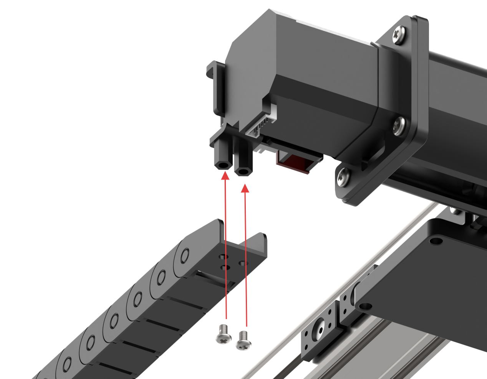

- **Step 2: Install the Motor Fixing Cover**

Attach the motor fixing cover to the sliding rail using **two M3\*6 pan head machine screws**.

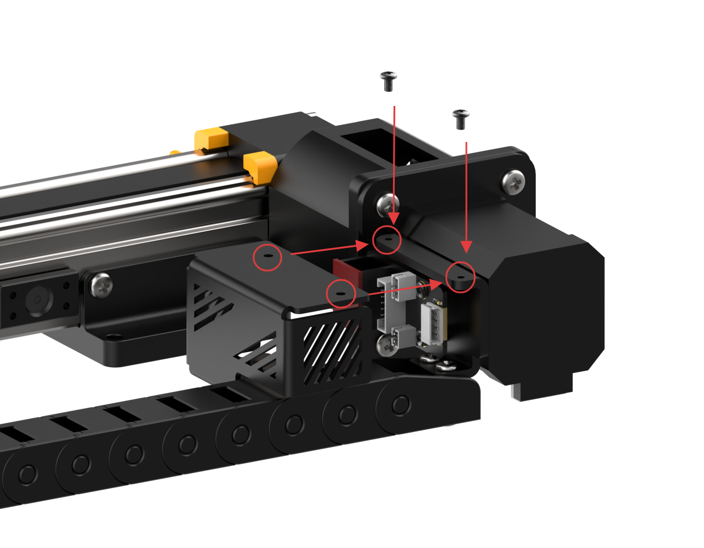

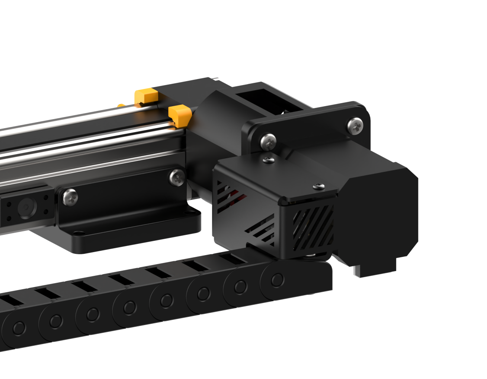

- **Step 3: Install the Sliding Rail Base Plate**

Secure the base plate to the sliding rail using **four M5\*12 countersunk machine screws** and **four nylon spacers (5.2\*7\*4 mm)**.

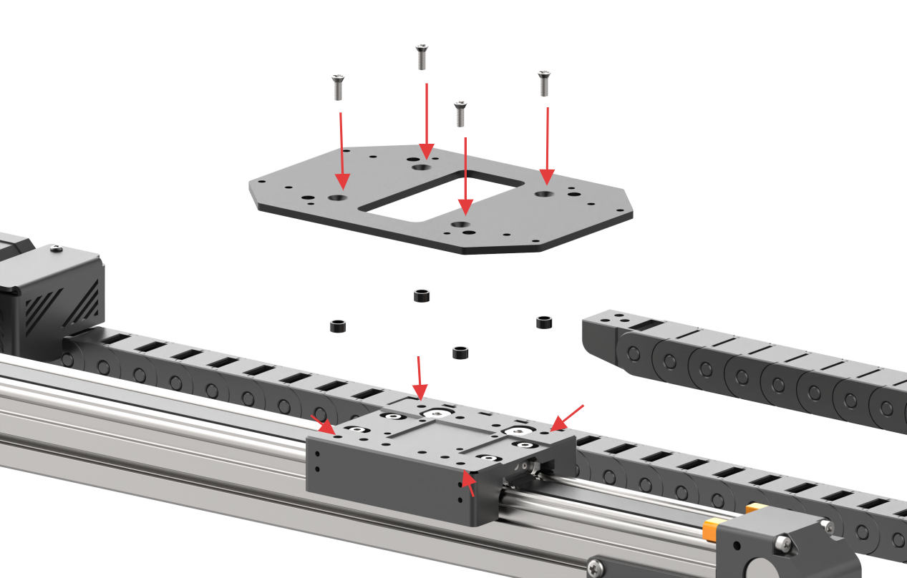

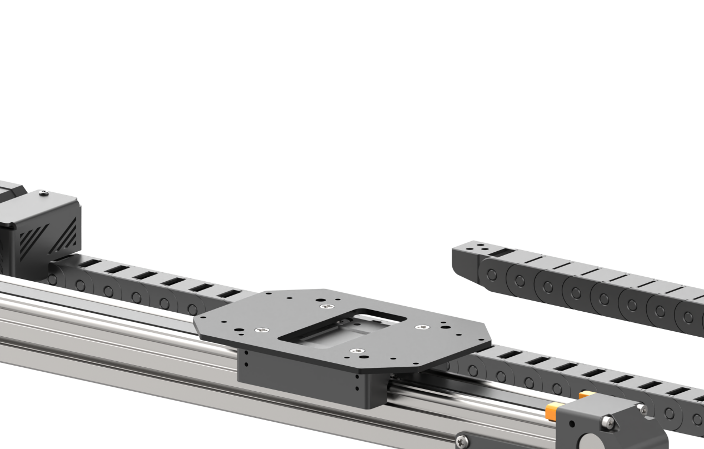

- **Step 4: Install the Sliding Rail Adapter Bracket**

Mount the adapter bracket onto the JetArm base plate using **two M4\*8 pan head machine screws**. Then, attach **two M3\*15 double-pass brass standoffs** to the JetArm adapter plate using **two M3\*6 pan head machine screws**.

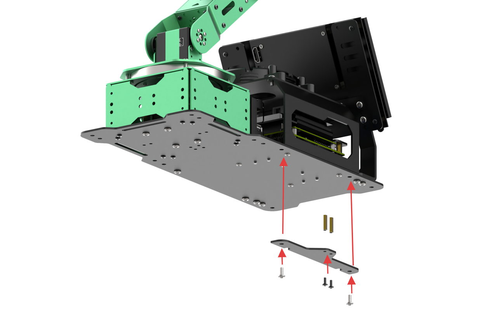

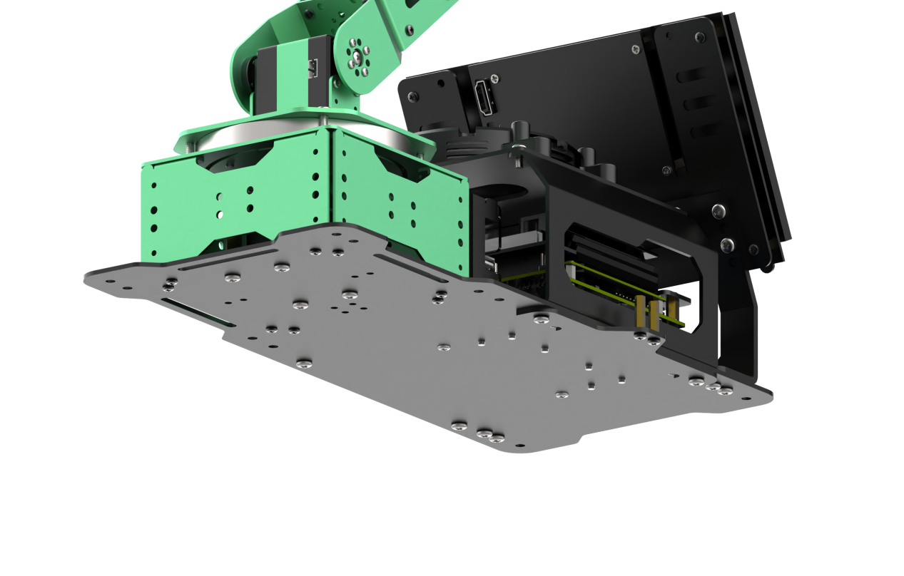

- **Step 5: Install the Robotic Arm**

Mount the robotic arm onto the sliding rail base plate using **four M3\*10 pan head machine screws**.

::: {Note} 
Before this step, remove the pre-installed M3*6 screws from the robotic arm. 
:::

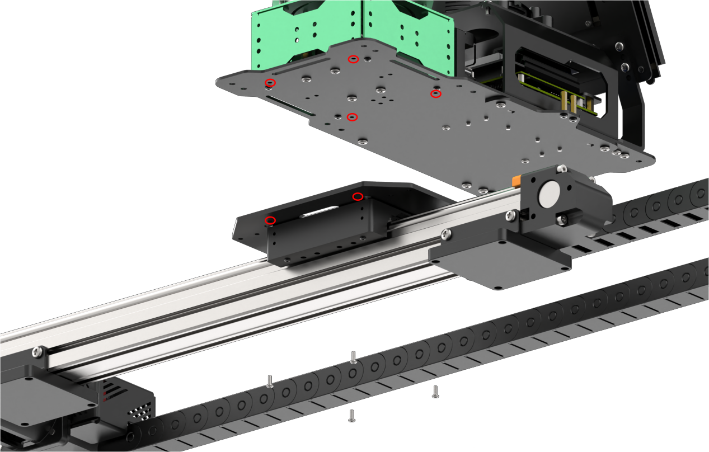

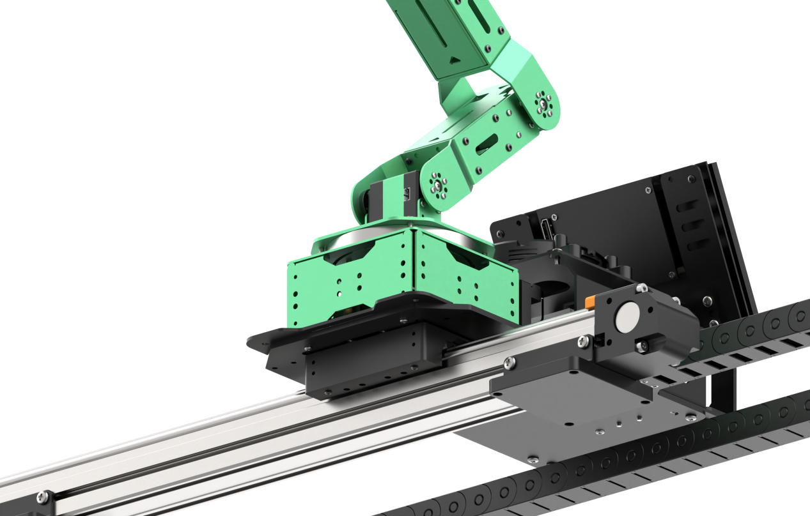

- **Step 6: Attach the Tank Track to the Robotic Arm**

Use **two M3\*6 pan head machine screws** to secure the tank track assembly to the JetArm robotic arm.

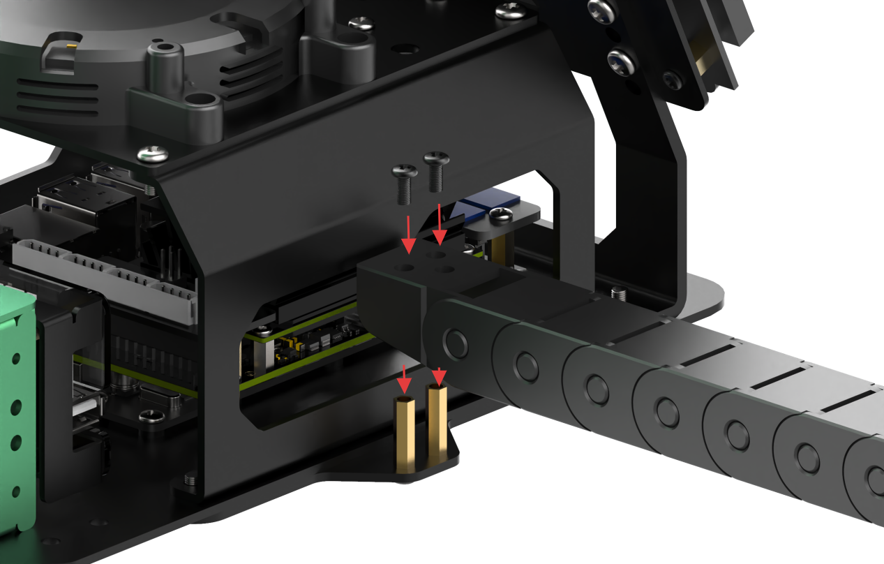

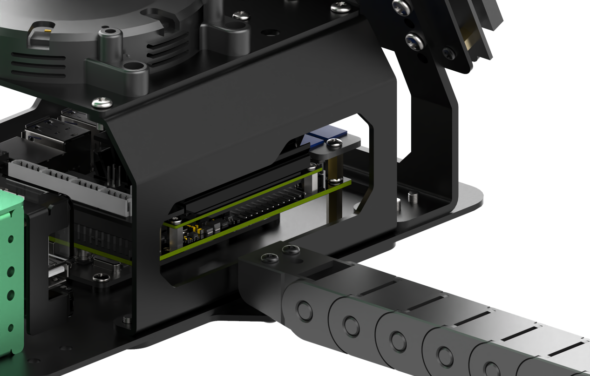

- **Step 7: Final Assembly and Wiring Instructions**

Once fully assembled, the setup should appear as shown in the diagram below.


Connect the 3-pin cable from the sliding rail to the 3-pin terminal on the STM32 expansion board for power supply. Connect the 4-pin cable from the sliding rail to the IIC interface on the Jetson Nano expansion board. As shown in the figure below:

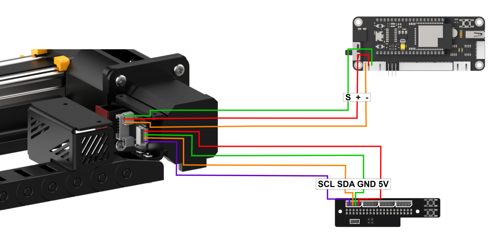

## 20.2 Selecting the Robot Type

JetArm's expansion accessories come in four types: tank chassis, Mecanum wheel chassis, sliding rail, and conveyor belt. After installation, you must switch the device version according to the installed accessory for proper operation.

::: {Note}
If you don't switch or select the wrong version, the motor may run unpredictably, causing malfunctions or even damaging the device. 
:::

Step-by-step instructions:

(1) Power on the robotic arm and connect it to the remote control software NoMachine. For installation and connection of the remote desktop tool, see ["**1.6 Development Environment Setup and Configuration.**"](1.Getting_Ready.md#development-environment-setup-and-configuration)

(2) Double-click the model configuration tool on the desktop. 

(3) Select the appropriate options based on the robotic arm version, camera version, and accessory type:


`Tank` refers to the tracked chassis. `Mecanum` refers to the mecanum wheel chassis. `Slide_Rails` refers to the sliding rail. `Conveyor_Belt` refers to the conveyor belt.

(4) After making your selection, click **"Apply & Save"** to save the configuration.


(5) Click **"Restart Service"** to reload the configuration.


Wait for the buzzer to beep once—this indicates the restart is complete and the new configuration is now active.

## 20.3 Position Calibration

::: {Note} 

* This section applies specifically to the sliding rail configuration. Please ensure the robotic arm is calibrated for mechanical deviations while placed on a flat table before mounting it on the sliding rail.

* Position calibration is the process of converting coordinates from the camera's visual feedback to the real-world coordinates of the robotic arm. Through this calibration, the system can accurately determine the actual distance between the robotic arm and the wooden block, enabling precise operations like sorting and object placement. 

:::

(1) Double-click the desktop icon 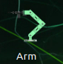 to open the control software, select the action group `stepper_calibration`, then click **"Run Action"**.

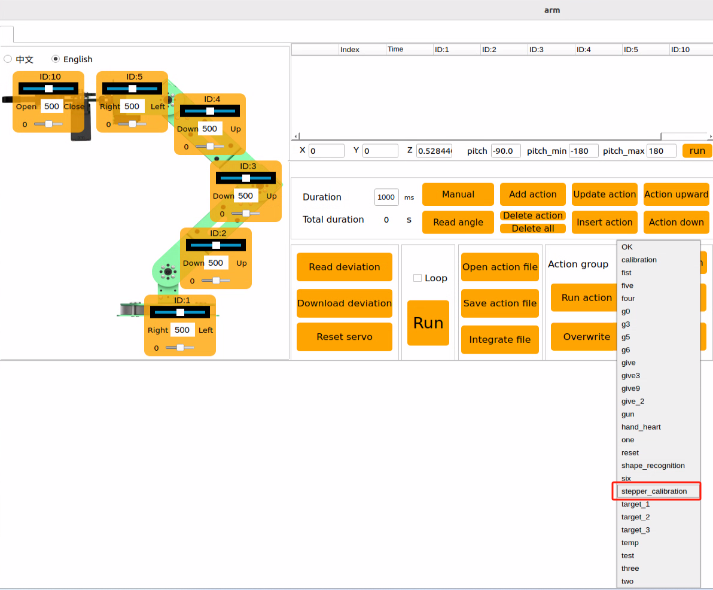

(2) Place the AprilTag with ID 1 at the exact center of the gripper. Ensure the **"TAG36H11-1"** label is facing toward the left side of the robotic arm as shown in the image below. Incorrect tag orientation can result in a misaligned ROI (Region of Interest) for the robotic arm.

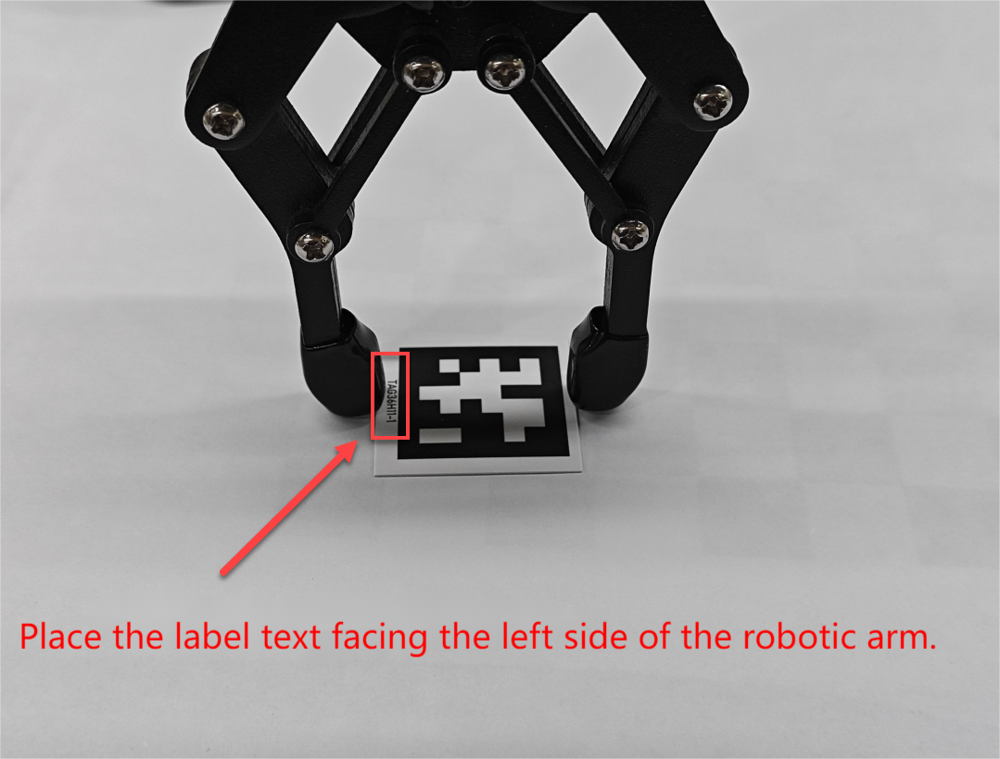

(3) For fine-tuning the robotic arm's gripping behavior, refer to: [Position Adjustment for Object Gripping and Placing - Jetson Orin Nano/NX Controller version](1.Getting_Ready.md#jetson-orin-nanonx-controller-version)

## 20.4 Wireless Controller

### 20.4.1 Getting Started

(1) Before powering on the device, make sure the wireless controller receiver is properly inserted. This can be ignored if the receiver was pre-inserted at the factory.

(2) Pay attention to battery polarity when placing the batteries.


(3) Each time the robot is powered on, the APP auto-start service will launch which includes the wireless handle control service. If this service has not been closed, no additional actions are needed—simply connect and control.

(4) Since wireless handle signals can interfere with each other, it is recommended not to use this function when multiple robots are in the same area, to avoid misconnection or unintended control.

(5) After turning on the wireless handle, if it does not connect to the robot within 30 seconds, or remains unused for 5 minutes after connection, it will enter sleep mode automatically. To wake up the wireless handle and exit sleep mode, press the **"START"** button.

### 20.4.2 Device Connection

(1) After the robot powers on, slide the wireless handle switch to the **"ON"** position. At this point, the red and green LED indicators on the wireless handle will start flashing simultaneously.

(2) Wait a few seconds for the robot and wireless handle to pair automatically. Once pairing is successful, the green LED will remain solid while the red LED turns off.


### 20.4.3 Control Modes

The wireless handle supports two control modes: Coordinate Mode and Single Servo Mode. After a successful connection, the default mode is Coordinate Mode.

- **Single Servo Mode: In this mode, the wireless handle buttons can be used to control the forward and reverse rotation of individual servos on the robotic arm.**


Button Functions in Single Servo Mode:

| **Button**          | **Function (from the robotic arm's first-person perspective)** |
| ------------------- | ------------------------------------------------------------ |
| START               | Reset the robotic arm                                        |
| SELECT+START        | Switch control mode (Single Servo / Coordinate)              |
| UP / ↑              | Raise Servo 2                                                |
| DOWN / ↓            | Lower Servo 2                                                |
| LEFT / ←            | Rotate Servo 1 to the left                                   |
| RIGHT / →           | Rotate Servo 1 to the right                                  |
| Y                   | Close the gripper (Servo 10)                                 |
| A                   | Open the gripper (Servo 10)                                  |
| B                   | Rotate Servo 5 to the right (Gripper turns right)            |
| X                   | Rotate Servo 5 to the left (Gripper turns left)              |
| L1                  | Raise Servo 3                                                |
| L2                  | Lower Servo 3                                                |
| R1                  | Raise Servo 4                                                |
| R2                  | Lower Servo 4                                                |
| Left Joystick LEFT  | Move the sliding rail to the left                            |
| Left Joystick RIGHT | Move the sliding rail to the right                           |

- **Coordinate Mode: In Coordinate Mode, the robotic arm moves as a whole along the X, Y, and Z axes and can also adjust its tilt angle based on button inputs.**


Switching Between Modes: To switch between modes, press both **SELECT** and **START** buttons. A sound prompt indicates the switch was successful.

(1) Two beeps: Switched from Single Servo Mode to Coordinate Mode.

(2) Two beeps: Switched from Single Servo Mode to Coordinate Mode.

Button Functions in Coordinate Mode:

| **Button**          | **Function (from the robotic arm's first-person perspective)** |
| ------------------- | ------------------------------------------------------------ |
| START               | Reset the robotic arm                                        |
| SELECT+START        | Switch control mode (Single Servo / Coordinate)              |
| UP / ↑              | Move arm in the positive X direction (forward)               |
| DOWN / ↓            | Move arm in the negative X direction (backward)              |
| LEFT / ←            | Move arm in the positive Y direction (left)                  |
| RIGHT / →           | Move arm in the negative Y direction (right)                 |
| Y                   | Close the gripper (Servo 10)                                 |
| A                   | Open the gripper (Servo 10)                                  |
| B                   | Rotate Servo 5 to the right (Gripper turns right)            |
| X                   | Rotate Servo 5 to the left (Gripper turns left)              |
| L1                  | Move arm upward along Z axis                                 |
| L2                  | Move arm downward along Z axis                               |
| R1                  | Increase gripper pitch angle                                 |
| R2                  | Decrease gripper pitch angle                                 |
| Left Joystick LEFT  | Move the sliding rail to the left                            |
| Left Joystick RIGHT | Move the sliding rail to the right                           |

## 20.5 Color Sorting

### 20.5.1 Working Principle

In this experiment, the camera uses OpenCV algorithms to detect color blocks of a target color and calculates the center position of each block. Next, an inverse kinematics algorithm is applied to compute the pulse widths for the robotic arm's servos, enabling the arm to grasp the target color block. Finally, the sliding rail moves to the designated drop-off location based on the color of the block, and the arm performs a placing action to complete the sorting process.

### 20.5.2 Enabling and Disabling the Feature

::: {Note} 
When entering commands, be sure to use correct case and spacing. You can use the Tab key to auto-complete keywords. 
:::

(1) Refer to ["**1.6 Development Environment Setup and Configuration**"](1.Getting_Ready.md#development-environment-setup-and-configuration) to establish a connection between the robotic arm and the remote desktop tool.

(2) Double-click 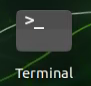 to launch the command bar, enter the command, and press Enter to disable the auto-start service.

```
~/.stop_ros.sh
```

(3) Enter the following command and press Enter to enable color sorting feature.

```
ros2 launch stepper color_sorting.launch.py
```

(4) To stop the program, press **Ctrl + C** in the terminal window. If the program does not stop immediately, repeat this step until it terminates.

(5) After completing the feature, you need to start the APP service . Otherwise, future APP features may not function properly. In the terminal, enter the command and press Enter to start the APP service.

```
sudo systemctl start start_app_node.service
```

(6) Once the APP service is successfully started, the robotic arm will return to its initial pose, and the buzzer will beep once.

### 20.5.3 Project Outcome

After starting the program, place the target color blocks within the robotic arm's visual recognition area. The robotic arm will detect and pick up each color block one by one, then place them in the corresponding locations. In this setup, we use three color-marked boxes—red, green, and blue—as designated drop-off points for the red, green, and blue blocks respectively.

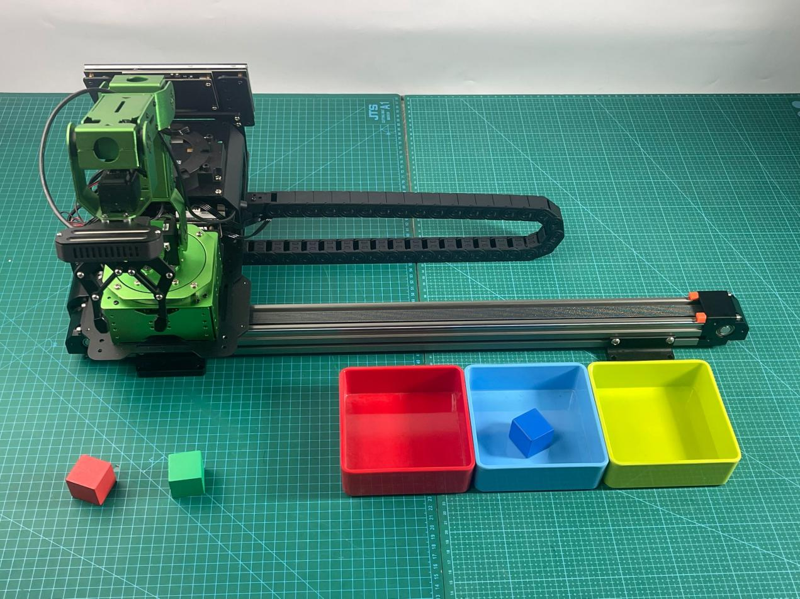

### 20.5.4 Functional Package Structure and Program Analysis

- **Functional Package Structure Analysis**

When using the color block sorting feature, the recognition program's functional package is called. Its file structure is shown below:

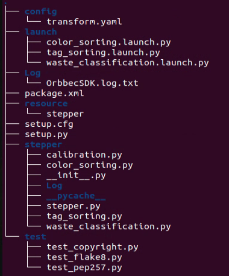

(1) `launch` folder: Contains launch files used to start the tag sorting program and initiate the sorting functionality.

(2) `stepper` folder: Contains source code files for the tag sorting program, implementing the core sorting logic functions.

(3) `CMakeLists.txt`: Manages build dependencies for the package and includes format information needed after launching ROS services.

(4) `package.xml`: The package description file, which details the package's contents such as build tools and version information.

- **Program Brief Analysis**

(1) Launch File Analysis

The launch files are located at: [~/ros2_ws/src/stepper/launch/color_sorting.launch.py](../_static/source_code/stepper.zip)

① `launch_setup` Function:

{lineno-start=10}

```python
def launch_setup(context):
  compiled = os.environ['need_compile']
  if compiled == 'True':
      sdk_package_path = get_package_share_directory('sdk')
      peripherals_package_path = get_package_share_directory('peripherals')
  else:
      sdk_package_path = '/home/ubuntu/ros2_ws/src/driver/sdk'
      peripherals_package_path = '/home/ubuntu/ros2_ws/src/peripherals'

  depth_camera_launch = IncludeLaunchDescription(
      PythonLaunchDescriptionSource(
          os.path.join(peripherals_package_path, 'launch/depth_camera.launch.py')),
  )

  sdk_launch = IncludeLaunchDescription(
      PythonLaunchDescriptionSource(
          os.path.join(sdk_package_path, 'launch/jetarm_sdk.launch.py')),
  )
  
  color_sorting_node = Node(
      package='stepper',
      executable='color_sorting',
      output='screen',
  )

  return [
          sdk_launch,
          depth_camera_launch,
          color_sorting_node,
          ]
```

- Environment Variables

The program first reads the environment variable `need_compile` via `os.environ['need_compile']` to determine whether the package needs to be compiled. If the value is **"True"**, the program uses `get_package_share_directory('sdk')` and `get_package_share_directory('peripherals')` to get the shared directory paths of the precompiled `SDK` and `peripherals` packages.

- Path Setup:

If `need_compile` is **"True"**, the paths are obtained using `ROS` utility functions, otherwise, hard-coded paths are used directly.

- Launch Description:

`depth_camera_launch` and `sdk_launch` are launch files included via `IncludeLaunchDescription`. They respectively load the launch configurations for the depth camera and the `SDK`. The `PythonLaunchDescriptionSource` specifies the file paths of the launch files to be executed.

- Node Configuration:

`color_sorting_node` is a node configuration that specifies the package `stepper`, the executable `color_sorting`, and sets the output to the screen.

- Return Launch Description:

The `launch_setup` function returns a list containing `sdk_launch`, `depth_camera_launch`, and `color_sorting_node`, which together start the depth camera and the color sorting node.

② Explanation of `launch_setup` and `main` Functions:

{lineno-start=41}

```python
def generate_launch_description():
  return LaunchDescription([
      OpaqueFunction(function = launch_setup)
  ])

if __name__ == '__main__':
  # Create a LaunchDescription object. 创建一个LaunchDescription对象
  ld = generate_launch_description()

  ls = LaunchService()
  ls.include_launch_description(ld)
  ls.run()
```

The function `generate_launch_description` returns a `LaunchDescription` object. It uses `OpaqueFunction` to wrap the `launch_setup` function, allowing the launch description to be dynamically created at runtime.

Inside the `if __name__ == '__main__':` block, `generate_launch_description()` is called first to generate the launch description, and a `LaunchService` object is then created. Finally, the launch description is included and run through the `LaunchService`. This code acts as the program's entry point, ensuring that when the script is run independently, all configurations and startup procedures are executed properly.

(2) Source File Analysis

Python files locate at: [~/ros2_ws/src/stepper/stepper/color_sorting.py](../_static/source_code/stepper.zip)

① Import the necessary libraries

{lineno-start=5}

```python
import os
import cv2
import yaml
import time
import math
import queue
import rclpy
import threading
import numpy as np
from sdk import common
from rclpy.node import Node
from cv_bridge import CvBridge
from stepper import stepper as Stepper
from interfaces.srv import SetStringBool
from std_srvs.srv import Trigger, SetBool
from sensor_msgs.msg import Image, CameraInfo
from rclpy.executors import MultiThreadedExecutor
from servo_controller_msgs.msg import ServosPosition
from rclpy.callback_groups import ReentrantCallbackGroup
from kinematics.kinematics_control import set_pose_target
from kinematics_msgs.srv import GetRobotPose, SetRobotPose
from servo_controller.bus_servo_control import set_servo_position
from app.utils import calculate_grasp_yaw, position_change_detect, pick_and_place, image_process, distortion_inverse_map
```

* `os`: Provides operating system interaction functions, such as file system operations and environment variable management, commonly used for handling file paths.

* `cv2`: Python interface for `OpenCV`, a computer vision library specializing in image processing tasks like reading, manipulating, displaying, and saving images.

* `yaml`: Parses `YAML` format configuration files, facilitating easy storage and retrieval of configuration data. `YAML` is a human-readable data serialization standard.

* `time`: Provides time-related functions such as getting the current time and implementing delays.

* `math`: Offers a variety of mathematical functions including trigonometric operations, logarithms, and other numeric computations.

* `queue`: Implements thread-safe queues, useful for communication between threads.

* `rclpy`: `ROS2`'s Python client library that provides interfaces for creating `ROS2` nodes, message communication, and related `ROS2` functionalities.

* `threading`: Supports multithreading, enabling concurrent execution of multiple threads to improve program efficiency.

* `numpy`: A powerful numerical computation library supporting multi-dimensional arrays and matrices, along with a wide range of mathematical functions.

* `rclpy.node.Node`: The base class for `ROS2` nodes in Python, providing core functionality such as publishing and subscribing to messages.

* `sdk.common` and `sdk.fps`: Modules from the robotic arm `SDK` (Software Development Kit).

* `cv_bridge`: A bridge library between `ROS` image messages and `OpenCV` image formats, facilitating seamless image processing within `ROS`.

* `stepper`: Module for controlling stepper motors, typically used for motion control in robots or robotic arms.

* `interfaces.srv.SetStringBool` and `std_srvs.srv.Trigger`, `SetBool`: `SetStringBool`: A `ROS2` service interface used to set a combination of a string and a boolean value. `Trigger`: A standard `ROS2` service to request the triggering of a certain action without parameters. `SetBool`: A standard `ROS2` service to set a boolean value.

* `sensor_msgs.msg.Image` and `CameraInfo`: Message types used for handling images and camera information, `Image` contains image data and `CameraInfo` contains relevant camera parameters.

* `rclpy.executors.MultiThreadedExecutor`: A `ROS2` executor supporting multithreading, allowing multiple nodes to run concurrently to improve system parallelism.

* `servo_controller_msgs.msg.ServosPosition`: Message type used to control servo motor positions, typically for servo control.

* `rclpy.callback_groups.ReentrantCallbackGroup`: A callback group type that supports reentrant callbacks, allowing new callbacks to be accepted and processed even when a previous callback is still executing—ideal for high-concurrency scenarios.

* `kinematics.kinematics_control.set_pose_target`: Function to set the robot's target pose of position and orientation, based on kinematics calculations.

* `kinematics_msgs.srv.GetRobotPose` and `SetRobotPose`: Service interfaces used to get and set the robot's pose information.

* `servo_controller.bus_servo_control.set_servo_position`: Function to set servo motor positions, primarily used for controlling robotic grasping or movement.

② Target Position Specification

{lineno-start=29}

```python
TARGET_POSITION = {
  'red': (2600),
  'green': (4000),
  'blue': (5200),
}
```

This is a dictionary used to store target positions for different colors, such as red, green, and blue. This structure simplifies quickly locating the corresponding position based on color during the robot's tasks. Sliding rail position range is from 0 (leftmost end) to 5200 (rightmost end).

③ `__init__` Function:

{lineno-start=37}

```python
  def __init__(self, name):
      rclpy.init()
      super().__init__(name, allow_undeclared_parameters=True, automatically_declare_parameters_from_overrides=True)

      self.K = None
      self.D = None
      self.lock = threading.RLock()
      self.image_queue = queue.Queue(maxsize=2)
      self.bridge = CvBridge()  # Used for the conversion between ROS Image messages and OpenCV images. 用于ROS Image消息与OpenCV图像之间的转换
      self.imgpts = None
      self.tag_size = 0.025
      self.center_imgpts = None
      self.roi = None
      self.count_move = 0
      self.count_still = 0
      self.target_miss_count = 0
      self.white_area_width = 0.167
      self.white_area_height = 0.13
      self.calibration_file = 'calibration.yaml'
      self.config_file = 'transform.yaml'
      self.config_path = "/home/ubuntu/ros2_ws/src/stepper/config/"
      self.data = common.get_yaml_data("/home/ubuntu/ros2_ws/src/app/config/lab_config.yaml")
      self.lab_data = self.data['/**']['ros__parameters']
      self.camera_type = os.environ['CAMERA_TYPE']
      self.min_area = 500
      self.max_area = 7000
      self.target = None
      self.last_position = None
      self.start_transport = False
      self.stepper = Stepper.Stepper(7)
      self.stepper.set_mode(self.stepper.EN) # Set the slide rail enable 设置滑轨使能
    
      self.image_sub = None
      self.camera_info_sub = None
      self.joints_pub = self.create_publisher(ServosPosition, '/servo_controller', 1)
      self.image_sub = self.create_subscription(Image, '/depth_cam/rgb/image_raw', self.image_callback, 1)
      self.camera_info_sub = self.create_subscription(CameraInfo, '/depth_cam/rgb/camera_info', self.camera_info_callback, 1)

      self.timer_cb_group = ReentrantCallbackGroup()
      self.client = self.create_client(Trigger, '/controller_manager/init_finish', callback_group=self.timer_cb_group)
      self.client.wait_for_service()
      self.get_current_pose_client = self.create_client(GetRobotPose, '/kinematics/get_current_pose', callback_group=self.timer_cb_group)
      self.get_current_pose_client.wait_for_service()
      self.kinematics_client = self.create_client(SetRobotPose, '/kinematics/set_pose_target', callback_group=self.timer_cb_group)
      self.kinematics_client.wait_for_service()
      
      self.timer = self.create_timer(0.0, self.init_process, callback_group=self.timer_cb_group)
```

This code initializes a `ROS 2` node, sets up image processing subscriptions and publications, configures stepper motor control, and prepares service clients for robot kinematics. It loads color range parameters from a `LAB` color space configuration file, creates an image queue for buffer management, and uses multithreading to allow the main logic to run in parallel, enabling coordinated image processing and motion control.

④  `camera_info_callback` Function: 

{lineno-start=91}

```python
  def camera_info_callback(self, msg):
      K = np.matrix(msg.k).reshape(1, -1, 3)
      D = np.array(msg.d)
      new_K, roi = cv2.getOptimalNewCameraMatrix(K, D, (640, 480), 0, (640, 480))
      self.K, self.D = np.matrix(new_K), np.zeros((5, 1))
```

This is a callback function designed to process configuration information from the camera, specifically from `CameraInfo` messages. It parses the camera's intrinsic parameters and distortion coefficients, then uses `OpenCV`'s `getOptimalNewCameraMatrix` function to calculate an optimized camera matrix, helping to remove distortion for subsequent image processing.

⑤ `adaptive_threshold` Function: 

{lineno-start=98}

```python
  def adaptive_threshold(self, gray_image):
      # The adaptive threshold is used for segmentation first to filter out the sides. 用自适应阈值先进行分割, 过滤掉侧面
      # cv2.ADAPTIVE_THRESH_MEAN_C： The weight values of all pixel points in the neighborhood are consistent. 邻域所有像素点的权重值是一致的
      # cv2.ADAPTIVE_THRESH_GAUSSIAN _C ： It is related to the distance from each pixel point in the neighborhood to the center point, and the weight values of each point are obtained through the Gaussian equation. 与邻域各个像素点到中心点的距离有关，通过高斯方程得到各个点的权重值
      binary = cv2.adaptiveThreshold(gray_image, 255, cv2.ADAPTIVE_THRESH_GAUSSIAN_C, cv2.THRESH_BINARY, 41, 7)
      return binary
```

Used to apply adaptive thresholding on a grayscale image. Using a Gaussian-weighted adaptive thresholding method, it performs binary segmentation that works effectively under uneven lighting conditions to separate the foreground from the background.

⑥ `canny_proc` Function:

{lineno-start=105}

```python
  def canny_proc(self, bgr_image):
      # Edge extraction is used for further segmentation when two objects of the same color are placed close together, they can only be distinguished by the edge. 边缘提取，用来进一步分割(当两个相同颜色物体靠在一起时，只能靠边缘去区分)
      mask = cv2.Canny(bgr_image, 9, 41, 9, L2gradient=True)
      mask = 255 - cv2.dilate(mask, cv2.getStructuringElement(cv2.MORPH_RECT, (11, 11)))  # Thicken the boundary and reverse the black and white. 加粗边界，黑白反转
      return mask
```

Primarily used for edge extraction on input images. It uses the Canny edge detection algorithm to identify edges, then applies dilation to thicken the boundaries, and finally inverts the black and white regions. This is especially useful for separating adjacent objects of the same color.

⑦ `get_top_surface` Function: 

{lineno-start=111}

```python
  def get_top_surface(self, rgb_image):
      # In order to extract only the topmost surface of the object. 为了只提取物体最上层表面
      # Convert the image to the HSV color space. 将图像转换到HSV颜色空间
      image_scale = cv2.convertScaleAbs(rgb_image, alpha=2.5, beta=0)
      image_gray = cv2.cvtColor(image_scale, cv2.COLOR_RGB2GRAY)
      image_mb = cv2.medianBlur(image_gray, 3)  # Median filtering 中值滤波
      image_gs = cv2.GaussianBlur(image_mb, (5, 5), 5)  # Gaussian blur denoising 高斯模糊去噪
      binary = self.adaptive_threshold(image_gs)  # Threshold adaptation 阈值自适应
      mask = self.canny_proc(image_gs)  # Edge detection 边缘检测
      mask1 = cv2.bitwise_and(binary, mask)  # Merge the two extracted images and retain their common parts. 合并两个提取出来的图像，保留他们共有的地方
      roi_image_mask = cv2.bitwise_and(rgb_image, rgb_image, mask=mask1)  # Mask the original image to retain the areas that need to be identified. 和原图做遮罩，保留需要识别的区域
      return roi_image_mask
```

Mainly used to process the input RGB image to extract the top surface of the object. It enhances contrast by scaling the image, converts it to grayscale, applies median filtering and Gaussian blur to reduce noise, and then uses a combination of adaptive thresholding and edge detection to create a mask containing only the target area.

⑧ `image_callback` Function:

{lineno-start=124}

```python
  def image_callback(self, ros_image):
      # Convert ros format images to opencv format. 将ros格式图像转换为opencv格式
      cv_image = self.bridge.imgmsg_to_cv2(ros_image, "rgb8")
      rgb_image = np.array(cv_image, dtype=np.uint8)
      if self.image_queue.full():
          # # If the queue is full, discard the oldest image.  如果队列已满，丢弃最旧的图像
          self.image_queue.get()
      # # Put the image into the queue. 将图像放入队列
      self.image_queue.put(rgb_image)
```

A callback function typically used to handle image messages received from the camera topic. It converts `ROS` image messages to `OpenCV` format and stores them in a buffer queue. If the queue is full, the oldest images are automatically discarded to ensure efficient memory use.

⑨`init_process` Function:

{lineno-start=135}

```python
  def init_process(self):
      self.timer.cancel()
      self.stepper.go_home()
      set_servo_position(self.joints_pub, 1.0, ( (1, 500),(2, 520), (3, 210), (4, 50), (5, 500), (10, 200)))  # Set the initial position of the robotic arm. 设置机械臂初始位置
      time.sleep(1.5)
      threading.Thread(target=self.main, daemon=True).start()
      threading.Thread(target=self.transport_thread, daemon=True).start()
      with open(self.config_path + self.config_file, 'r') as f:
          config = yaml.safe_load(f)

          # Convert to numpy array. 转换为 numpy 数组
          corners = np.array(config['corners']).reshape(-1, 3)
          extristric = np.array(config['extristric'])
          white_area_pose_world = np.array(config['white_area_pose_world'])


      self.white_area_center = white_area_pose_world.reshape(4, 4)
      tvec = extristric[:1]  # Take the first row. 取第一行
      rmat = extristric[1:]  # Take the last three rows. 取后面三行
      while self.K is None or self.D is None:
          time.sleep(0.5)

      center_imgpts, jac = cv2.projectPoints(corners[-1:], np.array(rmat), np.array(tvec), self.K, self.D)
      self.center_imgpts = np.int32(center_imgpts).reshape(2)

      tvec, rmat = common.extristric_plane_shift(np.array(tvec).reshape((3, 1)), np.array(rmat), 0.03)
      self.extristric = tvec, rmat
      tvec, rmat = common.extristric_plane_shift(np.array(tvec).reshape((3, 1)), np.array(rmat), 0.0)
      imgpts, jac = cv2.projectPoints(corners[:-1], np.array(rmat), np.array(tvec), self.K, self.D)
      self.imgpts = np.int32(imgpts).reshape(-1, 2)
      # 裁切出ROI区域
      x_min = min(self.imgpts, key=lambda p: p[0])[0] # The minimum value of the X-axis. x轴最小值
      x_max = max(self.imgpts, key=lambda p: p[0])[0] # The maximum value of the X-axis. x轴最大值
      y_min = min(self.imgpts, key=lambda p: p[1])[1] # The minimum value of the Y-axis. y轴最小值
      y_max = max(self.imgpts, key=lambda p: p[1])[1] # The maximum value of the Y-axis. y轴最大值
      roi = np.maximum(np.array([y_min, y_max, x_min, x_max]), 0)
      self.roi = roi
```

A system initialization function. It first cancels the timer, then sequentially executes sliding rail homing, sets the robot arm to its initial position, loads configuration files to calculate the white region baseline and ROI area, and finally starts the main processing and transport threads to complete the system setup.

⑩ `image_processing` function: 

{lineno-start=173}

```python
  def image_processing(self):
      rgb_image = self.image_queue.get()
      result_image = np.copy(rgb_image)
      if self.center_imgpts is not None:

          cv2.line(result_image, (self.center_imgpts[0]-10, self.center_imgpts[1]), (self.center_imgpts[0]+10, self.center_imgpts[1]), (255, 255, 0), 2)
          cv2.line(result_image, (self.center_imgpts[0], self.center_imgpts[1]-10), (self.center_imgpts[0], self.center_imgpts[1]+10), (255, 255, 0), 2)
      # Generate a mask for the recognition area. 生成识别区域的遮罩
      target_list = []
      index = 0
      if self.roi is not None  and self.imgpts is not None and not self.start_transport :
          roi_area_mask = np.zeros(shape=(rgb_image.shape[0], rgb_image.shape[1], 1), dtype=np.uint8)
          roi_area_mask = cv2.drawContours(roi_area_mask, [self.imgpts], -1, 255, cv2.FILLED)
          rgb_image = cv2.bitwise_and(rgb_image, rgb_image, mask=roi_area_mask)  # Mask the original image to retain the areas that need to be identified. 和原图做遮罩，保留需要识别的区域
          roi_img = rgb_image[self.roi[0]:self.roi[1], self.roi[2]:self.roi[3]]
          roi_img = self.get_top_surface(roi_img)
          image_lab = cv2.cvtColor(roi_img, cv2.COLOR_RGB2LAB) # Convert to the LAB space. 转换到 LAB 空间
          img_h, img_w = rgb_image.shape[:2]

          for i in ['red', 'green', 'blue']:
              mask = cv2.inRange(image_lab, tuple(self.lab_data['color_range_list'][i]['min']), tuple(self.lab_data['color_range_list'][i]['max']))  # Binarization 二值化

              # Smooth the edges, remove the small pieces, and merge the adjacent pieces. 平滑边缘，去除小块，合并靠近的块
              eroded = cv2.erode(mask, cv2.getStructuringElement(cv2.MORPH_RECT, (3, 3)))
              dilated = cv2.dilate(eroded, cv2.getStructuringElement(cv2.MORPH_RECT, (3, 3)))
              contours = cv2.findContours(dilated, cv2.RETR_EXTERNAL, cv2.CHAIN_APPROX_NONE)[-2]  # Find all contours. 找出所有轮廓
              contours_area = map(lambda c: (math.fabs(cv2.contourArea(c)), c), contours)  # Compute the area of each contour. 计算轮廓面积
              contours = map(lambda a_c: a_c[1], filter(lambda a: self.min_area <= a[0] <= self.max_area, contours_area))
              for c in contours:
                  rect = cv2.minAreaRect(c)  # Get the minimum bounding rectangle. 获取最小外接矩形
                  (center_x, center_y), _ = cv2.minEnclosingCircle(c)
                  center_x, center_y = self.roi[2] + center_x, self.roi[0] + center_y
                  cv2.circle(result_image, (int(center_x), int(center_y)), 8, (0, 0, 0), -1)
                  corners = list(map(lambda p: (self.roi[2] + p[0], self.roi[0] + p[1]), cv2.boxPoints(rect))) # Obtain the four corner points of the smallest circumscribed rectangle and convert them back to the coordinates of the original graph. 获取最小外接矩形的四个角点, 转换回原始图的坐标
                  cv2.drawContours(result_image, [np.intp(corners)], -1, (0, 255, 255), 2, cv2.LINE_AA)  # Draw the rectangular outline. 绘制矩形轮廓
                  index += 1 # Serial number increment. 序号递增
                  angle = int(round(rect[2]))  # Rectangular Angle 矩形角度
                  target_list.append([i, index, (center_x, center_y), (int(rect[1][0]), int(rect[1][1])), angle])
              # Draw the recognition area. 绘制识别区域
              cv2.drawContours(result_image, [self.imgpts], -1, (255, 255, 0), 2, cv2.LINE_AA)
              for p in self.imgpts:
                  cv2.circle(result_image, tuple(p), 8, (255, 0, 0), -1)
              pass

      return target_list, result_image
```

The core image processing function responsible for retrieving images from the queue and performing color detection. It uses `LAB` color space detection within the ROI area, applies morphological processing to smooth edges and remove noise, performs contour detection and area filtering, and finally extracts the target color block information, drawing the detection results on the output image.

⑪ `get_object_world_position` Function:

{lineno-start=219}

```python
  def get_object_world_position(self, position, intrinsic, extristric, white_area_center, height=0.03):
      projection_matrix = np.row_stack((np.column_stack((extristric[1], extristric[0])), np.array([[0, 0, 0, 1]])))
      world_pose = common.pixels_to_world([position], intrinsic, projection_matrix)[0]
      world_pose[0] = -world_pose[0]
      world_pose[1] = -world_pose[1]
      position = white_area_center[:3, 3] + world_pose
      position[2] = height
      
      config_data = common.get_yaml_data(os.path.join(self.config_path, self.calibration_file))
      offset = tuple(config_data['pixel']['offset'])
      scale = tuple(config_data['pixel']['scale'])
      for i in range(3):
          position[i] = position[i] * scale[i]
          position[i] = position[i] + offset[i]
      return position, projection_matrix
```

A core function for converting pixel coordinates to world coordinates. It builds a projection matrix to transform pixel coordinates in the image to positions in the robot's world coordinate system, applies coordinate transformations and sets the target height, and finally performs precision compensation using offset and scaling parameters from calibration files.

⑫ `calculate_pick_grasp_yaw` Function:

{lineno-start=235}

```python
  def calculate_pick_grasp_yaw(self, position, target, target_info, intrinsic, projection_matrix):
      yaw = math.degrees(math.atan2(position[1], position[0]))
      if position[0] < 0 and position[1] < 0:
          yaw = yaw + 180
      elif position[0] < 0 and position[1] > 0:
          yaw = yaw - 180
      # 0.09x0.02
      gripper_size = [common.calculate_pixel_length(0.09, intrinsic, projection_matrix),
                      common.calculate_pixel_length(0.02, intrinsic, projection_matrix)]

      return calculate_grasp_yaw.calculate_gripper_yaw_angle(target, target_info, gripper_size, yaw)
```

It calculates the gripper yaw angle for picking. It computes the base yaw angle based on the target position, adjusts the angle according to the quadrant, and then calls a utility function that incorporates the gripper's size information to calculate the optimal grasping angle. This ensures the robotic arm can stably pick up the target object.

⑬ `calculate_place_grasp_yaw` Function: 

{lineno-start=247}

```python
  def calculate_place_grasp_yaw(self, position, angle=0):
      yaw = math.degrees(math.atan2(position[1], position[0]))
      if position[0] < 0 and position[1] < 0:
          yaw = yaw + 180
      elif position[0] < 0 and position[1] > 0:
          yaw = yaw - 180
      yaw1 = yaw + angle
      if yaw < 0:
          yaw2 = yaw1 + 90
      else:
          yaw2 = yaw1 - 90

      yaw = yaw2
      if abs(yaw1) < abs(yaw2):
          yaw = yaw1
      yaw = 500 + int(yaw / 240 * 1000)

      return yaw
```

It calculates the gripper yaw angle for placing. It determines the yaw angle based on the target position, uses an angle optimization algorithm to select the most suitable placement angle, and then converts this angle into the pulse width value required for servo control, ensuring precise placement operations.

⑭ `transport_thread` Function:

{lineno-start=266}

```python
  def transport_thread(self):
      while True:
          if self.start_transport:
              position, yaw, target = self.transport_info
              if position[0] > 0.22:
                  position[2] += 0.01
              config_data = common.get_yaml_data(os.path.join(self.config_path, self.calibration_file))
              offset = tuple(config_data['kinematics']['offset'])
              scale = tuple(config_data['kinematics']['scale'])
              for i in range(3):
                  position[i] = position[i] * scale[i]
                  position[i] = position[i] + offset[i]

              finish = pick_and_place.pick(position, 80, yaw, 550, 0.02, self.joints_pub, self.kinematics_client)
              if finish:
                  stepper_position = TARGET_POSITION[self.target[0]]
                  self.stepper.goto(stepper_position) # Drive the slide rail to move to the placement position. 驱动滑轨移动到放置位置
                  stepper_time = stepper_position/1000 # Calculate the required time. 计算需要的时间
                  time.sleep(stepper_time)

                  position =  [0.25, 0, 0.015] # Set the placement position. 设置放置位置

                  yaw = self.calculate_place_grasp_yaw(position, 0)
                  config_data = common.get_yaml_data(os.path.join(self.config_path, self.calibration_file))
                  offset = tuple(config_data['kinematics']['offset'])
                  scale = tuple(config_data['kinematics']['scale'])
                  angle = math.degrees(math.atan2(position[1], position[0]))
                  if angle > 45:
                      # self.get_logger().info(f'1:{position}')
                      position = [position[0] * scale[1], position[1] * scale[0], position[2] * scale[2]]
                      position = [position[0] - offset[1], position[1] + offset[0], position[2] + offset[2]]
                  elif angle < -45:
                      # self.get_logger().info(f'2:{position}')
                      position = [position[0] * scale[1], position[1] * scale[0], position[2] * scale[2]]
                      position = [position[0] + offset[1], position[1] - offset[0], position[2] + offset[2]]
                  else:
                      # self.get_logger().info(f'3:{position}')
                      position = [position[0] * scale[0], position[1] * scale[1], position[2] * scale[2]]
                      position = [position[0] + offset[0], position[1] + offset[1], position[2] + offset[2]]

                  # self.get_logger().info(f'{position}')
                  finish = pick_and_place.place(position, 80, yaw, 200, self.joints_pub, self.kinematics_client)
                  if finish:
                      set_servo_position(self.joints_pub, 1.5, ( (1, 500),(2, 520), (3, 210), (4, 50), (5, 500), (10, 200)))  # 设置机械臂初始位置
                      time.sleep(1.5)
                      stepper_position = TARGET_POSITION[target]
                      self.stepper.goto(-stepper_position) # Drive the slide rail to move to the placement position. 驱动滑轨移动到放置位置
                      stepper_time = stepper_position/1000 # Calculate the required time. 计算需要的时间
                      time.sleep(stepper_time)
                      self.send_request(self.start_yolov8_client, Trigger.Request())
                      self.target = None
                      self.start_transport = False
          else:
              time.sleep(0.1)
```

Transport control thread, responsible for executing the full waste classification. Upon receiving the transport command, `YOLOv8` detection is first stopped to avoid interference. Then, kinematic calibration parameters are applied for position compensation. The `pick_and_place` utility function is used to perform the grasping operation. Next, the sliding rail is driven to the position corresponding to the target trash category to execute the placing operation. Finally, the robotic arm and sliding rail return to their home positions, and `YOLOv8` detection is restarted to prepare for the next operation.

⑮ `main` Function: 

{lineno-start=320}

```python
	    def main(self):
        while True:
            target_list, result_image = self.image_processing()
            if target_list:
                target_miss = True 
                for target in target_list:
                    if self.target is not None :  # If there is already a target, skip the other objects directly. 如果已经有了目标，其他物体就直接跳过
                        if self.target[0] != target[0] or self.target[1] != target[1]:
                            continue
                        else:
                            target_miss = False
                            self.target = target

                    position, projection_matrix = self.get_object_world_position(target[2], self.K, self.extristric, self.white_area_center, 0.03)
                    result = self.calculate_pick_grasp_yaw(position, target, target_list, self.K, projection_matrix)
                    if result is not None and self.target is None:
                            self.target = target
                            break
                    if self.last_position is not None and self.target is not None :
                        e_distance = round(math.sqrt(pow(self.last_position[0] - position[0], 2)) + math.sqrt(pow(self.last_position[1] - position[1], 2)), 5)
                        # self.get_logger().info(f'e_distance: {e_distance}')
                        if e_distance <= 0.003:  # Euclidean distance less than 1mm to prevent grasping while the object is still moving. 欧式距离小于1mm, 防止物体还在移动时就去夹取了
                            cv2.line(result_image, result[1][0], result[1][1], (255, 255, 0), 2, cv2.LINE_AA)
                            self.count_move = 0
                            self.count_still += 1
                        else:
                            self.count_move += 1
                            self.count_still = 0

                        if self.count_move > 10:
                            self.target = None
                        if self.count_still > 20:
                            self.count_still = 0
                            self.count_move = 0
                            self.target = target
                            yaw = 500 + int(result[0] / 240 * 1000)
                            self.transport_info = [position, yaw, target]
                            self.start_transport = True
                    self.last_position = position
                if target_miss:
                    self.target_miss_count += 1
                if self.target_miss_count > 10:
                    self.target_miss_count = 0
                    self.target = None
            if result_image is not None :
                result_image = cv2.cvtColor(result_image, cv2.COLOR_BGR2RGB)
                cv2.imshow('result_image', result_image)
                key = cv2.waitKey(1)

```

The main processing loop function. Continuously monitor for detected objects from `YOLOv8`. When a target is detected, extract its center coordinates and apply angle constraints. Convert the coordinates to world coordinates and perform deviation adjustments. Match the detected object's name to the corresponding waste category. Then stop detection and start the transport thread to execute the pick-and-place task.

⑯ Main Function: 

{lineno-start=369}

```python
	def main():
    node = ColorSortingNode('color_sorting')
    executor = MultiThreadedExecutor()
    executor.add_node(node)
    executor.spin()
    node.destroy_node()
    rclpy.shutdown()
```

The entry point for launching and running the waste classification `ROS2` node. It creates an instance of the `WasteClassificationNode`, uses a `MultiThreadedExecutor` to support multithreaded processing, starts the node, and properly cleans up resources upon termination.

## 20.6 Waste Classification

### 20.6.1 Working Principle

In this section, a trained `YOLOv8` model is used to classify waste blocks through a camera. Then, inverse kinematics is applied to control the robotic arm to grasp the waste block and sort it into the corresponding trash bin.

- **Step 1: Object Detection and Classification**

First, subscribe to the real-time image data published by the camera node and convert the received data into NumPy format. After conversion, the image is processed by the `YOLOv8` network through resizing, transposing, and array expansion to obtain detection results.

The detected image coordinates of the waste cards are then transformed back to the original image coordinates. Based on the detected object name, the waste is categorized according to predefined rules, and the corresponding waste category name is retrieved. Finally, a bounding box is drawn around each piece of waste, and its name and detection confidence are displayed on the screen.

- **Step 2: Grasping and Sorting**

To ensure the reliability of the results, multiple detections are performed to confirm the target object. The waste card with the highest confidence in the image is selected as the primary sorting target. Repeated detections are carried out to verify the object's consistency. Once the target is confirmed, the robotic arm begins the sorting process by converting the target card's pixel coordinates into world coordinates.

The robotic arm is then controlled to move to the location of the waste block and perform the grasping operation. Based on the identified waste category, the sliding rail moves the arm to the designated drop-off position. Finally, the robotic arm places the waste card into the corresponding bin, completing the waste classification task.

### 20.6.2 Enabling and Disabling the Feature

::: {Note}

When entering commands, be sure to use correct case and spacing. You can use the Tab key to auto-complete keywords. 

:::

(1) Refer to ["**1.6 Development Environment Setup and Configuration**"](1.Getting_Ready.md#development-environment-setup-and-configuration) to establish a connection between the robotic arm and the remote desktop tool.

(2) Double-click  to launch the command bar, enter the command, and press Enter to disable the auto-start service.

```
~/.stop_ros.sh
```

(3) Enter the following command and press Enter to enable color sorting feature.

```
ros2 launch stepper waste_classification.launch.py
```

(4) To stop the program, press **Ctrl + C** in the terminal window. If the program does not stop immediately, repeat this step until it terminates.

(5) After completing the feature, you need to start the APP service . Otherwise, future APP features may not function properly. In the terminal, enter the command and press Enter to start the APP service.

```
sudo systemctl start start_app_node.service
```

(6) Once the APP service is successfully started, the robotic arm will return to its initial pose, and the buzzer will beep once.

### 20.6.3 Project Outcome

After the program starts, once the camera detects a waste card, the corresponding category name will be displayed on the screen. Each category is highlighted with a rectangle of a specific color. **Hazardous waste is marked in red, Recyclables in blue, Kitchen waste in green, Other waste in gray**.

The robotic arm will then proceed to pick up the waste block and sort it into the appropriate category. In the example below, waste bins of different colors are used as props to represent each category.


| **Waste Category**                    | **Card**                                    |
| ------------------------------------- | ------------------------------------------- |
| Hazardous Waste (`hazardous_waste`)   | Storage Battery, Marker, Oral Liquid Bottle |
| Recyclable Waste (`recyclable_waste`) | Plastic Bottle, Umbrella, Toothbrush        |
| Food Waste (`food_waste`)             | Banana Peel, Ketchup, Broken Bones          |
| Residual Waste (`residual_waste`)     | Cigarette End, Plate, Disposable Chopsticks |

### 20.6.4 Functional Package Structure and Program Analysis

- **Functional Package Structure Analysis**

When using the waste classification feature, the recognition program's functional package is called. Its file structure is shown below:


(1) `launch` folder: Contains launch files used to start the waste classification program and initiate the sorting functionality.

(2) `stepper` folder: Contains source code files for the waste classification program, implementing the core waste classification logic functions.

(3) `CMakeLists.txt`: Manages build dependencies for the package and includes format information needed after launching ROS services.

(4) `package.xml`: The package description file, which details the package's contents such as build tools and version information.

- **Program Brief Analysis** 

(1) Launch File Analysis

The launch files are located at: `~/ros2_ws/src/stepper/launch/waste_classification.launch.py`

① `launch_setup` Function: The `launch_setup` function configures different package paths based on environment variables and includes other launch description files. It also defines and launches two nodes: one for `YOLOv8` object detection, and another for waste classification. The function returns a list of all launch elements that will be executed when the `ROS2` system starts.

- Determine Compilation Requirement:

{lineno-start=11}

```python
  compiled = os.environ['need_compile']
  if compiled == 'True':
      sdk_package_path = get_package_share_directory('sdk')
      peripherals_package_path = get_package_share_directory('peripherals')
  else:
      sdk_package_path = '/home/ubuntu/ros2_ws/src/driver/sdk'
      peripherals_package_path = '/home/ubuntu/ros2_ws/src/peripherals'
```

Retrieves the value of `need_compile` from the environment variables to determine whether compilation is required.

If `need_compile` is **"True"**, it obtains the paths for the `sdk` and `peripherals` packages using `get_package_share_directory`.

Otherwise, it uses fixed local paths to specify the package locations.

- Include Other Launch Description Files:

{lineno-start=19}

```python
  depth_camera_launch = IncludeLaunchDescription(
      PythonLaunchDescriptionSource(
          os.path.join(peripherals_package_path, 'launch/depth_camera.launch.py')),
  )

  sdk_launch = IncludeLaunchDescription(
      PythonLaunchDescriptionSource(
          os.path.join(sdk_package_path, 'launch/jetarm_sdk.launch.py')),
  )
```

Includes the `depth_camera.launch.py` and `jetarm_sdk.launch.py` launch description files, which are located in the launch directories of the `peripherals` and `sdk` packages, respectively.

- Define the `YOLOv8` node:

{lineno-start=29}

```python
  yolov8_node = Node(
      package='example',
      executable='yolov8_node',
      output='screen',
      parameters=[{'classes': ['BananaPeel','BrokenBones','CigaretteEnd','DisposableChopsticks','Ketchup','Marker','OralLiquidBottle','PlasticBottle','Plate','StorageBattery','Toothbrush', 'Umbrella']},
                  { 'engine': 'garbage_classification_640s.engine', 'lib': 'libmyplugins.so', 'conf': 0.8},]
  )
```

Launch a node named `yolov8_node` located in the `example` package.

`classes`: Specifies the categories of waste to detect.

`engine`: Indicates the engine file used for classification.

`lib`: Specifies the custom plugin library.

`conf`: Sets the confidence threshold to 0.8.

- Define the waste classification node:

{lineno-start=37}

```python
  waste_classification_node = Node(
      package='stepper',
      executable='waste_classification',
      output='screen',
  )
```

Launch a node named `waste_classification` located in the `stepper` package.

This node is responsible for handling the logic of waste sorting.

- Return the launch element list:

{lineno-start=43}

```python
  return [
          sdk_launch,
          depth_camera_launch,
          yolov8_node,
          waste_classification_node,
          ]
```

Combine all launch description files and node definitions into a list to be executed sequentially during the `ROS2` launch process.

② `generate_launch_description` function: {lineno-start=50}

```python
def generate_launch_description():
  return LaunchDescription([
      OpaqueFunction(function = launch_setup)
  ])
```

Creates and returns a `LaunchDescription` object, which defines the actions to execute at launch or includes other launch files. This object is instantiated and run in the main function.

(2) Source Code Analysis

Python files locate at: `~/ros2_ws/src/stepper/stepper/waste_classification.py`

① Import the necessary libraries

{lineno-start=5}

```python
import os
import cv2
import yaml
import time
import copy
import math
import queue
import rclpy
import signal
import threading
import numpy as np
from sdk import common
from rclpy.node import Node
from cv_bridge import CvBridge
from stepper import stepper as Stepper
from interfaces.msg import ObjectsInfo
from interfaces.srv import SetStringList
from std_srvs.srv import Trigger, SetBool
from sensor_msgs.msg import Image, CameraInfo
from rclpy.executors import MultiThreadedExecutor
from servo_controller_msgs.msg import ServosPosition
from rclpy.callback_groups import ReentrantCallbackGroup
from kinematics.kinematics_control import set_pose_target
from kinematics_msgs.srv import GetRobotPose, SetRobotPose
from servo_controller.bus_servo_control import set_servo_position
from app.utils import calculate_grasp_yaw, position_change_detect, pick_and_place, image_process, distortion_inverse_map
```

* `os`: Provides functions to interact with the operating system, such as file and directory operations, and environment variable management.

* `cv2`: The Python interface for the `OpenCV` library, used for image and video processing and analysis.

* `yaml`: Used for parsing and generating `YAML`-formatted data, commonly for reading and writing configuration files.

* `time`: Provides time-related functionality such as retrieving the current time and introducing delays.

* `math`: Offers mathematical functions including trigonometric, logarithmic, and exponential calculations.

* `queue`: Implements thread-safe queues, used for data exchange between threads.

* `rclpy`: The Python client library for `ROS2`, which provides interfaces for interacting with `ROS2` nodes, topics, services, etc.

* `signal`: Provides handling for system signals, such as interrupt signals and termination signals.

* `threading`: Supports multithreaded programming, allowing multiple threads to run concurrently to improve program concurrency and performance.

* `numpy as np`: `NumPy` library offering high-performance multidimensional array objects and a wide range of mathematical functions for scientific computing.

* `from sdk import common`: Imports the `common` module from the `SDK`, which usually contains general-purpose functions and utility tools.

* `from rclpy.node import Node`: Imports the `Node` class from the `rclpy` library, used to create and manage `ROS2` nodes.

* `from cv_bridge import CvBridge`: Imports the `CvBridge` class from the `cv_bridge` package, used for converting between `ROS` image messages and `OpenCV` image formats.

* `from stepper import stepper as Stepper`: Imports the `stepper` class from the `stepper` module and aliases it as `Stepper`, typically used to control stepper motors.

* `from interfaces.msg import ObjectsInfo`: Imports the `ObjectsInfo` message type from the `interfaces` message package, used to transmit object information within `ROS`.

* `from interfaces.srv import SetStringList`: Imports the `SetStringList` service type from the `interfaces` service package, used for service calls that set string lists.

* `from std_srvs.srv import Trigger`, `SetBool`: Imports the `Trigger` and `SetBool` standard service types, used respectively for triggering simple services and setting boolean values.

* `from sensor_msgs.msg import Image`, `CameraInfo`: Imports the `Image` and `CameraInfo` message types from the `sensor_msgs` package, used for transmitting image data and camera information.

* `from rclpy.executors import MultiThreadedExecutor`: Imports `MultiThreadedExecutor` from the `rclpy.executors` module, enabling `ROS2` callbacks to be processed across multiple threads concurrently.

* `from servo_controller_msgs.msg import ServosPosition`: Imports the `ServosPosition` message type from the `servo_controller_msgs` message package, used for transmitting servo motor position data.

* `from rclpy.callback_groups import ReentrantCallbackGroup`: Imports `ReentrantCallbackGroup` from the `rclpy.callback_groups` module, which allows callback functions to be re-entered, improving concurrency.

* `from kinematics.kinematics_control import set_pose_target`: Imports the `set_pose_target` function from the `kinematics` control module, used to set the target pose of the robot's end effector.

* `from kinematics_msgs.srv import GetRobotPose`, `SetRobotPose`: Imports the `GetRobotPose` and `SetRobotPose` service types from the `kinematics` message service package, used for getting and setting the robot's pose.

* `from servo_controller.bus_servo_control import set_servo_position`: Imports the `set_servo_position` function from the `servo` control bus module, used to set the position of servo motors.

② Target Position Specification

{lineno-start=32}

```python
TARGET_POSITION = {
  'recyclable_waste': (5200),
  'hazardous_waste': (4250),
  'food_waste': (3300),
  'residual_waste': (2300)
}
```

This is a dictionary used to store target positions for different wastes. This structure simplifies quickly locating the corresponding position based on color during the robot's tasks. Sliding rail position range is from 0 (leftmost end) to 5200 (rightmost end).

③ Specified Waste Types:

{lineno-start=39}

```python
WASTE_CLASSES = {
  'food_waste': ('BananaPeel', 'BrokenBones', 'Ketchup'),
  'hazardous_waste': ('Marker', 'OralLiquidBottle', 'StorageBattery'),
  'recyclable_waste': ('PlasticBottle', 'Toothbrush', 'Umbrella'),
  'residual_waste': ('Plate', 'CigaretteEnd', 'DisposableChopsticks'),
}
```

This is a dictionary used to store different types of waste. These types are used later in the program to determine the placement location.

④ `__init__` Function:

{lineno-start=50}

```python
  def __init__(self, name):
      rclpy.init()
      super().__init__(name, allow_undeclared_parameters=True, automatically_declare_parameters_from_overrides=True)
      self.running = True
      self.start_get_roi = True
      self.last_position = None
      self.roi = None
      self.imgpts = None
      self.count_move = 0
      self.count_still = 0
      self.last_position = None
      self.extristric = None
      self.intrinsic = None
      self.distortion = None
      self.target = None
      self.start_transport = False
      self.target_object_info = None
      self.stepper = Stepper.Stepper(7)
      self.stepper.set_mode(self.stepper.EN) # Set the slide rail enable. 设置滑轨使能
      self.camera_type = os.environ['CAMERA_TYPE']
      self.calibration_file = 'calibration.yaml'
      self.config_file = 'transform.yaml'
      self.config_path = "/home/ubuntu/ros2_ws/src/stepper/config/"
      self.target_list =['BananaPeel', 'BrokenBones', 'Ketchup', 'Marker', 'OralLiquidBottle', 'StorageBattery', 'PlasticBottle', 'Toothbrush', 'Umbrella', 'Plate', 'CigaretteEnd', 'DisposableChopsticks']

      self.bridge = CvBridge()
      self.joints_pub = self.create_publisher(ServosPosition, '/servo_controller', 1)
      self.camera_info_sub = self.create_subscription(CameraInfo, '/depth_cam/rgb/camera_info', self.camera_info_callback, 1)
      self.image_sub = self.create_subscription(Image, '/yolov8/object_image', self.image_callback, 1)
      self.object_sub = self.create_subscription(ObjectsInfo, '/yolov8/object_detect', self.get_object_callback, 1)

      # Wait for the service to start. 等待服务启动
      self.timer_cb_group = ReentrantCallbackGroup()
      self.client = self.create_client(Trigger, '/controller_manager/init_finish', callback_group=self.timer_cb_group)
      self.client.wait_for_service()
      self.get_current_pose_client = self.create_client(GetRobotPose, '/kinematics/get_current_pose', callback_group=self.timer_cb_group)
      self.get_current_pose_client.wait_for_service()
      self.kinematics_client = self.create_client(SetRobotPose, '/kinematics/set_pose_target', callback_group=self.timer_cb_group)
      self.kinematics_client.wait_for_service()
      self.start_yolov8_client = self.create_client(Trigger, '/yolov8/start', callback_group=self.timer_cb_group)
      self.start_yolov8_client.wait_for_service()
      self.stop_yolov8_client = self.create_client(Trigger, '/yolov8/stop', callback_group=self.timer_cb_group)
      self.stop_yolov8_client.wait_for_service()

      self.timer = self.create_timer(0.0, self.init_process, callback_group=self.timer_cb_group)
```

Initializes a `ROS 2`-based waste classification node. This function sets up status flags, ROI parameters, counters, and other state variables. It initializes the stepper motor controller, reads environment variables and configuration files, creates an image bridge and target list, and establishes `ROS 2` publishers, subscribers, and service clients. Finally, it starts the initialization process via a timer.

⑤ `init_process` Function:

{lineno-start=97}

```python
  def init_process(self):
      self.timer.cancel()
      set_servo_position(self.joints_pub, 1.0, ( (1, 500),(2, 520), (3, 210), (4, 50), (5, 500), (10, 200)))  # Set the initial position of the robotic arm. 设置机械臂初始位置
      time.sleep(1)
      self.stepper.go_home()
      self.send_request(self.start_yolov8_client, Trigger.Request())
      threading.Thread(target=self.main, daemon=True).start()
      threading.Thread(target=self.transport_thread, daemon=True).start()
```

A system initialization function. It first cancels the timer, sets the initial position of the robotic arm, performs the sliding rail homing operation, then starts the `YOLOv8` object detection service. Finally, it launches the main processing thread and the transport thread, completing the preparation of the entire waste classification system.

⑥ `camera_info_callback` Function:

{lineno-start=106}

```python
  def camera_info_callback(self, msg):
      self.intrinsic = np.matrix(msg.k).reshape(1, -1, 3)
      self.distortion = np.array(msg.d)
```

Camera information callback that processes configuration data from the camera. It extracts intrinsic camera parameters and distortion coefficients from the `CameraInfo` message and stores them as class attributes, providing necessary camera parameters for subsequent coordinate transformations and image processing.

⑦ `send_request` Function:

{lineno-start=110}

```python
  def send_request(self, client, msg):
      future = client.call_async(msg)
      while rclpy.ok():
          if future.done() and future.result():
              return future.result()
```

Used to send asynchronous requests to `ROS2` services and wait for their responses. This function simplifies interaction with `ROS2` services by polling the future object status in a loop, ensuring correct reception and return of service response data.

⑧ `image_callback` Function:

{lineno-start=116}

```python
  def image_callback(self, ros_image):
      cv_image = self.bridge.imgmsg_to_cv2(ros_image, "bgr8")
      bgr_image = np.array(cv_image, dtype=np.uint8)
      cv2.drawContours(bgr_image, [self.imgpts], -1, (0, 255, 255), 2, cv2.LINE_AA) # Draw rectangle. 绘制矩形
      cv2.imshow('image', bgr_image)
      cv2.waitKey(1)
```

Image callback that processes image messages received from the `YOLOv8` node. It converts `ROS` image format to `OpenCV` format, draws the ROI boundary on the image, and displays the image window using `OpenCV`, providing real-time visual feedback to the user.

⑨ `get_roi` Function: 

{lineno-start=123}

```python
  def get_roi(self):
      with open(self.config_path + self.config_file, 'r') as f:
          config = yaml.safe_load(f)

          # Convert to numpy array. 转换为 numpy 数组
          extristric = np.array(config['extristric'])
          corners = np.array(config['corners']).reshape(-1, 3)
          self.white_area_center = np.array(config['white_area_pose_world'])
      while True:
          intrinsic = self.intrinsic
          distortion = self.distortion
          if intrinsic is not None and distortion is not None:
              break
          time.sleep(0.1)

      tvec = extristric[:1]  # Take the first row. 取第一行
      rmat = extristric[1:]  # Take the last three rows. 取后面三行

      tvec, rmat = common.extristric_plane_shift(np.array(tvec).reshape((3, 1)), np.array(rmat), 0.04)
      self.extristric = tvec, rmat
      tvec, rmat = common.extristric_plane_shift(np.array(tvec).reshape((3, 1)), np.array(rmat), 0.0)
      imgpts, jac = cv2.projectPoints(corners[:-1], np.array(rmat), np.array(tvec), intrinsic, distortion)
      imgpts = np.int32(imgpts).reshape(-1, 2)
      self.imgpts = imgpts

      # 裁切出ROI区域(crop RIO region)
      x_min = min(imgpts, key=lambda p: p[0])[0] # x轴最小值(the minimum value of X-axis)
      x_max = max(imgpts, key=lambda p: p[0])[0] # x轴最大值(the maximum value of X-axis)
      y_min = min(imgpts, key=lambda p: p[1])[1] # y轴最小值(the minimum value of Y-axis)
      y_max = max(imgpts, key=lambda p: p[1])[1] # y轴最大值(the maximum value of Y-axis)
      roi = np.maximum(np.array([y_min, y_max, x_min, x_max]), 0)
          
      self.roi = roi
```

Retrieves the Region of Interest (ROI). Reads extrinsic parameters, corner points, and white area pose information from configuration files. It waits for the camera intrinsic parameters to be initialized, then uses coordinate transformations and projection calculations to determine the ROI boundary in the image, providing an accurate working area for subsequent object detection.

⑩ `get_object_world_position` Function:

{lineno-start=157}

```python
  def get_object_world_position(self, position, intrinsic, extristric, white_area_center, height=0.03):
      projection_matrix = np.row_stack((np.column_stack((extristric[1], extristric[0])), np.array([[0, 0, 0, 1]])))
      world_pose = common.pixels_to_world([position], intrinsic, projection_matrix)[0]
      world_pose[0] = -world_pose[0]
      world_pose[1] = -world_pose[1]
      position = white_area_center[:3, 3] + world_pose
      position[2] = height
      
      config_data = common.get_yaml_data(os.path.join(self.config_path, self.calibration_file))
      offset = tuple(config_data['pixel']['offset'])
      scale = tuple(config_data['pixel']['scale'])
      for i in range(3):
          position[i] = position[i] * scale[i]
          position[i] = position[i] + offset[i]
      return position, projection_matrix
```

A core function for converting pixel coordinates to world coordinates. By constructing a projection matrix, pixel coordinates in the image are converted into positions in the robot's world coordinate system. Coordinate transformations and height adjustments are applied, and finally, accuracy compensation is performed using offset and scaling parameters from the calibration file to ensure precise grasping positions.

⑪ `calculate_pick_grasp_yaw` Function:

{lineno-start=173}

```python
  def calculate_pick_grasp_yaw(self, position, target, target_info, intrinsic, projection_matrix):
      yaw = math.degrees(math.atan2(position[1], position[0]))
      if position[0] < 0 and position[1] < 0:
          yaw = yaw + 180
      elif position[0] < 0 and position[1] > 0:
          yaw = yaw - 180
      # 0.09x0.02
      gripper_size = [common.calculate_pixel_length(0.09, intrinsic, projection_matrix),
                      common.calculate_pixel_length(0.02, intrinsic, projection_matrix)]

      return calculate_grasp_yaw.calculate_gripper_yaw_angle(target, target_info, gripper_size, yaw)
```

It calculates the gripper yaw angle for picking. It computes the base yaw angle based on the target position, adjusts the angle according to the quadrant, and then calls a utility function that incorporates the gripper's size information to calculate the optimal grasping angle. This ensures the robotic arm can stably pick up the target object.

⑫ `calculate_place_grasp_yaw` Function:

{lineno-start=185}

```python
  def calculate_place_grasp_yaw(self, position, angle=0):
      yaw = math.degrees(math.atan2(position[1], position[0]))
      if position[0] < 0 and position[1] < 0:
          yaw = yaw + 180
      elif position[0] < 0 and position[1] > 0:
          yaw = yaw - 180
      yaw1 = yaw + angle
      if yaw < 0:
          yaw2 = yaw1 + 90
      else:
          yaw2 = yaw1 - 90

      yaw = yaw2
      if abs(yaw1) < abs(yaw2):
          yaw = yaw1
      yaw = 500 + int(yaw / 240 * 1000)

      return yaw
```

It calculates the gripper yaw angle for placing. It determines the yaw angle based on the target position, uses an angle optimization algorithm to select the most suitable placement angle, and then converts this angle into the pulse width value required for servo control, ensuring precise placement operations.

⑬  `transport_thread` Function:

{lineno-start=204}

```python
  def transport_thread(self):
      while True:
          if self.start_transport:
              self.send_request(self.stop_yolov8_client, Trigger.Request())
              position, yaw, target = self.transport_info
              if position[0] > 0.22:
                  position[2] += 0.01
              config_data = common.get_yaml_data(os.path.join(self.config_path, self.calibration_file))
              offset = tuple(config_data['kinematics']['offset'])
              scale = tuple(config_data['kinematics']['scale'])
              for i in range(3):
                  position[i] = position[i] * scale[i]
                  position[i] = position[i] + offset[i]
              # self.get_logger().info(f'pick2:{position}')

              finish = pick_and_place.pick(position, 80, yaw, 500, 0.02, self.joints_pub, self.kinematics_client)
              if finish:
                  set_servo_position(self.joints_pub, 1.0, ( (1, 500),))
                  time.sleep(1.0)
                  stepper_position = TARGET_POSITION[target]
                  self.stepper.goto(stepper_position) # Drive the slide rail to move to the placement position. 驱动滑轨移动到放置位置
                  stepper_time = stepper_position/1000 # Calculate the required time. 计算需要的时间
                  time.sleep(stepper_time)

                  position =  [0.25, 0, 0.02] # Set the placement position. 设置放置位置

                  yaw = self.calculate_place_grasp_yaw(position, 0)
                  config_data = common.get_yaml_data(os.path.join(self.config_path, self.calibration_file))
                  offset = tuple(config_data['kinematics']['offset'])
                  scale = tuple(config_data['kinematics']['scale'])
                  angle = math.degrees(math.atan2(position[1], position[0]))
                  if angle > 45:
                      # self.get_logger().info(f'1:{position}')
                      position = [position[0] * scale[1], position[1] * scale[0], position[2] * scale[2]]
                      position = [position[0] - offset[1], position[1] + offset[0], position[2] + offset[2]]
                  elif angle < -45:
                      # self.get_logger().info(f'2:{position}')
                      position = [position[0] * scale[1], position[1] * scale[0], position[2] * scale[2]]
                      position = [position[0] + offset[1], position[1] - offset[0], position[2] + offset[2]]
                  else:
                      # self.get_logger().info(f'3:{position}')
                      position = [position[0] * scale[0], position[1] * scale[1], position[2] * scale[2]]
                      position = [position[0] + offset[0], position[1] + offset[1], position[2] + offset[2]]

                  # self.get_logger().info(f'{position}')
                  finish = pick_and_place.place(position, 80, yaw, 200, self.joints_pub, self.kinematics_client)
                  if finish:
                      set_servo_position(self.joints_pub, 1.5, ( (1, 500),(2, 520), (3, 210), (4, 50), (5, 500), (10, 200)))  # 设置机械臂初始位置
                      time.sleep(1.5)
                      stepper_position = TARGET_POSITION[target]
                      self.stepper.goto(-stepper_position) # Drive the slide rail to move to the placement position. 驱动滑轨移动到放置位置
                      stepper_time = stepper_position/1000 # Calculate the required time. 计算需要的时间
                      time.sleep(stepper_time)
                      self.send_request(self.start_yolov8_client, Trigger.Request())
                      self.target = None
                      self.start_transport = False
          else:
              time.sleep(0.1)
```

Transport control thread, responsible for executing the full waste classification. Upon receiving the transport command, `YOLOv8` detection is first stopped to avoid interference. Then, kinematic calibration parameters are applied for position compensation. The `pick_and_place` utility function is used to perform the grasping operation. Next, the sliding rail is driven to the position corresponding to the target trash category to execute the placing operation. Finally, the robotic arm and sliding rail return to their home positions, and `YOLOv8` detection is restarted to prepare for the next operation.

⑭ `main` Function:

{lineno-start=263}

```python
  def main(self):
      while self.running:
          if self.start_get_roi:
              self.get_roi()
              self.start_get_roi = False
          roi = self.roi
          if self.target_object_info is not None:
              target_object_info = copy.deepcopy(self.target_object_info)
              center = target_object_info[0][2]
              if self.camera_type == 'USB_CAM':
                  x, y = distortion_inverse_map.undistorted_to_distorted_pixel(center[0], center[1], self.intrinsic, self.distortion)
                  center = (x, y)
              intrinsic = self.intrinsic
              self.target_object_info = None

              if roi[2] < center[0] < roi[3] and roi[0] < center[1] < roi[1]:
                  position, projection_matrix = self.get_object_world_position(target_object_info[0][2], intrinsic, self.extristric, self.white_area_center, 0.04)

                  result = self.calculate_pick_grasp_yaw(position, target_object_info[0], target_object_info[1], intrinsic, projection_matrix)
                  if result is not None:
                      if self.last_position is not None:
                          e_distance = round(math.sqrt(pow(self.last_position[0] - position[0], 2)) + math.sqrt(pow(self.last_position[1] - position[1], 2)), 5)
                          # self.get_logger().info(f'{e_distance}')
                          if e_distance <= 0.002:  # Euclidean distance less than 2mm to prevent grasping while the object is still moving. 欧式距离小于2mm, 防止物体还在移动时就去夹取了
                              self.count_move = 0
                              self.count_still += 1
                          else:
                              self.count_move += 1
                              self.count_still = 0
                          if self.count_move > 10:
                              if target_object_info[0][0] in self.target_list:
                                  self.target_list.remove(target_object_info[0][0])

                          if self.count_still > 10:
                              self.count_still = 0
                              self.count_move = 0
                              for k, v in WASTE_CLASSES.items():
                                  if target_object_info[0][0] in v:
                                      waste_category = k
                                      break
                              yaw = 500 + int(result[0] / 240 * 1000)
                              self.transport_info = [position, yaw, waste_category]
                              # self.get_logger().info(f'{self.transport_info}')
                              self.start_transport = True
                      self.last_position = position
```

The main processing loop function. Continuously monitor for detected objects from `YOLOv8`. When a target is detected, extract its center coordinates and apply angle constraints. Convert the coordinates to world coordinates and perform deviation adjustments. Match the detected object's name to the corresponding waste category. Then stop detection and start the transport thread to execute the pick-and-place task.

⑮ Main Function:

{lineno-start=342}

```python
def main():
  node = WasteClassificationNode('waste_classification')
  executor = MultiThreadedExecutor()
  executor.add_node(node)
  executor.spin()
  node.destroy_node()
  rclpy.shutdown()

if __name__ == "__main__":
  main()
```

The entry point for launching and running the waste classification `ROS2` node. It creates an instance of the `WasteClassificationNode`, uses a `MultiThreadedExecutor` to support multithreaded processing, starts the node, and properly cleans up resources upon termination.

## 20.7 Tag Sorting

### 20.7.1 Working Principle

In this lesson, the system uses a camera to recognize tags and then uses the tag information and its position to control a robotic arm. Based on inverse kinematics calculations, the robotic arm picks up the tagged wooden block and moves it to a designated location via a sliding rail system.

`AprilTag` is a type of visual localization marker, similar to `QR codes` or `barcodes`.

The process begins by subscribing to the camera node to obtain real-time image data. The image is converted from the RGB color space to grayscale, and the camera's intrinsic parameters are retrieved.

Next, the `AprilTag` detection function from the corresponding library is called to process the image. This detects `AprilTags` and retrieves their IDs, the coordinates of the four corner points of each tag, and the coordinates of their center points.

Using the coordinate information from detection, the system calculates the position of each wooden block. Then, inverse kinematics is applied to compute the necessary joint angles for the robotic arm to reach the target position. Finally, the robotic arm performs the pick-up action and the sliding rail transports the wooden block to the position corresponding to the tag ID, where it is placed.

### 20.7.2 Enabling and Disabling the Feature

::: {Note}

When entering commands, be sure to use correct case and spacing. You can use the Tab key to auto-complete keywords.

:::

(1) Refer to ["**1.6. Development Environment Setup and Configuration**"](1.Getting_Ready.md#development-environment-setup-and-configuration) to establish a connection between the robotic arm and the remote desktop tool.

(2) Double-click  to launch the command bar, enter the command, and press Enter to disable the auto-start service.

```
~/.stop_ros.sh
```

(3) Open a new terminal window , enter the following command, and press Enter to launch the tag sorting feature.

```
roslaunch stepper apriltag_sorting_stepper.launch
```

(4) To stop the program, press **Ctrl + C** in the terminal window. If the program does not stop immediately, repeat this step until it terminates.

(5) After completing the feature, you need to start the APP service . Otherwise, future APP features may not function properly. In the terminal, enter the command and press Enter to start the APP service.

```
sudo systemctl start start_app_node.service
```

(6) Once the APP service is successfully started, the robotic arm will return to its initial pose, and the buzzer will beep once.

### 20.7.3 Project Outcome

After the feature is started, place the tagged wooden blocks within the robotic arm's visual recognition area. The robotic arm will automatically pick up the blocks in the order of tag IDs 1, 2, and 3, and place them at their corresponding target locations. In this setup, red, green, and blue colored squares are used to represent the placement spots for tag ID 1, 2, and 3, respectively.

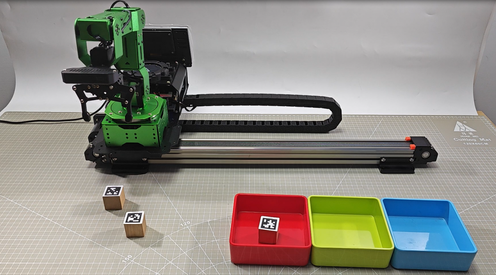

### 20.7.4 Functional Package Structure and Program Analysis

- **Functional Package Structure Analysis**

When using the tag sorting feature, the recognition program's functional package is called. Its file structure is shown below:


(1) `launch` folder: Contains launch files used to start the tag sorting program and initiate the sorting functionality.

(2) `stepper` folder: Contains source code files for the tag sorting program, implementing the core sorting logic functions.

(3) `CMakeLists.txt`: Manages build dependencies for the package and includes format information needed after launching ROS services.

(4) `package.xml`: The package description file, which details the package's contents such as build tools and version information.

- **Program Brief Analysis**

(1) Launch File Analysis

The launch files are located at: [~/ros2_ws/src/stepper/launch/tag_sorting.launch.py](../_static/source_code/stepper.zip)

① `launch_setup` Function: The `launch_setup` function configures different package paths based on environment variables and includes other launch description files. It also defines and launches a node for tag classification. The function returns a list of all launch elements that will be executed when the `ROS2` system starts.

- Environment Variable Check:

{lineno-start=11}

```python
  compiled = os.environ['need_compile']
  if compiled == 'True':
      sdk_package_path = get_package_share_directory('sdk')
      peripherals_package_path = get_package_share_directory('peripherals')
  else:
      sdk_package_path = '/home/ubuntu/ros2_ws/src/driver/sdk'
      peripherals_package_path = '/home/ubuntu/ros2_ws/src/peripherals'
```

The function first reads the `need_compile` value from the environment variables. This variable determines whether to use the installed package paths or the source directory paths.

If `need_compile` is set to **"True"**, it uses the `get_package_share_directory` function to get the shared directory path of the installed packages.

Otherwise, it falls back to using the absolute path of the source directories.

- Including Additional Launch Files:

{lineno-start=19}

```python
  depth_camera_launch = IncludeLaunchDescription(
      PythonLaunchDescriptionSource(
          os.path.join(peripherals_package_path, 'launch/depth_camera.launch.py')),
  )

  sdk_launch = IncludeLaunchDescription(
      PythonLaunchDescriptionSource(
          os.path.join(sdk_package_path, 'launch/jetarm_sdk.launch.py')),
  )
```

`depth_camera_launch`: Includes the `depth_camera.launch.py` launch file located in the `peripherals` package, which initializes the depth camera.

`sdk_launch`: Includes the `jetarm_sdk.launch.py` launch file located in the `SDK` package, responsible for initializing `SDK`-related components.

- Starting Nodes:

{lineno-start=29}

```python
  tag_sorting_node = Node(
      package='stepper',
      executable='tag_sorting',
      output='screen',
  )
```

A node named `tag_sorting_node` is created, which belongs to the `stepper` package. It executes the `tag_sorting` executable and outputs logs to the screen.

- Return Launch Actions List:

{lineno-start=35}

```python
  return [
          sdk_launch,
          depth_camera_launch,
          tag_sorting_node,
          ]
```

Finally, the function returns a list containing all the defined launch actions. These actions are executed sequentially during the `ROS 2` launch process, ensuring that all components are correctly initialized and running.

(2) Source Code Analysis

Python files locate at: [~/ros2_ws/src/stepper/stepper/tag_sorting.py](../_static/source_code/stepper.zip)

① Import the necessary libraries

{lineno-start=5}

```python
import os
import cv2
import yaml
import time
import math
import queue
import rclpy
import threading
import numpy as np
from sdk import common
from rclpy.node import Node
from app.common import Heart
from cv_bridge import CvBridge
from dt_apriltags import Detector
from stepper import stepper as Stepper
from std_srvs.srv import Trigger, SetBool
from sensor_msgs.msg import Image, CameraInfo
from rclpy.executors import MultiThreadedExecutor
from interfaces.srv import SetStringBool
from servo_controller_msgs.msg import ServosPosition
from rclpy.callback_groups import ReentrantCallbackGroup
from kinematics.kinematics_control import set_pose_target
from kinematics_msgs.srv import GetRobotPose, SetRobotPose
from kinematics.kinematics_control import set_joint_value_target
from servo_controller.bus_servo_control import set_servo_position
from app.utils import calculate_grasp_yaw, position_change_detect, pick_and_place, image_process, distortion_inverse_map
```

* `os`: A standard library for interacting with the operating system.

* `cv2`: The `OpenCV` library used for computer vision processing.

* `yaml`: A library for parsing and generating `YAML` format files.

* `time`: A standard library providing time-related functionalities.

* `math`: A standard library for mathematical operations.

* `queue`: A standard library providing a thread-safe queue implementation.

* `rclpy`: The Python client library for `ROS 2`, used to develop robotic applications.

* `threading`: A standard library that supports multithreaded programming.

* `numpy as np`: The `NumPy` library for efficient numerical computations and array manipulations.

* `sdk.common`, `sdk.fps`: Custom `SDK` modules for common utilities and `FPS` control.

* `rclpy.node.Node`: The base class for `ROS 2` nodes, used to create and manage nodes.

* `app.common.Heart`: A heartbeat module in the application used to monitor system status.

* `cv_bridge.CvBridge`: A bridge that converts between `OpenCV` images and `ROS` image messages.

* `dt_apriltags.Detector`: `AprilTag` detector used for recognizing and tracking `AprilTags`.

* `stepper.stepper as Stepper`: A stepper motor control module for precise control of stepper motors.

* `std_srvs.srv.Trigger`, `std_srvs.srv.SetBool`: Standard `ROS` services for triggering operations and setting boolean values.

* `sensor_msgs.msg.Image`, `sensor_msgs.msg.CameraInfo`: `ROS` sensor messages for image data and camera information.

* `rclpy.executors.MultiThreadedExecutor`: A `ROS` executor that supports multithreaded callback handling.

* `interfaces.srv.SetStringBool`: A custom `ROS` service for setting string and boolean values.

* `servo_controller_msgs.msg.ServosPosition`: A custom `ROS` message type representing servo positions.

* `rclpy.callback_groups.ReentrantCallbackGroup`: A `ROS` callback group that allows reentrant execution of callbacks.

* `kinematics.kinematics_control.set_pose_target`: A function from the `kinematics` control module used to set pose targets.

* `kinematics_msgs.srv.GetRobotPose` and `kinematics_msgs.srv.SetRobotPose`: These are `ROS2` kinematics service interfaces used for interacting with a robot's pose.

* `kinematics.kinematics_control.set_joint_value_target`: This function belongs to the `kinematics` control module. It is used to set the target values for the robot's joint angles.

* `servo_controller.bus_servo_control.set_servo_position`: Function for setting servo positions in the servo control module.

② Target Position Specification

{lineno-start=34}

```python
TARGET_POSITION = {
  'tag1': (2600),
  'tag2': (4000),
  'tag3': (5200),
}
```

This is a dictionary used to store target positions for different tags. This structure simplifies quickly locating the corresponding position based on tag during the robot's tasks. Sliding rail position range is from 0 (leftmost end) to 5200 (rightmost end).

③`__init__` Function: 

{lineno-start=42}

```python
class TagSorting(Node):

  def __init__(self, name):
      rclpy.init()
      super().__init__(name, allow_undeclared_parameters=True, automatically_declare_parameters_from_overrides=True)
      self.tag_size = 0.025
      self.start_get_roi = True
      self.last_position = None
      self.imgpts = None
      self.roi = None
      self.count_move = 0
      self.count_still = 0
      self.last_position = None
      self.start_transport = False
      self.extristric = None
      self.intrinsic = None
      self.distortion = None
      self.target = None
      self.target_miss_count = 0
      self.camera_type = os.environ['CAMERA_TYPE']
      self.calibration_file = 'calibration.yaml'
      self.config_file = 'transform.yaml'
      self.config_path = "/home/ubuntu/ros2_ws/src/stepper/config/"

      self.image_queue = queue.Queue(maxsize=2)
      self.lock = threading.RLock()
      self.bridge = CvBridge()  # Used for the conversion between ROS Image messages and OpenCV images. 用于ROS Image消息与OpenCV图像之间的转换
      self.stepper = Stepper.Stepper(7)
      self.stepper.set_mode(self.stepper.EN) # Set the slide rail enable. 设置滑轨使能

      self.at_detector = Detector(searchpath=['apriltags'],
                                  families='tag36h11',
                                  nthreads=4,
                                  quad_decimate=1.0,
                                  quad_sigma=0.0,
                                  refine_edges=1,
                                  decode_sharpening=0.25,
                                  debug=0)


      self.joints_pub = self.create_publisher(ServosPosition, '/servo_controller', 1)
      self.image_sub = self.create_subscription(Image, '/depth_cam/rgb/image_raw', self.image_callback, 1)
      self.camera_info_sub = self.create_subscription(CameraInfo, '/depth_cam/rgb/camera_info', self.camera_info_callback, 1)

      self.timer_cb_group = ReentrantCallbackGroup()
      self.client = self.create_client(Trigger, '/controller_manager/init_finish', callback_group=self.timer_cb_group)
      self.client.wait_for_service()
      self.get_current_pose_client = self.create_client(GetRobotPose, '/kinematics/get_current_pose', callback_group=self.timer_cb_group)
      self.get_current_pose_client.wait_for_service()
      self.kinematics_client = self.create_client(SetRobotPose, '/kinematics/set_pose_target', callback_group=self.timer_cb_group)
      self.kinematics_client.wait_for_service()

      self.timer = self.create_timer(0.0, self.init_process, callback_group=self.timer_cb_group)
```

This function is used to initialize a `ROS2`-based tag sorting node. It sets `AprilTag`-related parameters, such as tag size and detector configuration, initializes state variables and counters, configures the stepper motor controller, and creates the image queue and thread lock. It also sets up `ROS2` publishers, subscribers, and service clients, and starts the initialization process via a timer. The `AprilTag` detector is configured with parameters such as the `tag36h11` family, 4-thread processing, and edge refinement to improve detection accuracy.

④ `init_process` Function: 

{lineno-start=93}

```python
  def init_process(self):
      self.timer.cancel()
      set_servo_position(self.joints_pub, 1.0, ( (1, 500),(2, 520), (3, 210), (4, 50), (5, 500), (10, 200)))  # Set the initial position of the robotic arm. 设置机械臂初始位置
      time.sleep(1.5)
      self.stepper.go_home()
      threading.Thread(target=self.main, daemon=True).start()
      threading.Thread(target=self.transport_thread, daemon=True).start()
```

A system initialization function. It first cancels the timer, sets the robot arm to its initial position, performs the sliding rail homing operation, and then starts the main processing thread and the transport thread, completing all preparations for the tag sorting system.

⑤ `send_request` Function: 

{lineno-start=101}

```python
  def send_request(self, client, msg):
      future = client.call_async(msg)
      while rclpy.ok():
          if future.done() and future.result():
              return future.result()
```

Used to send asynchronous requests to `ROS2` services and wait for their responses. This function simplifies interaction with `ROS2` services by polling the future object status in a loop, ensuring correct reception and return of service response data.

⑥ `camera_info_callback` Function:

{lineno-start=107}

```python
  def camera_info_callback(self, msg):
      self.intrinsic = np.matrix(msg.k).reshape(1, -1, 3)
      self.distortion = np.array(msg.d)
```

Camera information callback that processes configuration data from the camera. From the `CameraInfo` message, the intrinsic matrix and distortion coefficients of the camera are extracted, reshaped to the appropriate form, and stored as class attributes. These parameters provide the necessary camera information for subsequent `AprilTag` detection and coordinate transformations.

⑦ `image_callback` Function:

{lineno-start=111}

```python
  def image_callback(self, ros_image):
      # Convert ros format images to opencv format. 将ros格式图像转换为opencv格式
      cv_image = self.bridge.imgmsg_to_cv2(ros_image, "bgr8")
      bgr_image = np.array(cv_image, dtype=np.uint8)

      if self.image_queue.full():
          # If the queue is full, discard the oldest image. 如果队列已满，丢弃最旧的图像
          self.image_queue.get()
      # Put the image into the queue. 将图像放入队列
      self.image_queue.put(bgr_image)
```

This is the image callback function used to process image messages received from the camera topic. It converts `ROS` image messages to `OpenCV` format and stores them in a buffer queue. If the queue is full, the oldest images are automatically discarded to ensure efficient memory usage and maintain real-time performance.

⑧ `get_roi` Function: {lineno-start=122}

```python
  def get_roi(self):
      with open(self.config_path + self.config_file, 'r') as f:
          config = yaml.safe_load(f)

          # Convert to numpy array. 转换为 numpy 数组
          extristric = np.array(config['extristric'])
          corners = np.array(config['corners']).reshape(-1, 3)
          self.white_area_center = np.array(config['white_area_pose_world'])
      while True:
          intrinsic = self.intrinsic
          distortion = self.distortion
          if intrinsic is not None and distortion is not None:
              break
          time.sleep(0.1)

      tvec = extristric[:1]  # Take the first row. 取第一行
      rmat = extristric[1:]  # Take the last three rows. 取后面三行

      tvec, rmat = common.extristric_plane_shift(np.array(tvec).reshape((3, 1)), np.array(rmat), 0.03)
      self.extristric = tvec, rmat
      tvec, rmat = common.extristric_plane_shift(np.array(tvec).reshape((3, 1)), np.array(rmat), 0.00)
      imgpts, jac = cv2.projectPoints(corners[:-1], np.array(rmat), np.array(tvec), intrinsic, distortion)
      imgpts = np.int32(imgpts).reshape(-1, 2)
      self.imgpts = imgpts
      # Crop RIO region 裁切出ROI区域
      x_min = min(imgpts, key=lambda p: p[0])[0] # The minimum value of the X-axis. x轴最小值
      x_max = max(imgpts, key=lambda p: p[0])[0] # The maximum value of the X-axis. x轴最大值
      y_min = min(imgpts, key=lambda p: p[1])[1] # The minimum value of the Y-axis. y轴最小值
      y_max = max(imgpts, key=lambda p: p[1])[1] # The maximum value of the Y-axis. y轴最大值
      roi = np.maximum(np.array([y_min, y_max, x_min, x_max]), 0)
          
      self.roi = roi
```

Retrieves the Region of Interest (ROI). Read the external parameters, corner points, and white area pose information from the configuration file.

Then, wait for the camera intrinsic parameters to be initialized. After that, determine the ROI boundaries in the image through plane offset processing and projection calculations. This provides a precise working area for subsequent `AprilTag` detection.

⑨ get_object_world_position` Function: 

{lineno-start=155}

```python
  def get_object_world_position(self, position, intrinsic, extristric, white_area_center, height=0.03):
      projection_matrix = np.row_stack((np.column_stack((extristric[1], extristric[0])), np.array([[0, 0, 0, 1]])))
      world_pose = common.pixels_to_world([position], intrinsic, projection_matrix)[0]
      world_pose[0] = -world_pose[0]
      world_pose[1] = -world_pose[1]
      position = white_area_center[:3, 3] + world_pose
      position[2] = height
      config_data = common.get_yaml_data(os.path.join(self.config_path, self.calibration_file))
      offset = tuple(config_data['pixel']['offset'])
      scale = tuple(config_data['pixel']['scale'])
      for i in range(3):
          position[i] = position[i] * scale[i]
          position[i] = position[i] + offset[i]
      return position, projection_matrix
```

A core function for converting pixel coordinates to world coordinates. By constructing a projection matrix, pixel coordinates in the image are converted into positions in the robot's world coordinate system. Coordinate transformations and height adjustments are applied, and finally, accuracy compensation is performed using offset and scaling parameters from the calibration file to ensure precise grasping positions.

⑩ `calculate_pick_grasp_yaw` Function: 

{lineno-start=170}

```python
  def calculate_pick_grasp_yaw(self, position, target, target_info, intrinsic, projection_matrix):
      yaw = math.degrees(math.atan2(position[1], position[0]))
      if position[0] < 0 and position[1] < 0:
          yaw = yaw + 180
      elif position[0] < 0 and position[1] > 0:
          yaw = yaw - 180
      # 0.09x0.02
      gripper_size = [common.calculate_pixel_length(0.09, intrinsic, projection_matrix),
                      common.calculate_pixel_length(0.02, intrinsic, projection_matrix)]

      return calculate_grasp_yaw.calculate_gripper_yaw_angle(target, target_info, gripper_size, yaw)
```

It calculates the gripper yaw angle for picking. It computes the base yaw angle based on the target position, adjusts the angle according to the quadrant, and then calls a utility function that incorporates the gripper's size information to calculate the optimal grasping angle. This ensures the robotic arm can stably pick up the objects marked with `AprilTags`.

⑪ `calculate_place_grasp_yaw` Function:

{lineno-start=182}

```python
  def calculate_place_grasp_yaw(self, position, angle=0):
      yaw = math.degrees(math.atan2(position[1], position[0]))
      if position[0] < 0 and position[1] < 0:
          yaw = yaw + 180
      elif position[0] < 0 and position[1] > 0:
          yaw = yaw - 180
      yaw1 = yaw + angle
      if yaw < 0:
          yaw2 = yaw1 + 90
      else:
          yaw2 = yaw1 - 90

      yaw = yaw2
      if abs(yaw1) < abs(yaw2):
          yaw = yaw1
      yaw = 500 + int(yaw / 240 * 1000)

      return yaw
```

It calculates the gripper yaw angle for placing. Based on the target position, calculate the yaw angle and use an angle optimization algorithm to select the most suitable placement angle from two candidate angles. Then convert this angle into the pulse width required for servo control, ensuring precise placement operations.

⑫ `transport_thread` Function: 

{lineno-start=201}

```python
  def transport_thread(self):
      while True:
          if self.start_transport:
              position, yaw, target = self.transport_info
              if position[0] > 0.22:
                  position[2] += 0.01
              config_data = common.get_yaml_data(os.path.join(self.config_path, self.calibration_file))
              offset = tuple(config_data['kinematics']['offset'])
              scale = tuple(config_data['kinematics']['scale'])
              for i in range(3):
                  position[i] = position[i] * scale[i]
                  position[i] = position[i] + offset[i]

              finish = pick_and_place.pick(position, 80, yaw, 540, 0.02, self.joints_pub, self.kinematics_client)
              if finish:
                  set_servo_position(self.joints_pub, 1.0, ( (1, 500),))  # Set the initial position of the robotic arm. 设置机械臂初始位置
                  time.sleep(1.)
                  stepper_position = TARGET_POSITION[str(self.target[0])]
                  self.stepper.goto(stepper_position) # Drive the slide rail to move to the placement position. 驱动滑轨移动到放置位置
                  stepper_time = stepper_position/1000 # Calculate the required time. 计算需要的时间
                  time.sleep(stepper_time)

                  position =  [0.25, 0, 0.015] # Set the placement position. 设置放置位置

                  yaw = self.calculate_place_grasp_yaw(position, 0)
                  config_data = common.get_yaml_data(os.path.join(self.config_path, self.calibration_file))
                  offset = tuple(config_data['kinematics']['offset'])
                  scale = tuple(config_data['kinematics']['scale'])
                  angle = math.degrees(math.atan2(position[1], position[0]))
                  if angle > 45:
                      # self.get_logger().info(f'1:{position}')
                      position = [position[0] * scale[1], position[1] * scale[0], position[2] * scale[2]]
                      position = [position[0] - offset[1], position[1] + offset[0], position[2] + offset[2]]
                  elif angle < -45:
                      # self.get_logger().info(f'2:{position}')
                      position = [position[0] * scale[1], position[1] * scale[0], position[2] * scale[2]]
                      position = [position[0] + offset[1], position[1] - offset[0], position[2] + offset[2]]
                  else:
                      # self.get_logger().info(f'3:{position}')
                      position = [position[0] * scale[0], position[1] * scale[1], position[2] * scale[2]]
                      position = [position[0] + offset[0], position[1] + offset[1], position[2] + offset[2]]

                  # self.get_logger().info(f'{position}')
                  finish = pick_and_place.place(position, 80, yaw, 200, self.joints_pub, self.kinematics_client)
                  if finish:
                      set_servo_position(self.joints_pub, 1.5, ( (1, 500),(2, 520), (3, 210), (4, 50), (5, 500), (10, 200)))  # 设置机械臂初始位置
                      time.sleep(1.5)
                      stepper_position = TARGET_POSITION[str(self.target[0])]
                      self.stepper.goto(-stepper_position) # 驱动滑轨移动到放置位置
                      stepper_time = stepper_position/1000 # 计算需要的时间
                      time.sleep(stepper_time)
                      self.target = None
                      self.start_transport = False
          else:
              time.sleep(0.1)
```

Transport control thread, responsible for executing the full tag sorting. When a transport command is received, it first applies kinematic calibration parameters for position compensation, then uses the `pick_and_place` utility function to perform the pick operation. It drives the sliding rail to move to the position corresponding to the tag ID, executes the place operation, and finally resets the robotic arm and sliding rail to prepare for the next operation.

⑬ `main` Function:

{lineno-start=257}

```python
  def main(self):
      while True:
          try:
              bgr_image = self.image_queue.get(block=True, timeout=1)
          except queue.Empty:
              continue
          if self.start_get_roi:
              self.get_roi()
              self.start_get_roi = False
          roi = self.roi.copy()
          intrinsic = self.intrinsic
          target_info = []
          if not self.start_transport:
              tags = self.at_detector.detect(cv2.cvtColor(bgr_image, cv2.COLOR_RGB2GRAY), True, (intrinsic[0,0], intrinsic[1,1], intrinsic[0,2], intrinsic[1,2]), self.tag_size)
              if len(tags) > 0 and roi[0] < tags[0].center[1] < roi[1] and roi[2] < tags[0].center[0] < roi[3]:
                  common.draw_tags(bgr_image, tags, corners_color=(0, 0, 255), center_color=(0, 255, 0))
                  index = 0
                  for tag in tags:
                      corners = tag.corners.astype(int)
                      rect = cv2.minAreaRect(np.array(tag.corners).astype(np.float32))
                      # rect includes center point, (width, height), rotation Angle. rect 包含 (中心点, (宽度, 高度), 旋转角度)
                      (center, (width, height), angle) = rect
                      index += 1
                      target_info.append(['tag%d'%tag.tag_id, index, (int(center[0]), int(center[1])), (int(width), int(height)), angle])
                      cv2.putText(bgr_image, "%d"%tag.tag_id, (int(tag.center[0] - (7 * len("%d"%tag.tag_id))), int(tag.center[1]-10)), cv2.FONT_HERSHEY_SIMPLEX, 0.7, (255, 255, 0), 2)

                  target_miss = True
                  for target in target_info:
                      if self.target is not None :  # If there is already a target, skip the other objects directly. 如果已经有了目标，其他物体就直接跳过
                          if self.target[0] != target[0] or self.target[1] != target[1]:
                              continue
                          else:
                              target_miss = False
                              self.target = target
                      position, projection_matrix = self.get_object_world_position(target[2], intrinsic, self.extristric, self.white_area_center, 0.03)
                      result = self.calculate_pick_grasp_yaw(position, target, target_info, intrinsic, projection_matrix)
                      if result is not None and self.target is None:
                          self.target = target
                          break
                      if self.last_position is not None and self.target is not None :
                          e_distance = round(math.sqrt(pow(self.last_position[0] - position[0], 2)) + math.sqrt(pow(self.last_position[1] - position[1], 2)), 5)
                          # self.get_logger().info(f'e_distance: {e_distance}')
                          if e_distance <= 0.001:  # Euclidean distance less than 1mm to prevent grasping while the object is still moving. 欧式距离小于1mm, 防止物体还在移动时就去夹取了
                              cv2.line(bgr_image, result[1][0], result[1][1], (255, 255, 0), 2, cv2.LINE_AA)
                              self.count_move = 0
                              self.count_still += 1
                          else:
                              self.count_move += 1
                              self.count_still = 0

                          if self.count_move > 10:
                              self.target = None
                          if self.count_still > 20:
                              self.count_still = 0
                              self.count_move = 0
                              self.target = target
                              yaw = 500 + int(result[0] / 240 * 1000)
                              self.transport_info = [position, yaw, target]
                              self.start_transport = True
                      self.last_position = position
                  if target_miss:
                      self.target_miss_count += 1
                  if self.target_miss_count > 10:
                      self.target_miss_count = 0
                      self.target = None
              cv2.drawContours(bgr_image, [self.imgpts], -1, (0, 255, 255), 2, cv2.LINE_AA) # Draw rectangle 绘制矩形
          if bgr_image is not None:
              cv2.imshow('result', bgr_image)
              cv2.waitKey(1)
```

The main processing loop function. Continuously retrieve images from the image queue and perform `AprilTag` detection. When a tag is detected within the ROI area, extract tag information and draw detection results. Use position change tracking to ensure target stability, and verify the target state using movement and stationary counters. When the target remains stable for a specified number of frames, start the transport thread to execute the pick-and-place task. At the same time, handle cases where the target is lost and display the corresponding results.

⑭ Main Function:

{lineno-start=326}

```python
def main():
  node = TagSorting('tag_sorting')
  executor = MultiThreadedExecutor()
  executor.add_node(node)
  executor.spin()
  node.destroy_node()
  rclpy.shutdown()

if __name__ == "__main__":
  main()
```

It serves as the entry point for starting and running the tag sorting `ROS2` node. It creates an instance of `TagSorting`, uses a `MultiThreadedExecutor` to support multithreaded processing, starts the node, and ensures proper resource cleanup upon termination.