# 21. JetArm and Chassis Integration Course

## 21.1 JetArm and Mecanum Chassis Integration Course

### 21.1.1 Getting Started

* **Wiring Instruction**

Connect the four motors of the mecanum wheel chassis in the following order: M1: Front left wheel, M2: Rear left wheel, M3: Front right wheel, and M4: Rear right wheel. Use a 4-pin cable to connect the 4-channel motor encoder driver module to the IIC interface on the Jetson expansion board. Use a 3-pin cable to connect the 4-channel motor encoder driver module to the 3-pin interface on the STM32 expansion board.

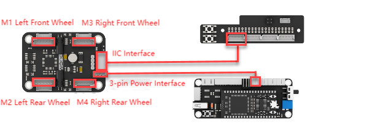

:::{Note}
If a 12.6V battery is used for power supply, the connection can also be made as shown in the figure below.
:::


* **Chassis Installation**

(1) Attach four M4\*5+6 nylon standoffs to the Mecanum chassis, then mount the 4-channel encoder motor driver module onto the standoffs using four M4\*6 pan head screws. Make sure the end with the IIC interface is facing the right side of the chassis.

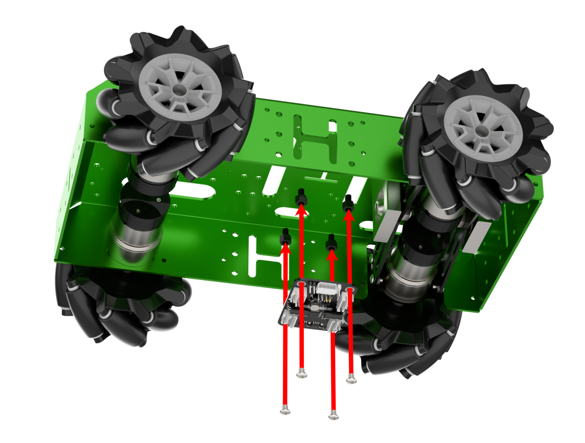

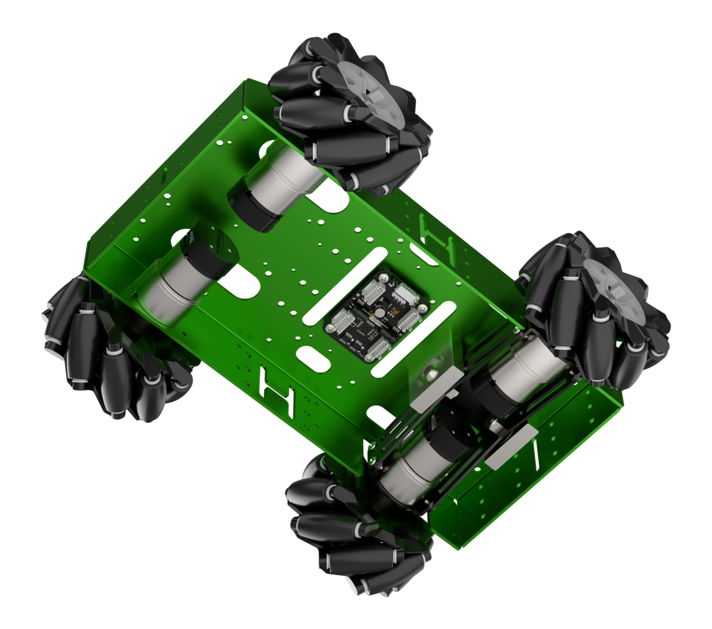


(2) Connect the four motor wires to the ports closest to each motor. Use a Velcro strap to secure the battery onto the battery mounting plate.

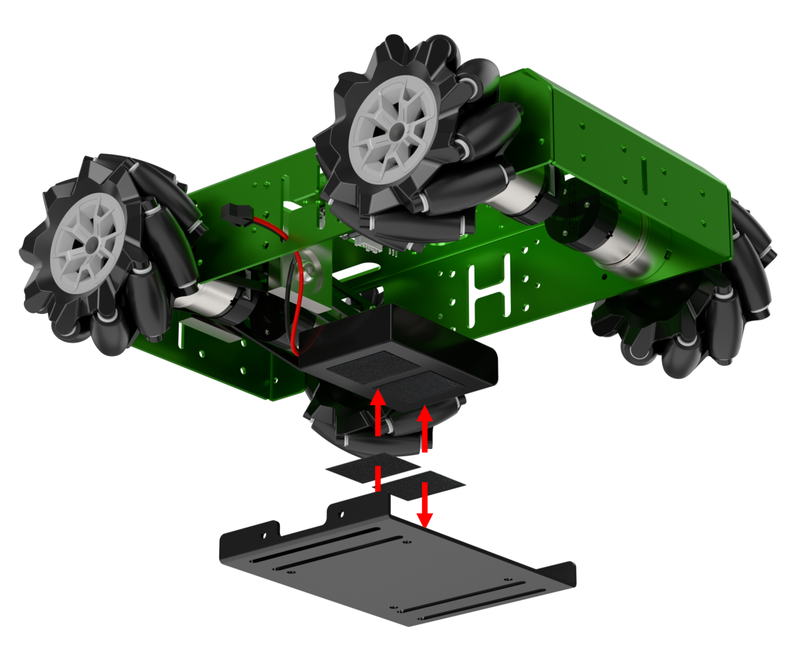


(3) Mount the battery plate onto the Mecanum chassis using four M4*6 pan head screws.

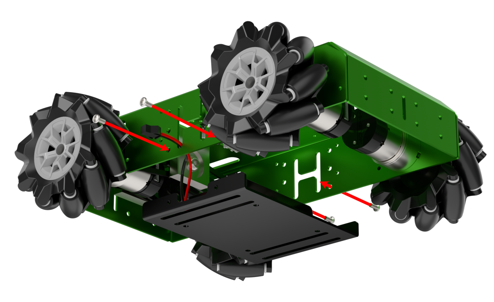

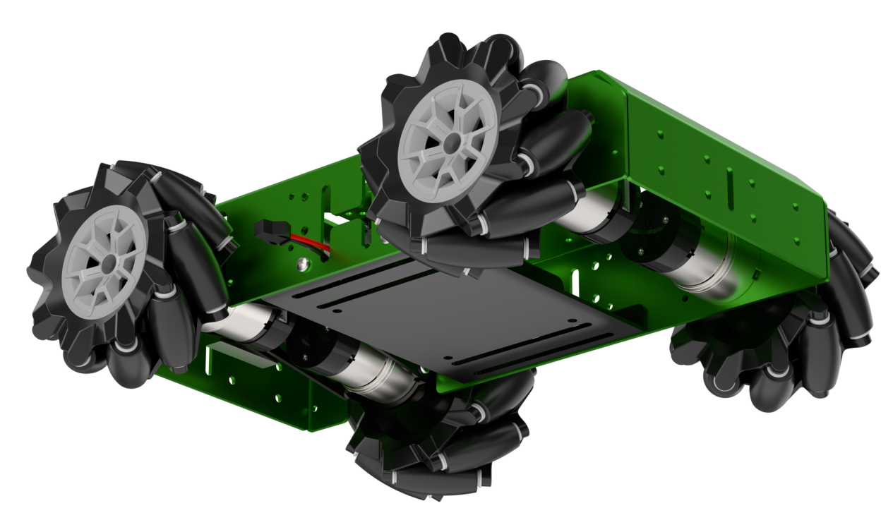

(4) Attach another set of six M4\*5+6 nylon standoffs to the Mecanum chassis. Then mount the robotic arm onto the Mecanum chassis using four M4\*6 and two M4\*10 pan head screws.

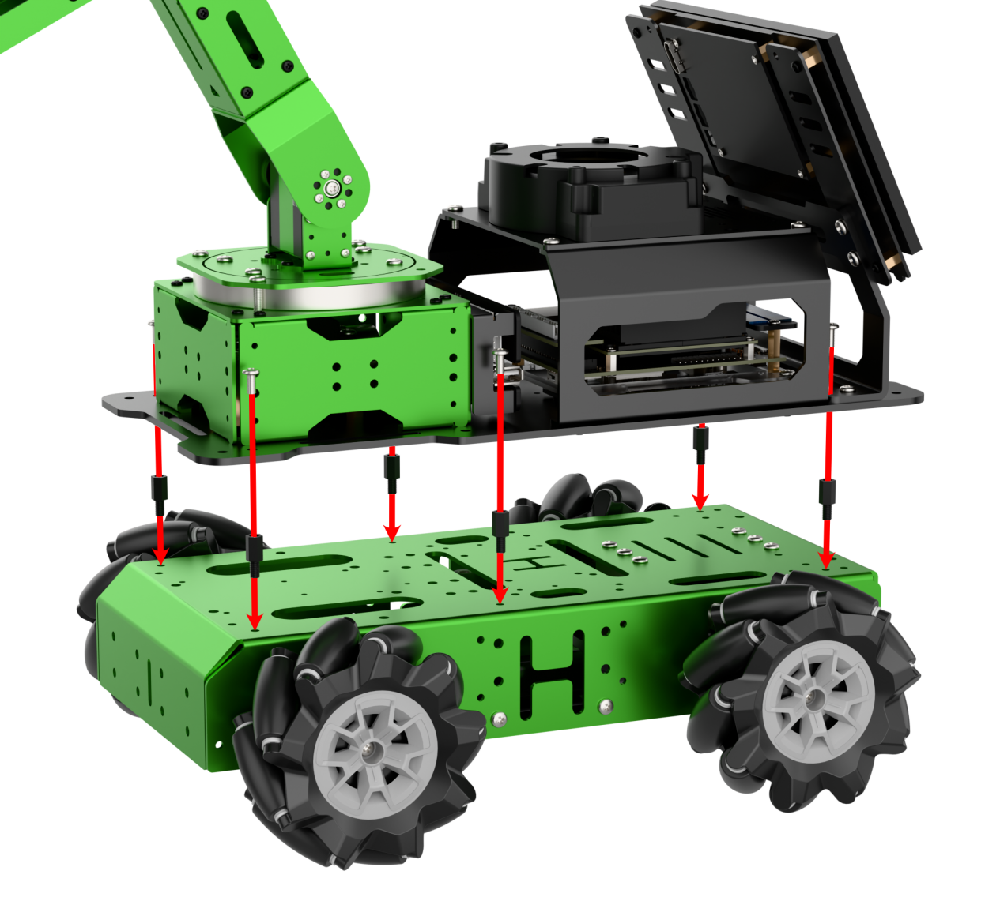

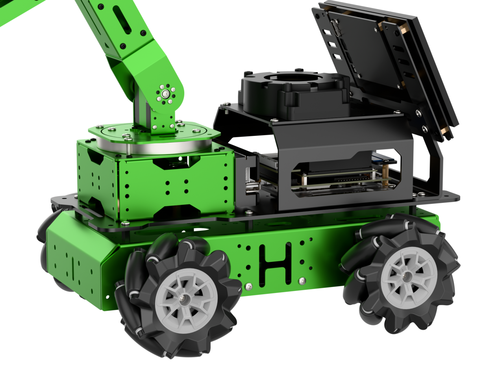

### 21.1.2 Selecting the Robot Type

JetArm's expansion accessories come in four types: tank chassis, Mecanum wheel chassis, sliding rail, and conveyor belt. After installation, you must switch the device version according to the installed accessory for proper operation.

:::{Note}
If you don't switch or select the wrong version, the motor may run unpredictably, causing malfunctions or even damaging the device.
:::

Step-by-step instructions:

(1) Power on the robotic arm and connect it to the remote control software NoMachine. For installation and connection of the remote desktop tool, see [1.6. Development Environment Setup and Configuration](1.Getting_Ready.md#development-environment-setup-and-configuration).

(2) Double-click the model configuration tool on the desktop.


(3) Select the appropriate options based on the robotic arm version, camera version, and accessory type:


Tank refers to the tracked chassis. Mecanum refers to the mecanum wheel chassis. Slide_Rails refers to the slide rails. Conveyor_Belt refers to the conveyor belt.

(4) After making your selection, click **"Apply & Save"** to save the configuration.

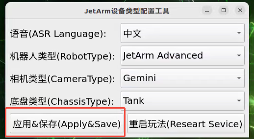

(5) Click **"Restart"** to reload the configuration.


Wait for the buzzer to beep once—this indicates the restart is complete and the new configuration is now active.

### 21.1.3 APP Control

* **APP Installation**

::: {Note}
(1) Please grant all permissions requested during installation to ensure the app functions properly.

(2) Turn on your phone's GPS and Wi-Fi before opening the app.
:::

(1) For Android devices:
You can find the app installation file in the directory: [APP Installation Package](resources_download.md). Transfer the APK file to your phone and install it.

(2) For iOS devices:
Go to the **App Store**, search for **"WonderAi"**, and download the app.


* **Connection Modes Overview**

The robot supports two network modes:

(1) AP Mode (Direct Connection): The controller creates a hotspot that your phone can connect to directly, but no Internet access in this mode.

(2) STA Mode (LAN Connection): The controller connects to a specified Wi-Fi network, and Internet access is available in this mode.

By default, the robot starts in AP direct connection mode. Regardless of whether the user chooses AP direct connection or STA LAN mode, the robot's features and functions remain the same.

:::{Note}
We recommend starting with the AP direct connection mode to quickly explore and experience the robot's functions. You can switch to LAN mode later based on your specific needs.
:::

(1) Connecting in AP Mode (Recommended First Step)

**To use this mode, iOS devices must be running iOS 11.0 or above, and Android devices must be running Android 5.0 or above.**

Important for Android users: Make sure to enable all required permissions for the app in your phone settings to ensure proper functionality.

This section uses JetArm connecting to the Android app as an example. The same steps apply for iOS devices.

① Open the **WonderAi** app and select **"Advanced"** → **"JetArm"**.


② Tap the **"+"** button in the bottom-right corner and choose **"Direct Connection Mode"**.


③ Tap **"Go to connect device hotspots"**, which will take you to the Wi-Fi settings page to connect the hotspot generated by the robot.

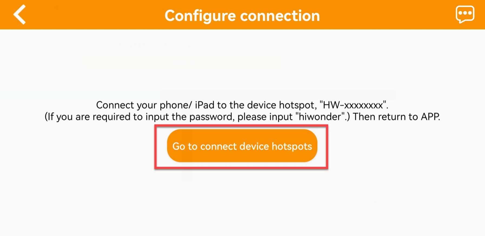

④ The hotspot starts with **"HW"** and connect to it by entering the password: **hiwonder**.


For iOS users: Make sure the Wi-Fi icon  appears in the status bar before switching back to the app, or the device might not be detected. If the app doesn't detect the device right away, tap the refresh icon  in the upper-right corner.

⑤ Go back to the **WonderAi** app, tap the corresponding robot icon, and enter the mode selection screen.

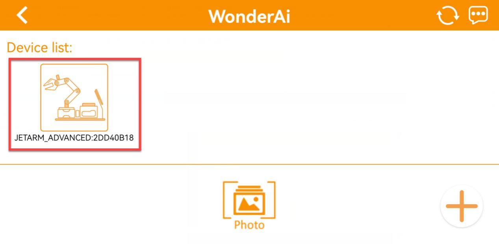

**If a message pops up saying "Network is unavailable, continue?", tap "Keep Connection" to proceed.**

⑥ If a message appears saying "**Whether to switch and enter the searched product interface?**", it means the wrong product was selected in Step 1. Tap "**CONFIRM**" to automatically switch to the correct version’s mode selection screen.


⑦ After tapping the robot icon, the mode selection screen will appear as shown below:

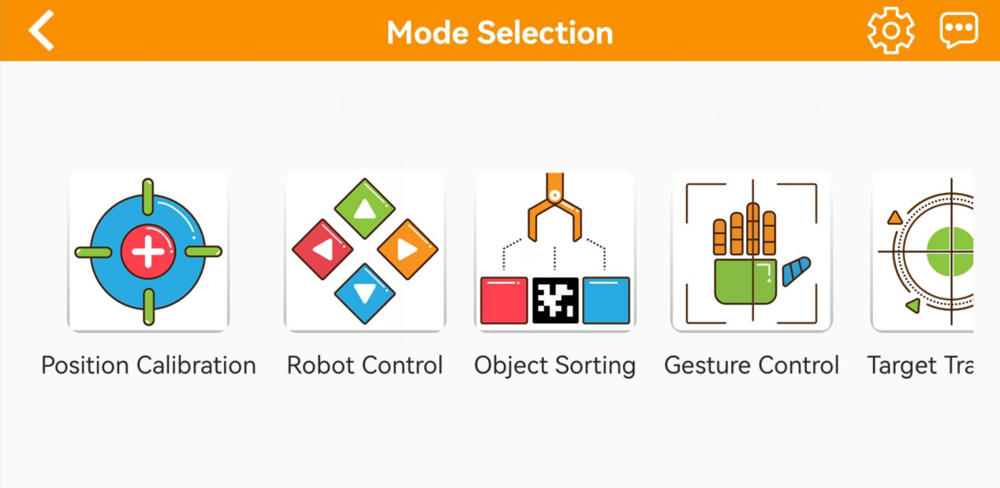

(2) LAN Mode Connection (Optional)

① First, connect your phone to a 5G Wi-Fi network. For example, connect to **"Hiwonder_5G."** If you are using a dual-band router with separate SSIDs, the 2.4G and 5G networks will have different names, for example, **"Hiwonder"** for 2.4G and **"Hiwonder_5G"** for 5G.


② Open the **WonderAi** app on your phone. Tap **"Advanced"** and select **"JetArm."**

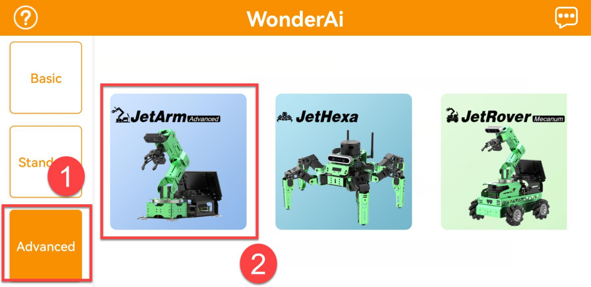

③ Tap the **"+"** button in the bottom-right corner and choose **"LAN Mode"**.

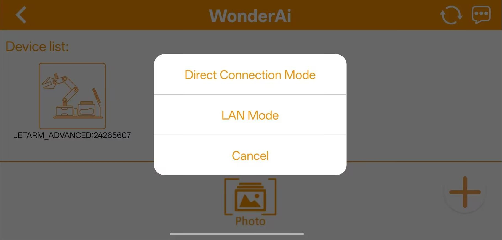

④ The app will prompt you to enter the Wi-Fi password for the network you're connected to. Make sure you enter the correct password, a wrong password will prevent the connection. After entering the password, tap **"OK"**.

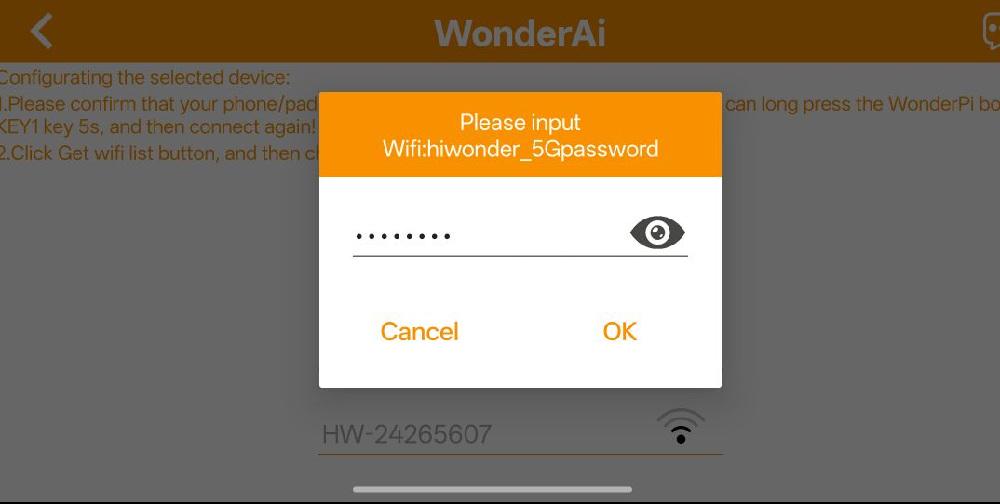

⑤ Tap **"Go to connect device hotspots"** to switch to the Wi-Fi settings.


⑥ In the Wi-Fi list, find the hotspot starting with **"HW"**, and connect to it using the password: **hiwonder**. After connecting, tap the **"Back"** button to return to the app.

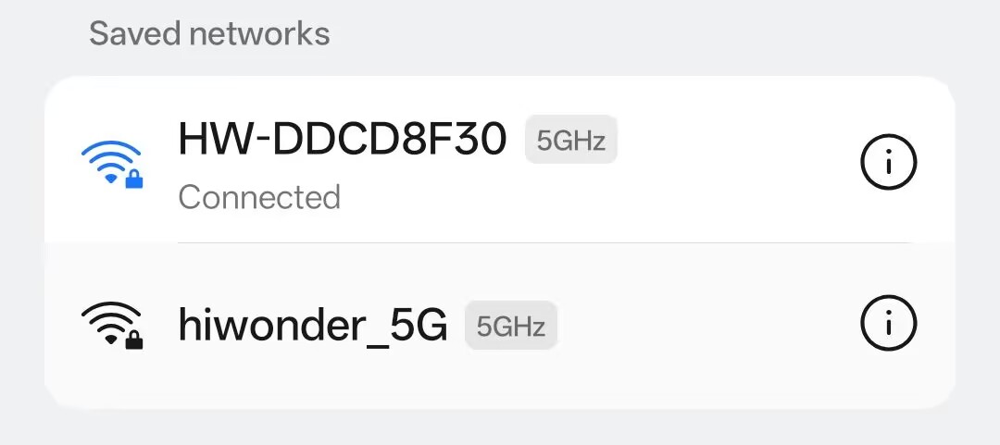

⑦ You will see that the app has started connecting to the robot.


⑧ After a few seconds, the robot's icon and name will appear on the main screen. The LED1 indicator on the expansion board will stay on.

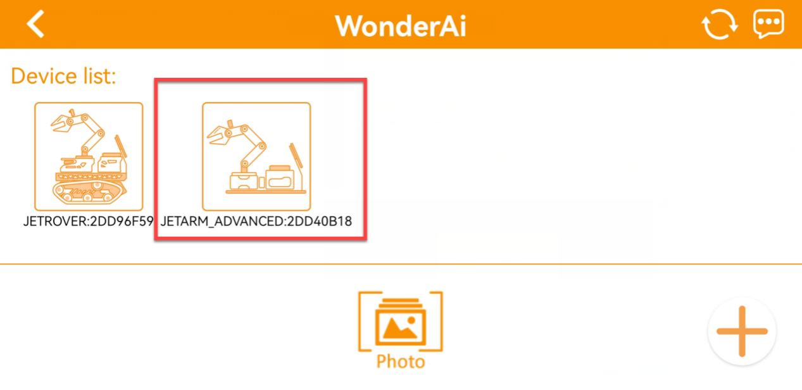

⑨ Long-press the corresponding icon of your robot in the app to view its assigned IP address and Device ID.


⑩ You can use this IP address in a remote desktop tool to establish a connection with the robot.

⑪ To switch from LAN mode back to direct connection mode, press and hold the **KEY1** button on the expansion board until the blue indicator light starts blinking. This indicates the mode has been switched successfully.

* **App Control Function**

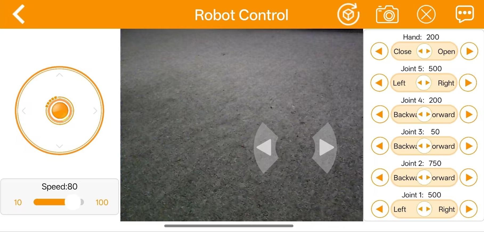

| | **Icon** | **Function** |
|:---|:--:|:--:|
| Live Video Feed |  | The pan-tilt rotates left or right, and the gripper rotates clockwise or counterclockwise accordingly. |
| Chassis Control |  | Control the chassis to move forward, backward, and strafe left or right. |
| Speed Adjustment Slider |  | Adjust the movement speed of the robot chassis. |
| Steering Control |  | Manually control the chassis turning direction (left/right). |
| Reset button |  | Return the robotic arm to its default position. |
| Arm Control |  | Individually control each servo motor of the robotic arm. |

### 21.1.4 Wireless Handle Control

* **Getting Started**

(1) Before powering on the device, make sure the wireless handle receiver is properly inserted. This can be ignored if the receiver was pre-inserted at the factory.

(2) Pay attention to battery polarity when placing the batteries.


(3) Each time the robot is powered on, the APP auto-start service will launch which includes the wireless handle control service. If this service has not been closed, no additional actions are needed—simply connect and control.

(4) Since wireless handle signals can interfere with each other, it is recommended not to use this function when multiple robots are in the same area, to avoid misconnection or unintended control.

(5) After turning on the wireless handle, if it does not connect to the robot within 30 seconds, or remains unused for 5 minutes after connection, it will enter sleep mode automatically. To wake up the wireless handle and exit sleep mode, press the **"START"** button.

* **Device Connection**

(1) After the robot powers on, slide the wireless handle switch to the **"ON"** position. At this point, the red and green LED indicators on the wireless handle will start flashing simultaneously.

(2) Wait a few seconds for the robot and wireless handle to pair automatically. Once pairing is successful, the green LED will remain solid while the red LED turns off.


* **Control Modes**

The wireless handle supports two control modes: Coordinate Mode and Single Servo Mode. After a successful connection, the default mode is Coordinate Mode.

(1) Single Servo Mode: In this mode, the wireless handle buttons can be used to control the forward and reverse rotation of individual servos on the robotic arm.


Button Functions in Single Servo Mode:

| **Button** | **Function (from the robotic arm's first-person perspective)** |
|:--:|:--:|
| START | Reset the robotic arm |
| SELECT+START | Switch control mode (Single Servo / Coordinate) |
| UP / ↑ | Raise Servo 2 |
| DOWN / ↓ | Lower Servo 2 |
| LEFT / ← | Rotate Servo 1 to the left |
| RIGHT / → | Rotate Servo 1 to the right |
| Y | Close the gripper (Servo 10) |
| A | Open the gripper (Servo 10) |
| B | Rotate Servo 5 to the right (Gripper turns right) |
| X | Rotate Servo 5 to the left (Gripper turns left) |
| L1 | Raise Servo 3 |
| L2 | Lower Servo 3 |
| R1 | Raise Servo 4 |
| R2 | Lower Servo 4 |
| Left Joystick Forward | Move Chassis Forward |
| Left Joystick Backward | Move Chassis Backward |
| Left Joystick Left | Chassis strafes to the left. |
| Left Joystick Right | Chassis strafes to the right. |
| Right Joystick Left | Chassis Turn Left |
| Right Joystick Right | Chassis Turn Right |

(2) Coordinate Mode: In Coordinate Mode, the robotic arm moves as a whole along the X, Y, and Z axes and can also adjust its tilt angle based on button inputs.


Button Functions in Coordinate Mode:

| **Button** | **Function (from the robotic arm's first-person perspective)** |
|:--:|:--:|
| START | Reset the robotic arm |
| SELECT+START | Switch control mode (Single Servo / Coordinate) |
| UP / ↑ | Move arm in the positive X direction (forward) |
| DOWN / ↓ | Move arm in the negative X direction (backward) |
| LEFT / ← | Move arm in the positive Y direction (left) |
| RIGHT / → | Move arm in the negative Y direction (right) |
| Y | Close the gripper (Servo 10) |
| A | Open the gripper (Servo 10) |
| B | Rotate Servo 5 to the right (Gripper turns right) |
| X | Rotate Servo 5 to the left (Gripper turns left) |
| L1 | Move arm upward along Z axis |
| L2 | Move arm downward along Z axis |
| R1 | Increase gripper pitch angle |
| R2 | Decrease gripper pitch angle |
| Left Joystick Forward | Move Chassis Forward |
| Left Joystick Backward | Move Chassis Backward |
| Left Joystick Left | Chassis strafes to the left. |
| Left Joystick Right | Chassis strafes to the right. |
| Right Joystick Left | Chassis Turn Left |
| Right Joystick Right | Chassis Turn Right |

Switching Between Modes: To switch between modes, press both **SELECT** and **START** buttons. A sound prompt indicates the switch was successful.

(1) Two beeps: Switched from Single Servo Mode to Coordinate Mode.

(2) Two beeps: Switched from Single Servo Mode to Coordinate Mode.

### 21.1.5 Target Tracking

When the camera detects a target color block, the robotic arm and chassis will follow the movement of that block.

* **Project Process**

First, subscribe to the topic published by the color recognition node to obtain detected color information.

Choose the target color. Once the target color is detected, obtain the center position of the target object in the image.

Finally, based on the target's relative position within the image frame, estimate the distance to the object. Then publish a motion control topic message to drive the chassis accordingly.

* **Enabling the Feature**

(1) Power on the robotic arm and connect it to the remote control software NoMachine. For installation and connection of the remote desktop tool, see [1.6. Development Environment Setup and Configuration](1.Getting_Ready.md#development-environment-setup-and-configuration).

(2) Click the terminal icon 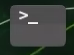 in the system desktop to open a command-line window.

(3) Enter the following command and press Enter to stop the auto-start service:

```bash
sudo systemctl stop start_app_node.service
```

(4) Entering the following command to start the feature.

```bash
ros2 launch chassis object_tracking_node.launch.py
```

(5) Once the program is launched successfully, you will see the following log messages printed in the terminal. A camera feed window will pop up automatically.

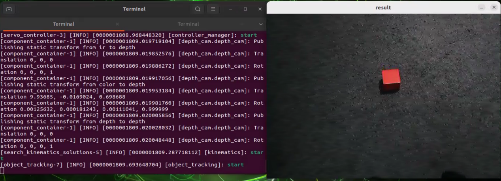

(6) Click on the object you want to track in the camera feed window. The system will automatically detect the color threshold of the selected object and set it as the tracking target.

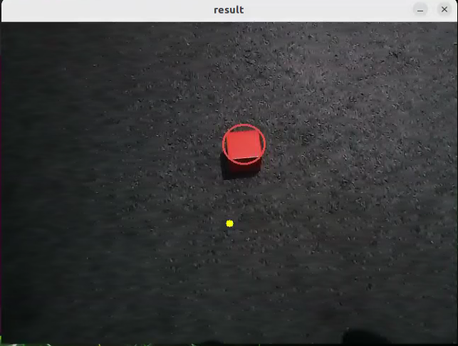

(7) Open a new terminal window  and enter the following command to begin tracking:

```bash
ros2 service call /object_tracking/set_running std_srvs/srv/SetBool "{data：true}"
```

(8) To exit the feature, press **Ctrl+C** in the terminal. If the program does not close successfully, try pressing **Ctrl+C** again.

(9) If you want to experience the mobile app features again later, enter the command and press Enter to start the app service. Wait for the robotic arm to return to its initial position — a beep from the buzzer will indicate it's ready.

```bash
sudo systemctl start start_app_node.service
```

* **Project Outcome**

After launching the feature, place a red block within the field of view of the robotic arm's camera. The live video feed will highlight the detected target color, and the robotic arm with its chassis will continuously follow the movement of the red block.

* **launch File Analysis**

The Launch files are located at: [/home/ubuntu/ros2_ws/src/chassis/launch/object_tracking_node.launch.py](../_static/source_code/chassis.zip)

(1) launch_set

The main purpose of this function is to configure and launch a set of ROS2 nodes and programs to enable the robot's target tracking functionality in a specific context. The function follows these steps:

{lineno-start=10}

```python
def launch_setup(context):
    compiled = os.environ['need_compile']
    if compiled == 'True':
        sdk_package_path = get_package_share_directory('sdk')
        chassis_package_path = get_package_share_directory('chassis')
        peripherals_package_path = get_package_share_directory('peripherals')
    else:
        sdk_package_path = '/home/ubuntu/ros2_ws/src/driver/sdk'
        chassis_package_path = '/home/ubuntu/ros2_ws/src/chassis'
        peripherals_package_path = '/home/ubuntu/ros2_ws/src/peripherals'


    object_tracking_node = GroupAction([
        IncludeLaunchDescription(
            PythonLaunchDescriptionSource(
                os.path.join(peripherals_package_path, 'launch/depth_camera.launch.py')),
            ),

        IncludeLaunchDescription(
            PythonLaunchDescriptionSource(
                os.path.join(sdk_package_path, 'launch/jetarm_sdk.launch.py')),
            ),

        IncludeLaunchDescription(
            PythonLaunchDescriptionSource(
                os.path.join(chassis_package_path, 'launch/chassis_controller_node.launch.py')),
            ),

        Node(
            package='chassis',
            executable='object_tracking',
            output='screen',
            ),
    ])

    return [
            object_tracking_node,
            ]
```

① Retrieve Compilation Status:

The function first reads a flag from the environment variable `need_compile` to determine whether related packages need to be recompiled. If the value of this variable is **'True'**, it indicates that compilation is required.

② Set Paths:

If compilation is needed, the function uses `get_package_share_directory` to obtain the paths of the `sdk`, `chassis`, and `peripherals` packages.

If compilation is not needed, it directly uses predefined paths such as [/home/ubuntu/ros2_ws/src/driver/sdk](../_static/source_code/sdk.zip), etc.

③ Define Nodes and Launch Items:

A `GroupAction` is created, which contains multiple `IncludeLaunchDescription` entries and a `Node`.

`IncludeLaunchDescription` is used to include other launch files:

* It includes `depth_camera.launch.py` to launch depth camera-related nodes.
* It includes `jetarm_sdk.launch.py` to launch SDK-related nodes.
* It includes `chassis_controller_node.launch.py` to launch nodes to control chassis.
* A `Node` is created to start the executable file `object_tracking`, which will output data to the screen.

④ Return the Launch Item List:

Finally, the function returns a list containing `object_tracking_node` and passes it to the `generate_launch_description` function, enabling ROS2's launch system to execute these configurations.

* **Python Source Code Analysis**

The Launch files are located at: [/home/ubuntu/ros2_ws/src/chassis/object_tracking.py](../_static/source_code/chassis.zip)

(1) Import the necessary libraries

{lineno-start=4}

```python
import os
import cv2
import math
import time
import queue
import rclpy
import threading
import numpy as np
import sdk.pid as pid
import sdk.misc as misc
import sdk.common as common
from chassis import mecanum
from rclpy.node import Node
from app.common import Heart
from cv_bridge import CvBridge
from sensor_msgs.msg import Image
from app.common import ColorPicker
from chassis_msgs.msg import Mecanum
from std_srvs.srv import SetBool, Trigger
from interfaces.srv import SetPoint, SetFloat64
from servo_controller_msgs.msg import ServosPosition
from rclpy.callback_groups import ReentrantCallbackGroup
from servo_controller.bus_servo_control import set_servo_position
```

① `os`: Python standard library for interacting with the operating system, such as file and directory operations.

② `cv2`: Computer vision library that provides image processing and vision functionalities like reading, processing, and displaying images.

③ `math`: Python's standard math library offering mathematical functions and constants such as trigonometric and logarithmic functions.

④ `queue`: Provides queue data structures designed for use in multithreaded environments.

⑤ `rclpy`: Python client library for ROS 2, used to create ROS 2 nodes and manage communications.

⑥ `threading`: Used for creating and managing threads to enable multithreaded programming.

⑦ `numpy`: A powerful numerical computing library offering array objects and a variety of mathematical functions, widely used in scientific computing and data processing.

⑧ `sdk.pid`: A custom PID controller module implementing the PID control algorithm.

⑨ `sdk.misc`: A custom module containing miscellaneous helper functions.

⑩ `sdk.common`: A custom module including common functions and constants.

⑪ `chassis.mecanum`: A custom module related to the mechatronic system or chassis control, specifically for controlling Mecanum wheels.

⑫ `rclpy.node.Node`: The ROS 2 node class used to define a ROS node and handle ROS messages.

⑬ `app.common.Heart`: A custom heartbeat monitoring feature used to check the status of the system or nodes.

⑭ `cv_bridge`: A bridging tool for converting image data formats between ROS and OpenCV.

⑮ `sensor_msgs.msg.Image`: ROS image message type used for transmitting image data.

⑯ `app.common.ColorPicker`: A custom module for color selection functionality.

⑰ `chassis_msgs.msg.Mecanum`: A custom message type for controlling chassis movement.

⑱ `std_srvs.srv.SetBool`: A standard ROS service used to set a boolean value, typically to enable or disable certain features.

⑲ `std_srvs.srv.Trigger`: A standard ROS service used to trigger an operation, typically for executing a one-time action.

⑳ `interfaces.srv.SetPoint`: A custom service used to set the position or target of a point.

㉑ `interfaces.srv.SetFloat64`: A custom service used to set a 64-bit floating-point value.

㉒ `servo_controller_msgs.msg.ServosPosition`: A custom message type for controlling the position of servo motors.

㉓ `servo_controller.bus_servo_control`: A custom module used for controlling servo motors.

(2) `__init__` function: The constructor method of the class, automatically called when an instance is created. Used to initialize the object's state and attributes.

{lineno-start=29}

```python
    def __init__(self, color, node):
        self.node = node
        self.chassis_type = os.environ['CHASSIS_TYPE']
        self.camera_type = os.environ['CAMERA_TYPE']
        self.pid_yaw = pid.PID(0.01, 0.0, 0.001)
        self.pid_dist = pid.PID(0.002, 0.0, 0.00)
        self.last_color_circle = None
        self.lost_target_count = 0
        self.target_lab, self.target_rgb = color
        self.weight_sum = 1.0
        self.x_stop = 320
        self.Mecanum = mecanum.MecanumChassis()
        if self.camera_type == 'GEMINI':
            self.y_stop = 300
            self.pro_size = (640, 480)
        else:
            self.y_stop = 300
            self.pro_size = (640, 480)
```

① Environment Variables:Uses `os.environ` to retrieve system environment variables `CHASSIS_TYPE` and `CAMERA_TYPE` to configure the robot's chassis type and camera type.

② Creates two PID controller instances: `self.pid_yaw` and `self.pid_dist`.

- `pid_yaw` controls the robot's rotation (yaw axis) with proportional, integral, and derivative coefficients.
- `pid_dist` controls the robot's distance to the target, also configured with PID parameters.

③ Attribute Initialization

- `last_color_circle`: Initialized to `None`. Stores the last detected color circle.
- `lost_target_count`: Initialized to `0`. Tracks how many times the target has been lost.
- `target_lab` and `target_rgb`: Store the target color values in LAB and RGB color spaces.
- `weight_sum`: Initialized to `1.0`. Used for normalizing weighted calculations.
- `x_stop` and `y_stop`: Coordinates set for stopping positions.
- `Mecanum`: Instantiates a `MecanumChassis` object to control the robot chassis movement.

④ Camera and Processing Initialization: For different camera types (e.g., `GEMINI`), set different stopping coordinates (`y_stop`) and processing size (`pro_size`).

(3) `__call__` Method: This method processes the input image and calculates the robot's movement commands based on detected target colors.

① Initialization and Parameter Setup

{lineno-start=49}

```python
        mecanum = Mecanum()
        velocity_x = 0.0
        velocity_y = 0.0
        angular_rate = 0.0
        h, w = image.shape[:2]
```

- Instantiate a `Mecanum` object to handle chassis control.
- Initialize velocity parameters, `velocity_x`, `velocity_y`, and `angular_rate` all set to `0.0`.
- Obtain the height (`h`) and width (`w`) of the input image.

② Image Preprocessing

{lineno-start=54}

```python
        image = cv2.resize(image, self.pro_size)
        image = cv2.cvtColor(image, cv2.COLOR_RGB2LAB)  # Convert RGB to LAB space. RGB转LAB空间
        image = cv2.GaussianBlur(image, (5, 5), 5)
```

- Resize the input image to the predefined processing size (`self.pro_size`).
- Convert the image color space from RGB to LAB to improve the accuracy of color detection.
- Apply Gaussian blur to the image to reduce noise and minimize its impact on subsequent processing.

③ Color Threshold Range Calculation

{lineno-start=58}

```python
        min_color = [int(self.target_lab[0] - 50 * threshold * 2),
                     int(self.target_lab[1] - 50 * threshold),
                     int(self.target_lab[2] - 50 * threshold)]
        max_color = [int(self.target_lab[0] + 50 * threshold * 2),
                     int(self.target_lab[1] + 50 * threshold),
                     int(self.target_lab[2] + 50 * threshold)]
        target_color = self.target_lab, min_color, max_color
```

Based on the LAB values of the target color and the given threshold, calculate the minimum and maximum LAB values. These values are used to generate a binary mask that highlights regions in the image that closely match the target color.

④ Mask Generation and Contour Detection

{lineno-start=65}

```python
        mask = cv2.inRange(image, tuple(target_color[1]), tuple(target_color[2]))  # Binarization 二值化
        eroded = cv2.erode(mask, cv2.getStructuringElement(cv2.MORPH_RECT, (3, 3)))  # Erode 腐蚀
        dilated = cv2.dilate(eroded, cv2.getStructuringElement(cv2.MORPH_RECT, (3, 3)))  # Dilate 膨胀
        contours = cv2.findContours(dilated, cv2.RETR_EXTERNAL, cv2.CHAIN_APPROX_NONE)[-2]  # Find contours 找出轮廓
        contour_area = map(lambda c: (c, math.fabs(cv2.contourArea(c)),), contours)  # Calculate the area of each contour. 计算各个轮廓的面积
        contour_area = list(filter(lambda c: c[1] > 40, contour_area))  # Remove contours with area that is too small. 剔除>面积过小的轮廓
```

- Use `cv2.inRange` to create a binary mask, marking areas in the image that match the target color.
- Apply morphological operations (erosion and dilation) to the mask to eliminate noise and smooth the edges.
- Detect contours in the processed mask. Calculate the area of each contour and filter out those with an area smaller than 40 pixels.

⑤ Target Tracking and Motion Control

{lineno-start=71}

```python
        circle = None
        if len(contour_area) > 0:
            if self.last_color_circle is None:
                contour, area = max(contour_area, key=lambda c_a: c_a[1])
                circle = cv2.minEnclosingCircle(contour)
            else:
                (last_x, last_y), last_r = self.last_color_circle
                circles = map(lambda c: cv2.minEnclosingCircle(c[0]), contour_area)
                circle_dist = list(map(lambda c: (c, math.sqrt(((c[0][0] - last_x) ** 2) + ((c[0][1] - last_y) ** 2))),
                                       circles))
                circle, dist = min(circle_dist, key=lambda c: c[1])
                if dist < 100:
                    circle = circle
        if circle is not None:
            self.lost_target_count = 0
            (x, y), r = circle
            x = x / self.pro_size[0] * w
            y = y / self.pro_size[1] * h
            r = r / self.pro_size[0] * w

            cv2.circle(result_image, (self.x_stop, self.y_stop), 5, (255, 255, 0), -1)
            result_image = cv2.circle(result_image, (int(x), int(y)), int(r), (self.target_rgb[0],
                                                                               self.target_rgb[1],
                                                                               self.target_rgb[2]), 2)
```

- If valid contours are detected, compute the minimum enclosing circle for each contour. If no previous color circle was detected, select the contour with the largest area as the target.
- If a previous color circle exists, calculate the distance between the current and previous center points, and select the closest contour.
- If the distance between centers is less than 100 pixels, continue using the current detected center as the target.
- Once a valid target circle is found, update `lost_target_count`, scale the center coordinates back to the original image size, and draw the target marker on the image to visualize tracking.

⑥ Control Command Calculation

{lineno-start=95}

```python
            vx = 0
            vw = 0
            if abs(y - self.y_stop) > 20:
                self.pid_dist.update(y - self.y_stop)
                velocity_y = misc.map(common.set_range(self.pid_dist.output, -0.35, 0.35), -0.35, 0.35, -150, 150)
            else:
                self.pid_dist.clear()
            if abs(x - self.x_stop) > 20:
                self.pid_yaw.update(x - self.x_stop)
                if self.chassis_type == 'Mecanum':
                    velocity_x = misc.map(common.set_range(self.pid_yaw.output, -2, 2), -2, 2, 150, -150)
                elif self.chassis_type == 'Tank':
                    angular_rate = misc.map(common.set_range(self.pid_yaw.output, -2, 2), -2, 2, -150, 150)
            else:
                self.pid_yaw.clear()

            v, d = self.Mecanum.translation(velocity_x, velocity_y, fake=True)
            mecanum.velocity = v
            mecanum.direction = d
            mecanum.angular_rate = angular_rate
```

- Based on the deviation between the contour center and the predefined stopping coordinates (`x_stop` and `y_stop`), the system uses PID controllers to calculate the appropriate linear velocity and angular velocity commands.
- The computed velocities are clamped within a specified range to ensure safe and stable movement. Depending on the chassis type, Mecanum or Tank, the system generates corresponding control signals.

⑦ Return Result:

{lineno-start=115}

```python
        return result_image, mecanum
```

Finally, the method returns the processed image with visual markers, the updated `Mecanum` instance, which contains the calculated linear speed, direction, and angular velocity — ready to be used for controlling the robot's chassis.

(4) `__init__` function: The constructor method of the class, automatically called when an instance is created. Used to initialize the object's state and attributes.

① Initializing the ROS Client Library

{lineno-start=118}

```python
        rclpy.init()
        super().__init__(name, allow_undeclared_parameters=True, automatically_declare_parameters_from_overrides=True)
```

Initialize ROS 2's Python client library to ensure the node can communicate with the ROS system.

Call the constructor of the `Node` class, assigning a node name and enabling undeclared parameters, and automatic declaration of parameters from overrides.

② Basic Attribute Initialization

{lineno-start=121}

```python
        self.name = name
        self.set_callback = False
        self.color_picker = None
        self.tracker = None
        self.is_running = False
        self.threshold = 0.5
        self.dist_threshold = 0.3
        self.lock = threading.RLock()
        self.image_sub = None
        self.result_image = None
        self.image_height = None
        self.image_width = None
        self.bridge = CvBridge()
        self.image_queue = queue.Queue(2)
```

`self.name`: The name of the current node.

Additional attributes are initialized to manage node state control, image processing parameters, and thread safety mechanisms.

③ Creating ROS Publishers and Subscribers

{lineno-start=135}

```python
        self.chassis_pub = self.create_publisher(Mecanum, '/chassis_controller/command', 1)
        self.image_sub = self.create_subscription(Image, '/depth_cam/rgb/image_raw', self.image_callback, 1)  # Subscribe to the camera. 摄像头订阅
```

- `self.chassis_pub`: Publishes chassis control commands to the `/chassis_controller/command` topic.
- `self.joints_pub`: Publishes servo motor positions to the `servo_controller` topic.
- Subscribes to the `/depth_cam/rgb/image_raw` topic to receive image data. Incoming data is passed to the `self.image_callback` method for processing.

④ Multiple ROS Services Created

{lineno-start=138}

```python
        self.timer_cb_group = ReentrantCallbackGroup()
        self.client = self.create_client(Trigger, '/controller_manager/init_finish', callback_group=self.timer_cb_group)
        self.client.wait_for_service()

        self.set_running_srv = self.create_service(SetBool, '~/set_running', self.set_running_srv_callback)
        self.joints_pub = self.create_publisher(ServosPosition, 'servo_controller', 1)
        self.timer = self.create_timer(0.0, self.init_process, callback_group=self.timer_cb_group)
```

- `~/exit`: Exit the node.
- `~/set_running`: Set the node's running state.
- `~/set_target_color`: Set the target color to track.
- `~/get_target_color`: Retrieve the currently set target color.
- `~/set_threshold`: Set the color detection threshold.

⑤ Starting the Main Thread

{lineno-start=146}

```python
    def init_process(self):
        self.timer.cancel()
        set_servo_position(self.joints_pub, 1, ((10, 300), (5, 500), (4, 210), (3, 40), (2, 665), (1, 500)))
        time.sleep(1.0)
        threading.Thread(target=self.main, daemon=True).start()
```

A background thread is launched to run the `self.main` method, ensuring continuous operation of the main node and consistent data processing.

(5) main Function: Responsible for running a continuous loop that processes image data, displays the image window, sets up mouse event callbacks, and, under specific conditions, publishes control commands and shuts down the ROS node.

{lineno-start=152}

```python
    def main(self):
        while True:
            try:
                image = self.image_queue.get(block=True, timeout=1)
            except queue.Empty:
                continue

            result = cv2.cvtColor(image, cv2.COLOR_RGB2BGR)
            cv2.imshow("result", result)

            if not self.set_callback:
                self.set_callback = True
                # Set callback function for mouse clicking event. 设置鼠标点击事件的回调函数
                cv2.setMouseCallback("result", self.mouse_callback)
            key = cv2.waitKey(1)
        self.chassis_pub.publish(Mecanum())
        rclpy.shutdown()
```

① Continuous Image Processing Loop

The function enters an infinite loop, repeatedly retrieving image data from the `self.image_queue`.

It uses the `get` method with a 1-second timeout to wait for an image. If no image is received within the timeout, a `queue.Empty` exception is raised, and the loop continues to the next iteration using `continue`.

② Image Processing and Display

- The received image is converted from RGB to BGR color space, as OpenCV uses BGR by default.
- The processed image is displayed in a window titled **"result"** using OpenCV's `imshow` function.

③ Setting Mouse Callback

Before setting the mouse callback, the program checks whether it has already been set using the flag `self.set_callback`.

If the callback hasn't been set yet, set `self.set_callback` to `True`. `cv2.setMouseCallback` is called to bind the `self.mouse_callback` method to the **"result"** window. This allows the program to respond to mouse events in the image window and trigger appropriate actions.

④ Keyboard Event Listener

Uses `cv2.waitKey(1)` to check for keyboard input every millisecond.

⑤ Publishing Commands and Shutting Down the ROS Node

After the loop ends, a `Mecanum` type message is published to `chassis_pub`. This is typically used to control the robot's chassis or mobile platform.

Calls `rclpy.shutdown()` to shut down the ROS 2 client library and terminate the node.

(6) mouse_callback Function: This function handles mouse event callbacks, specifically responding to left mouse button clicks in the image window.

{lineno-start=169}

```python
    def mouse_callback(self, event, x, y, flags, param):
        if event == cv2.EVENT_LBUTTONDOWN:
            msg = SetPoint.Request()
            if self.image_height is not None and self.image_width is not None:
                msg.data.x = x / self.image_width
                msg.data.y = y / self.image_height
                self.set_target_color_srv_callback(msg, SetPoint.Response())
```

① Detecting Left-Click Events

Checks if the mouse event is of type `EVENT_LBUTTONDOWN`. Only executes the following logic when the left mouse button is clicked.

② Logging Click Coordinates

Uses the logger (`get_logger()`) to log the `x` and `y` coordinates of the click. This is useful for debugging and monitoring user interaction.

③ Creating and Configuring the Request Message

- Creates a `SetPoint.Request` object to hold the data for the target point.
- Verifies that the image height and width have been initialized, preventing division by `None`.
- Normalizes the clicked `x` and `y` coordinates by dividing them by the image's width and height. This converts the absolute pixel values to relative ratios, making the data adaptable to different image resolutions.

④ Calling the Service Callback Function

Passes the configured request (`msg`) and an empty response object (`SetPoint.Response()`) to the `set_target_color_srv_callback` method. This is typically used to interact with a ROS service, passing the selected point to the server for further processing — such as setting the target color or target position based on user input.

(7) set_running_srv_callback function: A service callback function mainly used to handle requests for setting the running state of object tracking.

{lineno-start=192}

```python
    def set_running_srv_callback(self, request, response):
        with self.lock:
            self.is_running = request.data
            if self.is_running:
                self.get_logger().info('\033[1;32m%s\033[0m' % 'set_running')
            else:
                self.chassis_pub.publish(Mecanum())
                self.get_logger().info('\033[1;32m%s\033[0m' % 'stop')
        response.success = True
        response.message = "set_running"
        return response
```

① Logging

Use `self.get_logger().info` to output a green log message to record the running state operation.

② Thread-safe state update, synchronized with `self.lock`

- Running state control: Set `self.is_running` based on `request.data` to control object tracking status.

③ Resource Management

- If running, log the "set_running" message.
- If stopping, publish a `Mecanum()` message to stop chassis movement and log the "stop" message.

④ Client Response

- Set `response.success` to `True` to indicate a successful operation.
- Set `response.message` to **"set_running"** to return the operation message.

Return the response object to complete the service response.

(8) set_target_color_srv_callback Function: A service callback function used to set the target color or adjust the associated tracker.

{lineno-start=177}

```python
    def set_target_color_srv_callback(self, request, response):
        self.get_logger().info('\033[1;32m%s\033[0m' % 'set_target_color')
        with self.lock:
            x, y = request.data.x, request.data.y
            if x == -1 and y == -1:
                self.color_picker = None
                self.tracker = None
            else:
                self.tracker = None
                self.color_picker = ColorPicker(request.data, 10)
            self.chassis_pub.publish(Mecanum())
        response.success = True
        response.message = "set_target_color"
        return response
```

① Thread Locking

Uses `with self.lock:` To ensure the following operations are thread-safe in a multithreaded environment, preventing race conditions.

② Retrieving Request Data

Extracts the `x` and `y` coordinates from `request.data`.

③ Conditional Logic

- If both `x` and `y` are equal to `-1`, set `self.color_picker` and `self.tracker` to `None`, indicating that the current color selection and tracking should be canceled.
- Otherwise, set `self.tracker` to `None`.

Create a new instance of `ColorPicker`, passing in `request.data` and the value `10` for color selection initialization.

④ Publishing a Message

Publishes a `Mecanum` message using `self.chassis_pub.publish(Mecanum())`. This controls the movement of the robot chassis or triggers related behavior.

⑤ Setting the Response

- Sets `response.success` = `True` to indicate the operation was successful.
- Sets `response.message` = **"set_target_color"** to provide feedback about the action.

Returns the response object.

(9) image_callback Function: A service callback function that processes incoming image messages from ROS. It handles color picking and object tracking logic while ensuring thread-safe access to shared resources.

① Image Conversion

{lineno-start=204}

```python
    def image_callback(self, ros_image):
        # Convert RGB format of ROS to that of OpenCV. 将ros格式(rgb)转为opencv的rgb格式
        cv_image = self.bridge.imgmsg_to_cv2(ros_image, "rgb8")
        rgb_image = np.array(cv_image, dtype=np.uint8)
        self.image_height, self.image_width = rgb_image.shape[:2]
```

The function first converts a ROS image message, usually in RGB8 format, to an OpenCV-compatible RGB image, stored in the variable `cv_image`. Then, it converts the image to a NumPy array and extracts the image's height and width.

② Result Image Initialization

{lineno-start=210}

```python
        result_image = np.copy(rgb_image)  # The image used for display the result.  显示结果用的画面
```

Create `result_image` as a copy of `rgb_image` to be used for displaying or processing results later.

③ Thread Safety Handling

{lineno-start=211}

```python
        with self.lock:
```

Use `with self.lock` to ensure thread safety, preventing data races in a multithreaded environment.

④ Color Picker Handling

{lineno-start=212}

```python
            # Color picker and object tracking are mutually exclusive. If the color picker exists, start picking colors. 颜色拾取器和识别追踪互斥, 如果拾取器存在就开始拾取
            if self.color_picker is not None:  # Color pick exists. 拾取器存在
                target_color, result_image = self.color_picker(rgb_image, result_image)
                if target_color is not None:
                    self.color_picker = None
                    self.tracker = ObjectTracker(target_color, self)
```

- If a color picker exists (`self.color_picker` is not `None`), call the color picker to process the current image and extract the target color and update the `result_image`.
- If a target color is successfully captured, clear the color picker. Initialize a new object tracker (`ObjectTracker`) and record relevant information about the target color.

⑤ Object Tracking

{lineno-start=218}

```python
            else:
                if self.tracker is not None:
                    try:
                        result_image, mecanum = self.tracker(rgb_image, result_image, self.threshold)
                        if self.is_running:
                            self.chassis_pub.publish(mecanum)
                        else:
                            self.tracker.pid_dist.clear()
                            self.tracker.pid_yaw.clear()
                    except Exception as e:
                        self.get_logger().error(str(e))
```

If an object tracker exists, which means `self.tracker` is not `None`, use the tracker to process the image. After processing, update the `result_image` accordingly. Depending on the tracker's status, publish movement commands to the chassis (`mecanum`) and log information about the movement speed and direction.

⑥ Image Queue Management

{lineno-start=229}

```python
        if self.image_queue.full():
            # Discard the oldest image if the queue is full. 如果队列已满，丢弃最旧的图像
            self.image_queue.get()
            # Put image into the queue. 将图像放入队列
        self.image_queue.put(result_image)
```

If the image queue is full, discard the oldest image to ensure the queue contains only the latest images. Then, put the processed image into the queue for further use.

(10) main Function: Serves as the standard Python program entry point, responsible for initializing and running the `ObjectTrackingNode` node.

{lineno-start=235}

```python
def main():
    node = OjbectTrackingNode('object_tracking')
    rclpy.spin(node)
    node.destroy_node()
    rclpy.shutdown()
```

### 21.1.6 Line Following

When the camera detects a line of the target color, the robotic arm chassis will follow the line forward.

* **Project Process**

First, subscribe to the topic published by the color recognition node to obtain detected color information.

Choose the target color. Once the target color is matched, define three ROI areas to determine the direction of the line.

Based on the line direction, publish motion control messages to command the chassis movement.

* **Enabling the Feature**

(1) Power on the robotic arm and connect it to the remote control software NoMachine. For installation and connection of the remote desktop tool, see [1.6. Development Environment Setup and Configuration](1.Getting_Ready.md#development-environment-setup-and-configuration).

(2) Click the terminal icon  in the system desktop to open a command-line window.

(3) Enter the following command and press Enter to stop the auto-start service:

```bash
sudo systemctl stop start_app_node.service
```

(4) Entering the following command to start the feature.

```bash
ros2 launch chassis line_following_node.launch.py
```

(5) Once the program is launched successfully, you will see the following log messages printed in the terminal. A camera feed window will pop up automatically.

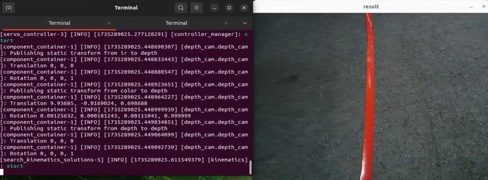

(6) Click on the line you want to track in the camera feed window. The system will automatically detect the color threshold of the selected line and set it as the tracking target.

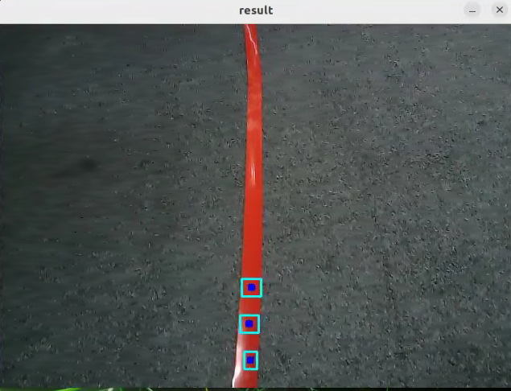

(7) Open a new terminal window  and enter the following command to begin tracking:

```bash
ros2 service call /line_following/set_running std_srvs/srv/SetBool "{data: true}"
```

(8) To exit the feature, press **Ctrl+C** in the terminal. If the program does not close successfully, try pressing **Ctrl+C** again.

(9) If you want to experience the mobile app features again later, enter the command and press Enter to start the app service. Wait for the robotic arm to return to its initial position — a beep from the buzzer will indicate it's ready.

```bash
sudo systemctl start start_app_node.service
```

* **Project Outcome**

After starting the feature, place the robotic arm behind the target line. Once the target line is selected and line following begins, the robotic arm chassis will move forward while maintaining alignment with the center of the line.

* **launch File Analysis**

The Launch files are located at: [/home/ubuntu/ros2_ws/src/chassis/launch/line_following_node.launch.py](../_static/source_code/chassis.zip)

(1) launch_setup() Function:

The main purpose of this function is to configure and launch a set of ROS2 nodes and programs to enable the robot's target tracking functionality in a specific context. The function follows these steps:

① Retrieve Compilation Status:

The function first reads a flag from the environment variable `need_compile` to determine whether related packages need to be recompiled. If the value of this variable is **'True'**, it indicates that compilation is required.

② Set Paths:

If compilation is needed, the function uses `get_package_share_directory` to obtain the paths of the `sdk`, `chassis`, and `peripherals` packages.

If compilation is not needed, it directly uses predefined paths such as [/home/ubuntu/ros2_ws/src/driver/sdk](../_static/source_code/sdk.zip), etc.

③ Define Nodes and Launch Items:

A `GroupAction` is created, which contains multiple `IncludeLaunchDescription` entries and a `Node`.

`IncludeLaunchDescription` is used to include other launch files:

* It includes `depth_camera.launch.py` to launch depth camera-related nodes.
* It includes `jetarm_sdk.launch.py` to launch SDK-related nodes.
* It includes `chassis_controller_node.launch.py` to launch nodes to control chassis.
* A `Node` is created to start the executable file `line_following`, which will output data to the screen.

④ Return the Launch Item List:

Finally, the function returns a list containing `object_tracking_node` and passes it to the `generate_launch_description` function, enabling ROS2's launch system to execute these configurations.

* **Python Source Code Analysis**

Python source code files locate at: [/home/ubuntu/ros2_ws/src/chassis/launch/line_following_node.launch.py](../_static/source_code/chassis.zip)

(1) Import the necessary libraries

{lineno-start=4}

```python
import os
import cv2
import math
import time
import rclpy
import queue
import threading
import numpy as np
import sdk.pid as pid
import sdk.misc as misc
import sdk.common as common
from rclpy.node import Node
from app.common import Heart
from cv_bridge import CvBridge
from app.common import ColorPicker
from chassis_msgs.msg import Mecanum
from std_srvs.srv import SetBool, Trigger
from sensor_msgs.msg import Image, LaserScan
from interfaces.srv import SetPoint, SetFloat64
from servo_controller_msgs.msg import ServosPosition
from rclpy.qos import QoSProfile, QoSReliabilityPolicy
from rclpy.callback_groups import ReentrantCallbackGroup
from servo_controller.bus_servo_control import set_servo_position
```

① `os`: Provides functionality to interact with the operating system, such as retrieving environment variables and file paths.

② `cv2`: A powerful computer vision library specialized in image and video processing, including reading, processing, displaying, and analyzing images.

③ `math`: Python's math library offering basic mathematical functions and constants, such as trigonometric functions and arithmetic operations.

④ `rclpy`: ROS 2's Python client library for Python developers, used to create ROS 2 nodes and handle message communication.

⑤ `queue`: Provides thread-safe queues to facilitate data transfer and synchronization between multiple threads.

⑥ `threading`: Offers thread management capabilities to implement multithreaded applications.

⑦ `numpy`: A numerical computation library supporting large multi-dimensional arrays and matrices, along with numerous mathematical functions.

⑧ `sdk.pid`: A custom module implementing the PID control algorithm, commonly used for feedback control systems.

⑨ `sdk.misc`: A custom miscellaneous module containing various utility functions and tools that simplify the main program logic.

⑩ `sdk.common`: A collection of general-purpose utility functions designed to support code reuse during development.

⑪ `rclpy.node.Node`: The ROS 2 node class, the base class for all ROS nodes, providing core functionalities for publishers, subscribers, and services.

⑫ `app.common.Heart`: A custom module for heartbeat detection to monitor the system's operational status.

⑬ `cv_bridge`: Provides tools for converting between ROS image messages and OpenCV image formats, enabling the use of OpenCV for image processing within ROS.

⑭ `app.common.ColorPicker`: A custom module used for handling or selecting specific colors.

⑮ `chassis_msgs.msg.Mecanum`: A custom message type used to send motion commands related to the robot chassis.

⑯ `std_srvs.srv.SetBool`: A standard ROS service used to set a boolean value.

⑰ `std_srvs.srv.Trigger`: A standard ROS service used to trigger a one-time operation, typically for controlling device power or executing a specific action.

⑱ `interfaces.srv.SetPoint`: A custom service for setting the position of a target point.

⑲ `interfaces.srv.SetFloat64`: A custom service used to set a 64-bit floating-point value.

⑳ `servo_controller_msgs.msg.ServosPosition`: A custom message type for controlling servo motor positions.

㉑ `servo_controller.bus_servo_control`: A custom module for controlling servo motors.

㉒ `rclpy.qos`: Provides classes for Quality of Service (QoS) configurations in ROS 2, used to define message reliability, latency, and other communication parameters.

(2) LineFollower Class

① `__init__` function: The constructor method of the class, automatically called when an instance is created. Used to initialize the object's state and attributes.

{lineno-start=29}

```python
    def __init__(self, color, node):
        self.node = node
        self.target_lab, self.target_rgb = color
        if os.environ['CAMERA_TYPE'] == 'GEMINI':
            self.rois = ((0.9, 0.95, 0, 1, 0.7), (0.8, 0.85, 0, 1, 0.2), (0.7, 0.75, 0, 1, 0.1))
        else:
            self.rois = ((0.81, 0.83, 0, 1, 0.7), (0.69, 0.71, 0, 1, 0.2), (0.57, 0.59, 0, 1, 0.1))
        self.weight_sum = 1.0
```

② Node Setup

Assigns the node parameter passed to the constructor to the instance attribute `self.node`.

③ Target Color Setup

Splits the passed-in color tuple `color` into two attributes: `target_lab` stores the target color in LAB color space, and `target_rgb` stores the target color in RGB color space.

④ Define Regions of Interest (ROI)

Selects different ROIs based on the value of the environment variable `CAMERA_TYPE`. If the camera type is `GEMINI`, sets a specific set of ROI values, otherwise, sets another set of ROI values.

⑤ Initialize Weight Sum

Sets `self.weight_sum` to `1.0` for subsequent calculations or processing.

(3) get_area_max_contour Function: Its primary function is to find the contour with the largest area from a given set of contours, where the area exceeds a specified threshold.

{lineno-start=38}

```python
    def get_area_max_contour(self, contours, threshold=100):
        '''
        Get the contour of the largest area.获取最大面积对应的轮廓
        :param contours:
        :param threshold:
        :return:
        '''
        contour_area = zip(contours, tuple(map(lambda c: math.fabs(cv2.contourArea(c)), contours)))
        contour_area = tuple(filter(lambda c_a: c_a[1] > threshold, contour_area))
        if len(contour_area) > 0:
            max_c_a = max(contour_area, key=lambda c_a: c_a[1])
            return max_c_a
        return None
```

① Contour Area Calculation

Uses `cv2.contourArea()` to calculate the area of each contour and pairs each contour with its area in a tuple for further processing.

② Contour Filtering

Use the `filter()` function to keep only contours with an area greater than the specified threshold.

③ Find Maximum Contour

If any contours meet the area condition, use the `max()` function to find the contour with the largest area.

④ Return Result

If a largest contour is found, the function returns both the contour and its area. If no contour meets the criteria, the function returns `None`.

(4) `__call__` Function: The main purpose of this function is to process the input image to identify specific Regions of Interest (ROIs) and calculate their center positions and deflection angles.

① Color Range Calculation

{lineno-start=53}

```python
        status = True
        centroid_sum = 0
        h, w = image.shape[:2]
        min_color = [int(self.target_lab[0] - 50 * threshold * 2),
                     int(self.target_lab[1] - 50 * threshold),
                     int(self.target_lab[2] - 50 * threshold)]
        max_color = [int(self.target_lab[0] + 50 * threshold * 2),
                     int(self.target_lab[1] + 50 * threshold),
                     int(self.target_lab[2] + 50 * threshold)]
        target_color = self.target_lab, min_color, max_color
```

Based on the LAB values of the target color and the given threshold, compute the minimum and maximum color values. These color ranges are used for subsequent image processing to determine which parts belong to the target color.

② ROI Processing

{lineno-start=63}

```python
        for roi in self.rois:
            blob = image[int(roi[0]*h):int(roi[1]*h), int(roi[2]*w):int(roi[3]*w)]  # Intercept roi 截取roi
            img_lab = cv2.cvtColor(blob, cv2.COLOR_RGB2LAB)  # Convert rgb into lab. rgb转lab
            img_blur = cv2.GaussianBlur(img_lab, (3, 3), 3)  # Perform Gaussian filtering to reduce noise. 高斯模糊去噪
            mask = cv2.inRange(img_blur, tuple(target_color[1]), tuple(target_color[2]))  # Image binarization 二值化
            eroded = cv2.erode(mask, cv2.getStructuringElement(cv2.MORPH_RECT, (3, 3)))  # Corrode 腐蚀
            dilated = cv2.dilate(eroded, cv2.getStructuringElement(cv2.MORPH_RECT, (3, 3)))  # Dilate 膨胀
```

The function iterates over predefined target ROIs, performing the following steps for each ROI:

- Crop the image block within the ROI and convert it from RGB color space to LAB color space.
- Apply Gaussian blur to reduce noise in the image block.
- Create a binary mask using thresholding to identify areas within the specified color range.
- Apply morphological operations (erosion and dilation) to optimize the mask and extract contours.

③ Contour Analysis

{lineno-start=70}

```python
            contours = cv2.findContours(dilated, cv2.RETR_EXTERNAL, cv2.CHAIN_APPROX_TC89_L1)[-2]  # Find the contour 找轮廓
            max_contour_area = self.get_area_max_contour(contours, 100)  # Get the contour corresponding to the largest contour. 获取最大面积对应轮廓
            if max_contour_area is not None:
                rect = cv2.minAreaRect(max_contour_area[0])  # Minimum circumscribed rectangle 最小外接矩形
                box = np.intp(cv2.boxPoints(rect))  # Four corners 四个角
                for j in range(4):
                    box[j, 1] = box[j, 1] + int(roi[0]*h)
                cv2.drawContours(result_image, [box], -1, (0, 255, 255), 2)  # Draw the rectangle composed of four points. 画出四个点组成的矩形
```

The function searches for contours within the mask. If a largest-area contour is found, it calculates the minimum bounding rectangle around it and draws this rectangle on the result image. This provides visual support for detecting the target area.

④ Center Point Calculation

{lineno-start=79}

```python
                # Acquire the diagonal points of the rectangle. 获取矩形对角点
                pt1_x, pt1_y = box[0, 0], box[0, 1]
                pt3_x, pt3_y = box[2, 0], box[2, 1]
                # Center point of the line. 线的中心点
                line_center_x, line_center_y = (pt1_x + pt3_x) / 2, (pt1_y + pt3_y) / 2

                cv2.circle(result_image, (int(line_center_x), int(line_center_y)), 5, (0, 0, 255), -1)   # Draw the center point. 画出中心点
                centroid_sum += line_center_x * roi[-1]
```

For each detected rectangle, calculate the coordinates of its center point. Accumulate these center points proportionally to compute an overall center position.

⑤ Deflection Angle Calculation

{lineno-start=90}

```python
        if centroid_sum == 0:
            return result_image, None, status
        center_pos = centroid_sum / self.weight_sum  # Calculate the center point according to the ratio. 按比重计算中心点
        deflection_angle = -math.atan((center_pos - (w / 2.0)) / (h / 2.0))   # Calculate the line angle. 计算线角度
```

Based on the overall center position, calculate a deflection angle indicating how far the center deviates from the image center.

⑥ Return Result

{lineno-start=94}

```python
        return result_image, deflection_angle, status
```

Finally, the function returns the processed result image, calculated deflection angle (if available), and a status flag indicating whether the processing was successful.

(5) LineFollowingNode Class `__init__` function: The constructor method of the class, automatically called when an instance is created. Used to initialize the object's state and attributes.

① Initialization of ROS 2

{lineno-start=97}

```python
        rclpy.init()
        super().__init__(name, allow_undeclared_parameters=True, automatically_declare_parameters_from_overrides=True)
```

Call `rclpy.init()` to initialize ROS2. This step is a necessary prerequisite for starting any ROS2 node.

Call the parent class constructor to initialize the ROS2 node and configure its name.

② Key Attributes and Member Variables Initialization

{lineno-start=101}

```python
        self.name = name
        self.set_callback = False
        self.is_running = False
        self.color_picker = None
        self.follower = None
        self.scan_angle = math.radians(45)
        self.pid = pid.PID(0.01, 0.0, 0.0)
        self.empty = 0
        self.threshold = 0.5
        self.stop_threshold = 0.4
        self.lock = threading.RLock()
        self.image_sub = None
        self.image_height = None
        self.image_width = None
        self.bridge = CvBridge()
        self.image_queue = queue.Queue(2)
```

③ Creating Publishers and Subscribers

{lineno-start=117}

```python
        self.chassis_pub = self.create_publisher(Mecanum, '/chassis_controller/command', 1)
        self.result_publisher = self.create_publisher(Image, '~/image_result', 1)  # Publish the image processing result. 图像处理结果发布
        self.image_sub = self.create_subscription(Image, '/depth_cam/rgb/image_raw', self.image_callback, 1)  # Subscribe to the camera. 摄像头订阅
```

- Define publishers for image processing results and robot control commands, allowing the node to send data over the ROS2 network.
- Create a subscriber to receive RGB images from the depth camera, and incoming images are processed by the `image_callback` method.

④ Create Services

{lineno-start=121}

```python
        self.timer_cb_group = ReentrantCallbackGroup()
        self.client = self.create_client(Trigger, '/controller_manager/init_finish', callback_group=self.timer_cb_group)
        self.client.wait_for_service()

        self.create_service(SetBool, '~/set_running', self.set_running_srv_callback)  # Start the feature. 开启玩法
        self.joints_pub = self.create_publisher(ServosPosition, 'servo_controller', 1)
        self.timer = self.create_timer(0.0, self.init_process, callback_group=self.timer_cb_group)
```

Define multiple ROS services to allow external systems to interact with the node and control its behavior, such as starting/stopping the node, setting/getting target colors, and adjusting thresholds.

⑤ Multithreading Execution

{lineno-start=129}

```python
    def init_process(self):
        self.timer.cancel()
        set_servo_position(self.joints_pub, 1, ((10, 300), (5, 500), (4, 210), (3, 40), (2, 665), (1, 500)))
        time.sleep(1.0)
        threading.Thread(target=self.main, daemon=True).start()
```

Create and start a new thread to run the node's main logic, ensuring other operations are not blocked by the main thread.

(6) main Function: Continuously fetch images from an image queue and display them in a window.

{lineno-start=135}

```python
    def main(self):
        while True:
            try:
                image = self.image_queue.get(block=True, timeout=1)
            except queue.Empty:
                continue

            result = cv2.cvtColor(image, cv2.COLOR_RGB2BGR)
            cv2.imshow("result", result)

            if not self.set_callback:
                self.set_callback = True
                # Set callback function for mouse clicking event. 设置鼠标点击事件的回调函数
                cv2.setMouseCallback("result", self.mouse_callback)
            k = cv2.waitKey(1)
        self.chassis_pub.publish(Mecanum())
        rclpy.shutdown()
```

① Image Fetch Loop

An infinite loop tries to get images from `self.image_queue`. If no image is received within 1 second, a `queue.Empty` exception is caught, and the loop continues.

② Image Processing

The acquired image is in RGB format. Use `cv2.cvtColor` to convert it to BGR format because OpenCV processes images in BGR by default.

③ Image Display

Use `cv2.imshow` to show the processed image in a window titled **"result"**.

④ Mouse Callback Setup

When the function successfully retrieves an image for the first time, it sets up a mouse click event handler: `self.mouse_callback`. This allows specific actions to be triggered when the user clicks on the image.

⑤ Keyboard Monitoring

`cv2.waitKey(1)` is used to check for keyboard input every millisecond. In the current code, no specific action is taken based on the value of `k`.

⑥ Publishing and Shutdown

After the infinite loop ends, a `Mecanum` message is published to control the robot, and `rclpy.shutdown()` is called to terminate the ROS2 node.

(7) mouse_callback Function: This function handles mouse click events. It is triggered when the user clicks the left mouse button in the image window titled **"result"**.

{lineno-start=153}

```python
    def mouse_callback(self, event, x, y, flags, param):
        if event == cv2.EVENT_LBUTTONDOWN:
            msg = SetPoint.Request()
            if self.image_height is not None and self.image_width is not None:
                msg.data.x = x / self.image_width
                msg.data.y = y / self.image_height
                self.set_target_color_srv_callback(msg, SetPoint.Response())
```

① Event Detection

The function first checks whether the event parameter equals `cv2.EVENT_LBUTTONDOWN`, which indicates a left-click action.

② Logging the Click Position

If a left-click is detected, the function logs the click coordinates (`x`, `y`) using `self.get_logger().info`.

③ Building the Request Message

  - `msg.data.x = x / self.image_width`: Normalize `x` to the range [0, 1].
  - `msg.data.y = y / self.image_height`: Normalize `y` to the range [0, 1].

④ Triggering the Service Callback

Finally, the function calls `self.set_target_color_srv_callback`, passing the constructed request message and an empty response object (`SetPoint.Response()`). This sends a request to set the target color or position.

(8) set_target_color_srv_callback Function: This is a ROS2 service callback used to handle client requests for setting a target color.

{lineno-start=162}

```python
    def set_target_color_srv_callback(self, request, response):
        self.get_logger().info('\033[1;32m%s\033[0m' % "set_target_color")
        with self.lock:
            x, y = request.data.x, request.data.y
            self.follower = None
            if x == -1 and y == -1:
                self.color_picker = None
            else:
                self.color_picker = ColorPicker(request.data, 5)
                self.chassis_pub.publish(Mecanum())
        response.success = True
        response.message = "set_target_color"
        return response
```

① Logging

When the callback is triggered, it logs the message **"set_target_color"** using `self.get_logger().info`.

② Thread Safety

A lock with `self.lock` ensures thread-safe access when updating shared resources like `self.color_picker` and `self.follower`.

③ Handling Request Data

The callback extracts the `x` and `y` coordinate values from the request, which represent the user's clicked location to select a color.

It checks whether both `x` and `y` are equal to `-1` to determine whether clear the target color or not:

If both `x` and `y` are `-1`, `self.color_picker` is set to `None`, which indicates no target color. Otherwise, a new `ColorPicker` instance is created, initialized with the request data and a threshold value of `5`. Regardless of whether a new color is selected or cleared, a `Mecanum()` message is published using `chassis_pub` to indicate that the robot should update its behavior accordingly.

④ Preparing the Response

Set `response.success` = `True` to indicate that the request was successfully processed, and `response.message` is set to **set_target_color**.

Returns the response object:

Finally, return the constructed response object to send it back to the client that called this service.

(9) set_running_srv_callback Function: This is a ROS2 service callback function used to set the `is_running` status flag.

{lineno-start=176}

```python
    def set_running_srv_callback(self, request, response):
        with self.lock:
            self.is_running = request.data
            self.empty = 0

            if self.is_running:
                self.get_logger().info('\033[1;32m%s\033[0m' % "set_running")
            else:
                self.get_logger().info('\033[1;32m%s\033[0m' % "stop")
                self.chassis_pub.publish(Mecanum())
        response.success = True
        response.message = "set_running"
        return response
```

① Logging

When the function is triggered, it logs a message indicating that the system is setting the running state by using **set_running**.

② Thread Locking

Use the `with self.lock` statement to ensure thread safety when updating the `self.is_running` shared resource. This prevents interference from other threads during the status update process, avoiding race conditions.

③ Updating the State

Assigns the incoming request data to the `self.is_running` attribute, updating the object's running state. Resets `self.empty` to `0` at the same time.

④ Handling the Stop State

If `self.is_running` is set to `False`, the node will publish a new `Mecanum()` message to `self.chassis_pub`, indicating that the robot should stop moving.

⑤ Constructing the Response

Set the `success` attribute of the response object to `True` to indicate the operation was successful, and assign **"set_running"** to `response.message` to specify the result of the operation.

(10) image_callback Function: Handles incoming image data for color recognition and line tracking, and updates related control commands.

① Image Format Conversion

{lineno-start=191}

```python
    def image_callback(self, ros_image):
        cv_image = self.bridge.imgmsg_to_cv2(ros_image, "rgb8")
        rgb_image = np.array(cv_image, dtype=np.uint8)
        self.image_height, self.image_width = rgb_image.shape[:2]
```

Uses `self.bridge.imgmsg_to_cv2` to convert ROS image messages to OpenCV RGB format, then converts to a NumPy array. Then, retrieves image height and width.

② Result Image Initialization

{lineno-start=195}

```python
        result_image = np.copy(rgb_image)  # The image used to display the result. 显示结果用的画面
```

Creates a copy of the image named `result_image` for further processing and displaying results.

③ Thread Locking

{lineno-start=196}

```python
        with self.lock:
```

Uses `with self.lock` to ensure thread safety while processing the image, preventing interference from other threads.

④ Color Picking

{lineno-start=197}

```python
            # Color picker and line recognition are exclusive. If there is color picker, start picking. 颜色拾取器和识别巡线互斥, 如果拾取器存在就开始拾取
            if self.color_picker is not None:  # Color picker exists. 拾取器存在
                try:
                    target_color, result_image = self.color_picker(rgb_image, result_image)
                    if target_color is not None:
                        self.color_picker = None
                        self.follower = LineFollower(target_color, self)
                        self.get_logger().info("target color: {}".format(target_color))
                except Exception as e:
                    self.get_logger().error(str(e))
```

- If `self.color_picker` is not `None`, indicating that the color picker is active, the color picking logic will be executed.
- Calls `self.color_picker(rgb_image, result_image)` to attempt detecting the target color in the current image and returns the detection results. If the target color is successfully recognized, it sets `self.color_picker` to `None` and initializes a new object tracker (`ObjectTracker`) and record relevant information about the target color.

⑤ Line Following

{lineno-start=207}

```python
            else:
                mecanum = Mecanum()
                mecanum.velocity = 80.0
                mecanum.direction = 90.0
                if self.follower is not None:
                    try:
                        result_image, deflection_angle , status= self.follower(rgb_image, result_image, self.threshold)
                        if deflection_angle is not None and self.is_running and  status:
                            self.pid.update(deflection_angle)
                            angular_rate = common.set_range(-self.pid.output, -1, 1)
                            mecanum.angular_rate = misc.map(angular_rate, -0.1, 0.1, -350, 350)
                            self.chassis_pub.publish(mecanum)
                        elif not status:
                            self.chassis_pub.publish(Mecanum())
                        else:
                            self.pid.clear()
                    except Exception as e:
                        self.get_logger().error(str(e))
```

- If the color picker is not active, it initializes a `Mecanum` movement object and sets its speed and direction.
- If `self.follower` exists, indicating the line follower is active, it calls `self.follower` to process the current image, obtaining the deflection angle (`deflection_angle`) and status (`status`).
- If the deflection angle is valid, the system is running, and the status is normal, it updates the PID controller to calculate and publish the appropriate angular velocity command.
- If the status is abnormal, it publishes stop or zero-motion commands.
- If the deflection angle is invalid, it clears the PID controller's internal state.

⑥ Image Queue Management

{lineno-start=225}

```python
        if self.image_queue.full():
            # Discard the oldest image if the queue is full. 如果队列已满，丢弃最旧的图像
            self.image_queue.get()
            # Put image into the queue. 将图像放入队列
        self.image_queue.put(result_image)
```

If the image queue is full, discard the oldest image to ensure the queue contains only the latest images. Then, adds the processed result image to the queue for further use.

(11) Main Function: Starts a ROS2 node named `line_following`.

{lineno-start=231}

```python
def main():
    node = LineFollowingNode('line_following')
    rclpy.spin(node)
    node.destroy_node()
    rclpy.shutdown()
```

① `def main()`

Defines the main entry function of the program.

② `node = LineFollowingNode('line_following')`

Creates a ROS2 node named **"line_following"**. `LineFollowingNode` is a custom class implementing the line-following functionality in this case.

③ `rclpy.spin(node)`

Keeps the node alive in a loop, waiting for and processing incoming messages, service requests, etc.

④ `node.destroy_node()`

When the node stops running, this method is called to destroy the node and release resources.

⑤ `rclpy.shutdown()`

Shuts down the ROS2 client library and cleans up resources.

⑥ `if __name__ == "__main__":`

Checks if the script is executed as the main program, and if so, calls the `main()` function to start execution.

---

## 21.2 JetArm and Tank Chassis Integration Course

### 21.2.1 Getting Started

:::{Note}
If a 12.6V battery is used for power supply, the connection can also be made as shown in the figure below.
:::


* **Chassis Installation**

(1) Attach four M4\*5+6 nylon standoffs to the chassis, then mount the 4-channel encoder motor driver module onto the standoffs using four M4\*6 pan head screws. Make sure the end with the IIC interface is facing the right side of the chassis.

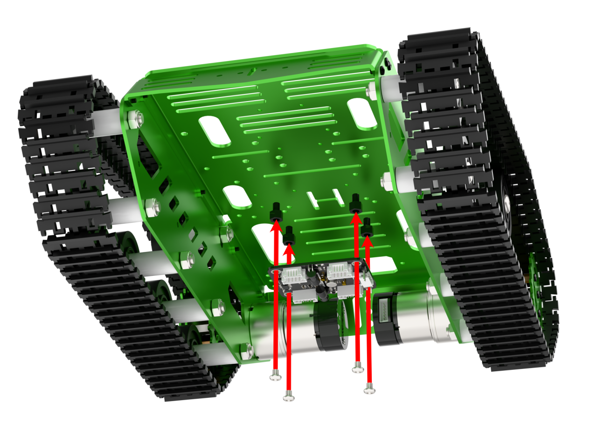

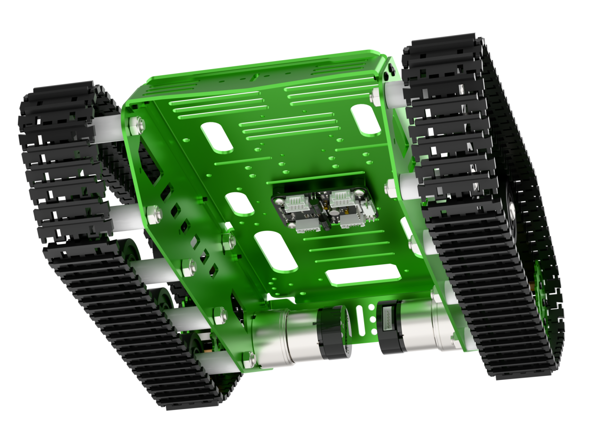


(2) Connect two motor wires to the M2 and M3 ports on the driver module, respectively. Secure the battery to the battery mounting plate using Velcro.

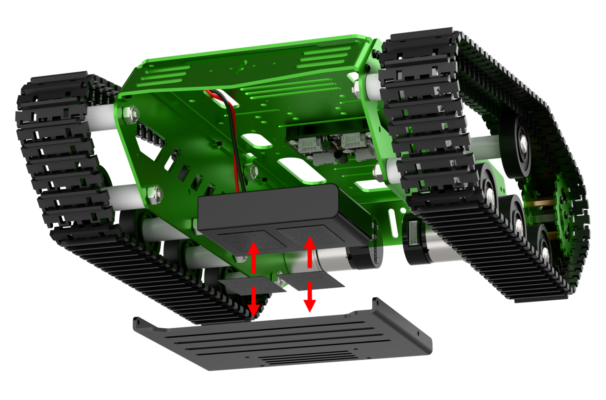

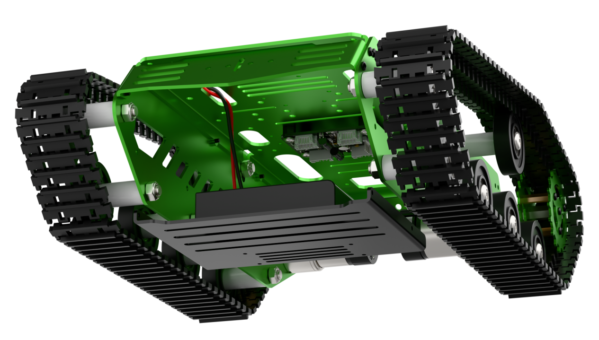

(3) Mount the battery plate onto the chassis using four M3*6 pan head screws.

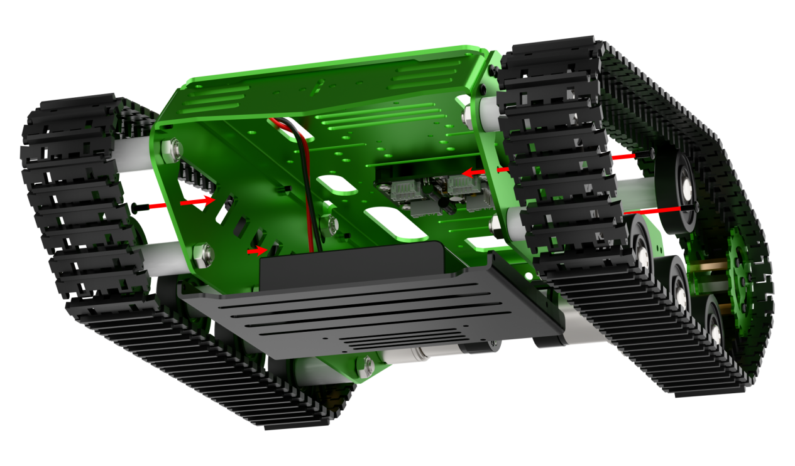

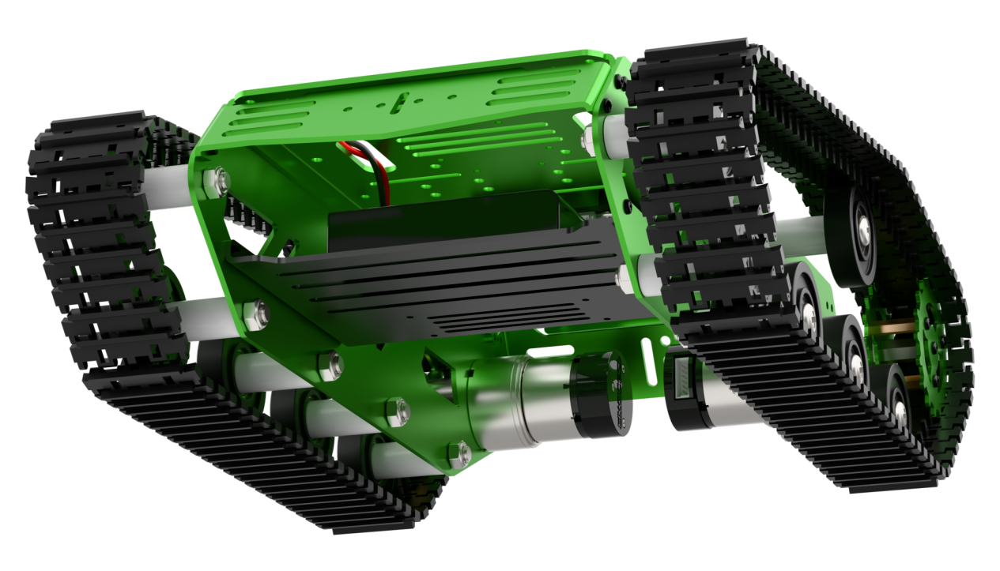

(4) Attach another set of four M4\*5+6 nylon standoffs to the chassis. Then mount the robotic arm onto the chassis using four M4\*6 and two M4*10 pan head screws.

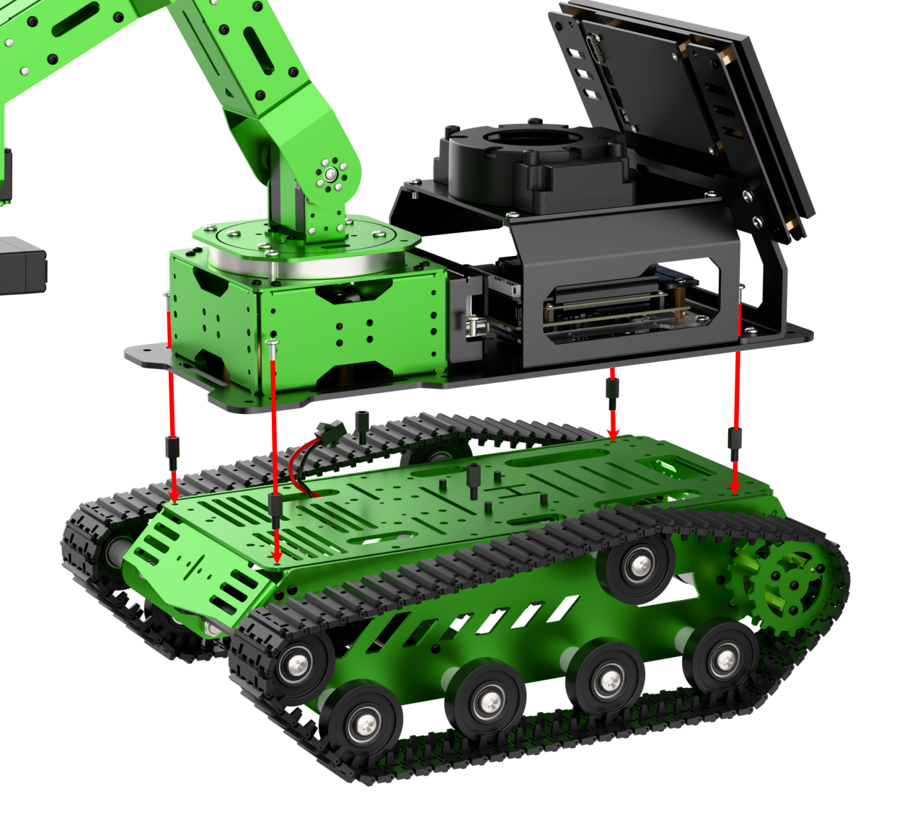

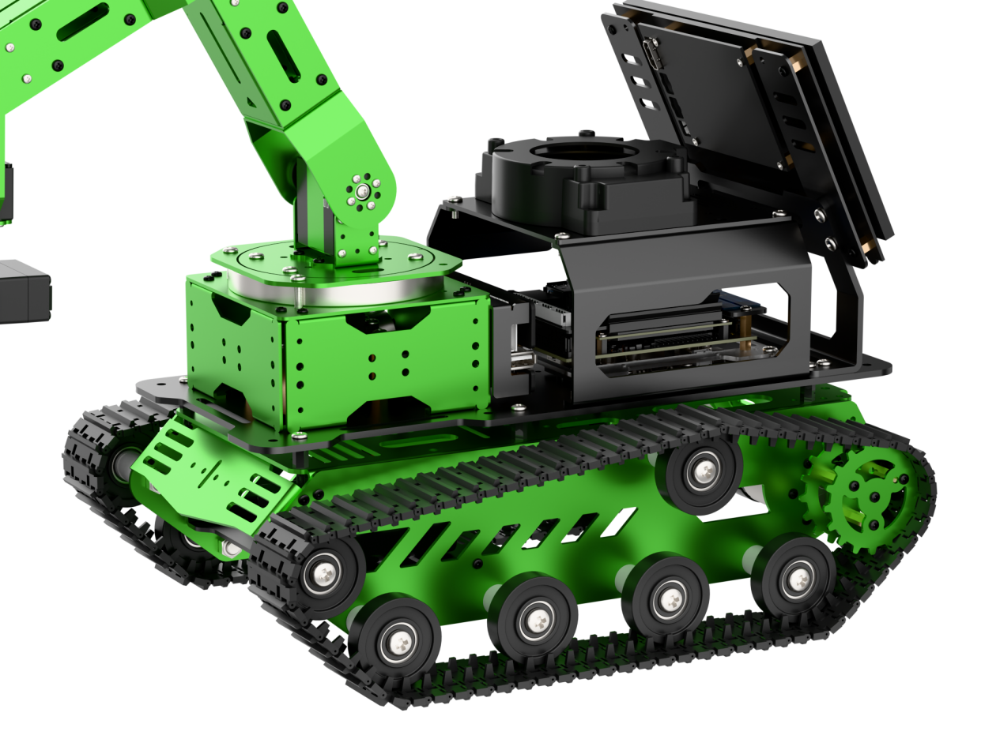

* **Wiring Instruction**

Connect the motor wire from the left rear wheel to the M2 port of the 4-channel encoder motor driver module. Connect the motor wire from the right rear wheel to the M3 port. Use a 4-pin cable to connect the encoder motor driver module to the IIC port on the Jetson expansion board. Use a 3-pin cable to connect the encoder motor driver module to the 3-pin port on the STM32 expansion board.

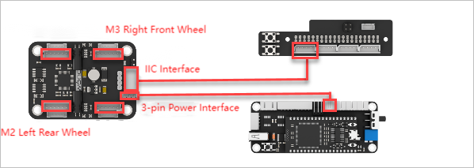

### 21.2.2 Selecting the Robot Type

JetArm's expansion accessories come in four types: tank chassis, Mecanum wheel chassis, sliding rail, and conveyor belt. After installation, you must switch the device version according to the installed accessory for proper operation.

:::{Note}
If you don't switch or select the wrong version, the motor may run unpredictably, causing malfunctions or even damaging the device.
:::

Step-by-step instructions:

(1) Power on the robotic arm and connect it to the remote control software NoMachine. For installation and connection of the remote desktop tool, see [1.JetArm User Manual -> 1.6 Development Environment Setup and Configuration](1.Getting_Ready.md#development-environment-setup-and-configuration).

(2) Double-click the model configuration tool on the desktop.


(3) Select the appropriate options based on the robotic arm version, camera version, and accessory type:

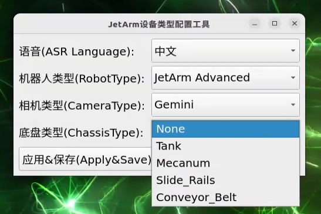

Tank refers to the tracked chassis. Mecanum refers to the mecanum wheel chassis. Slide_Rails refers to the slide rails. Conveyor_Belt refers to the conveyor belt.

(4) After making your selection, click **"Apply & Save"** to save the configuration.


(5) Click **"Restart"** to reload the configuration.

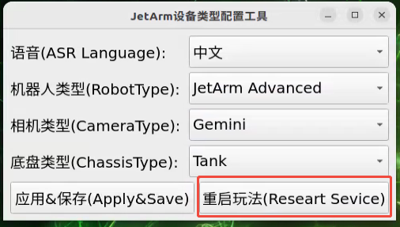

Wait for the buzzer to beep once—this indicates the restart is complete and the new configuration is now active.

### 21.2.3 APP Control

* **APP Installation**

:::{Note}

* Please grant all permissions requested during installation to ensure the app functions properly.

* Turn on your phone's GPS and Wi-Fi before opening the app.
  :::

(1) For Android devices:
You can find the app installation file in the directory: [2 Software Tools\APP Installation Package](resources_download.md). Transfer the APK file to your phone and install it.

(2) For iOS devices:

Go to the **App Store**, search for **"WonderAi"**, and download the app.


* **Connection Modes Overview**

The robot supports two network modes:

(1) AP Mode (Direct Connection): The controller creates a hotspot that your phone can connect to directly, but no Internet access in this mode.

(2) STA Mode (LAN Connection): The controller connects to a specified Wi-Fi network, and Internet access is available in this mode.

By default, the robot starts in AP direct connection mode. Regardless of whether the user chooses AP direct connection or STA LAN mode, the robot's features and functions remain the same.

:::Note}
We recommend starting with the AP direct connection mode to quickly explore and experience the robot's functions. You can switch to LAN mode later based on your specific needs.
:::

(1) Connecting in AP Mode (Recommended First Step)

**To use this mode, iOS devices must be running iOS 11.0 or above, and Android devices must be running Android 5.0 or above.**

Important for Android users: Make sure to enable all required permissions for the app in your phone settings to ensure proper functionality.

This section uses JetArm connecting to the Android app as an example. The same steps apply for iOS devices.

① Open the **WonderAi** app and select **"Advanced"** → **"JetArm"**.


② Tap the **"+"** button in the bottom-right corner and choose **"Direct Connection Mode"**.

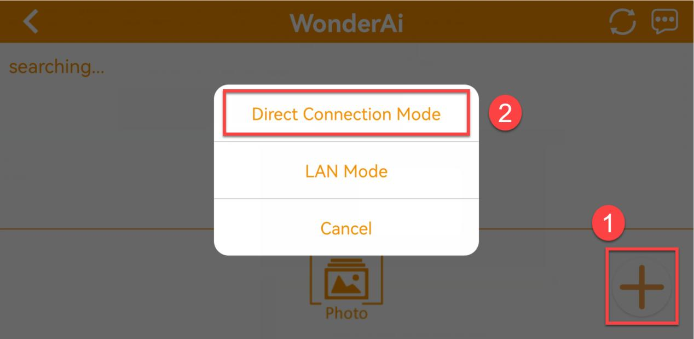

③ Tap **"Go to connect device hotspots"**, which will take you to the Wi-Fi settings page to connect the hotspot generated by the robot.


④ The hotspot starts with **"HW"** and connect to it by entering the password: **hiwonder**.

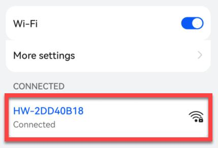

For iOS users: Make sure the Wi-Fi icon  appears in the status bar before switching back to the app, or the device might not be detected. If the app doesn't detect the device right away, tap the refresh icon  in the upper-right corner.

⑤ Go back to the **WonderAi** app, tap the corresponding robot icon, and enter the mode selection screen.

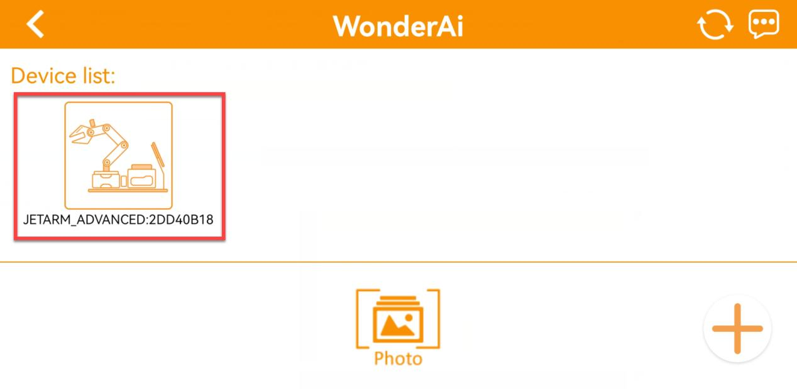

**If a message pops up saying "Network is unavailable, continue?", tap "Keep Connection" to proceed.**

⑥ If a message appears saying "**Whether to switch and enter the searched product interface?**", it means the wrong product was selected in Step 1. Tap "**CONFIRM**" to automatically switch to the correct version’s mode selection screen.

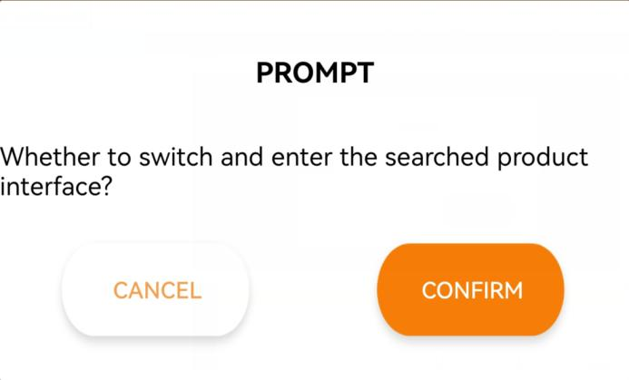

⑦ After tapping the robot icon, the mode selection screen will appear as shown below:

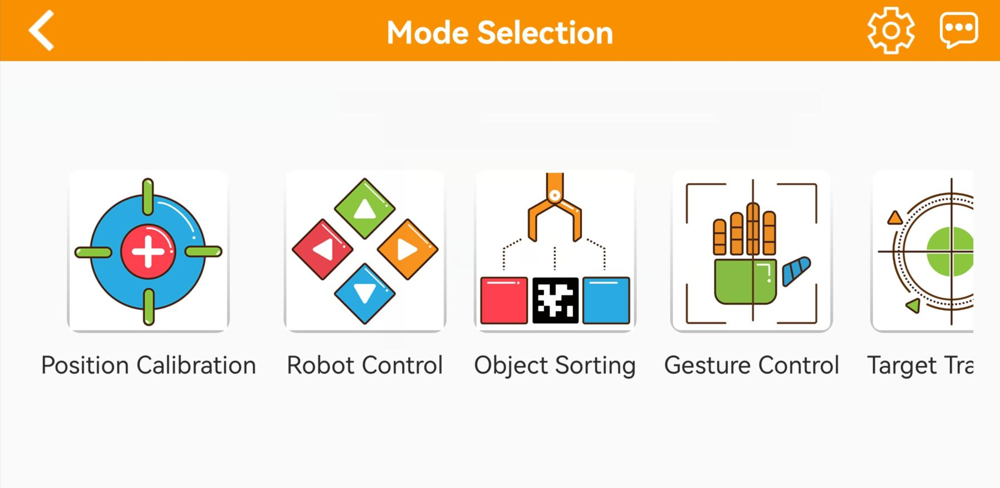

(2) LAN Mode Connection (Optional)

① First, connect your phone to a 5G Wi-Fi network. For example, connect to **"Hiwonder_5G."** If you are using a dual-band router with separate SSIDs, the 2.4G and 5G networks will have different names, for example, **"Hiwonder"** for 2.4G and **"Hiwonder_5G"** for 5G.


② Open the **WonderAi** app on your phone. Tap **"Advanced"** and select **"JetArm."**


③ Tap the **"+"** button in the bottom-right corner and choose **"LAN Mode"**.

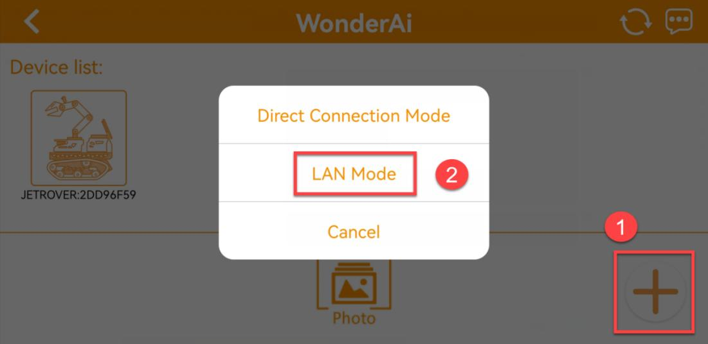

④ The app will prompt you to enter the Wi-Fi password for the network you're connected to. Make sure you enter the correct password, a wrong password will prevent the connection. After entering the password, tap **"OK"**.

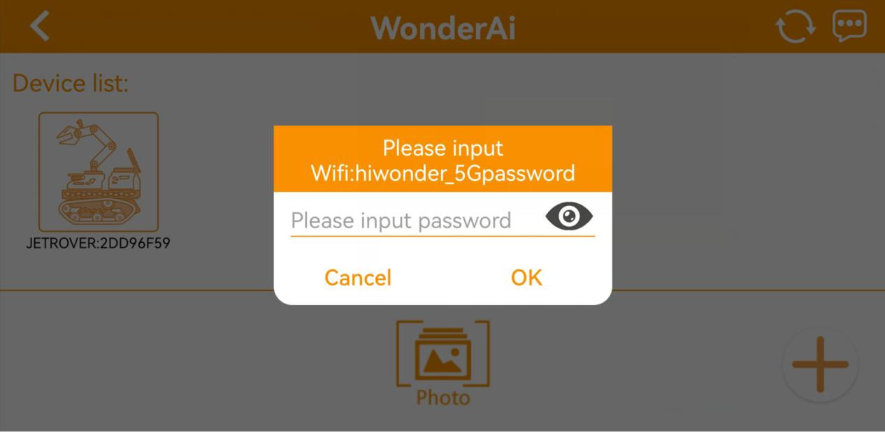

⑤ Tap **"Go to connect device hotspots"** to switch to the Wi-Fi settings.


⑥ In the Wi-Fi list, find the hotspot starting with **"HW"**, and connect to it using the password: **hiwonder**. After connecting, tap the **"Back"** button to return to the app.


⑦ You will see that the app has started connecting to the robot.

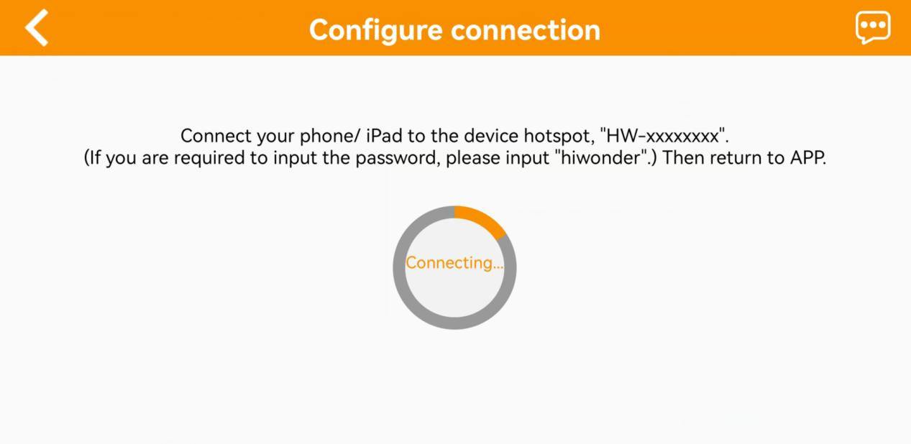

⑧ After a few seconds, the robot's icon and name will appear on the main screen. The LED1 indicator on the expansion board will stay on.


⑨ Long-press the corresponding icon of your robot in the app to view its assigned IP address and Device ID.

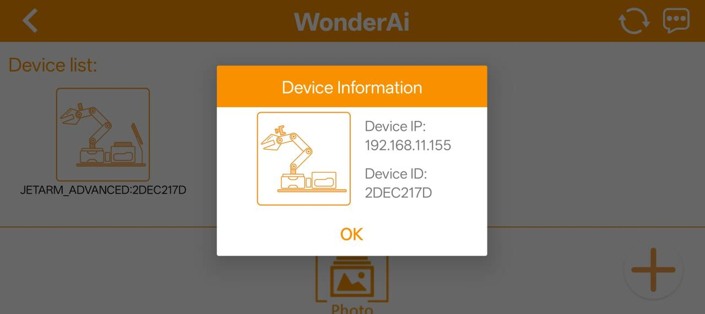

⑩ You can use this IP address in a remote desktop tool to establish a connection with the robot.

⑪ To switch from LAN mode back to direct connection mode, press and hold the **KEY1** button on the expansion board until the blue indicator light starts blinking. This indicates the mode has been switched successfully.

* **App Control Function**

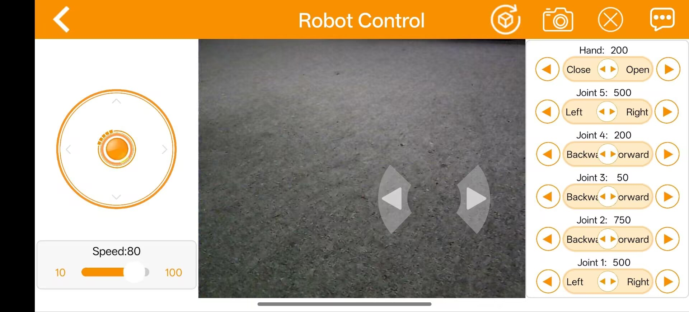

| | **Icon** | **Function** |
|:---|:--:|:--:|
| Live Video Feed | 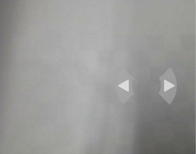 | The pan-tilt rotates left or right, and the gripper rotates clockwise or counterclockwise accordingly. |
| Chassis Control | 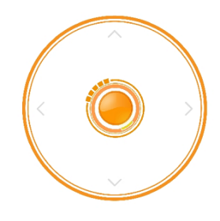 | Control the chassis to move forward, backward, and strafe left or right. |
| Speed Adjustment Slider |  | Adjust the movement speed of the robot chassis. |
| Steering Control |  | Manually control the chassis turning direction (left/right). |
| Reset button |  | Return the robotic arm to its default position. |
| Arm Control | 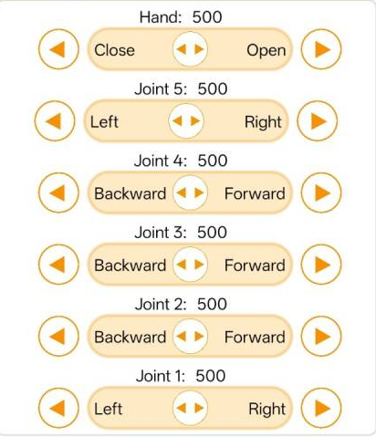 | Individually control each servo motor of the robotic arm. |

### 21.2.4 Wireless Handle Control

* **Getting Started**

(1) Before powering on the device, make sure the wireless handle receiver is properly inserted. This can be ignored if the receiver was pre-inserted at the factory.

(2) Pay attention to battery polarity when placing the batteries.

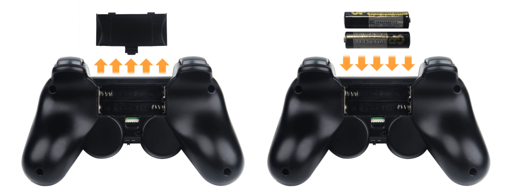

(3) Each time the robot is powered on, the APP auto-start service will launch which includes the wireless handle control service. If this service has not been closed, no additional actions are needed—simply connect and control.

(4) Since wireless handle signals can interfere with each other, it is recommended not to use this function when multiple robots are in the same area, to avoid misconnection or unintended control.

(5) After turning on the wireless handle, if it does not connect to the robot within 30 seconds, or remains unused for 5 minutes after connection, it will enter sleep mode automatically. To wake up the wireless handle and exit sleep mode, press the **"START"** button.

* **Device Connection**

(1) After the robot powers on, slide the wireless handle switch to the **"ON"** position. At this point, the red and green LED indicators on the wireless handle will start flashing simultaneously.

(2) Wait a few seconds for the robot and wireless handle to pair automatically. Once pairing is successful, the green LED will remain solid while the red LED turns off.


* **Control Modes**

The wireless handle supports two control modes: Coordinate Mode and Single Servo Mode. After a successful connection, the default mode is Coordinate Mode.

(1) Single Servo Mode: In this mode, the wireless handle buttons can be used to control the forward and reverse rotation of individual servos on the robotic arm.


Button Functions in Single Servo Mode:

| **Button** | **Function (from the robotic arm's first-person perspective)** |
|:---|:---|
| START | Reset the robotic arm |
| SELECT+START | Switch control mode (Single Servo / Coordinate) |
| UP / ↑ | Raise Servo 2 |
| DOWN / ↓ | Lower Servo 2 |
| LEFT / ← | Rotate Servo 1 to the left |
| RIGHT / → | Rotate Servo 1 to the right |
| Y | Close the gripper (Servo 10) |
| A | Open the gripper (Servo 10) |
| B | Rotate Servo 5 to the right (Gripper turns right) |
| X | Rotate Servo 5 to the left (Gripper turns left) |
| L1 | Raise Servo 3 |
| L2 | Lower Servo 3 |
| R1 | Raise Servo 4 |
| R2 | Lower Servo 4 |
| Left Joystick Forward | Move Chassis Forward |
| Left Joystick Backward | Move Chassis Backward |
| Right Joystick Left | Chassis Turn Left |
| Right Joystick Right | Chassis Turn Right |

(2) Coordinate Mode: In Coordinate Mode, the robotic arm moves as a whole along the X, Y, and Z axes and can also adjust its tilt angle based on button inputs.

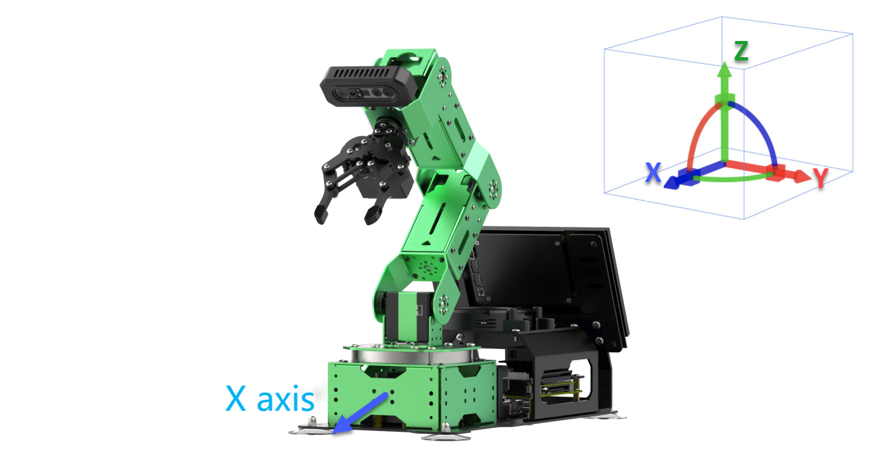

Button Functions in Coordinate Mode:

| **Button** | **Function (from the robotic arm's first-person perspective)** |
|:---|:---|
| START | Reset the robotic arm |
| SELECT+START | Switch control mode (Single Servo / Coordinate) |
| UP / ↑ | Move arm in the positive X direction (forward) |
| DOWN / ↓ | Move arm in the negative X direction (backward) |
| LEFT / ← | Move arm in the positive Y direction (left) |
| RIGHT / → | Move arm in the negative Y direction (right) |
| Y | Close the gripper (Servo 10) |
| A | Open the gripper (Servo 10) |
| B | Rotate Servo 5 to the right (Gripper turns right) |
| X | Rotate Servo 5 to the left (Gripper turns left) |
| L1 | Move arm upward along Z axis |
| L2 | Move arm downward along Z axis |
| R1 | Increase gripper pitch angle |
| R2 | Decrease gripper pitch angle |
| Left Joystick Forward | Move Chassis Forward |
| Left Joystick Backward | Move Chassis Backward |
| Right Joystick Left | Chassis Turn Left |
| Right Joystick Right | Chassis Turn Right |

Switching Between Modes: To switch between modes, press both **SELECT** and **START** buttons. A sound prompt indicates the switch was successful.

(1) Two beeps: Switched from Single Servo Mode to Coordinate Mode.

(2) Two beeps: Switched from Single Servo Mode to Coordinate Mode.

### 21.2.5 Target Tracking

When the camera detects a target color block, the robotic arm and chassis will follow the movement of that block.

* **Project Process**

First, subscribe to the topic published by the color recognition node to obtain detected color information.

Choose the target color. Once the target color is detected, obtain the center position of the target object in the image.

Finally, based on the target's relative position within the image frame, estimate the distance to the object. Then publish a motion control topic message to drive the chassis accordingly.

* **Enabling the Feature**

(1) Power on the robotic arm and connect it to the remote control software NoMachine. For installation and connection of the remote desktop tool, see [1. JetArm User Manual -> 1.6 Development Environment Setup and Configuration](1.Getting_Ready.md#development-environment-setup-and-configuration).

(2) Click the terminal icon  in the system desktop to open a command-line window.

(3) Enter the following command and press Enter to stop the auto-start service:

```bash
sudo systemctl stop start_app_node.service
```

(4) Entering the following command to start the feature.

```bash
ros2 launch chassis object_tracking_node.launch.py
```

(5) Once the program is launched successfully, you will see the following log messages printed in the terminal. A camera feed window will pop up automatically.


(6) Click on the object you want to track in the camera feed window. The system will automatically detect the color threshold of the selected object and set it as the tracking target.


(7) Open a new terminal window  and enter the following command to begin tracking:

```bash
ros2 service call /object_tracking/set_running std_srvs/srv/SetBool "{data: true}"
```

(8) To stop tracking, use the following command:

```bash
ros2 service call /object_tracking/set_running std_srvs/srv/SetBool "{data: false}"
```

(9) To exit the feature, press **Ctrl+C** in the terminal. If the program does not close successfully, try pressing **Ctrl+C** again.

(10) If you want to experience the mobile app features again later, enter the command and press Enter to start the app service. Wait for the robotic arm to return to its initial position — a beep from the buzzer will indicate it's ready.

```bash
sudo systemctl start start_app_node.service
```

* **Action Performed**

After launching the feature, place a red block within the field of view of the robotic arm's camera. The live video feed will highlight the detected target color, and the robotic arm with its chassis will continuously follow the movement of the red block.

* **launch File Analysis**

The Launch files are located at: [/home/ubuntu/ros2_ws/src/chassis/launch/object_tracking_node.launch.py](../_static/source_code/chassis.zip)

(1) launch_setup() Function:

{lineno-start=10}

```python
def launch_setup(context):
    compiled = os.environ['need_compile']
    if compiled == 'True':
        sdk_package_path = get_package_share_directory('sdk')
        chassis_package_path = get_package_share_directory('chassis')
        peripherals_package_path = get_package_share_directory('peripherals')
    else:
        sdk_package_path = '/home/ubuntu/ros2_ws/src/driver/sdk'
        chassis_package_path = '/home/ubuntu/ros2_ws/src/chassis'
        peripherals_package_path = '/home/ubuntu/ros2_ws/src/peripherals'


    object_tracking_node = GroupAction([
        IncludeLaunchDescription(
            PythonLaunchDescriptionSource(
                os.path.join(peripherals_package_path, 'launch/depth_camera.launch.py')),
            ),

        IncludeLaunchDescription(
            PythonLaunchDescriptionSource(
                os.path.join(sdk_package_path, 'launch/jetarm_sdk.launch.py')),
            ),

        IncludeLaunchDescription(
            PythonLaunchDescriptionSource(
                os.path.join(chassis_package_path, 'launch/chassis_controller_node.launch.py')),
            ),

        Node(
            package='chassis',
            executable='object_tracking',
            output='screen',
            ),
    ])

    return [
            object_tracking_node,
            ]
```

The main purpose of this function is to configure and launch a set of ROS2 nodes and programs to enable the robot's target tracking functionality in a specific context. The function follows these steps:

① Retrieve Compilation Status:

The function first reads a flag from the environment variable `need_compile` to determine whether related packages need to be recompiled. If the value of this variable is **'True'**, it indicates that compilation is required.

② Set Paths:

If compilation is needed, the function uses `get_package_share_directory` to obtain the paths of the `sdk`, `chassis`, and `peripherals` packages.

If compilation is not needed, it directly uses predefined paths such as [/home/ubuntu/ros2_ws/src/driver/sdk](../_static/source_code/sdk.zip), etc.

③ Define Nodes and Launch Items:

A `GroupAction` is created, which contains multiple `IncludeLaunchDescription` entries and a `Node`.

`IncludeLaunchDescription` is used to include other launch files:

* It includes `depth_camera.launch.py` to launch depth camera-related nodes.
* It includes `jetarm_sdk.launch.py` to launch SDK-related nodes.
* It includes `chassis_controller_node.launch.py` to launch nodes to control chassis.
* A `Node` is created to start the executable file `object_tracking`, which will output data to the screen.

④ Return the Launch Item List:

Finally, the function returns a list containing `object_tracking_node` and passes it to the `generate_launch_description` function, enabling ROS2's launch system to execute these configurations.

* **Python Source Code Analysis**

The Launch files are located at: [/home/ubuntu/ros2_ws/src/chassis/chassis/object_tracking.py](../_static/source_code/chassis.zip)

(1) Import the necessary libraries

{lineno-start=4}
```python
import os
import cv2
import math
import time
import queue
import rclpy
import threading
import numpy as np
import sdk.pid as pid
import sdk.misc as misc
import sdk.common as common
from chassis import mecanum
from rclpy.node import Node
from app.common import Heart
from cv_bridge import CvBridge
from sensor_msgs.msg import Image
from app.common import ColorPicker
from chassis_msgs.msg import Mecanum
from std_srvs.srv import SetBool, Trigger
from interfaces.srv import SetPoint, SetFloat64
from servo_controller_msgs.msg import ServosPosition
from rclpy.callback_groups import ReentrantCallbackGroup
from servo_controller.bus_servo_control import set_servo_position
```

① `os`: Python standard library for interacting with the operating system, such as file and directory operations.

② `cv2`: Computer vision library that provides image processing and vision functionalities like reading, processing, and displaying images.

③ `math`: Python's standard math library offering mathematical functions and constants such as trigonometric and logarithmic functions.

④ `queue`: Provides queue data structures designed for use in multithreaded environments.

⑤ `rclpy`: Python client library for ROS 2, used to create ROS 2 nodes and manage communications.

⑥ `threading`: Used for creating and managing threads to enable multithreaded programming.

⑦ `numpy`: A powerful numerical computing library offering array objects and a variety of mathematical functions, widely used in scientific computing and data processing.

⑧ `sdk.pid`: A custom PID controller module implementing the PID control algorithm.

⑨ `sdk.misc`: A custom module containing miscellaneous helper functions.

⑩ `sdk.common`: A custom module including common functions and constants.

⑪ `chassis.mecanum`: A custom module related to the mechatronic system or chassis control, specifically for controlling Mecanum wheels.

⑫ `rclpy.node.Node`: The ROS 2 node class used to define a ROS node and handle ROS messages.

⑬ `app.common.Heart`: A custom heartbeat monitoring feature used to check the status of the system or nodes.

⑭ `cv_bridge`: A bridging tool for converting image data formats between ROS and OpenCV.

⑮ `sensor_msgs.msg.Image`: ROS image message type used for transmitting image data.

⑯ `app.common.ColorPicker`: A custom module for color selection functionality.

⑰ `chassis_msgs.msg.Mecanum`: A custom message type for controlling chassis movement.

⑱ `std_srvs.srv.SetBool`: A standard ROS service used to set a boolean value, typically to enable or disable certain features.

⑲ `std_srvs.srv.Trigger`: A standard ROS service used to trigger an operation, typically for executing a one-time action.

⑳ `interfaces.srv.SetPoint`: A custom service used to set the position or target of a point.

㉑ `interfaces.srv.SetFloat64`: A custom service used to set a 64-bit floating-point value.

㉒ `servo_controller_msgs.msg.ServosPosition`: A custom message type for controlling the position of servo motors.

㉓ `servo_controller.bus_servo_control`: A custom module used for controlling servo motors.

(2) ObjectTracker Class

① `__init__` function: The constructor method of the class, automatically called when an instance is created. Used to initialize the object's state and attributes.

{lineno-start=29}
```python
    def __init__(self, color, node):
        self.node = node
        self.chassis_type = os.environ['CHASSIS_TYPE']
        self.camera_type = os.environ['CAMERA_TYPE']
        self.pid_yaw = pid.PID(0.01, 0.0, 0.001)
        self.pid_dist = pid.PID(0.002, 0.0, 0.00)
        self.last_color_circle = None
        self.lost_target_count = 0
        self.target_lab, self.target_rgb = color
        self.weight_sum = 1.0
        self.x_stop = 320
        self.Mecanum = mecanum.MecanumChassis()
        if self.camera_type == 'GEMINI':
            self.y_stop = 300
            self.pro_size = (640, 480)
        else:
            self.y_stop = 300
            self.pro_size = (640, 480)
```

**Environment Variables**

Uses `os.environ` to retrieve system environment variables `CHASSIS_TYPE` and `CAMERA_TYPE` to configure the robot's chassis type and camera type.

**Creates two PID controller instances:** `self.pid_yaw` and `self.pid_dist`.

* `pid_yaw` controls the robot's rotation (yaw axis) with proportional, integral, and derivative coefficients.
* `pid_dist` controls the robot's distance to the target, also configured with PID parameters.

**Attribute Initialization**

* `last_color_circle`: Initialized to `None`. Stores the last detected color circle.
* `lost_target_count`: Initialized to `0`. Tracks how many times the target has been lost.
* `target_lab` and `target_rgb`: Store the target color values in LAB and RGB color spaces.
* `weight_sum`: Initialized to `1.0`. Used for normalizing weighted calculations.
* `x_stop` and `y_stop`: Coordinates set for stopping positions.
* `Mecanum`: Instantiates a `MecanumChassis` object to control the robot chassis movement.

**Camera and Processing Initialization**

For different camera types (e.g., `GEMINI`), set different stopping coordinates (`y_stop`) and processing size (`pro_size`).

② `__call__` Method: This method processes the input image and calculates the robot's movement commands based on detected target colors.

**Initialization and Parameter Setup**

{lineno-start=49}
```python
        mecanum = Mecanum()
        velocity_x = 0.0
        velocity_y = 0.0
        angular_rate = 0.0
        h, w = image.shape[:2]
```

* Instantiate a `Mecanum` object to handle chassis control.
* Initialize velocity parameters, `velocity_x`, `velocity_y`, and `angular_rate` all set to `0.0`.
* Obtain the height (`h`) and width (`w`) of the input image.

**Image Preprocessing**

{lineno-start=54}
```python
        image = cv2.resize(image, self.pro_size)
        image = cv2.cvtColor(image, cv2.COLOR_RGB2LAB)  # Convert RGB to LAB space. RGB转LAB空间
        image = cv2.GaussianBlur(image, (5, 5), 5)
```

* Resize the input image to the predefined processing size (`self.pro_size`).
* Convert the image color space from RGB to LAB to improve the accuracy of color detection.
* Apply Gaussian blur to the image to reduce noise and minimize its impact on subsequent processing.

**Color Threshold Range Calculation**

{lineno-start=58}
```python
        min_color = [int(self.target_lab[0] - 50 * threshold * 2),
                     int(self.target_lab[1] - 50 * threshold),
                     int(self.target_lab[2] - 50 * threshold)]
        max_color = [int(self.target_lab[0] + 50 * threshold * 2),
                     int(self.target_lab[1] + 50 * threshold),
                     int(self.target_lab[2] + 50 * threshold)]
        target_color = self.target_lab, min_color, max_color
```

Based on the LAB values of the target color and the given threshold, calculate the minimum and maximum LAB values. These values are used to generate a binary mask that highlights regions in the image that closely match the target color.

**Mask Generation and Contour Detection**

{lineno-start=65}
```python
        mask = cv2.inRange(image, tuple(target_color[1]), tuple(target_color[2]))  # Binarization 二值化
        eroded = cv2.erode(mask, cv2.getStructuringElement(cv2.MORPH_RECT, (3, 3)))  # Erode 腐蚀
        dilated = cv2.dilate(eroded, cv2.getStructuringElement(cv2.MORPH_RECT, (3, 3)))  # Dilate 膨胀
        contours = cv2.findContours(dilated, cv2.RETR_EXTERNAL, cv2.CHAIN_APPROX_NONE)[-2]  # Find contours 找出轮廓
        contour_area = map(lambda c: (c, math.fabs(cv2.contourArea(c)),), contours)  # Calculate the area of each contour. 计算各个轮廓的面积
        contour_area = list(filter(lambda c: c[1] > 40, contour_area))  # Remove contours with area that is too small. 剔除>面积过小的轮廓
```

* Use `cv2.inRange` to create a binary mask, marking areas in the image that match the target color.
* Apply morphological operations (erosion and dilation) to the mask to eliminate noise and smooth the edges.
* Detect contours in the processed mask. Calculate the area of each contour and filter out those with an area smaller than 40 pixels.

**Target Tracking and Motion Control**

{lineno-start=71}
```python
        circle = None
        if len(contour_area) > 0:
            if self.last_color_circle is None:
                contour, area = max(contour_area, key=lambda c_a: c_a[1])
                circle = cv2.minEnclosingCircle(contour)
            else:
                (last_x, last_y), last_r = self.last_color_circle
                circles = map(lambda c: cv2.minEnclosingCircle(c[0]), contour_area)
                circle_dist = list(map(lambda c: (c, math.sqrt(((c[0][0] - last_x) ** 2) + ((c[0][1] - last_y) ** 2))),
                                       circles))
                circle, dist = min(circle_dist, key=lambda c: c[1])
                if dist < 100:
                    circle = circle
        if circle is not None:
            self.lost_target_count = 0
            (x, y), r = circle
            x = x / self.pro_size[0] * w
            y = y / self.pro_size[1] * h
            r = r / self.pro_size[0] * w

            cv2.circle(result_image, (self.x_stop, self.y_stop), 5, (255, 255, 0), -1)
            result_image = cv2.circle(result_image, (int(x), int(y)), int(r), (self.target_rgb[0],
                                                                               self.target_rgb[1],
                                                                               self.target_rgb[2]), 2)
```

* If valid contours are detected, compute the minimum enclosing circle for each contour. If no previous color circle was detected, select the contour with the largest area as the target.
* If a previous color circle exists, calculate the distance between the current and previous center points, and select the closest contour.
* If the distance between centers is less than 100 pixels, continue using the current detected center as the target.
* Once a valid target circle is found, update `lost_target_count`, scale the center coordinates back to the original image size, and draw the target marker on the image to visualize tracking.

**Control Command Calculation**

{lineno-start=95}
```python
            vx = 0
            vw = 0
            if abs(y - self.y_stop) > 20:
                self.pid_dist.update(y - self.y_stop)
                velocity_y = misc.map(common.set_range(self.pid_dist.output, -0.35, 0.35), -0.35, 0.35, -150, 150)
            else:
                self.pid_dist.clear()
            if abs(x - self.x_stop) > 20:
                self.pid_yaw.update(x - self.x_stop)
                if self.chassis_type == 'Mecanum':
                    velocity_x = misc.map(common.set_range(self.pid_yaw.output, -2, 2), -2, 2, 150, -150)
                elif self.chassis_type == 'Tank':
                    angular_rate = misc.map(common.set_range(self.pid_yaw.output, -2, 2), -2, 2, -150, 150)
            else:
                self.pid_yaw.clear()

            v, d = self.Mecanum.translation(velocity_x, velocity_y, fake=True)
            mecanum.velocity = v
            mecanum.direction = d
            mecanum.angular_rate = angular_rate
```

* Based on the deviation between the contour center and the predefined stopping coordinates (`x_stop` and `y_stop`), the system uses PID controllers to calculate the appropriate linear velocity and angular velocity commands.
* The computed velocities are clamped within a specified range to ensure safe and stable movement. Depending on the chassis type, Mecanum or Tank, the system generates corresponding control signals.

**Return Result:**

{lineno-start=115}
```python
        return result_image, mecanum
```

Finally, the method returns the processed image with visual markers, the updated `Mecanum` instance, which contains the calculated linear speed, direction, and angular velocity — ready to be used for controlling the robot's chassis.

(3) OjbectTrackingNode Class

① `__init__` function: The constructor method of the class, automatically called when an instance is created. Used to initialize the object's state and attributes.

**Initializing the ROS Client Library**

{lineno-start=118}
```python
        rclpy.init()
        super().__init__(name, allow_undeclared_parameters=True, automatically_declare_parameters_from_overrides=True)
```

Initialize ROS 2's Python client library to ensure the node can communicate with the ROS system.

Call the constructor of the `Node` class, assigning a node name and enabling undeclared parameters, and automatic declaration of parameters from overrides.

**Basic Attribute Initialization**

{lineno-start=121}
```python
        self.name = name
        self.set_callback = False
        self.color_picker = None
        self.tracker = None
        self.is_running = False
        self.threshold = 0.5
        self.dist_threshold = 0.3
        self.lock = threading.RLock()
        self.image_sub = None
        self.result_image = None
        self.image_height = None
        self.image_width = None
        self.bridge = CvBridge()
        self.image_queue = queue.Queue(2)
```

`self.name`: The name of the current node.

Additional attributes are initialized to manage node state control, image processing parameters, and thread safety mechanisms.

**Creating ROS Publishers and Subscribers**

{lineno-start=135}
```python
        self.chassis_pub = self.create_publisher(Mecanum, '/chassis_controller/command', 1)
        self.image_sub = self.create_subscription(Image, '/depth_cam/rgb/image_raw', self.image_callback, 1)  # Subscribe to the camera. 摄像头订阅
```

* `self.chassis_pub`: Publishes chassis control commands to the `/chassis_controller/command` topic.
* `self.joints_pub`: Publishes servo motor positions to the `servo_controller` topic.
* Subscribes to the `/depth_cam/rgb/image_raw` topic to receive image data. Incoming data is passed to the `self.image_callback` method for processing.

**Multiple ROS Services Created**

{lineno-start=138}
```python
        self.timer_cb_group = ReentrantCallbackGroup()
        self.client = self.create_client(Trigger, '/controller_manager/init_finish', callback_group=self.timer_cb_group)
        self.client.wait_for_service()

        self.set_running_srv = self.create_service(SetBool, '~/set_running', self.set_running_srv_callback)
        self.joints_pub = self.create_publisher(ServosPosition, 'servo_controller', 1)
        self.timer = self.create_timer(0.0, self.init_process, callback_group=self.timer_cb_group)
```

* `~/exit`: Exit the node.
* `~/set_running`: Set the node's running state.
* `~/set_target_color`: Set the target color to track.
* `~/get_target_color`: Retrieve the currently set target color.
* `~/set_threshold`: Set the color detection threshold.

**Starting the Main Thread:**

{lineno-start=146}
```python
    def init_process(self):
        self.timer.cancel()
        set_servo_position(self.joints_pub, 1, ((10, 300), (5, 500), (4, 210), (3, 40), (2, 665), (1, 500)))
        time.sleep(1.0)
        threading.Thread(target=self.main, daemon=True).start()
```

A background thread is launched to run the `self.main` method, ensuring continuous operation of the main node and consistent data processing.

② main Function: Responsible for running a continuous loop that processes image data, displays the image window, sets up mouse event callbacks, and, under specific conditions, publishes control commands and shuts down the ROS node.

{lineno-start=152}
```python
    def main(self):
        while True:
            try:
                image = self.image_queue.get(block=True, timeout=1)
            except queue.Empty:
                continue

            result = cv2.cvtColor(image, cv2.COLOR_RGB2BGR)
            cv2.imshow("result", result)
            if not self.set_callback:
                self.set_callback = True
                # Set callback function for mouse clicking event. 设置鼠标点击事件的回调函数
                cv2.setMouseCallback("result", self.mouse_callback)
            key = cv2.waitKey(1)
        self.chassis_pub.publish(Mecanum())
        rclpy.shutdown()
```

**Continuous Image Processing Loop**

The function enters an infinite loop, repeatedly retrieving image data from the `self.image_queue`.

It uses the `get` method with a 1-second timeout to wait for an image. If no image is received within the timeout, a `queue.Empty` exception is raised, and the loop continues to the next iteration using `continue`.

**Image Processing and Display**

* The received image is converted from RGB to BGR color space, as OpenCV uses BGR by default.
* The processed image is displayed in a window titled **"result"** using OpenCV's `imshow` function.

**Setting Mouse Callback**

Before setting the mouse callback, the program checks whether it has already been set using the flag `self.set_callback`.

If the callback hasn't been set yet, set `self.set_callback` to `True`. `cv2.setMouseCallback` is called to bind the `self.mouse_callback` method to the **"result"** window. This allows the program to respond to mouse events in the image window and trigger appropriate actions.

**Keyboard Event Listener**

Uses `cv2.waitKey(1)` to check for keyboard input every millisecond.

**Publishing Commands and Shutting Down the ROS Node**

After the loop ends, a `Mecanum` type message is published to `chassis_pub`. This is typically used to control the robot's chassis or mobile platform.

Calls `rclpy.shutdown()` to shut down the ROS 2 client library and terminate the node.

③ mouse_callback Function: This function handles mouse event callbacks, specifically responding to left mouse button clicks in the image window.

{lineno-start=169}
```python
    def mouse_callback(self, event, x, y, flags, param):
        if event == cv2.EVENT_LBUTTONDOWN:
            msg = SetPoint.Request()
            if self.image_height is not None and self.image_width is not None:
                msg.data.x = x / self.image_width
                msg.data.y = y / self.image_height
                self.set_target_color_srv_callback(msg, SetPoint.Response())
```

**Detecting Left-Click Events:**

Checks if the mouse event is of type `EVENT_LBUTTONDOWN`. Only executes the following logic when the left mouse button is clicked.

**Logging Click Coordinates:**

Uses the logger (`get_logger()`) to log the `x` and `y` coordinates of the click. This is useful for debugging and monitoring user interaction.

**Creating and Configuring the Request Message:**

* Creates a `SetPoint.Request` object to hold the data for the target point.
* Verifies that the image height and width have been initialized, preventing division by `None`.
* Normalizes the clicked `x` and `y` coordinates by dividing them by the image's width and height. This converts the absolute pixel values to relative ratios, making the data adaptable to different image resolutions.

**Calling the Service Callback Function:**

Passes the configured request (`msg`) and an empty response object (`SetPoint.Response()`) to the `set_target_color_srv_callback` method. This is typically used to interact with a ROS service, passing the selected point to the server for further processing — such as setting the target color or target position based on user input.

④ set_target_color_srv_callback Function: This is a ROS2 service callback used to handle client requests for setting a target color.

{lineno-start=177}
```python
    def set_target_color_srv_callback(self, request, response):
        self.get_logger().info('\033[1;32m%s\033[0m' % 'set_target_color')
        with self.lock:
            x, y = request.data.x, request.data.y
            if x == -1 and y == -1:
                self.color_picker = None
                self.tracker = None
            else:
                self.tracker = None
                self.color_picker = ColorPicker(request.data, 10)
            self.chassis_pub.publish(Mecanum())
        response.success = True
        response.message = "set_target_color"
        return response
```

**Thread Locking:**

Uses `with self.lock:`: To ensure the following operations are thread-safe in a multithreaded environment, preventing race conditions.

**Retrieving Request Data**

Extracts the `x` and `y` coordinates from `request.data`.

**Conditional Logic:**

* If both `x` and `y` are equal to `-1`, set `self.color_picker` and `self.tracker` to `None`, indicating that the current color selection and tracking should be canceled.
* Otherwise, set `self.tracker` to `None`.

Create a new instance of `ColorPicker`, passing in `request.data` and the value `10` for color selection initialization.

**Publishing a Message:**

Publishes a `Mecanum` message using `self.chassis_pub.publish(Mecanum())`. This controls the movement of the robot chassis or triggers related behavior.

**Setting the Response:**

* Sets `response.success` = `True` to indicate the operation was successful.
* Sets `response.message` = **"set_target_color"** to provide feedback about the action.

Returns the response object.

⑤ get_target_color_srv_callback Function: A service callback function that handles requests for retrieving the currently selected target color.

{lineno-start=192}
```python
    def set_running_srv_callback(self, request, response):
        with self.lock:
            self.is_running = request.data
            if self.is_running:
                self.get_logger().info('\033[1;32m%s\033[0m' % 'set_running')
            else:
                self.chassis_pub.publish(Mecanum())
                self.get_logger().info('\033[1;32m%s\033[0m' % 'stop')
        response.success = True
        response.message = "set_running"
        return response
```

**self.lock::**

Uses the thread lock `self.lock` to ensure that access to shared resources is thread-safe, such as `self.is_running`. This prevents race conditions in a multithreaded environment.

**self.is_running = request.data:**

Assigns the data field from the request to `self.is_running`. `request.data` is a boolean indicating whether a task should be started or stopped.

**self.is_running::**

Checks if `self.is_running` is `True`. `True` means the task should be started.

**self.get_logger().info**

Uses ROS 2's built-in logging mechanism to print a colored log message. `\033[1;32m` is an ANSI escape sequence used to set the text color to green, while `\033[0m` resets the text color to the default. The log message **"set_running"** indicates that the task is currently being started.

**else:**

If `self.is_running` is `False`, it indicates the task needs to be stopped.

**self.chassis_pub.publish(Mecanum()):**

Publish a `Mecanum` message to `self.chassis_pub`. This message type controls the chassis movement. Publishing it here signals the chassis to stop moving.

**self.get_logger().info('\033[1;32m%s\033[0m' % 'stop'):**

This prints the word **stop** with color, indicating the task is stopping.

**response.success = True:**

`success` is set to `True` to indicate the request was handled successfully.

**response.message = "set_running":**

`message` is set to **"set_running"**, returning this as feedback.

**return response:**

Returns the service response, concluding the callback function.

⑥ image_callback Function: Handles incoming image data for color recognition and line tracking, and updates related control commands.

**Image Format Conversion:**

{lineno-start=204}
```python
        # Convert RGB format of ROS to that of OpenCV. 将ros格式(rgb)转为opencv的rgb格式
        cv_image = self.bridge.imgmsg_to_cv2(ros_image, "rgb8")
        rgb_image = np.array(cv_image, dtype=np.uint8)
        self.image_height, self.image_width = rgb_image.shape[:2]
```

The function first converts a ROS image message, usually in RGB8 format, to an OpenCV-compatible RGB image, stored in the variable `cv_image`. Then, it converts the image to a NumPy array and extracts the image's height and width.

**Result Image Initialization:**

{lineno-start=210}
```python
        result_image = np.copy(rgb_image)  # The image used for display the result.  显示结果用的画面
```

Create `result_image` as a copy of `rgb_image` to be used for displaying or processing results later.

**Thread Safety Handling:**

{lineno-start=211}
```python
        with self.lock:
```

Use `with self.lock` to ensure thread safety, preventing data races in a multithreaded environment.

**Color Picker Handling:**

{lineno-start=212}
```python
            # Color picker and object tracking are mutually exclusive. If the color picker exists, start picking colors. 颜色拾取器和识别追踪互斥, 如果拾取器存在就开始拾取
            if self.color_picker is not None:  # Color pick exists. 拾取器存在
                target_color, result_image = self.color_picker(rgb_image, result_image)
                if target_color is not None:
                    self.color_picker = None
                    self.tracker = ObjectTracker(target_color, self)
```

* If a color picker exists (`self.color_picker` is not `None`), call the color picker to process the current image and extract the target color and update the `result_image`.
* If a target color is successfully captured, clear the color picker. Initialize a new object tracker (`ObjectTracker`) and record relevant information about the target color.

**Object Tracking:**

{lineno-start=218}
```python
            else:
                if self.tracker is not None:
                    try:
                        result_image, mecanum = self.tracker(rgb_image, result_image, self.threshold)
                        if self.is_running:
                            self.chassis_pub.publish(mecanum)
                        else:
                            self.tracker.pid_dist.clear()
                            self.tracker.pid_yaw.clear()
                    except Exception as e:
                        self.get_logger().error(str(e))
```

If an object tracker exists, which means `self.tracker` is not `None`, use the tracker to process the image. After processing, update the `result_image` accordingly. Depending on the tracker's status, publish movement commands to the chassis (`mecanum`) and log information about the movement speed and direction.

**Image Queue Management:**

{lineno-start=229}
```python
        if self.image_queue.full():
            # Discard the oldest image if the queue is full. 如果队列已满，丢弃最旧的图像
            self.image_queue.get()
            # Put image into the queue. 将图像放入队列
        self.image_queue.put(result_image)
```

If the image queue is full, discard the oldest image to ensure the queue contains only the latest images. Then, put the processed image into the queue for further use.

⑦ main Function: Serves as the standard Python program entry point, responsible for initializing and running the `ObjectTrackingNode` node.

{lineno-start=235}
```python
def main():
    node = OjbectTrackingNode('object_tracking')
    rclpy.spin(node)
    node.destroy_node()
    rclpy.shutdown()
```

### 21.2.6 Line Following

When the camera detects a line of the target color, the robotic arm chassis will follow the line forward.

* **Project Process**

First, subscribe to the topic published by the color recognition node to obtain detected color information.

Choose the target color. Once the target color is matched, define three ROI areas to determine the direction of the line.

Based on the line direction, publish motion control messages to command the chassis movement.

* **Enabling the Feature**

(1) Power on the robotic arm and connect it to the remote control software NoMachine. For installation and connection of the remote desktop tool, see [1. JetArm User Manual -> 1.6 Development Environment Setup and Configuration](1.Getting_Ready.md#development-environment-setup-and-configuration).

(2) Click the terminal icon  in the system desktop to open a command-line window.

(3) Enter the following command and press Enter to stop the auto-start service:

```bash
sudo systemctl stop start_app_node.service
```

(4) Entering the following command to start the feature.

```bash
ros2 launch chassis line_following_node.launch.py
```

(5) Once the program is launched successfully, you will see the following log messages printed in the terminal. A camera feed window will pop up automatically.


(6) Click on the line you want to track in the camera feed window. The system will automatically detect the color threshold of the selected line and set it as the tracking target.


(7) Open a new terminal window  and enter the following command to begin tracking:

```bash
ros2 service call /line_following/set_running std_srvs/srv/SetBool "{data: true}"
```

(8) To exit the feature, press **Ctrl+C** in the terminal. If the program does not close successfully, try pressing **Ctrl+C** again.

(9) If you want to experience the mobile app features again later, enter the command and press Enter to start the app service. Wait for the robotic arm to return to its initial position — a beep from the buzzer will indicate it's ready.

```bash
sudo systemctl start start_app_node.service
```

* **Project Outcome**

After starting the feature, place the robotic arm behind the target line. Once the target line is selected and line following begins, the robotic arm chassis will move forward while maintaining alignment with the center of the line.

* **launch File Analysis**

The Launch files are located at: [/home/ubuntu/ros2_ws/src/chassis/launch/line_following_node.launch.py](../_static/source_code/chassis.zip)

(1) launch_setup() Function:

The main purpose of this function is to configure and launch a set of ROS2 nodes and programs to enable the robot's target tracking functionality in a specific context. The function follows these steps:

① Retrieve Compilation Status:

The function first reads a flag from the environment variable `need_compile` to determine whether related packages need to be recompiled. If the value of this variable is **'True'**, it indicates that compilation is required.

② Set Paths:

If compilation is needed, the function uses `get_package_share_directory` to obtain the paths of the `sdk`, `chassis`, and `peripherals` packages.

If compilation is not needed, it directly uses predefined paths such as [/home/ubuntu/ros2_ws/src/driver/sdk](../_static/source_code/sdk.zip), etc.

③ Define Nodes and Launch Items:

A `GroupAction` is created, which contains multiple `IncludeLaunchDescription` entries and a `Node`.

`IncludeLaunchDescription` is used to include other launch files:

* It includes `depth_camera.launch.py` to launch depth camera-related nodes.
* It includes `jetarm_sdk.launch.py` to launch SDK-related nodes.
* It includes `chassis_controller_node.launch.py` to launch nodes to control chassis.
* A `Node` is created to start the executable file `line_following`, which will output data to the screen.

④ Return the Launch Item List:

Finally, the function returns a list containing `object_tracking_node` and passes it to the `generate_launch_description` function, enabling ROS2's launch system to execute these configurations.

* **Python Source Code Analysis**

Python source code files locate at: [/home/ubuntu/ros2_ws/src/chassis/launch/line_following_node.launch.py](../_static/source_code/chassis.zip)

(1) Import the necessary libraries

{lineno-start=4}

```python
import os
import cv2
import math
import time
import rclpy
import queue
import threading
import numpy as np
import sdk.pid as pid
import sdk.misc as misc
import sdk.common as common
from rclpy.node import Node
from app.common import Heart
from cv_bridge import CvBridge
from app.common import ColorPicker
from chassis_msgs.msg import Mecanum
from std_srvs.srv import SetBool, Trigger
from sensor_msgs.msg import Image, LaserScan
from interfaces.srv import SetPoint, SetFloat64
from servo_controller_msgs.msg import ServosPosition
from rclpy.qos import QoSProfile, QoSReliabilityPolicy
from rclpy.callback_groups import ReentrantCallbackGroup
from servo_controller.bus_servo_control import set_servo_position
```

① `os`: Provides functionality to interact with the operating system, such as retrieving environment variables and file paths.

② `cv2`: A powerful computer vision library specialized in image and video processing, including reading, processing, displaying, and analyzing images.

③ `math`: Python’s math library offering basic mathematical functions and constants, such as trigonometric functions and arithmetic operations.

④ `rclpy`: ROS 2’s Python client library for Python developers, used to create ROS 2 nodes and handle message communication.

⑤ `queue`: Provides thread-safe queues to facilitate data transfer and synchronization between multiple threads.

⑥ `threading`: Offers thread management capabilities to implement multithreaded applications.

⑦ `numpy`: A numerical computation library supporting large multi-dimensional arrays and matrices, along with numerous mathematical functions.

⑧ `sdk.pid`: A custom module implementing the PID control algorithm, commonly used for feedback control systems.

⑨ `sdk.misc`: A custom miscellaneous module containing various utility functions and tools that simplify the main program logic.

⑩ `sdk.common`: A collection of general-purpose utility functions designed to support code reuse during development.

⑪ `rclpy.node.Node`: The ROS 2 node class, the base class for all ROS nodes, providing core functionalities for publishers, subscribers, and services.

⑫ `app.common.Heart`: A custom module for heartbeat detection to monitor the system’s operational status.

⑬ `cv_bridge`: Provides tools for converting between ROS image messages and OpenCV image formats, enabling the use of OpenCV for image processing within ROS.

⑭ `app.common.ColorPicker`: A custom module used for handling or selecting specific colors.

⑮ `chassis_msgs.msg.Mecanum`: A custom message type used to send motion commands related to the robot chassis.

⑯ `std_srvs.srv.SetBool`: A standard ROS service used to set a boolean value.

⑰ `std_srvs.srv.Trigger`: A standard ROS service used to trigger a one-time operation, typically for controlling device power or executing a specific action.

⑱ `interfaces.srv.SetPoint`: A custom service for setting the position of a target point.

⑲ `interfaces.srv.SetFloat64`: A custom service used to set a 64-bit floating-point value.

⑳ `servo_controller_msgs.msg.ServosPosition`: A custom message type for controlling servo motor positions.

㉑ `servo_controller.bus_servo_control`: A custom module for controlling servo motors.

㉒ `rclpy.qos`: Provides classes for Quality of Service (QoS) configurations in ROS 2, used to define message reliability, latency, and other communication parameters.

(2) LineFollower Class

① `__init__` function: The constructor method of the class, automatically called when an instance is created. Used to initialize the object’s state and attributes.

{lineno-start=29}

```python
    def __init__(self, color, node):
        self.node = node
        self.target_lab, self.target_rgb = color
        if os.environ['CAMERA_TYPE'] == 'GEMINI':
            self.rois = ((0.9, 0.95, 0, 1, 0.7), (0.8, 0.85, 0, 1, 0.2), (0.7, 0.75, 0, 1, 0.1))
        else:
            self.rois = ((0.81, 0.83, 0, 1, 0.7), (0.69, 0.71, 0, 1, 0.2), (0.57, 0.59, 0, 1, 0.1))
        self.weight_sum = 1.0
```

**Node Setup:**

Assigns the node parameter passed to the constructor to the instance attribute `self.node`.

**Target Color Setup:**

Splits the passed-in color tuple `color` into two attributes: `target_lab` stores the target color in LAB color space, and `target_rgb` stores the target color in RGB color space.

**Define Regions of Interest (ROI):**

Selects different ROIs based on the value of the environment variable `CAMERA_TYPE`. If the camera type is `GEMINI`, sets a specific set of ROI values, otherwise, sets another set of ROI values.

**Initialize Weight Sum:**

Sets `self.weight_sum` to `1.0` for subsequent calculations or processing.

(3) get_area_max_contour Function: Its primary function is to find the contour with the largest area from a given set of contours, where the area exceeds a specified threshold.

{lineno-start=38}

```python
    def get_area_max_contour(self, contours, threshold=100):
        '''
        Get the contour of the largest area.获取最大面积对应的轮廓
        :param contours:
        :param threshold:
        :return:
        '''
        contour_area = zip(contours, tuple(map(lambda c: math.fabs(cv2.contourArea(c)), contours)))
        contour_area = tuple(filter(lambda c_a: c_a[1] > threshold, contour_area))
        if len(contour_area) > 0:
            max_c_a = max(contour_area, key=lambda c_a: c_a[1])
            return max_c_a
        return None
```

**Contour Area Calculation:**

Uses `cv2.contourArea()` to calculate the area of each contour and pairs each contour with its area in a tuple for further processing.

**Contour Filtering:**

Use the `filter()` function to keep only contours with an area greater than the specified threshold.

**Find Maximum Contour:**

If any contours meet the area condition, use the `max()` function to find the contour with the largest area.

**Return Result:**

If a largest contour is found, the function returns both the contour and its area. If no contour meets the criteria, the function returns `None`.

(4) `__call__` Function: The main purpose of this function is to process the input image to identify specific Regions of Interest (ROIs) and calculate their center positions and deflection angles.

**Color Range Calculation:**

{lineno-start=53}

```python
        status = True
        centroid_sum = 0
        h, w = image.shape[:2]
        min_color = [int(self.target_lab[0] - 50 * threshold * 2),
                     int(self.target_lab[1] - 50 * threshold),
                     int(self.target_lab[2] - 50 * threshold)]
        max_color = [int(self.target_lab[0] + 50 * threshold * 2),
                     int(self.target_lab[1] + 50 * threshold),
                     int(self.target_lab[2] + 50 * threshold)]
        target_color = self.target_lab, min_color, max_color
```

Based on the LAB values of the target color and a given threshold, compute the minimum and maximum color values. These color ranges are used for subsequent image processing to determine which parts belong to the target color.

**ROI Processing:**

{lineno-start=63}

```python
        for roi in self.rois:
            blob = image[int(roi[0]*h):int(roi[1]*h), int(roi[2]*w):int(roi[3]*w)]  # Intercept roi 截取roi
            img_lab = cv2.cvtColor(blob, cv2.COLOR_RGB2LAB)  # Convert rgb into lab. rgb转lab
            img_blur = cv2.GaussianBlur(img_lab, (3, 3), 3)  # Perform Gaussian filtering to reduce noise. 高斯模糊去噪
            mask = cv2.inRange(img_blur, tuple(target_color[1]), tuple(target_color[2]))  # Image binarization 二值化
            eroded = cv2.erode(mask, cv2.getStructuringElement(cv2.MORPH_RECT, (3, 3)))  # Corrode 腐蚀
            dilated = cv2.dilate(eroded, cv2.getStructuringElement(cv2.MORPH_RECT, (3, 3)))  # Dilate 膨胀
```

The function iterates over predefined target ROIs, performing the following steps for each ROI:

* Crop the image block within the ROI and convert it from RGB color space to LAB color space.
* Apply Gaussian blur to reduce noise in the image block.
* Create a binary mask using thresholding to identify areas within the specified color range.
* Apply morphological operations (erosion and dilation) to optimize the mask and extract contours.

**Contour Analysis:**

{lineno-start=70}

```python
            contours = cv2.findContours(dilated, cv2.RETR_EXTERNAL, cv2.CHAIN_APPROX_TC89_L1)[-2]  # Find the contour 找轮廓
            max_contour_area = self.get_area_max_contour(contours, 100)  # Get the contour corresponding to the largest contour. 获取最大面积对应轮廓
            if max_contour_area is not None:
                rect = cv2.minAreaRect(max_contour_area[0])  # Minimum circumscribed rectangle 最小外接矩形
                box = np.intp(cv2.boxPoints(rect))  # Four corners 四个角
                for j in range(4):
                    box[j, 1] = box[j, 1] + int(roi[0]*h)
                cv2.drawContours(result_image, [box], -1, (0, 255, 255), 2)  # Draw the rectangle composed of four points. 画出四个点组成的矩形
```

The function searches for contours within the mask. If a largest-area contour is found, it calculates the minimum bounding rectangle around it and draws this rectangle on the result image. This provides visual support for detecting the target area.

**Center Point Calculation:**

{lineno-start=79}

```python
                # Acquire the diagonal points of the rectangle. 获取矩形对角点
                pt1_x, pt1_y = box[0, 0], box[0, 1]
                pt3_x, pt3_y = box[2, 0], box[2, 1]
                # Center point of the line. 线的中心点
                line_center_x, line_center_y = (pt1_x + pt3_x) / 2, (pt1_y + pt3_y) / 2

                cv2.circle(result_image, (int(line_center_x), int(line_center_y)), 5, (0, 0, 255), -1)   # Draw the center point. 画出中心点
                centroid_sum += line_center_x * roi[-1]
```

For each detected rectangle, calculate the coordinates of its center point. Accumulate these center points proportionally to compute an overall center position.

**Deflection Angle Calculation:**

{lineno-start=90}

```python
        if centroid_sum == 0:
            return result_image, None, status
        center_pos = centroid_sum / self.weight_sum  # Calculate the center point according to the ratio. 按比重计算中心点
        deflection_angle = -math.atan((center_pos - (w / 2.0)) / (h / 2.0))   # Calculate the line angle. 计算线角度
```

Based on the overall center position, calculate a deflection angle indicating how far the center deviates from the image center.

**Return Result:**

{lineno-start=94}

```python
        return result_image, deflection_angle, status
```

Finally, the function returns the processed result image, calculated deflection angle (if available), and a status flag indicating whether the processing was successful.

(5) LineFollowingNode Class:

① `__init__` function: The constructor method of the class, automatically called when an instance is created. Used to initialize the object’s state and attributes.

**Initialization of ROS 2:**

{lineno-start=97}

```python
        rclpy.init()
        super().__init__(name, allow_undeclared_parameters=True, automatically_declare_parameters_from_overrides=True)
```

Call `rclpy.init()` to initialize ROS2. This step is a necessary prerequisite for starting any ROS2 node.

Call the parent class constructor to initialize the ROS2 node and configure its name.

**Key Attributes and Member Variables Initialization:**

{lineno-start=101}

```python
        self.name = name
        self.set_callback = False
        self.is_running = False
        self.color_picker = None
        self.follower = None
        self.scan_angle = math.radians(45)
        self.pid = pid.PID(0.01, 0.0, 0.0)
        self.empty = 0
        self.threshold = 0.5
        self.stop_threshold = 0.4
        self.lock = threading.RLock()
        self.image_sub = None
        self.image_height = None
        self.image_width = None
        self.bridge = CvBridge()
        self.image_queue = queue.Queue(2)
```

**Creating Publishers and Subscribers:**

{lineno-start=117}

```python
        self.chassis_pub = self.create_publisher(Mecanum, '/chassis_controller/command', 1)
        self.result_publisher = self.create_publisher(Image, '~/image_result', 1)  # Publish the image processing result. 图像处理结果发布
        self.image_sub = self.create_subscription(Image, '/depth_cam/rgb/image_raw', self.image_callback, 1)  # Subscribe to the camera. 摄像头订阅
```

* Define publishers for image processing results and robot control commands, allowing the node to send data over the ROS2 network.
* Create a subscriber to receive RGB images from the depth camera, and incoming images are processed by the `image_callback` method.

**Create Services:**

{lineno-start=121}

```python
        self.timer_cb_group = ReentrantCallbackGroup()
        self.client = self.create_client(Trigger, '/controller_manager/init_finish', callback_group=self.timer_cb_group)
        self.client.wait_for_service()

        self.create_service(SetBool, '~/set_running', self.set_running_srv_callback)  # Start the feature. 开启玩法
        self.joints_pub = self.create_publisher(ServosPosition, 'servo_controller', 1)
        self.timer = self.create_timer(0.0, self.init_process, callback_group=self.timer_cb_group)
```

Define multiple ROS services to allow external systems to interact with the node and control its behavior, such as starting/stopping the node, setting/getting target colors, and adjusting thresholds.

**Multithreading Execution:**

{lineno-start=129}

```python
    def init_process(self):
        self.timer.cancel()
        set_servo_position(self.joints_pub, 1, ((10, 300), (5, 500), (4, 210), (3, 40), (2, 665), (1, 500)))
        time.sleep(1.0)
        threading.Thread(target=self.main, daemon=True).start()
```

Create and start a new thread to run the node’s main logic, ensuring other operations are not blocked by the main thread.

② main Function: Continuously fetch images from an image queue and display them in a window.

{lineno-start=135}

```python
    def main(self):
        while True:
            try:
                image = self.image_queue.get(block=True, timeout=1)
            except queue.Empty:
                continue

            result = cv2.cvtColor(image, cv2.COLOR_RGB2BGR)
            cv2.imshow("result", result)

            if not self.set_callback:
                self.set_callback = True
                # Set callback function for mouse clicking event. 设置鼠标点击事件的回调函数
                cv2.setMouseCallback("result", self.mouse_callback)
            k = cv2.waitKey(1)
        self.chassis_pub.publish(Mecanum())
        rclpy.shutdown()
```

**Image Fetch Loop:**

An infinite loop tries to get images from `self.image_queue`. If no image is received within 1 second, a `queue.Empty` exception is caught, and the loop continues.

**Image Processing:**

The acquired image is in RGB format. Use `cv2.cvtColor` to convert it to BGR format because OpenCV processes images in BGR by default.

**Image Display:**

Use `cv2.imshow` to show the processed image in a window titled **"result"**.

**Mouse Callback Setup:**

When the function successfully retrieves an image for the first time, it sets up a mouse click event handler: `self.mouse_callback`. This allows specific actions to be triggered when the user clicks on the image.

**Keyboard Monitoring:**

`cv2.waitKey(1)` is used to check for keyboard input every millisecond. In the current code, no specific action is taken based on the value of `k`.

**Publishing and Shutdown:**

After the infinite loop ends, a `Mecanum` message is published to control the robot, and `rclpy.shutdown()` is called to terminate the ROS2 node.

③ `_mouse_callback` Function: This function handles mouse click events. It is triggered when the user clicks the left mouse button in the image window titled **"result"**.

{lineno-start=153}

```python
    def mouse_callback(self, event, x, y, flags, param):
        if event == cv2.EVENT_LBUTTONDOWN:
            msg = SetPoint.Request()
            if self.image_height is not None and self.image_width is not None:
                msg.data.x = x / self.image_width
                msg.data.y = y / self.image_height
                self.set_target_color_srv_callback(msg, SetPoint.Response())
```

**Event Detection:**

The function first checks whether the event parameter equals `cv2.EVENT_LBUTTONDOWN`, which indicates a left-click action.

**Logging the Click Position:**

If a left-click is detected, the function logs the click coordinates (`x`, `y`) using `self.get_logger().info`.

**Building the Request Message:**

* A `SetPoint.Request` message object `msg` is created to store the click position. The function checks whether `self.image_height` and `self.image_width` have been initialized, whether valid image dimensions are available. If valid, the function computes the normalized coordinates of the click:
  * `msg.data.x = x / self.image_width`: Normalize `x` to the range [0, 1].
  * `msg.data.y = y / self.image_height`: Normalize `y` to the range [0, 1].

**Triggering the Service Callback:**

Finally, the function calls `self.set_target_color_srv_callback`, passing the constructed request message and an empty response object (`SetPoint.Response()`). This sends a request to set the target color or position.

④ set_target_color_srv_callback Function: This is a ROS2 service callback used to handle client requests for setting a target color.

{lineno-start=162}

```python
    def set_target_color_srv_callback(self, request, response):
        self.get_logger().info('\033[1;32m%s\033[0m' % "set_target_color")
        with self.lock:
            x, y = request.data.x, request.data.y
            self.follower = None
            if x == -1 and y == -1:
                self.color_picker = None
            else:
                self.color_picker = ColorPicker(request.data, 5)
                self.chassis_pub.publish(Mecanum())
        response.success = True
        response.message = "set_target_color"
        return response
```

**Logging:**

When the callback is triggered, it logs the message **"set_target_color"** using `self.get_logger().info`.

**Thread Safety:**

A lock with `self.lock` ensures thread-safe access when updating shared resources like `self.color_picker` and `self.follower`.

**Handling Request Data:**

The callback extracts the `x` and `y` coordinate values from the request, which represent the user's clicked location to select a color.

It checks whether both `x` and `y` are equal to `-1` to determine whether clear the target color or not:

If both `x` and `y` are `-1`, `self.color_picker` is set to `None`, which indicates no target color. Otherwise, a new `ColorPicker` instance is created, initialized with the request data and a threshold value of `5`. Regardless of whether a new color is selected or cleared, a `Mecanum()` message is published using `chassis_pub` to indicate that the robot should update its behavior accordingly.

**Preparing the Response:**

Set `response.success` = `True` to indicate that the request was successfully processed, and `response.message` is set to **set_target_color**.

Returns the response object:

Finally, return the constructed response object to send it back to the client that called this service.

⑤ get_target_color_srv_callback Function: This is a ROS2 service callback function used to handle requests and return information about the currently selected target color.

{lineno-start=176}

```python
    def set_running_srv_callback(self, request, response):
        with self.lock:
            self.is_running = request.data
            self.empty = 0

            if self.is_running:
                self.get_logger().info('\033[1;32m%s\033[0m' % "set_running")
            else:
                self.get_logger().info('\033[1;32m%s\033[0m' % "stop")
                self.chassis_pub.publish(Mecanum())
        response.success = True
        response.message = "set_running"
        return response
```

**with `self.lock`::**

Uses the thread lock `self.lock` to ensure that access to shared resources is thread-safe, such as `self.is_running`. This prevents race conditions in a multithreaded environment.

**`self.is_running = request.data`:**

Assigns the data field from the request to `self.is_running`. `request.data` is a boolean indicating whether a task should be started or stopped.

**`self.empty = 0`:**

Initializes `self.empty` to `0`. `self.empty` typically serves as a counter or a status flag.

**if `self.is_running`::**

Checks if `self.is_running` is `True`. `True` means the task should be started.

**`self.get_logger().info`**

Uses ROS 2’s built-in logging mechanism to print a colored log message. `\033[1;32m` is an ANSI escape sequence used to set the text color to green, while `\033[0m` resets the text color to the default. The log message **“set_running”** indicates that the task is currently being started.

**else:**

If `self.is_running` is `False`, it indicates the task needs to be stopped.

**`self.get_logger().info('\033[1;32m%s\033[0m' % "stop")`:**

This prints the word **stop** with color, indicating the task is stopping.

**`self.chassis_pub.publish(Mecanum())`:**

Publish a `Mecanum` message to `self.chassis_pub`. This message type controls the chassis movement. Publishing it here signals the chassis to stop moving.

**`response.success = True`:**

`success` is set to `True` to indicate the request was handled successfully.

**`response.message = "set_running"`:**

`message` is set to **"set_running"**, returning this as feedback.

**`return response`:**

Returns the service response, concluding the callback function.

⑥ set_running_srv_callback Function: This is a ROS2 service callback function used to set the `is_running` status flag.

{lineno-start=176}

```python
    def set_running_srv_callback(self, request, response):
        with self.lock:
            self.is_running = request.data
            self.empty = 0

            if self.is_running:
                self.get_logger().info('\033[1;32m%s\033[0m' % "set_running")
            else:
                self.get_logger().info('\033[1;32m%s\033[0m' % "stop")
                self.chassis_pub.publish(Mecanum())
        response.success = True
        response.message = "set_running"
        return response
```

**Logging:**

When the function is triggered, it logs a message indicating that the system is setting the running state by using **set_running**.

**Thread Locking:**

Use the `with self.lock` statement to ensure thread safety when updating the `self.is_running` shared resource. This prevents interference from other threads during the status update process, avoiding race conditions.

**Updating the State:**

Assigns the incoming request data to the `self.is_running` attribute, updating the object's running state. Resets `self.empty` to `0` at the same time.

**Setting Servo Position:**

Call the `set_servo_position` function, passing in the current `joints_pub` and a specified tuple of servo positions to update the servo motors. This is typically used to initiate a specific pose or action.

**Handling the Stop State:**

If `self.is_running` is set to `False`, the node will publish a new `Mecanum()` message to `self.chassis_pub`, indicating that the robot should stop moving.

**Constructing the Response:**

Set the `success` attribute of the response object to `True` to indicate the operation was successful, and assign **"set_running"** to `response.message` to specify the result of the operation.

⑦ set_threshold_srv_callback function: This is a service callback used to set a threshold value (`threshold`).

paste source code here.

**Logging:**

When the function is called, it logs a message indicating that the threshold is being set.

**Thread Locking:**

Uses `with self.lock` to ensure thread safety during the threshold update, preventing interference from other threads.

**Setting Threshold:**

Assigns the incoming data from `request.data` to the class attribute `self.threshold` to update the threshold value.

**Constructing the Response:**

Sets the response object's `success` attribute to `True` to indicate the threshold was set successfully, and sets the response message to **"set_threshold"** to reflect the operation’s result.

⑧ image_callback Function: Handles incoming image data for color recognition and line tracking, and updates related control commands.

**Image Format Conversion:**

{lineno-start=191}

```python
    def image_callback(self, ros_image):
        cv_image = self.bridge.imgmsg_to_cv2(ros_image, "rgb8")
        rgb_image = np.array(cv_image, dtype=np.uint8)
        self.image_height, self.image_width = rgb_image.shape[:2]
```

Uses `self.bridge.imgmsg_to_cv2` to convert ROS image messages to OpenCV RGB format, then converts to a NumPy array. Then, retrieves image height and width.

**Result Image Initialization:**

{lineno-start=195}

```python
        result_image = np.copy(rgb_image)  # The image used to display the result. 显示结果用的画面
```

Creates a copy of the image named `result_image` for further processing and displaying results.

**Thread Locking:**

{lineno-start=196}

```python
        with self.lock:
```

Uses `with self.lock` to ensure thread safety while processing the image, preventing interference from other threads.

**Color Picking:**

{lineno-start=197}

```python
            # Color picker and line recognition are exclusive. If there is color picker, start picking. 颜色拾取器和识别巡线互斥, 如果拾取器存在就开始拾取
            if self.color_picker is not None:  # Color picker exists. 拾取器存在
                try:
                    target_color, result_image = self.color_picker(rgb_image, result_image)
                    if target_color is not None:
                        self.color_picker = None
                        self.follower = LineFollower(target_color, self)
                        self.get_logger().info("target color: {}".format(target_color))
                except Exception as e:
                    self.get_logger().error(str(e))
```

* If `self.color_picker` is not `None`, indicating that the color picker is active, the color picking logic will be executed.
* Calls `self.color_picker(rgb_image, result_image)` to attempt detecting the target color in the current image and returns the detection results. If the target color is successfully recognized, it sets `self.color_picker` to `None` and initializes a new `LineFollower` instance, recording the target color.

**Line Following:**

{lineno-start=207}

```python
            else:
                mecanum = Mecanum()
                mecanum.velocity = 80.0
                mecanum.direction = 90.0
                if self.follower is not None:
                    try:
                        result_image, deflection_angle , status= self.follower(rgb_image, result_image, self.threshold)
                        if deflection_angle is not None and self.is_running and  status:
                            self.pid.update(deflection_angle)
                            angular_rate = common.set_range(-self.pid.output, -1, 1)
                            mecanum.angular_rate = misc.map(angular_rate, -0.1, 0.1, -350, 350)
                            self.chassis_pub.publish(mecanum)
                        elif not status:
                            self.chassis_pub.publish(Mecanum())
                        else:
                            self.pid.clear()
                    except Exception as e:
                        self.get_logger().error(str(e))
```

* If the color picker is not active, it initializes a `Mecanum` movement object and sets its speed and direction.
* If `self.follower` exists, indicating the line follower is active, it calls `self.follower` to process the current image, obtaining the deflection angle (`deflection_angle`) and status (`status`).
* If the deflection angle is valid, the system is running, and the status is normal, it updates the PID controller to calculate and publish the appropriate angular velocity command.
* If the status is abnormal, it publishes stop or zero-motion commands.
* If the deflection angle is invalid, it clears the PID controller’s internal state.

**Image Queue Management:**

{lineno-start=225}

```python
        if self.image_queue.full():
            # Discard the oldest image if the queue is full. 如果队列已满，丢弃最旧的图像
            self.image_queue.get()
            # Put image into the queue. 将图像放入队列
        self.image_queue.put(result_image)
```

Checks if the image queue `self.image_queue` is full. If so, discards the oldest image to maintain freshness. Then, adds the processed result image to the queue.

⑨ Main Function: Starts a ROS2 node named `line_following`.

{lineno-start=231}

```python
def main():
    node = LineFollowingNode('line_following')
    rclpy.spin(node)
    node.destroy_node()
    rclpy.shutdown()
```

① `def main():`

Defines the main entry function of the program.

② `node = LineFollowingNode('line_following')`:

Creates a ROS2 node named **"line_following"**. `LineFollowingNode` is a custom class implementing the line-following functionality in this case.

③ `rclpy.spin(node)`:

Keeps the node alive in a loop, waiting for and processing incoming messages, service requests, etc.

④ `node.destroy_node()`: When the node stops running, this method is called to destroy the node and release resources.

⑤ `rclpy.shutdown()`: Shuts down the ROS2 client library and cleans up resources.

⑥ `if __name__ == "__main__":`: Checks if the script is executed as the main program, and if so, calls the `main()` function to start execution.
