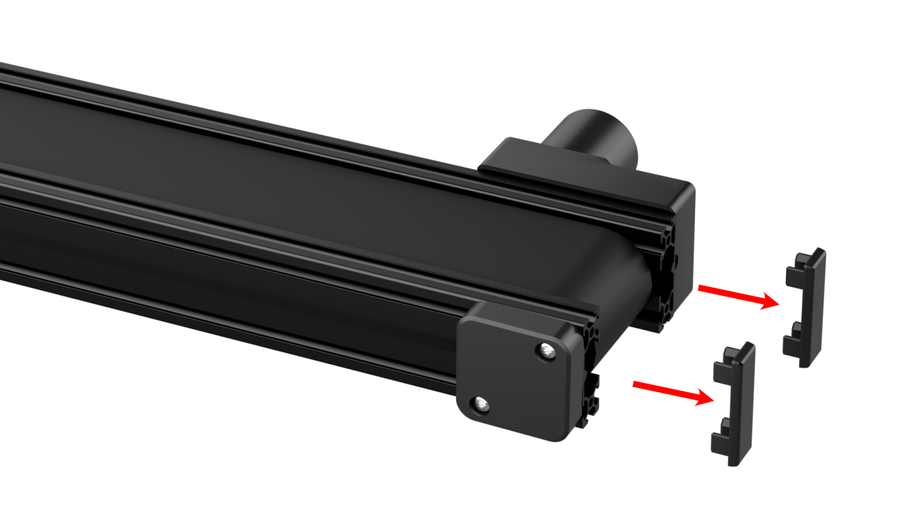
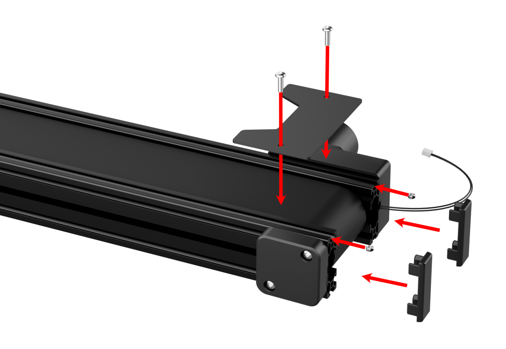
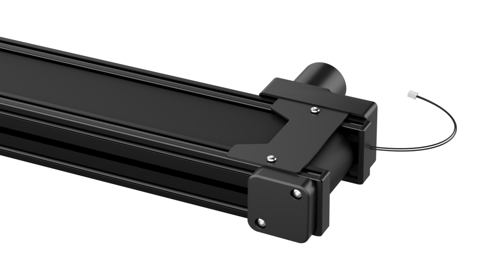
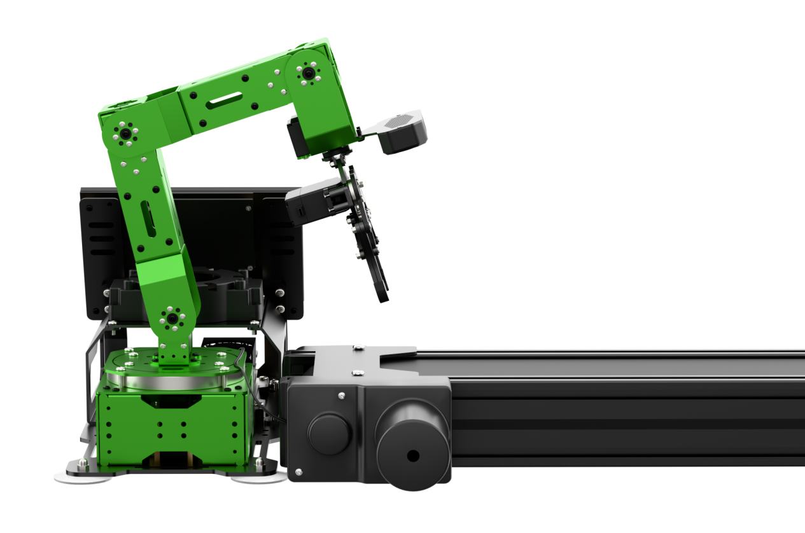
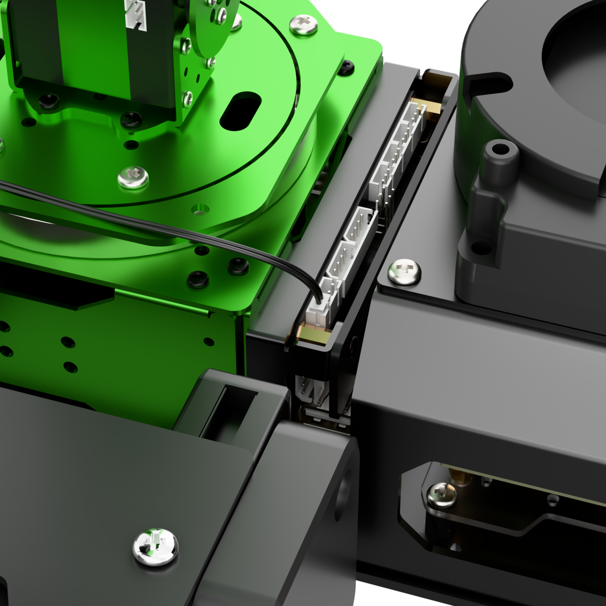
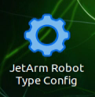
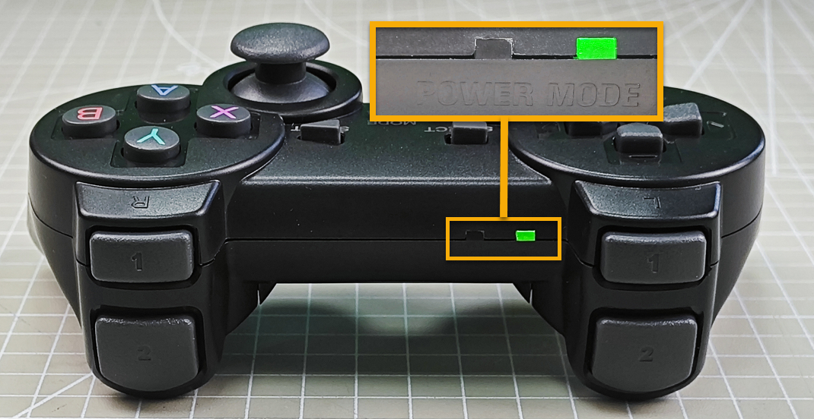
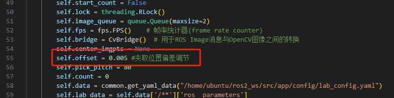

# 22. JetArm and Electrical Conveyor Belt Integration Course

## 22.1 Conveyor Belt Installation

(1) Remove the plastic part near the motor end.



(2) Use M4*10 pan head screws and M4 nuts to secure the acrylic plate onto the conveyor belt, then reattach the plastic part.





(3) Place the conveyor belt on the left side of the robotic arm, and connect the motor cable to Motor Port 1 on the STM32 controller.





## 22.2 Selecting the Robot Type

JetArm's expansion accessories come in four types: tank chassis, Mecanum wheel chassis, sliding rail, and conveyor belt. After installation, you must switch the device version according to the installed accessory for proper operation.

:::{Note}
If you don't switch or select the wrong version, the motor may run unpredictably, causing malfunctions or even damaging the device.
:::

Step-by-step instructions:

(1) Power on the robotic arm and connect it to the remote control software NoMachine. For installation and connection of the remote desktop tool, see [1.6 Development Environment Setup and Configuration](1.Getting_Ready.md#development-environment-setup-and-configuration).

(2) Double-click the model configuration tool on the desktop. 



(3) Select the appropriate options based on the robotic arm version, camera version, and accessory type:


Tank refers to the tracked chassis. Mecanum refers to the mecanum wheel chassis. Slide_Rails refers to the slide rails. Conveyor_Belt refers to the conveyor belt.

(4) After making your selection, click "**Apply & Save**" to save the configuration.


(5) Click "**Restart**" to reload the configuration.


Wait for the buzzer to beep once—this indicates the restart is complete and the new configuration is now active.

## 22.3 Wireless Handle Control

### 22.3.1 Getting Started

(1) Before powering on the device, make sure the wireless handle receiver is properly inserted. This can be ignored if the receiver was pre-inserted at the factory.

(2) Pay attention to battery polarity when placing the batteries.


(3) Each time the robot is powered on, the APP auto-start service will launch which includes the wireless handle control service. If this service has not been closed, no additional actions are needed—simply connect and control.

(4) Since wireless handle signals can interfere with each other, it is recommended not to use this function when multiple robots are in the same area, to avoid misconnection or unintended control.

(5) After turning on the wireless handle, if it does not connect to the robot within 30 seconds, or remains unused for 5 minutes after connection, it will enter sleep mode automatically. To wake up the wireless handle and exit sleep mode, press the **"START"** button.

### 22.3.2 Device Connection

(1) After the robot powers on, slide the wireless handle switch to the **"ON"** position. At this point, the red and green LED indicators on the wireless handle will start flashing simultaneously.

(2) Wait a few seconds for the robot and wireless handle to pair automatically. Once pairing is successful, the green LED will remain solid while the red LED turns off.



### 22.3.3 Control Modes

The wireless handle supports two control modes: Coordinate Mode and Single Servo Mode. After a successful connection, the default mode is Coordinate Mode.

*   **Single Servo Mode**: In this mode, the wireless handle buttons can be used to control the forward and reverse rotation of individual servos on the robotic arm.


Button Functions in Single Servo Mode:

| **Button** | **Function (from the robotic arm's first-person perspective)** |
|:---|:---|
| START | Reset the robotic arm |
| SELECT+START | Switch control mode (Single Servo / Coordinate) |
| UP / ↑ | Raise Servo 2 |
| DOWN / ↓ | Lower Servo 2 |
| LEFT / ← | Rotate Servo 1 to the left |
| RIGHT / → | Rotate Servo 1 to the right |
| Y | Close the gripper (Servo 10) |
| A | Open the gripper (Servo 10) |
| B | Rotate Servo 5 to the right (Gripper turns right) |
| X | Rotate Servo 5 to the left (Gripper turns left) |
| L1 | Raise Servo 3 |
| L2 | Lower Servo 3 |
| R1 | Raise Servo 4 |
| R2 | Lower Servo 4 |
| Left Joystick Left | Conveyor belt moves left |
| Left Joystick Right | Conveyor belt moves right |

*   **Coordinate Mode**: In Coordinate Mode, the robotic arm moves as a whole along the X, Y, and Z axes and can also adjust its tilt angle based on button inputs.


Button Functions in Coordinate Mode:

| **Button** | **Function (from the robotic arm's first-person perspective)** |
|:---|:---|
| START | Reset the robotic arm |
| SELECT+START | Switch control mode (Single Servo / Coordinate) |
| UP / ↑ | Move arm in the positive X direction (forward) |
| DOWN / ↓ | Move arm in the negative X direction (backward) |
| LEFT / ← | Move arm in the positive Y direction (left) |
| RIGHT / → | Move arm in the negative Y direction (right) |
| Y | Close the gripper (Servo 10) |
| A | Open the gripper (Servo 10) |
| B | Rotate Servo 5 to the right (Gripper turns right) |
| X | Rotate Servo 5 to the left (Gripper turns left) |
| L1 | Move arm upward along Z axis |
| L2 | Move arm downward along Z axis |
| R1 | Increase gripper pitch angle |
| R2 | Decrease gripper pitch angle |
| Left Joystick Left | Conveyor belt moves left |
| Left Joystick Right | Conveyor belt moves right |

Switching Between Modes: To switch between modes, press both **SELECT** and **START** buttons. A sound prompt indicates the switch was successful.

(1) Two beeps: Switched from Single Servo Mode to Coordinate Mode.

(2) Two beeps: Switched from Single Servo Mode to Coordinate Mode.

## 22.4 Color Sorting

### 22.4.1 Project Process

First, subscribe to the topic published by the color recognition node to obtain detected color information.

Choose the target color. Once the target color is detected, obtain the center position of the target object in the image.

Use the object's center position to guide the robotic arm for gripping and placing the color block into the corresponding area.

### 22.4.2 Enabling the Feature

(1) Power on the robotic arm and connect it to the remote control software NoMachine. For installation and connection of the remote desktop tool, see [1.6 Development Environment Setup and Configuration](1.Getting_Ready.md#development-environment-setup-and-configuration).

(2) Click the terminal icon  in the system desktop to open a command-line window.

(3) Enter the following command and press Enter to stop the auto-start service:

```
sudo systemctl stop start_app_node.service
```

(4) Entering the following command to start the feature.

```
ros2 launch motor color_sorting.launch.py
```

(5) After the program starts successfully, click on the camera display window and press **"a"** to start sorting, then press **"s"** to stop sorting.

(6) To exit the feature, press **"Ctrl+C"** in the terminal. If the program does not close successfully, try pressing **"Ctrl+C"** again.

(7) If you want to experience the mobile app features again later, enter the command and press Enter to start the app service. Wait for the robotic arm to return to its initial position — a beep from the buzzer will indicate it's ready.

```
sudo systemctl start start_app_node.service
```

### 22.4.3 Action Performed

After starting the program, place the color blocks within the robotic arm's camera view. The returned image will highlight the recognized target color, and the robotic arm will sort the corresponding color blocks into their designated areas.

### 22.4.4 Launch File Analysis

The Launch files are located at:

[/home/ubuntu/ros2_ws/src/motor/launch/color_sorting.launch.py](../_static/source_code/motor.zip)

*   `launch_setup()` Function

{lineno-start=10}
```python
def launch_setup(context):
    compiled = os.environ['need_compile']
    if compiled == 'True':
        sdk_package_path = get_package_share_directory('sdk')
        peripherals_package_path = get_package_share_directory('peripherals')
    else:
        sdk_package_path = '/home/ubuntu/ros2_ws/src/driver/sdk'
        peripherals_package_path = '/home/ubuntu/ros2_ws/src/peripherals'

    depth_camera_launch = IncludeLaunchDescription(
        PythonLaunchDescriptionSource(
            os.path.join(peripherals_package_path, 'launch/depth_camera.launch.py')),
    )

    sdk_launch = IncludeLaunchDescription(
        PythonLaunchDescriptionSource(
            os.path.join(sdk_package_path, 'launch/jetarm_sdk.launch.py')),
    )
    
    color_sorting_node = Node(
        package='motor',
        executable='color_sorting',
        output='screen',
    )

    return [
            sdk_launch,
            depth_camera_launch,
            color_sorting_node,
            ]
```

The main purpose of this function is to configure and launch a set of ROS2 nodes and programs to enable the robot's color block sorting functionality in a specific context. The function follows these steps:

(1) Retrieve Compilation Status:

{lineno-start=11}
```python
    compiled = os.environ['need_compile']
    if compiled == 'True':
        sdk_package_path = get_package_share_directory('sdk')
```

The function first reads a flag from the environment variable `need_compile` to determine whether related packages need to be recompiled. If the value of this variable is **'True'**, it indicates that compilation is required.

(2) Set Paths:

{lineno-start=15}
```python
    else:
        sdk_package_path = '/home/ubuntu/ros2_ws/src/driver/sdk'
        peripherals_package_path = '/home/ubuntu/ros2_ws/src/peripherals'
```

If compilation is needed, the function uses `get_package_share_directory` to obtain the paths of the `sdk` and `peripherals` packages.

If compilation is not needed, it directly uses predefined paths such as `/home/ubuntu/ros2_ws/src/driver/sdk`, etc.

(3) Define Nodes and Launch Items:

{lineno-start=19}
```python
    depth_camera_launch = IncludeLaunchDescription(
        PythonLaunchDescriptionSource(
            os.path.join(peripherals_package_path, 'launch/depth_camera.launch.py')),
    )

    sdk_launch = IncludeLaunchDescription(
        PythonLaunchDescriptionSource(
            os.path.join(sdk_package_path, 'launch/jetarm_sdk.launch.py')),
    )
    
    color_sorting_node = Node(
        package='motor',
        executable='color_sorting',
        output='screen',
    )
```

A `GroupAction` is created, which contains multiple `IncludeLaunchDescription` entries and a `Node`.

`IncludeLaunchDescription` is used to include other launch files:

*   It includes `jetarm_sdk.launch.py` to launch SDK-related nodes.

*   A `Node` is created to start the executable file `color_sorting`, which will output data to the screen.

(4) Return the Launch Item List:

{lineno-start=35}
```python
    return [
            sdk_launch,
            depth_camera_launch,
            color_sorting_node,
            ]
```

Finally, the function returns a list containing `object_tracking_node` and passes it to the `generate_launch_description` function, enabling ROS2's launch system to execute these configurations.

### 22.4.5 Python Source Code Analysis

The Launch files are located at:

[/home/ubuntu/ros2_ws/src/motor/motor/color_sorting.py](../_static/source_code/motor.zip)

(1) Import the necessary libraries

{lineno-start=5}

```python
import os
import cv2
import yaml
import time
import math
import queue
import rclpy
import signal
import threading
import numpy as np
from rclpy.node import Node
from sdk import common, fps
from cv_bridge import CvBridge
from interfaces.srv import SetStringBool
from std_srvs.srv import Trigger, SetBool
from sensor_msgs.msg import Image, CameraInfo
from rclpy.executors import MultiThreadedExecutor
from servo_controller_msgs.msg import ServosPosition
from rclpy.callback_groups import ReentrantCallbackGroup
from kinematics.kinematics_control import set_pose_target
from kinematics_msgs.srv import GetRobotPose, SetRobotPose
from servo_controller.bus_servo_control import set_servo_position
from ros_robot_controller_msgs.msg import MotorsState, MotorState
from servo_controller.action_group_controller import ActionGroupController
```

① `os`: Provides functions for interacting with the operating system, such as path manipulation and accessing environment variables.

② `cv2`: OpenCV, a powerful library for image processing and computer vision tasks.

③ `yaml`: Used for parsing and generating YAML-formatted data, commonly used in configuration files.

④ `time`: Offers time-related functions such as delays and retrieving current timestamps.

⑤ `math`: Supplies basic mathematical operations, including trigonometric and other mathematical functions.

⑥ `queue`: Provides thread-safe queues, useful for passing data between threads in multithreaded environments.

⑦ `rclpy`: The ROS 2 Python client library, enabling node creation, topic publishing/subscribing, services, and more.

⑧ `signal`: Handles asynchronous signals such as interrupts, allowing graceful termination or custom signal handling.

⑨ `threading`: Enables the execution of code in multiple threads for concurrent operations.

⑩ `numpy`: A fundamental package for scientific computing, offering fast array manipulation and advanced mathematical operations.

⑪ `rclpy.node.Node`: The base class for ROS 2 nodes in Python, which is essential for building ROS 2 applications.

⑫ `sdk`: A custom SDK that provides interfaces to specific hardware components or functional modules.

⑬ `cv_bridge`: A bridge library between ROS and OpenCV, used to convert ROS image messages to OpenCV images and vice versa.

⑭ `interfaces.srv.SetStringBool`: A custom service interface designed to handle messages containing both a string and a boolean value.

⑮ `std_srvs.srv.Trigger`: A standard ROS 2 service used to trigger an action without requiring input parameters.

⑯ `std_srvs.srv.SetBool`: A standard ROS 2 service interface used to set or toggle a boolean state.

⑰ `sensor_msgs.msg.Image`: A standard sensor message type for transmitting image data.

⑱ `sensor_msgs.msg.CameraInfo`: A message type that provides intrinsic and extrinsic parameters of a camera, such as focal length and distortion coefficients.

⑲ `rclpy.executors.MultiThreadedExecutor`: An executor that allows multiple threads to handle callbacks concurrently, improving system responsiveness.

⑳ `rclpy.callback_groups.ReentrantCallbackGroup`: A callback group that supports reentrant callbacks, allowing concurrent execution within the same group.

㉑ `kinematics.kinematics_control.set_pose_target`: A custom function module used to set the robot's target pose.

㉒ `kinematics_msgs.srv.GetRobotPose`: A service interface for retrieving the current pose of the robot.

㉓ `kinematics_msgs.srv.SetRobotPose`: A service interface for setting the desired target pose of the robot.

㉔ `servo_controller.bus_servo_control.set_servo_position`: A custom function used to control the position of servo motors.

㉕ `ros_robot_controller_msgs.msg.MotorsState`: A message type representing the overall state of multiple motors.

㉖ `ros_robot_controller_msgs.msg.MotorState`: A message type representing the state of a single motor.

㉗ `servo_controller.action_group_controller.ActionGroupController`: A custom action group controller designed to manage the execution of a group of actions in coordination.

(2) Specifying Target Positions

{lineno-start=30}

```python
PLACE_POSITION = {
    'red': [0.15, -0.08, 0.01],
    'green': [0.15, 0.0, 0.01],
    'blue': [0.15, 0.08, 0.01],
}
```

This is a dictionary used to store target positions for different colors, such as red, green, and blue. This structure simplifies quickly locating the corresponding position based on color during the robot's tasks. The coordinates for each color are represented in the robotic arm's base coordinate system.

(3) ColorSortingNode Class `__init__` Function: This code initializes a ROS2 node, sets up subscriptions and publications related to image processing, configures relevant parameters, and prepares service clients related to robotic kinematics. Using multithreading, the main logic can run concurrently, enabling coordinated operation between image processing and motion control.

① Initializing the ROS2 Node

{lineno-start=39}

```python
        rclpy.init()
        super().__init__(name, allow_undeclared_parameters=True, automatically_declare_parameters_from_overrides=True)
```

The ROS2 initialization function is called to prepare for node operation.

The `super().__init__` calls the parent class constructor, passing the node name, allowing undeclared parameters, and enabling automatic parameter declaration from overrides.

② Initialization of Instance Variables

{lineno-start=42}

```python
        self.running = True
        self.start_count = False
        self.lock = threading.RLock()
        self.image_queue = queue.Queue(maxsize=2)
        self.fps = fps.FPS()    # frame rate counter 帧率统计器
        self.bridge = CvBridge()  # Used for the conversion between ROS Image messages and OpenCV images. 用于ROS Image消息与OpenCV图像之间的转换
        self.center_imgpts = None
        self.offset = 0.005 # Adjustment of the clamping position deviation. 夹取位置偏差调节
        self.pick_pitch = 80
        self.count = 0
        self.data = common.get_yaml_data("/home/ubuntu/ros2_ws/src/app/config/lab_config.yaml")
        self.lab_data = self.data['/**']['ros__parameters']
        self.camera_type = os.environ['CAMERA_TYPE']
        self.min_area = 500
        self.max_area = 15000
        self.target = None
        self.image_sub = None
```

③ Initializing Controllers and Publishers

{lineno-start=60}

```python
        self.motor_pub = self.create_publisher(MotorsState, '/ros_robot_controller/set_motor', 1)
        self.joints_pub = self.create_publisher(ServosPosition, '/servo_controller', 1)
```

④ Subscribing to Image Topic

{lineno-start=62}

```python
        self.image_sub = self.create_subscription(Image, '/depth_cam/rgb/image_raw', self.image_callback, 1)
```

Subscribes to the ROS image topic `/depth_cam/rgb/image_raw`, with the callback function `self.image_callback` designated to handle incoming images.

⑤ Creating Service Clients

{lineno-start=63}

```python
        timer_cb_group = ReentrantCallbackGroup()
        self.client = self.create_client(Trigger, '/controller_manager/init_finish', callback_group=timer_cb_group)
        self.client.wait_for_service()
        self.get_current_pose_client = self.create_client(GetRobotPose, '/kinematics/get_current_pose', callback_group=timer_cb_group)
        self.get_current_pose_client.wait_for_service()
        self.kinematics_client = self.create_client(SetRobotPose, '/kinematics/set_pose_target')
        self.kinematics_client.wait_for_service()
```

- `get_current_pose_client`: Used to get the robot's current pose.
- `kinematics_client`: Used to set the robot's target pose. The code waits for these services to become available.

⑥ Starting the Main Thread

{lineno-start=70}

```python
        set_servo_position(self.joints_pub, 1.0, ((1, 850), (2, 630), (3, 90), (4, 85), (5, 480), (10, 200)))
        threading.Thread(target=self.main).start()
```

Starts a new thread to run the `self.main` method, ensuring other parts of the program can run concurrently.

(4) set_motor Function: Used to set the motor's rotational speed.

{lineno-start=74}

```python
    def set_motor(self,id, rps):
        data = MotorState()
        data.id = id
        data.rps = rps
        msg = MotorsState()
        msg.data.append(data)
        self.motor_pub.publish(msg)
```

① `id`: Identifier of the motor, used to distinguish between different motors.

② `rps`: Target rotational speed of the motor, in revolutions per second.

(5) send_request Function: Used to send asynchronous requests to ROS2 services and wait for their responses. This function simplifies interaction with ROS2 services, making service calls more intuitive and efficient.

{lineno-start=82}

```python
    def send_request(self, client, msg):
        future = client.call_async(msg)
        while rclpy.ok():
            if future.done() and future.result():
                return future.result()
```

① Sending Asynchronous Requests

Uses the `call_async` method of a service client (`client`) to send an asynchronous request (`msg`). This immediately returns a future object, which is used to track the status and result of the request.

② Waiting for Service Response

- A while loop continuously checks if the ROS2 system is still running (`rclpy.ok()`).
- It checks whether the future is completed (`future.done()`) and has a valid result (`future.result()`).
- Once the request completes and a result is available, the method returns the result (`future.result()`) and exits the loop.

(6) adaptive_threshold Function: Used to apply adaptive thresholding on a grayscale image. Adaptive thresholding is an image processing technique that effectively binarizes an image under uneven lighting conditions, improving the separation of foreground and background.

{lineno-start=88}

```python
    def adaptive_threshold(self, gray_image):
        # The adaptive threshold is used for segmentation first to filter out the sides. 用自适应阈值先进行分割, 过滤掉侧面
        # cv2.ADAPTIVE_THRESH_MEAN_C： The weight values of all pixel points in the neighborhood are consistent. 邻域所有像素点的权重值是一致的
        # cv2.ADAPTIVE_THRESH_GAUSSIAN _C ： It is related to the distance from each pixel point in the neighborhood to the center point, and the weight values of each point are obtained through the Gaussian equation. 与邻域各个像素点到中心点的距离有关，通过高斯方程得到各个点的权重值
        binary = cv2.adaptiveThreshold(gray_image, 255, cv2.ADAPTIVE_THRESH_GAUSSIAN_C, cv2.THRESH_BINARY, 41, 7)
        return binary
```

(7) canny_proc Function: Mainly used to perform edge detection on the input color image in BGR format for subsequent image segmentation.

{lineno-start=95}

```python
    def canny_proc(self, bgr_image):
        # Edge extraction is used for further segmentation when two objects of the same color are placed close together, they can only be distinguished by the edge. 边缘提取，用来进一步分割(当两个相同颜色物体靠在一起时，只能靠边缘去区分)
        mask = cv2.Canny(bgr_image, 9, 41, 9, L2gradient=True)
        mask = 255 - cv2.dilate(mask, cv2.getStructuringElement(cv2.MORPH_RECT, (11, 11)))  # Thicken the boundary and reverse the black and white. 加粗边界，黑白反转
        return mask
```

① Edge Detection — Canny Algorithm

`cv2.Canny`: The Canny edge detection function in OpenCV, used to detect edges within an image.

② Parameter Explanation

- `bgr_image`: The input image in BGR color format.
- `9`: Low threshold (`threshold1`), used for edge linking during edge detection. Typically set to about one-half to one-third of the high threshold.
- `41`: High threshold (`threshold2`), gradient values above this threshold are classified as edges.
- `9`: Aperture size of the Sobel operator (`apertureSize`), used for calculating the image gradient. Here it is set to 9, but usually odd values like 3, 5, or 7 are used.
- `L2gradient=True`: Uses a more precise gradient calculation method, Euclidean distance, improving the accuracy of edge detection.

③ Output

`mask` is a binary image where edges are represented by 255 (white) and non-edges by 0 (black).

(8) get_top_surface Function: Mainly used to process the input RGB image to extract the top surface of the object. It applies a series of image processing techniques such as color space conversion, filtering, thresholding, and edge detection to generate a mask image containing only the target region.

{lineno-start=101}

```python
    def get_top_surface(self, rgb_image):
        # In order to extract only the topmost surface of the object. 为了只提取物体最上层表面
        # Convert the image to the HSV color space. 将图像转换到HSV颜色空间
        image_scale = cv2.convertScaleAbs(rgb_image, alpha=2.5, beta=0)
        image_gray = cv2.cvtColor(image_scale, cv2.COLOR_RGB2GRAY)
        image_mb = cv2.medianBlur(image_gray, 3)  # Median filtering 中值滤波
        image_gs = cv2.GaussianBlur(image_mb, (5, 5), 5)  # Gaussian blur denoising 高斯模糊去噪
        binary = self.adaptive_threshold(image_gs)  # Threshold adaptation 阈值自适应
        mask = self.canny_proc(image_gs)  # Edge detection 边缘检测
        mask1 = cv2.bitwise_and(binary, mask)  # Merge the two extracted images and retain their common parts. 合并两个提取出来的图像，保留他们共有的地方
        roi_image_mask = cv2.bitwise_and(rgb_image, rgb_image, mask=mask1)  # Mask the original image to retain the areas that need to be identified. 和原图做遮罩，保留需要识别的区域
        return roi_image_mask
```

① Image Scaling

- Performs linear transformation on the input RGB image to increase its contrast and brightness.
- `alpha = 2.5`: Scaling factor used to control the contrast. The larger the value, the higher the contrast.
- `beta = 0`: Offset used to control brightness. Here it is set to 0, meaning no brightness adjustment is performed.

② Convert to Grayscale

The RGB image is converted to a grayscale image to simplify the data and reduce computational complexity, preparing it for subsequent filtering and edge detection.

③ Median Filtering

- Median filtering is applied to remove salt-and-pepper noise in the image.
- `3`: The kernel size, i.e., a 3x3 neighborhood.

④ Gaussian Blur for Noise Reduction

- A Gaussian blur is applied to further smooth the image and remove high-frequency noise.
- `(5, 5)`: The size of the Gaussian kernel, i.e., a 5x5 neighborhood.
- `5`: The standard deviation of the Gaussian kernel, controlling the amount of blur.

⑤ Adaptive Thresholding

Adaptive thresholding is applied to the Gaussian-blurred grayscale image to binarize it.

⑥ Edge Detection

Apply Canny edge detection on the grayscale image after Gaussian blur to extract edges.

⑦ Dilation Operation

Use an 11x11 rectangular structuring element to dilate the edges, effectively thickening them.

⑧ Black-White Inversion

Perform an inversion of the mask by `255 - mask` to convert white edges to black and background to white.

⑨ Combining Binary Image and Edge Mask

Perform a bitwise AND operation between the adaptive threshold binary image and the edge mask. This retains only the common regions between the two images, enhancing the accuracy of the target area and reducing false positives.

⑩ Return Result

Return the processed mask image which contains only the top surface of the object.

(9) image_callback Function: This function processes the image messages received from the camera topic and stores the processed images in a queue for further use.

{lineno-start=114}

```python
    def image_callback(self, ros_image):
        # Convert ros format images to opencv format. 将ros格式图像转换为opencv格式
        cv_image = self.bridge.imgmsg_to_cv2(ros_image, "rgb8")
        rgb_image = np.array(cv_image, dtype=np.uint8)
        if self.image_queue.full():
            # # If the queue is full, discard the oldest image. 如果队列已满，丢弃最旧的图像
            self.image_queue.get()
        # # Put the image into the queue. 将图像放入队列
        self.image_queue.put(rgb_image)
```

① Receiving ROS Image Messages

- The `image_callback` method is automatically triggered when a new image message arrives on the `/depth_cam/rgb/image_raw` topic.
- The `ros_image` parameter is the image message received from the ROS topic `/depth_cam/rgb/image_raw`, and it is usually of the type `sensor_msgs.msg.Image`.

② Converting ROS Image to OpenCV Format

- `self.bridge.imgmsg_to_cv2(ros_image, "rgb8")`:
- Using the `CvBridge` instance (`self.bridge`) to convert the ROS image message into an OpenCV format image (`cv_image`).
- "rgb8" specifies the image encoding format as RGB with 8-bit depth. This ensures that during conversion, the color space and bit depth of the image match the expected format.
- `rgb_image = np.array(cv_image, dtype=np.uint8)`:
- Converts the OpenCV image (`cv_image`) into a NumPy array (`rgb_image`), specifying the data type as `uint8` (unsigned 8-bit integer), which is the standard data type used by OpenCV for image processing.

③ Managing the image queue

- `self.image_queue.full()` checks whether the image queue has reached its maximum capacity (here, `maxsize=2`).
- If the queue is full, it means at least two images are waiting to be processed.

④ Discard the oldest image

`self.image_queue.get()` removes the earliest image from the queue.

⑤ Add the new image

`self.image_queue.put(rgb_image)` puts the newly received image (`rgb_image`) at the end of the queue, waiting for further processing.

(10) image_processing Function: This function retrieves one RGB image frame from the image queue, performs color segmentation and contour detection, identifies red, green, and blue targets in the image, and annotates the detected target positions, indices, and angle information on the resulting image.

{lineno-start=124}

```python
    def image_processing(self):
        rgb_image = self.image_queue.get()
        result_image = np.copy(rgb_image)
        target_list = []
        index = 0
```

① Get and copy the image

- `self.image_queue.get()` retrieves one RGB image from the queue for processing.
- `result_image = np.copy(rgb_image)` creates a copy of the image for drawing the detected targets, preserving the original image.

② Initialize target list and index

- `target_list`: Used to store the detected target information, where each target contains color, index number, center coordinates, and angle.
- `index`: Records the target's sequence number, starting from 0 and incrementing.

③ Determine whether to start counting

{lineno-start=129}

```python
        if self.start_count :
```

`self.start_count`: A boolean variable controlling whether to begin image processing and target detection. If set to **True**, subsequent image processing steps are executed.

④ Get image dimensions

{lineno-start=130}

```python
            img_h, img_w = rgb_image.shape[:2]
```

`img_h` and `img_w`: Retrieve the height and width of the image, respectively.

⑤ Get top surface and convert color space

{lineno-start=132}

```python
            rgb_image = self.get_top_surface(rgb_image)
            image_lab = cv2.cvtColor(rgb_image, cv2.COLOR_RGB2LAB) # Convert to LAB space. 转换到 LAB 空间
```

- `self.get_top_surface(rgb_image)`: Calls a custom method to extract the top surface of the image.
- `cv2.cvtColor(rgb_image, cv2.COLOR_RGB2LAB)`: Converts the RGB image to LAB color space, which facilitates more accurate color segmentation because LAB better aligns with human visual perception.

⑥ Iterate over target colors for processing, including red, green, and blue

{lineno-start=134}

```python
            for i in ['red', 'green', 'blue']:
```

Loop through the color list: Perform color segmentation and target detection for each color.

⑦ Color segmentation and binarization

{lineno-start=136}

```python
                mask = cv2.inRange(image_lab, tuple(self.lab_data['color_range_list'][i]['min']), tuple(self.lab_data['color_range_list'][i]['max']))  # 二值化
```

- `cv2.inRange`: Binarizes the image based on a predefined color range, generating a binary mask where the target color regions are white (255), and all other areas are black (0).
- `self.lab_data['color_range_list'][i]['min']` and `max`: Retrieve the minimum and maximum LAB values for the current color from the configuration. These values are used to define the color range for segmentation.

⑧ Morphological processing to smooth edges, remove small regions, and merge nearby blobs

{lineno-start=138}

```python
                eroded = cv2.erode(mask, cv2.getStructuringElement(cv2.MORPH_RECT, (3, 3)))
                dilated = cv2.dilate(eroded, cv2.getStructuringElement(cv2.MORPH_RECT, (3, 3)))
```

- `cv2.erode`: Performs erosion to remove noise and small isolated regions in the binary mask.
- `cv2.dilate`: Performs dilation to restore the shape of the target area and further eliminate noise. The combination of erosion followed by dilation is known as opening, which helps smooth the edges and remove small artifacts.

⑨ Contour detection

{lineno-start=141}

```python
                contours = cv2.findContours(dilated, cv2.RETR_EXTERNAL, cv2.CHAIN_APPROX_NONE)[-2]  # Find all contours. 找出所有轮廓
```

- `cv2.findContours`: Finds contours in the binary image.
- `cv2.RETR_EXTERNAL`: Retrieves only the outermost contours, ignoring nested or internal contours.
- `cv2.CHAIN_APPROX_NONE`: Stores all contour points without compression.
- `[-2]`: Used to adapt to different OpenCV versions and ensure the correct extraction of the contour list.

⑩ Contour filtering and area calculation

{lineno-start=142}

```python
                contours_area = map(lambda c: (math.fabs(cv2.contourArea(c)), c), contours)  # Calculate contour area. 计算轮廓面积
                contours = map(lambda a_c: a_c[1], filter(lambda a: self.min_area <= a[0] <= self.max_area, contours_area))
```

- Contour area calculation: Use `cv2.contourArea` to compute the area of each contour. The absolute value is taken to ensure the result is positive.
- Contour filtering: Only retain contours whose area falls within the specified range between `self.min_area` and `self.max_area`. This helps eliminate noise from overly small or large regions.

⑪ Processing each valid contour

{lineno-start=144}

```python
                for c in contours:
                    area = math.fabs(cv2.contourArea(c))
                    rect = cv2.minAreaRect(c)  # Obtain the minimum bounding rectangle. 获取最小外接矩形
                    (center_x, center_y), _ = cv2.minEnclosingCircle(c)
                    center_x, center_y =  center_x,  center_y
                    cv2.circle(result_image, (int(center_x), int(center_y)), 8, (0, 0, 0), -1)
                    corners = list(map(lambda p: (p[0],  p[1]), cv2.boxPoints(rect))) # Obtain the four corner points of the smallest circumscribed rectangle and convert them back to the coordinates of the original graph. 获取最小外接矩形的四个角点, 转换回原始图的坐标
                    cv2.drawContours(result_image, [np.intp(corners)], -1, (0, 255, 255), 2, cv2.LINE_AA)  # Draw the rectangular outline. 绘制矩形轮廓
                    index += 1 # Serial number increment. 序号递增
                    angle = int(round(rect[2]))  # Rectangular Angle 矩形角度
                    target_list.append([i, index, (center_x, center_y), angle])
```

- Contour area calculation: The contour area is computed again. This could be optimized by reusing the previously calculated area.
- Get the minimum bounding rectangle: Use `cv2.minAreaRect` to obtain the smallest bounding rectangle of the contour. It returns the center point, width and height, and the rotation angle of the rectangle.
- Get the minimum enclosing circle: Use `cv2.minEnclosingCircle` to find the smallest circle that completely encloses the contour. This is mainly used to determine the center position of the object.
- Draw center point: Draw a solid black circle on `result_image` to mark the center of the detected object.
- Get and draw rectangle corners: Use `cv2.boxPoints` to obtain the four corner points of the minimum bounding rectangle, and draw the yellow rectangle contour on `result_image`.
- Update index and angle: Increment the object index and round the rectangle's rotation angle to the nearest integer.
- Add target info to list: Add the current target's color, index, center coordinates, and rotation angle to the `target_list`.

⑫ Return target list and result image

{lineno-start=157}

```python
        return target_list, result_image
```

- `target_list`: Contains all detected target information. Each target is represented as a list that includes its color, index, center coordinates, and angle.
- `result_image`: An image where all detected targets are annotated with their position and contours, making it easier for visual verification and further processing.

(11) move Function: Used to control the motion of the robotic arm. This function determines the X-axis position of the robotic arm based on the provided `center_y` value, and then performs a series of steps to pick up and place the object.

{lineno-start=159}

```python
    def move(self, center_y):
        if self.running:
```

① Check if running

The function first checks `self.running`. If it is **True**, the movement and object manipulation actions proceed.

② Calculate Target Position

{lineno-start=161}

```python
            y =  ((center_y - 235) / (335 -235)) * (0.11 - 0.16) + 0.16 # Determine the distance of the color block on the X-axis of the robotic arm based on the center point of the recognized contour. 根据识别轮廓的中心点确定色块在机械臂X轴上的距离
            y = y + self.offset
            position = [0, y, 0.08]
```

The target position on the X-axis is calculated based on the given `center_y` value. The calculation uses a linear interpolation formula with fixed constants (235 and 335), along with an offset defined by `self.offset`.

③ Perform Grasping Operation

{lineno-start=165}

```python
            if self.running:
                position[2] += 0.02
                msg = set_pose_target(position, self.pick_pitch,  [-180.0, 180.0], 1.0)
                res = self.send_request(self.kinematics_client, msg)
                servo_data = res.pulse
                set_servo_position(self.joints_pub, 1.0, ((1, servo_data[0]), ))
                time.sleep(1)
                set_servo_position(self.joints_pub, 1.0, ((2, servo_data[1]), (3, servo_data[2]), (4, servo_data[3])))
                time.sleep(1)
                

            if self.running:
                position[2] -= 0.03
                msg = set_pose_target(position, self.pick_pitch,  [-90.0, 90.0], 1.0)
                res = self.send_request(self.kinematics_client, msg)
                servo_data = res.pulse

                set_servo_position(self.joints_pub, 1.0, ((1, servo_data[0]), (2, servo_data[1]), (3, servo_data[2]), (4, servo_data[3])))
                time.sleep(1)

                set_servo_position(self.joints_pub, 1.0, ((10, 600),))
                time.sleep(1)
```

- The robotic arm moves above the target by gradually adjusting the Z value in the position array.
- After each adjustment, a pose-setting message, `set_pose_target`, is sent using the `self.send_request` function to the `kinematics` client.
- The received servo data is used to set the servo positions, and `time.sleep` is used to pause the system, ensuring the motion is completed properly.

④ Place the Object

{lineno-start=188}

```python
            if self.running:
                position[2] += 0.04
                msg = set_pose_target(position, self.pick_pitch,  [-180.0, 180.0], 1.0)
                res = self.send_request(self.kinematics_client, msg)
                servo_data = res.pulse

                set_servo_position(self.joints_pub, 1.0, ((2, servo_data[1]), (3, servo_data[2]), (4, servo_data[3])))
                time.sleep(1)

                set_servo_position(self.joints_pub, 1.0, ((1, 850), (2, 630), (3, 90), (4, 85), (5, 480)))
                time.sleep(1)

                position =  PLACE_POSITION[self.target[0]] # Obtain the placement position. 获取放置位置

            if self.running:
                position[2] += 0.03
                msg = set_pose_target(position, self.pick_pitch,  [-90.0, 90.0], 1.0)
                res = self.send_request(self.kinematics_client, msg)
                    
                servo_data = res.pulse
                set_servo_position(self.joints_pub, 2.0, ((1, servo_data[0]),))
                time.sleep(2)
                set_servo_position(self.joints_pub, 1.0, ((2, servo_data[1]), (3, servo_data[2]), (4, servo_data[3])))
                time.sleep(1)

            if self.running:
                position[2] -= 0.03
                msg = set_pose_target(position, self.pick_pitch,  [-90.0, 90.0], 1.0)
                res = self.send_request(self.kinematics_client, msg)
                servo_data = res.pulse

                self.get_logger().info('\033[1;32m%s\033[0m' %servo_data)
                set_servo_position(self.joints_pub, 1.0, ((1, servo_data[0]), (2, servo_data[1]), (3, servo_data[2]), (4, servo_data[3])))
                time.sleep(1)
                set_servo_position(self.joints_pub, 1.0, ((10, 200),))
                time.sleep(1)
```

A new target position is set to move the object to a predefined drop-off location. This process is similar to grasping—adjusting the pose and sending the request message.

⑤ End Operation

{lineno-start=234}

```python
            if not self.running:

                set_servo_position(self.joints_pub, 1.0, ((2, 630), (3, 90), (4, 85), (5, 480), (10, 200)))
                time.sleep(1)
                set_servo_position(self.joints_pub, 2.0, ((1, 850),))
                time.sleep(2)
                self.target = None
```

If `self.running` is **False**, the servo positions are set to return the robotic arm to a safe position before the function ends.

(12) main Function: Main Loop Function used to control the motion of the robotic arm. This function determines the X-axis position of the robotic arm based on the provided `center_y` value, and then performs a series of steps to pick up and place the object.

{lineno-start=242}

```python
    def main(self):
        while True:
```

① Retrieve Target List and Image Result

{lineno-start=245}

```python
            target_list, result_image = self.image_processing()
            if target_list and self.running:
```

In each loop, the function calls `self.image_processing()` to attempt image processing. It returns a list of detected target objects (`target_list`) and the processed image (`result_image`).

② Target Tracking and Counting

{lineno-start=246}

```python
            if target_list and self.running:
                if self.target is not None :
                    if self.target[0] == target_list[0][0]:
                        self.count += 1
                    else:
                        self.target = target_list[0]
                        self.count = 0
                else :
                    self.target = target_list[0]
            if self.count > 65:
                self.count = 0

                self.start_count = False
                threading.Thread(target=self.move,args=(target_list[0][2][0],), daemon=True).start()
```

- If `target_list` is not empty and the system is running (`self.running` is **True**), the program checks whether a target (`self.target`) is already being tracked.
- If the current target is the same as the previous one, the counter `self.count` is incremented.
- If the target differs, the tracked target is updated, and the counter is reset.
- Once the counter exceeds 65, the system resets the counter and `start_count`, then starts a new thread to call `self.move()` with the target's Y-coordinate to begin robotic arm movement.

③ Image Display and User Input

{lineno-start=261}

```python
            if result_image is not None :
                self.fps.update()
                result_image = cv2.cvtColor(result_image, cv2.COLOR_BGR2RGB)
                cv2.imshow('result_image', result_image)
                key = cv2.waitKey(1)
                if key != -1:
                    if key == 97: #A
                        self.running = True
                        self.start_count = True
                        self.set_motor(1, -100.0)
                    if key == 115: # S
                        self.running = False
                        self.count = 0
                        self.set_motor(1, 0.0)
```

- If `result_image` is not None, the frame rate is updated, and the image is converted to RGB format using OpenCV and displayed in a window.
- The system also checks for the key pressed by user. If the user presses the **'a'** key, the system will start processing. If the **'s'** key is pressed, the system will stop running, reset the counter, and halt the robotic arm's movement.

(13) Main Function: Program Entry Point

{lineno-start=277}

```python
def main():
    node = ColorSortingNode('color_sorting')
    executor = MultiThreadedExecutor()
    executor.add_node(node)
    executor.spin()
    node.destroy_node()
    rclpy.shutdown()
```

① Creates a ColorSortingNode instance

② Sets up MultiThreadedExecutor for concurrent processing

③ Adds the node to the executor

④ Starts the executor to process callbacks

⑤ Cleans up resources when shutting down

### 22.4.6 Adjusting the Gripping Offset

Due to slight variations between different JetArm robotic arms, the gripping position may be inaccurate. If there is a deviation in the gripping position, you can correct it by modifying the offset value in the source code file. The location of the Python source file can be found in the Program Analysis section of the corresponding tutorial.



Increasing the offset value allows the arm to grip farther. Decreasing the value brings the grip position closer.